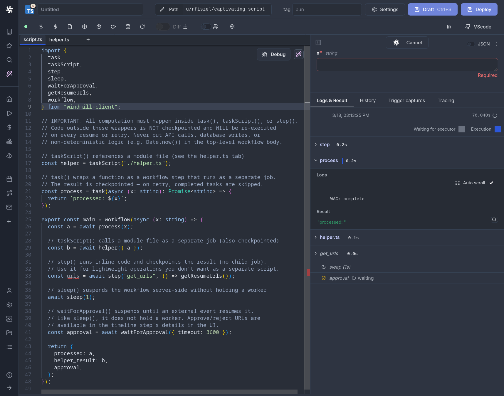
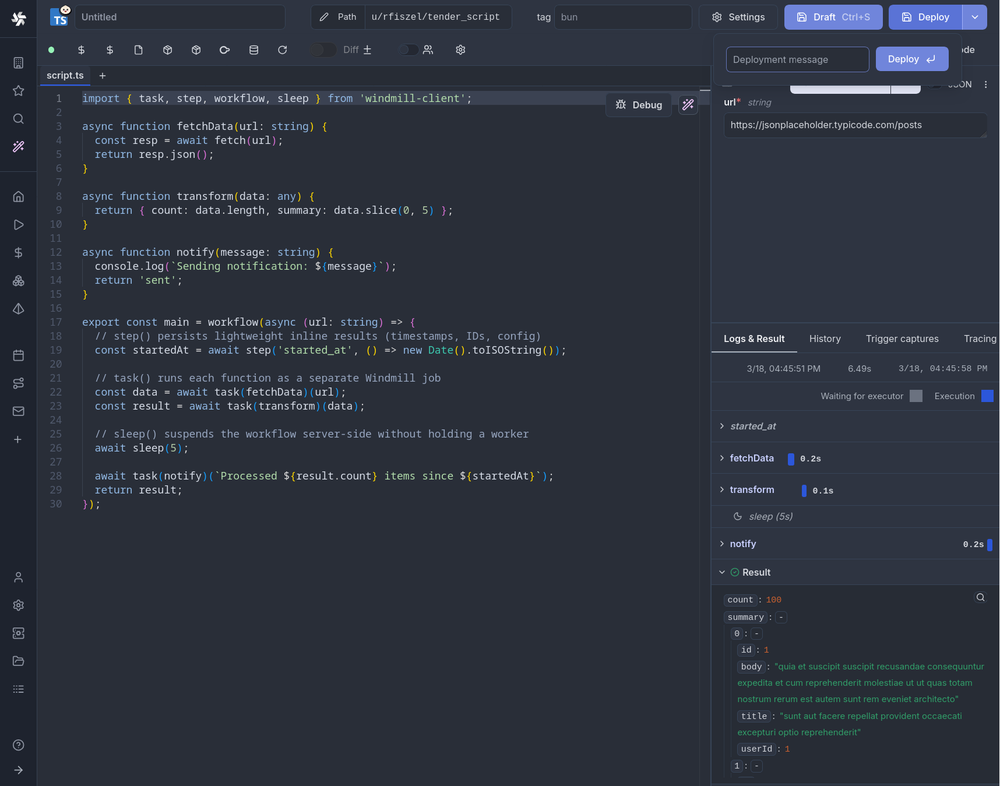
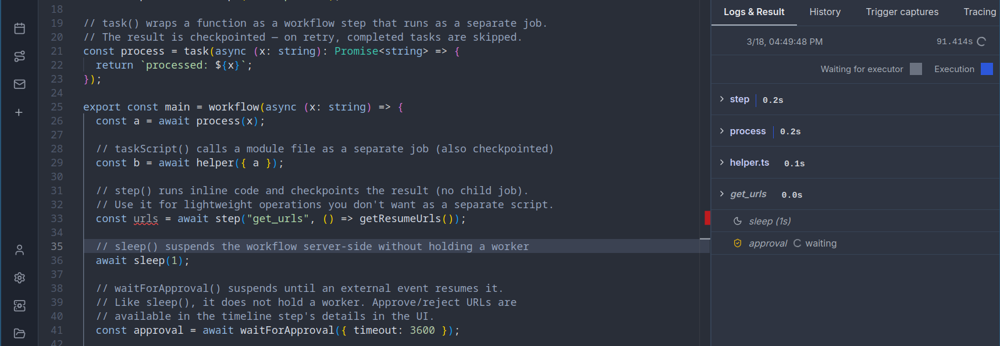
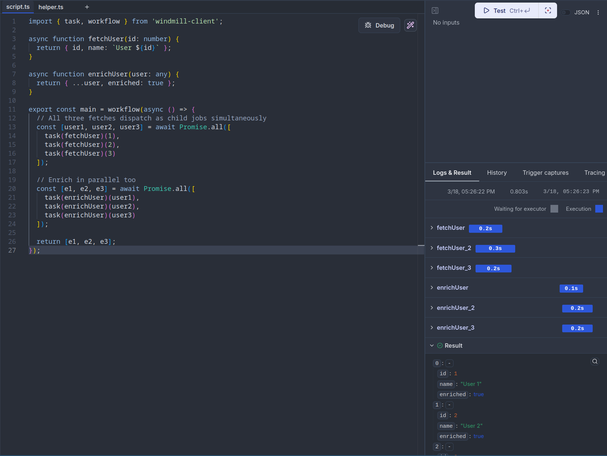
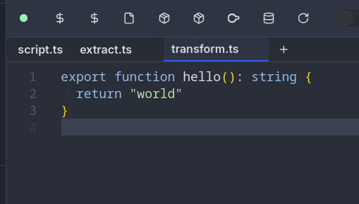

import Tabs from '@theme/Tabs';
import TabItem from '@theme/TabItem';
import DocCard from '@site/src/components/DocCard';

# Workflows as code

[Flows](../../flows/1_flow_editor.mdx) are not the only way to write distributed programs that execute distinct jobs. Workflows as code let you define orchestration logic directly in [TypeScript](../../getting_started/0_scripts_quickstart/1_typescript_quickstart/index.mdx) or [Python](../../getting_started/0_scripts_quickstart/2_python_quickstart/index.mdx), using familiar language constructs like functions, conditionals, and loops, while Windmill handles checkpointing, parallelism, and fault tolerance.



Each `task()` call runs as a separate [job](../20_jobs/index.mdx) with its own logs, resources, and timeline entry. The workflow suspends between tasks (releasing its [worker](../9_worker_groups/index.mdx) slot entirely) and resumes from a checkpoint when child jobs complete. This means a single worker can run workflows with any number of parallel tasks without deadlocking.

Workflows as code support the same patterns as Temporal, Inngest, Cloudflare Workflows, and Airflow — checkpointing, retries, parallelism, durable sleep — with comparable or better performance (especially compared to Airflow, where task scheduling overhead alone can dwarf actual execution time). Windmill is easily [self-hostable](../../advanced/1_self_host/index.mdx), ships with an intuitive [script editor](../../script_editor/index.mdx) and [visual flow builder](../../flows/1_flow_editor.mdx), and includes built-in [approval steps](#approval--human-in-the-loop) and a complete [app builder](../../apps/0_app_editor/index.mdx) — all in one platform.

Workflows as code can be [synced with git](../../advanced/11_git_sync/index.mdx) and the [CLI](../../advanced/11_git_sync/cli_sync.mdx) like any other script.

## Quickstart

Wrap your orchestration function with `workflow()` and annotate task functions with `task()`:

<Tabs className="unique-tabs">
<TabItem value="typescript" label="TypeScript" attributes={{className: "text-xs p-4 !mt-0 !ml-0"}}>

```typescript
import { task, step, workflow, sleep, parallel } from 'windmill-client';

async function fetchData(url: string) {
	const resp = await fetch(url);
	return resp.json();
}

async function transform(data: any) {
	return { count: data.length, summary: data.slice(0, 5) };
}

async function notify(message: string) {
	console.log(`Sending notification: ${message}`);
	return 'sent';
}

export const main = workflow(async (url: string) => {
	// step() persists lightweight inline results (timestamps, IDs, config)
	const startedAt = await step('started_at', () => new Date().toISOString());

	// task() runs each function as a separate Windmill job
	const data = await task(fetchData)(url);
	const result = await task(transform)(data);

	// sleep() suspends the workflow server-side without holding a worker
	await sleep(5);

	await task(notify)(`Processed ${result.count} items since ${startedAt}`);
	return result;
});
```

</TabItem>
<TabItem value="python" label="Python" attributes={{className: "text-xs p-4 !mt-0 !ml-0"}}>

```python
from datetime import datetime
from wmill import task, step, workflow, sleep, parallel

@task
async def fetch_data(url: str):
    import httpx
    async with httpx.AsyncClient() as client:
        resp = await client.get(url)
        return resp.json()

@task
async def transform(data: list):
    return {"count": len(data), "summary": data[:5]}

@task
async def notify(message: str):
    print(f"Sending notification: {message}")
    return "sent"

@workflow
async def main(url: str):
    # step() persists lightweight inline results (timestamps, IDs, config)
    started_at = await step("started_at", lambda: datetime.now().isoformat())

    # task() runs each function as a separate Windmill job
    data = await fetch_data(url)
    result = await transform(data)

    # sleep() suspends the workflow server-side without holding a worker
    await sleep(5)

    await notify(f"Processed {result['count']} items since {started_at}")
    return result
```

</TabItem>
</Tabs>



## How it works

Workflows as code use a **checkpoint/replay** model that ensures zero worker waste:

1. The workflow script runs until it hits a `task()`, `step()`, `sleep()`, or `waitForApproval()` call that isn't cached yet
2. The script exits, and Windmill saves a checkpoint (all completed step results) to the database
3. **The parent workflow fully suspends**, releasing its [worker](../9_worker_groups/index.mdx) slot back to the pool. No worker is held while waiting.
4. For `task()`: child jobs are created and dispatched. Each child runs independently on any available worker. When all children complete, the parent is automatically re-queued
5. For `step()`: the inline result is persisted immediately, and the workflow is re-picked up on the next available worker
6. For `sleep()`: the workflow suspends for the given duration. No worker is occupied during the sleep; the job is re-queued when the timer expires
7. For `waitForApproval()`: the workflow suspends indefinitely (up to the timeout). The worker is released, and the job resumes only when a human approves or rejects
8. On replay, all previously completed steps return their cached results instantly, and execution continues from where it left off

This design means the parent workflow process is **never alive while child jobs run, during sleeps, or while waiting for approvals**. It only occupies a worker during the brief moments between checkpoints. A workflow that sleeps for 24 hours or waits a week for approval consumes zero worker time during those waits.

:::info Zero worker waste
Unlike traditional workflow engines that hold a thread or process alive while waiting, Windmill workflows fully suspend between steps. The parent job is marked as suspended in the database and becomes invisible to the worker pull query. When a child completes (or a sleep/approval timer fires), the database counter is decremented atomically. Only when all pending children reach zero does the parent become eligible for pickup again. This means:

- A workflow with 100 parallel tasks uses 100 worker slots for the tasks, but 0 slots while orchestrating
- A workflow sleeping for 1 hour uses 0 worker slots during the entire sleep
- A workflow waiting for approval uses 0 worker slots until the human responds
- Workers are free to process other jobs while your workflow waits
  :::



## Core primitives

### `workflow()`

Marks a function as a workflow entry point. Required for using `task()`, `step()`, `sleep()`, `waitForApproval()`, and `parallel()`.

<Tabs className="unique-tabs">
<TabItem value="typescript" label="TypeScript" attributes={{className: "text-xs p-4 !mt-0 !ml-0"}}>

```typescript
import { workflow } from 'windmill-client';

export const main = workflow(async (x: number, y: number) => {
	// orchestration logic here
	return x + y;
});
```

</TabItem>
<TabItem value="python" label="Python" attributes={{className: "text-xs p-4 !mt-0 !ml-0"}}>

```python
from wmill import workflow

@workflow
async def main(x: int, y: int):
    # orchestration logic here
    return x + y
```

</TabItem>
</Tabs>

### `task()`

Wraps a function so that each call runs as a **separate child job**. The child gets its own logs, timeline entry, and can run on a different worker.

<Tabs className="unique-tabs">
<TabItem value="typescript" label="TypeScript" attributes={{className: "text-xs p-4 !mt-0 !ml-0"}}>

```typescript
import { task, workflow } from 'windmill-client';

// Basic usage: task wraps the function, then you call it with arguments
async function double(n: number) {
	return n * 2;
}

async function add(a: number, b: number) {
	return a + b;
}

export const main = workflow(async () => {
	const a = await task(double)(5); // runs as child job, returns 10
	const b = await task(double)(3); // runs as child job, returns 6
	return await task(add)(a, b); // runs as child job, returns 16
});
```

With options:

```typescript
// With explicit path and options
const result = await task('f/my_folder/heavy_script', double, {
	timeout: 600,
	tag: 'gpu',
	cache_ttl: 3600,
	priority: 10,
	concurrency_limit: 5,
	concurrency_key: 'my_key',
	concurrency_time_window_s: 60
})(42);

// With options only (no path override)
const result2 = await task(double, { timeout: 300, tag: 'highmem' })(42);
```

</TabItem>
<TabItem value="python" label="Python" attributes={{className: "text-xs p-4 !mt-0 !ml-0"}}>

```python
from wmill import task, workflow

# Basic usage: @task decorator
@task
async def double(n: int):
    return n * 2

@task
async def add(a: int, b: int):
    return a + b

@workflow
async def main():
    a = await double(5)     # runs as child job, returns 10
    b = await double(3)     # runs as child job, returns 6
    return await add(a, b)  # runs as child job, returns 16
```

With options:

```python
@task(
    path="f/my_folder/heavy_script",
    timeout=600,
    tag="gpu",
    cache_ttl=3600,
    priority=10,
    concurrency_limit=5,
    concurrency_key="my_key",
    concurrency_time_window_s=60,
)
async def heavy_compute(data: list):
    return sum(data)
```

</TabItem>
</Tabs>

### `step()`

Executes a lightweight function **inline** (in the parent process) and persists the result to the database. On replay, the cached value is returned without re-executing.

Use `step()` for non-deterministic operations that must return the same value across replays: timestamps, random IDs, config reads, or any cheap computation whose result must be stable.

<Tabs className="unique-tabs">
<TabItem value="typescript" label="TypeScript" attributes={{className: "text-xs p-4 !mt-0 !ml-0"}}>

```typescript
import { step, task, workflow } from 'windmill-client';
import { randomUUID } from 'crypto';

async function processOrder(orderId: string, ts: string) {
	console.log(`Processing order ${orderId} created at ${ts}`);
	return { orderId, ts, status: 'processed' };
}

export const main = workflow(async () => {
	// These values are computed once and cached across replays
	const orderId = await step('order_id', () => randomUUID());
	const timestamp = await step('timestamp', () => new Date().toISOString());

	return await task(processOrder)(orderId, timestamp);
});
```

</TabItem>
<TabItem value="python" label="Python" attributes={{className: "text-xs p-4 !mt-0 !ml-0"}}>

```python
from wmill import step, task, workflow
import uuid
from datetime import datetime

@task
async def process_order(order_id: str, ts: str):
    print(f"Processing order {order_id} created at {ts}")
    return {"order_id": order_id, "ts": ts, "status": "processed"}

@workflow
async def main():
    # These values are computed once and cached across replays
    order_id = await step("order_id", lambda: str(uuid.uuid4()))
    timestamp = await step("timestamp", lambda: datetime.now().isoformat())

    return await process_order(order_id, timestamp)
```

</TabItem>
</Tabs>

:::tip When to use `step()` vs `task()`

- **`task()`**: heavy computation, external API calls, anything that benefits from being a separate job (own logs, own worker, parallelizable)
- **`step()`**: lightweight deterministic-must-be-stable operations like generating IDs, reading timestamps, config lookups. No separate job overhead, but the result is persisted so replays are consistent
  :::

### `task()` vs `step()` comparison

|             | `task()`                               | `step()`                             |
| ----------- | -------------------------------------- | ------------------------------------ |
| Execution   | Separate child job (own process)       | Inline in parent process             |
| Overhead    | Full job lifecycle                     | Function call + one DB write         |
| Parallelism | Yes (`Promise.all` / `asyncio.gather`) | No, sequential only                  |
| Use case    | Heavy compute, external APIs           | Timestamps, random IDs, config reads |
| Logs        | Own log stream                         | Part of parent logs                  |
| Timeline    | Separate timeline entry                | Not a separate entry                 |

## Determinism requirement

Because workflows replay from checkpoints, the orchestration logic must be **deterministic**: given the same inputs, the workflow must call tasks in the same order on every replay. This ensures step keys are consistent and cached results map to the correct steps.

Safe patterns:

- Branching on task results (results are replayed from checkpoint)
- Loops over static or task-derived data
- Any logic that depends only on inputs and previous task results

Patterns that break determinism (wrap these in `step()` instead):

- `Date.now()` / `datetime.now()` — use `await step('ts', () => Date.now())`
- `Math.random()` / `random.random()` — use `await step('id', () => randomUUID())`
- Reading environment variables or config that may change between replays
- External API calls whose results affect control flow

If a workflow's code changes between replays (e.g. a deployment mid-execution), Windmill detects the source hash mismatch and re-runs from scratch to avoid stale checkpoint data.

## Parallel execution

### Using `Promise.all` / `asyncio.gather`

Tasks wrapped with `task()` return promises/awaitables, so you can run them in parallel with standard language constructs:

<Tabs className="unique-tabs">
<TabItem value="typescript" label="TypeScript" attributes={{className: "text-xs p-4 !mt-0 !ml-0"}}>

```typescript
import { task, workflow } from 'windmill-client';

async function fetchUser(id: number) {
	return { id, name: `User ${id}` };
}

async function enrichUser(user: any) {
	return { ...user, enriched: true };
}

export const main = workflow(async () => {
	// All three fetches dispatch as child jobs simultaneously
	const [user1, user2, user3] = await Promise.all([
		task(fetchUser)(1),
		task(fetchUser)(2),
		task(fetchUser)(3)
	]);

	// Enrich in parallel too
	const [e1, e2, e3] = await Promise.all([
		task(enrichUser)(user1),
		task(enrichUser)(user2),
		task(enrichUser)(user3)
	]);

	return [e1, e2, e3];
});
```

</TabItem>
<TabItem value="python" label="Python" attributes={{className: "text-xs p-4 !mt-0 !ml-0"}}>

```python
import asyncio
from wmill import task, workflow

@task
async def fetch_user(id: int):
    return {"id": id, "name": f"User {id}"}

@task
async def enrich_user(user: dict):
    return {**user, "enriched": True}

@workflow
async def main():
    # All three fetches dispatch as child jobs simultaneously
    user1, user2, user3 = await asyncio.gather(
        fetch_user(1),
        fetch_user(2),
        fetch_user(3),
    )

    # Enrich in parallel too
    e1, e2, e3 = await asyncio.gather(
        enrich_user(user1),
        enrich_user(user2),
        enrich_user(user3),
    )

    return [e1, e2, e3]
```

</TabItem>
</Tabs>



### Using `parallel()`

The `parallel()` utility provides a higher-level API for processing a list of items with optional concurrency control:

<Tabs className="unique-tabs">
<TabItem value="typescript" label="TypeScript" attributes={{className: "text-xs p-4 !mt-0 !ml-0"}}>

```typescript
import { task, parallel, workflow } from 'windmill-client';

async function processItem(item: number) {
	return item * 2;
}

export const main = workflow(async () => {
	const items = [1, 2, 3, 4, 5, 6, 7, 8, 9, 10];

	// Process all items in parallel (default: all at once)
	const results = await parallel(items, (item) => task(processItem)(item));

	// With concurrency control: process at most 3 at a time
	const batched = await parallel(items, (item) => task(processItem)(item), { concurrency: 3 });

	return { results, batched };
});
```

</TabItem>
<TabItem value="python" label="Python" attributes={{className: "text-xs p-4 !mt-0 !ml-0"}}>

```python
from wmill import task, parallel, workflow

@task
async def process_item(item: int):
    return item * 2

@workflow
async def main():
    items = [1, 2, 3, 4, 5, 6, 7, 8, 9, 10]

    # Process all items in parallel (default: all at once)
    results = await parallel(items, lambda item: process_item(item))

    # With concurrency control: process at most 3 at a time
    batched = await parallel(
        items,
        lambda item: process_item(item),
        concurrency=3,
    )

    return {"results": results, "batched": batched}
```

</TabItem>
</Tabs>

## Sleep

`sleep()` suspends the workflow **server-side** for a given number of seconds. The workflow releases its worker slot during the sleep, unlike a regular `time.sleep()` or `setTimeout()` which would block a worker.

<Tabs className="unique-tabs">
<TabItem value="typescript" label="TypeScript" attributes={{className: "text-xs p-4 !mt-0 !ml-0"}}>

```typescript
import { task, sleep, workflow } from 'windmill-client';

async function sendReminder(email: string) {
	console.log(`Reminder sent to ${email}`);
}

export const main = workflow(async (email: string) => {
	await task(sendReminder)(email);

	// Suspend for 1 hour without holding a worker
	await sleep(3600);

	await task(sendReminder)(email);
	return 'done';
});
```

</TabItem>
<TabItem value="python" label="Python" attributes={{className: "text-xs p-4 !mt-0 !ml-0"}}>

```python
from wmill import task, sleep, workflow

@task
async def send_reminder(email: str):
    print(f"Reminder sent to {email}")

@workflow
async def main(email: str):
    await send_reminder(email)

    # Suspend for 1 hour without holding a worker
    await sleep(3600)

    await send_reminder(email)
    return "done"
```

</TabItem>
</Tabs>

The minimum sleep duration is 1 second. Values are rounded to the nearest integer.

## Approval / human-in-the-loop

`waitForApproval()` suspends the workflow and waits for a human to approve or reject it from the Windmill UI, similar to [approval steps in flows](../../flows/11_flow_approval.mdx). The worker is fully released while waiting, so there is zero resource usage during the approval window.

It returns an object with three fields:

| Field | Type | Description |
| --- | --- | --- |
| `value` | `any` | Form data submitted with the approval (if a form was provided) |
| `approver` | `string` | Username or identifier of the person who approved/rejected |
| `approved` | `boolean` | `true` if approved, `false` if rejected or timed out |

Parameters:

| Parameter | Type | Default | Description |
| --- | --- | --- | --- |
| `timeout` | `number` / `int` | `1800` | Maximum time to wait for approval in seconds. The workflow is cancelled if the timeout is reached |
| `form` | `object` / `dict` | `undefined` / `None` | Form fields shown on the approval page. Pass fields directly as keys (e.g. `{ reason: { type: "string" } }`), or use a full JSON Schema object for `required`/`order` support (EE only) |
| `selfApproval` / `self_approval` | `boolean` / `bool` | `true` / `True` | Whether the user who triggered the workflow can approve it. Set to `false` to require a different user (EE only). See [disable self-approval](../../flows/11_flow_approval.mdx#disable-self-approval) |

<Tabs className="unique-tabs">
<TabItem value="typescript" label="TypeScript" attributes={{className: "text-xs p-4 !mt-0 !ml-0"}}>

```typescript
import { task, waitForApproval, workflow } from 'windmill-client';

async function deploy(env: string) {
	console.log(`Deploying to ${env}`);
	return `deployed to ${env}`;
}

export const main = workflow(async (env: string) => {
	const approval = await waitForApproval({
		timeout: 3600,
		selfApproval: false, // require a different user to approve
	});

	if (!approval.approved) {
		return `Deployment rejected by ${approval.approver}`;
	}

	return await task(deploy)(env);
});
```

With a form (EE only). Pass fields directly as keys — no `type: "object"` wrapper needed:

```typescript
const approval = await waitForApproval({
	timeout: 7200,
	form: {
		reason: { type: 'string', description: 'Approval reason' },
		environment: { type: 'string', enum: ['staging', 'production'] }
	}
});
// The approver fills in the form on the approval page.
// approval.value contains the submitted form data, e.g.:
// { reason: "LGTM", environment: "production" }
console.log(approval.value.reason);      // "LGTM"
console.log(approval.value.environment); // "production"
```

You can also use a full JSON Schema object if you need `required` or `order` constraints:

```typescript
const approval = await waitForApproval({
	form: {
		type: 'object',
		properties: {
			reason: { type: 'string' },
			environment: { type: 'string', enum: ['staging', 'production'] }
		},
		required: ['reason'],
		order: ['reason', 'environment']
	}
});
```

</TabItem>
<TabItem value="python" label="Python" attributes={{className: "text-xs p-4 !mt-0 !ml-0"}}>

```python
from wmill import task, wait_for_approval, workflow

@task
async def deploy(env: str):
    print(f"Deploying to {env}")
    return f"deployed to {env}"

@workflow
async def main(env: str):
    approval = await wait_for_approval(
        timeout=3600,
        self_approval=False,  # require a different user to approve
    )

    if not approval["approved"]:
        return f"Deployment rejected by {approval['approver']}"

    return await deploy(env)
```

With a form (EE only). Pass fields directly as keys — no `type: "object"` wrapper needed:

```python
approval = await wait_for_approval(
    timeout=7200,
    form={
        "reason": {"type": "string", "description": "Approval reason"},
        "environment": {"type": "string", "enum": ["staging", "production"]},
    },
)
# The approver fills in the form on the approval page.
# approval["value"] contains the submitted form data, e.g.:
# {"reason": "LGTM", "environment": "production"}
print(approval["value"]["reason"])       # "LGTM"
print(approval["value"]["environment"])  # "production"
```

You can also use a full JSON Schema object if you need `required` or `order` constraints:

```python
approval = await wait_for_approval(
    form={
        "type": "object",
        "properties": {
            "reason": {"type": "string"},
            "environment": {"type": "string", "enum": ["staging", "production"]},
        },
        "required": ["reason"],
        "order": ["reason", "environment"],
    },
)
```

</TabItem>
</Tabs>

The workflow appears as suspended in the [job runs](../20_jobs/index.mdx) page. Navigate to the job detail to find the approve/reject buttons. The timeline does not display anything while the workflow is waiting — it only shows the full execution once the workflow resumes after approval.

### `getResumeUrls()`

Use `getResumeUrls()` (wrapped in a `step()` for replay safety) to obtain URLs you can send to approvers via email, Slack, or any notification channel:

<Tabs className="unique-tabs">
<TabItem value="typescript" label="TypeScript" attributes={{className: "text-xs p-4 !mt-0 !ml-0"}}>

```typescript
import { step, waitForApproval, workflow, getResumeUrls } from 'windmill-client';

export const main = workflow(async () => {
	const urls = await step('get_urls', () => getResumeUrls());
	// urls.approvalPage — link to the Windmill approval UI
	// urls.resume       — POST endpoint to approve programmatically
	// urls.cancel       — POST endpoint to reject programmatically

	// Send the approval page link via your notification system
	await step('notify', () => sendSlackMessage(urls.approvalPage));

	const result = await waitForApproval({ timeout: 86400 });
	return result;
});
```

</TabItem>
<TabItem value="python" label="Python" attributes={{className: "text-xs p-4 !mt-0 !ml-0"}}>

```python
from wmill import step, wait_for_approval, workflow, get_resume_urls

@workflow
async def main():
    urls = await step("get_urls", lambda: get_resume_urls())
    # urls["approvalPage"] — link to the Windmill approval UI
    # urls["resume"]       — POST endpoint to approve programmatically
    # urls["cancel"]       — POST endpoint to reject programmatically

    # Send the approval page link via your notification system
    await step("notify", lambda: send_slack_message(urls["approvalPage"]))

    result = await wait_for_approval(timeout=86400)
    return result
```

</TabItem>
</Tabs>

## Referencing external scripts and flows

Use `taskScript()` and `taskFlow()` to dispatch to existing Windmill [scripts](../../script_editor/index.mdx) and [flows](../../flows/1_flow_editor.mdx) by path, rather than defining the logic inline.

<Tabs className="unique-tabs">
<TabItem value="typescript" label="TypeScript" attributes={{className: "text-xs p-4 !mt-0 !ml-0"}}>

```typescript
import { taskScript, taskFlow, workflow } from 'windmill-client';

export const main = workflow(async () => {
	// Run an existing script by path
	const data = await taskScript('f/data_team/extract_users')({ limit: 100 });

	// Run an existing flow by path
	const result = await taskFlow('f/data_team/etl_pipeline')({ data });

	// With options
	const heavy = await taskScript('f/ml/train_model', {
		timeout: 3600,
		tag: 'gpu'
	})({ dataset: data });

	return { result, heavy };
});
```

</TabItem>
<TabItem value="python" label="Python" attributes={{className: "text-xs p-4 !mt-0 !ml-0"}}>

```python
from wmill import task_script, task_flow, workflow

@workflow
async def main():
    # Run an existing script by path
    data = await task_script("f/data_team/extract_users")(limit=100)

    # Run an existing flow by path
    result = await task_flow("f/data_team/etl_pipeline")(data=data)

    # With options
    heavy = await task_script(
        "f/ml/train_model",
        timeout=3600,
        tag="gpu",
    )(dataset=data)

    return {"result": result, "heavy": heavy}
```

</TabItem>
</Tabs>

## Script modules

Workflow-as-code scripts support **companion module files** stored in a `__mod/` folder alongside the main script. This lets you split task functions into separate files while keeping them part of the same script.

Two layout options:

**Flat layout:**

```
f/my_folder/
├── my_workflow.ts              # main script
└── my_workflow__mod/
    ├── extract.ts              # module
    └── transform.ts            # module
```

**Folder layout:**

```
f/my_folder/
└── my_workflow__mod/
    ├── script.ts               # main script (entry point)
    ├── extract.ts              # module
    └── transform.ts            # module
```

Modules can be imported with relative paths and referenced via `taskScript()`:

<Tabs className="unique-tabs">
<TabItem value="typescript" label="TypeScript" attributes={{className: "text-xs p-4 !mt-0 !ml-0"}}>

```typescript
// my_workflow.ts (main script)
import { taskScript, workflow } from 'windmill-client';

export const main = workflow(async (url: string) => {
	const data = await taskScript('./extract.ts')({ url });
	const result = await taskScript('./transform.ts')({ data });
	return result;
});
```

```typescript
// my_workflow__mod/extract.ts
export async function main(url: string) {
	const resp = await fetch(url);
	return resp.json();
}
```

```typescript
// my_workflow__mod/transform.ts
export async function main(data: any) {
	return { count: data.length, items: data };
}
```

</TabItem>
<TabItem value="python" label="Python" attributes={{className: "text-xs p-4 !mt-0 !ml-0"}}>

```python
# my_workflow.py (main script)
from wmill import task_script, workflow

@workflow
async def main(url: str):
    data = await task_script("./extract.py")(url=url)
    result = await task_script("./transform.py")(data=data)
    return result
```

```python
# my_workflow__mod/extract.py
def main(url: str):
    import httpx
    return httpx.get(url).json()
```

```python
# my_workflow__mod/transform.py
def main(data: list):
    return {"count": len(data), "items": data}
```

</TabItem>
</Tabs>

Modules are synced with the CLI and included in the script hash for proper versioning. Each module can have its own dependencies, and locks are tracked per-module.



## Task options

All task types (`task()`, `taskScript()`, `taskFlow()`) accept the following options:

| Option                      | Type     | Description                                                                         |
| --------------------------- | -------- | ----------------------------------------------------------------------------------- |
| `timeout`                   | `number` | Maximum execution time in seconds                                                   |
| `tag`                       | `string` | [Worker tag](../9_worker_groups/index.mdx) to route the task to specific workers    |
| `cache_ttl`                 | `number` | [Cache](../24_caching/index.md) the result for this many seconds                    |
| `priority`                  | `number` | [Priority](../../flows/20_priority.md) in the job queue (higher = picked up sooner) |
| `concurrency_limit`         | `number` | Max concurrent executions for this task                                             |
| `concurrency_key`           | `string` | Key for grouping [concurrency limits](../21_concurrency_limits/index.md)            |
| `concurrency_time_window_s` | `number` | Time window in seconds for the concurrency limit                                    |

## Error handling

When a child task fails, the error is propagated to the parent workflow. You can catch errors with standard try/catch or try/except:

<Tabs className="unique-tabs">
<TabItem value="typescript" label="TypeScript" attributes={{className: "text-xs p-4 !mt-0 !ml-0"}}>

```typescript
import { task, workflow } from 'windmill-client';

async function riskyOperation(data: string) {
	if (data === 'bad') throw new Error('Invalid data');
	return `processed: ${data}`;
}

async function fallback(error: string) {
	return `fallback result for: ${error}`;
}

export const main = workflow(async (data: string) => {
	try {
		return await task(riskyOperation)(data);
	} catch (e) {
		console.log(`Task failed: ${e.message}`);
		return await task(fallback)(e.message);
	}
});
```

</TabItem>
<TabItem value="python" label="Python" attributes={{className: "text-xs p-4 !mt-0 !ml-0"}}>

```python
from wmill import task, workflow
from wmill.client import TaskError

@task
async def risky_operation(data: str):
    if data == "bad":
        raise Exception("Invalid data")
    return f"processed: {data}"

@task
async def fallback(error: str):
    return f"fallback result for: {error}"

@workflow
async def main(data: str):
    try:
        return await risky_operation(data)
    except TaskError as e:
        print(f"Task failed: {e}")
        return await fallback(str(e))
```

</TabItem>
</Tabs>

In Python, task errors raise `TaskError` which includes `step_key`, `child_job_id`, and `result` attributes for detailed inspection.

## Complete example

Here is a full example combining multiple primitives:

<Tabs className="unique-tabs">
<TabItem value="typescript" label="TypeScript" attributes={{className: "text-xs p-4 !mt-0 !ml-0"}}>

```typescript
import {
	task,
	step,
	workflow,
	sleep,
	parallel,
	waitForApproval,
	taskScript
} from 'windmill-client';

async function fetchPage(url: string) {
	const resp = await fetch(url);
	return resp.json();
}

async function processChunk(items: any[]) {
	return items.map((item: any) => ({ ...item, processed: true }));
}

async function saveResults(results: any[]) {
	console.log(`Saved ${results.length} results`);
	return { saved: results.length };
}

export const main = workflow(async (baseUrl: string, pageCount: number) => {
	// Persist run metadata
	const runId = await step('run_id', () => crypto.randomUUID());
	const startedAt = await step('started_at', () => new Date().toISOString());

	// Fetch all pages in parallel
	const pages = await parallel(
		Array.from({ length: pageCount }, (_, i) => i + 1),
		(page) => task(fetchPage)(`${baseUrl}?page=${page}`),
		{ concurrency: 5 }
	);

	// Process each page's data in parallel
	const processed = await parallel(pages, (pageData) => task(processChunk)(pageData), {
		concurrency: 3
	});

	// Request approval before saving
	const approval = await waitForApproval({ timeout: 3600 });
	if (!approval.approved) {
		return { runId, status: 'rejected', approver: approval.approver };
	}

	// Save with an existing script
	const flat = processed.flat();
	const saveResult = await task(saveResults)(flat);

	// Brief delay before cleanup
	await sleep(5);

	return {
		runId,
		startedAt,
		...saveResult,
		approvedBy: approval.approver
	};
});
```

</TabItem>
<TabItem value="python" label="Python" attributes={{className: "text-xs p-4 !mt-0 !ml-0"}}>

```python
import uuid
from datetime import datetime
from wmill import (
    task, step, workflow, sleep, parallel, wait_for_approval, task_script
)

@task
async def fetch_page(url: str):
    import httpx
    async with httpx.AsyncClient() as client:
        resp = await client.get(url)
        return resp.json()

@task
async def process_chunk(items: list):
    return [{**item, "processed": True} for item in items]

@task
async def save_results(results: list):
    print(f"Saved {len(results)} results")
    return {"saved": len(results)}

@workflow
async def main(base_url: str, page_count: int):
    # Persist run metadata
    run_id = await step("run_id", lambda: str(uuid.uuid4()))
    started_at = await step("started_at", lambda: datetime.now().isoformat())

    # Fetch all pages in parallel
    pages = await parallel(
        list(range(1, page_count + 1)),
        lambda page: fetch_page(f"{base_url}?page={page}"),
        concurrency=5,
    )

    # Process each page's data in parallel
    processed = await parallel(
        pages,
        lambda page_data: process_chunk(page_data),
        concurrency=3,
    )

    # Request approval before saving
    approval = await wait_for_approval(timeout=3600)
    if not approval["approved"]:
        return {"run_id": run_id, "status": "rejected", "approver": approval["approver"]}

    # Save results
    flat = [item for sublist in processed for item in sublist]
    save_result = await save_results(flat)

    # Brief delay before cleanup
    await sleep(5)

    return {
        "run_id": run_id,
        "started_at": started_at,
        **save_result,
        "approved_by": approval["approver"],
    }
```

</TabItem>
</Tabs>

## Examples

### ETL pipeline with retry

<Tabs className="unique-tabs">
<TabItem value="typescript" label="TypeScript" attributes={{className: "text-xs p-4 !mt-0 !ml-0"}}>

```typescript
import { task, step, workflow, parallel } from 'windmill-client';

async function extractFromApi(endpoint: string) {
	const resp = await fetch(endpoint);
	if (!resp.ok) throw new Error(`HTTP ${resp.status}`);
	return resp.json();
}

async function transformRecord(record: any) {
	return { ...record, transformed: true, processedAt: new Date().toISOString() };
}

async function loadBatch(records: any[]) {
	console.log(`Loading ${records.length} records`);
	return { loaded: records.length };
}

export const main = workflow(async (endpoints: string[]) => {
	// Extract from multiple APIs in parallel
	const rawData = await parallel(endpoints, (ep) => task(extractFromApi)(ep), { concurrency: 10 });

	// Transform all records in parallel
	const allRecords = rawData.flat();
	const transformed = await parallel(allRecords, (record) => task(transformRecord)(record), {
		concurrency: 20
	});

	// Load in a single batch
	return await task(loadBatch)(transformed);
});
```

</TabItem>
<TabItem value="python" label="Python" attributes={{className: "text-xs p-4 !mt-0 !ml-0"}}>

```python
from wmill import task, step, workflow, parallel

@task
async def extract_from_api(endpoint: str):
    import httpx
    async with httpx.AsyncClient() as client:
        resp = await client.get(endpoint)
        resp.raise_for_status()
        return resp.json()

@task
async def transform_record(record: dict):
    from datetime import datetime
    return {**record, "transformed": True, "processed_at": datetime.now().isoformat()}

@task
async def load_batch(records: list):
    print(f"Loading {len(records)} records")
    return {"loaded": len(records)}

@workflow
async def main(endpoints: list):
    # Extract from multiple APIs in parallel
    raw_data = await parallel(endpoints, extract_from_api, concurrency=10)

    # Transform all records in parallel
    all_records = [r for batch in raw_data for r in batch]
    transformed = await parallel(all_records, transform_record, concurrency=20)

    # Load in a single batch
    return await load_batch(transformed)
```

</TabItem>
</Tabs>

### Deployment with approval gate

<Tabs className="unique-tabs">
<TabItem value="typescript" label="TypeScript" attributes={{className: "text-xs p-4 !mt-0 !ml-0"}}>

```typescript
import {
	task,
	step,
	workflow,
	sleep,
	waitForApproval,
	getResumeUrls,
	taskScript
} from 'windmill-client';

async function runTests(branch: string) {
	console.log(`Running tests for ${branch}`);
	return { passed: 42, failed: 0 };
}

async function deployToStaging(branch: string) {
	console.log(`Deploying ${branch} to staging`);
	return { url: `https://staging.example.com` };
}

async function deployToProduction(branch: string) {
	console.log(`Deploying ${branch} to production`);
	return { url: `https://example.com` };
}

export const main = workflow(async (branch: string) => {
	// Run tests
	const testResults = await task(runTests)(branch);
	if (testResults.failed > 0) {
		return { status: 'failed', tests: testResults };
	}

	// Deploy to staging
	const staging = await task(deployToStaging)(branch);

	// Get approval URLs and notify
	const urls = await step('approval_urls', () => getResumeUrls());
	await step('notify_team', () => {
		// send Slack/email with urls.approvalPage
		console.log(`Approve production deploy: ${urls.approvalPage}`);
	});

	// Wait up to 24 hours for approval — zero worker usage during the wait
	const approval = await waitForApproval({ timeout: 86400 });
	if (!approval.approved) {
		return { status: 'rejected', approver: approval.approver, staging };
	}

	// Deploy to production
	const production = await task(deployToProduction)(branch);
	return { status: 'deployed', staging, production, approvedBy: approval.approver };
});
```

</TabItem>
<TabItem value="python" label="Python" attributes={{className: "text-xs p-4 !mt-0 !ml-0"}}>

```python
from wmill import (
    task, step, workflow, sleep, wait_for_approval, get_resume_urls
)

@task
async def run_tests(branch: str):
    print(f"Running tests for {branch}")
    return {"passed": 42, "failed": 0}

@task
async def deploy_to_staging(branch: str):
    print(f"Deploying {branch} to staging")
    return {"url": "https://staging.example.com"}

@task
async def deploy_to_production(branch: str):
    print(f"Deploying {branch} to production")
    return {"url": "https://example.com"}

@workflow
async def main(branch: str):
    # Run tests
    test_results = await run_tests(branch)
    if test_results["failed"] > 0:
        return {"status": "failed", "tests": test_results}

    # Deploy to staging
    staging = await deploy_to_staging(branch)

    # Get approval URLs and notify
    urls = await step("approval_urls", lambda: get_resume_urls())
    await step("notify_team", lambda: print(f"Approve: {urls['approvalPage']}"))

    # Wait up to 24 hours for approval — zero worker usage during the wait
    approval = await wait_for_approval(timeout=86400)
    if not approval["approved"]:
        return {"status": "rejected", "approver": approval["approver"], "staging": staging}

    # Deploy to production
    production = await deploy_to_production(branch)
    return {"status": "deployed", "staging": staging, "production": production}
```

</TabItem>
</Tabs>

### Scheduled retry with backoff

<Tabs className="unique-tabs">
<TabItem value="typescript" label="TypeScript" attributes={{className: "text-xs p-4 !mt-0 !ml-0"}}>

```typescript
import { task, step, workflow, sleep } from 'windmill-client';

async function callExternalApi(payload: any) {
	const resp = await fetch('https://api.example.com/submit', {
		method: 'POST',
		body: JSON.stringify(payload)
	});
	if (!resp.ok) throw new Error(`API error: ${resp.status}`);
	return resp.json();
}

export const main = workflow(async (payload: any, maxRetries: number = 3) => {
	for (let attempt = 1; attempt <= maxRetries; attempt++) {
		try {
			return await task(callExternalApi)(payload);
		} catch (e) {
			if (attempt === maxRetries) throw e;
			// Exponential backoff: 30s, 60s, 120s — worker is free during each sleep
			const delay = 30 * Math.pow(2, attempt - 1);
			await sleep(delay);
		}
	}
});
```

</TabItem>
<TabItem value="python" label="Python" attributes={{className: "text-xs p-4 !mt-0 !ml-0"}}>

```python
from wmill import task, workflow, sleep
from wmill.client import TaskError

@task
async def call_external_api(payload: dict):
    import httpx
    async with httpx.AsyncClient() as client:
        resp = await client.post("https://api.example.com/submit", json=payload)
        resp.raise_for_status()
        return resp.json()

@workflow
async def main(payload: dict, max_retries: int = 3):
    for attempt in range(1, max_retries + 1):
        try:
            return await call_external_api(payload)
        except TaskError:
            if attempt == max_retries:
                raise
            # Exponential backoff: 30s, 60s, 120s — worker is free during each sleep
            delay = 30 * (2 ** (attempt - 1))
            await sleep(delay)
```

</TabItem>
</Tabs>

## CLI sync

Workflow-as-code scripts and their modules are fully supported by the [Windmill CLI](../../advanced/11_git_sync/cli_sync.mdx):

```bash
# Push a WAC script with its modules
wmill script push f/my_folder/my_workflow

# Pull WAC scripts (modules are written to __mod/ folders)
wmill sync pull

# Preview a WAC script locally (modules are automatically included)
wmill script preview f/my_folder/my_workflow
```

The CLI tracks per-module hashes in `wmill-lock.yaml` and only regenerates locks for modules that changed.

## API reference

### TypeScript (`windmill-client`)

#### `workflow(fn)`

Marks an async function as a workflow entry point. Required for all other WAC primitives.

```typescript
import { workflow } from 'windmill-client';

export const main = workflow(async (x: number) => {
	// orchestration logic
	return x;
});
```

#### `task(fn)` / `task(fn, options)` / `task(path, fn)` / `task(path, fn, options)`

Wraps a function so each call runs as a separate child job.

```typescript
import { task } from 'windmill-client';

// Inline task
const result = await task(myFunction)(arg1, arg2);

// With options
const result = await task(myFunction, { timeout: 600, tag: 'gpu' })(arg1);

// With explicit script path
const result = await task('f/folder/script', myFunction)(arg1);

// With path and options
const result = await task('f/folder/script', myFunction, { timeout: 600 })(arg1);
```

Returns a wrapper function with `_is_task: true` and `_task_path` properties.

#### `taskScript(path, options?)`

Creates a task that dispatches to an existing Windmill [script](../../script_editor/index.mdx) by path.

```typescript
import { taskScript } from 'windmill-client';

const extract = taskScript('f/data/extract', { timeout: 3600 });
const data = await extract({ url: 'https://...' });
```

#### `taskFlow(path, options?)`

Creates a task that dispatches to an existing Windmill [flow](../../flows/1_flow_editor.mdx) by path.

```typescript
import { taskFlow } from 'windmill-client';

const pipeline = taskFlow('f/etl/pipeline', { concurrency_limit: 5 });
const result = await pipeline({ input: data });
```

#### `step(name, fn)`

Executes `fn` inline and persists the result. On replay, returns the cached value without re-executing. Use for non-deterministic values that must be stable across replays.

```typescript
import { step } from 'windmill-client';

const ts = await step('timestamp', () => Date.now());
const id = await step('run_id', () => crypto.randomUUID());
```

#### `sleep(seconds)`

Suspends the workflow server-side for the given duration. The worker is released during the sleep. Minimum 1 second.

```typescript
import { sleep } from 'windmill-client';

await sleep(3600); // 1 hour, zero worker usage
```

#### `waitForApproval(options?)`

Suspends the workflow and waits for human approval. The worker is released while waiting. Returns `{ value: any, approver: string, approved: boolean }`.

| Option | Type | Default | Description |
| --- | --- | --- | --- |
| `timeout` | `number` | `1800` | Max wait time in seconds |
| `form` | `object` | `undefined` | Form fields (pass fields directly as keys, or a full JSON Schema object for `required`/`order` support) (EE only) |
| `selfApproval` | `boolean` | `true` | Allow the triggering user to approve. Set to `false` to require a different approver (EE only) |

```typescript
import { waitForApproval } from 'windmill-client';

const result = await waitForApproval({
	timeout: 3600,
	selfApproval: false,
	form: {
		reason: { type: 'string', description: 'Why are you approving?' },
		priority: { type: 'number', enum: [1, 2, 3] }
	}
});
// result.approved — true if approved, false if rejected/timed out
// result.approver — username of the person who acted
// result.value    — submitted form data, e.g. { reason: "Urgent fix", priority: 1 }
```

#### `parallel(items, fn, options?)`

Processes items in parallel with optional concurrency control. Returns results in input order.

```typescript
import { parallel, task } from 'windmill-client';

const results = await parallel(
	items,
	(item) => task(process)(item),
	{ concurrency: 5 } // optional, default: all at once
);
```

#### `getResumeUrls(approver?)`

Returns URLs for programmatic workflow control: `{ approvalPage, resume, cancel }`.

```typescript
import { getResumeUrls, step } from 'windmill-client';

const urls = await step('urls', () => getResumeUrls());
```

#### `TaskOptions`

All task types accept these options:

```typescript
interface TaskOptions {
	timeout?: number; // max execution time (seconds)
	tag?: string; // worker tag
	cache_ttl?: number; // cache result (seconds)
	priority?: number; // queue priority (higher = sooner)
	concurrency_limit?: number; // max concurrent executions
	concurrency_key?: string; // concurrency grouping key
	concurrency_time_window_s?: number; // concurrency time window (seconds)
}
```

### Python (`wmill`)

#### `@workflow`

Marks an async function as a workflow entry point. Required for all other WAC primitives.

```python
from wmill import workflow

@workflow
async def main(x: int):
    # orchestration logic
    return x
```

#### `@task` / `@task(path=, timeout=, tag=, ...)`

Wraps a function so each call runs as a separate child job.

```python
from wmill import task

# Basic decorator
@task
async def double(n: int):
    return n * 2

# With options
@task(path="f/folder/script", timeout=600, tag="gpu")
async def heavy_compute(data: list):
    return sum(data)
```

Options: `path`, `timeout`, `tag`, `cache_ttl`, `priority`, `concurrency_limit`, `concurrency_key`, `concurrency_time_window_s`.

#### `task_script(path, **options)`

Creates a task that dispatches to an existing Windmill [script](../../script_editor/index.mdx) by path.

```python
from wmill import task_script

extract = task_script("f/data/extract", timeout=3600)
data = await extract(url="https://...")
```

#### `task_flow(path, **options)`

Creates a task that dispatches to an existing Windmill [flow](../../flows/1_flow_editor.mdx) by path.

```python
from wmill import task_flow

pipeline = task_flow("f/etl/pipeline", concurrency_limit=5)
result = await pipeline(input=data)
```

#### `step(name, fn)`

Executes `fn` inline and persists the result. On replay, returns the cached value. Supports both sync and async callables.

```python
from wmill import step

ts = await step("timestamp", lambda: time.time())
config = await step("config", get_config)  # async fn also works
```

#### `sleep(seconds)`

Suspends the workflow server-side. The worker is released during the sleep. Minimum 1 second.

```python
from wmill import sleep

await sleep(3600)  # 1 hour, zero worker usage
```

#### `wait_for_approval(timeout=1800, form=None, self_approval=True)`

Suspends the workflow and waits for human approval. The worker is released while waiting. Returns `{"value": ..., "approver": "...", "approved": True/False}`.

| Parameter | Type | Default | Description |
| --- | --- | --- | --- |
| `timeout` | `int` | `1800` | Max wait time in seconds |
| `form` | `dict \| None` | `None` | Form fields (pass fields directly as keys, or a full JSON Schema dict for `required`/`order` support) (EE only) |
| `self_approval` | `bool` | `True` | Allow the triggering user to approve. Set to `False` to require a different approver (EE only) |

```python
from wmill import wait_for_approval

result = await wait_for_approval(
    timeout=3600,
    self_approval=False,
    form={
        "reason": {"type": "string", "description": "Why are you approving?"},
        "priority": {"type": "number", "enum": [1, 2, 3]},
    },
)
# result["approved"] — True if approved, False if rejected/timed out
# result["approver"] — username of the person who acted
# result["value"]    — submitted form data, e.g. {"reason": "Urgent fix", "priority": 1}
```

#### `parallel(items, fn, concurrency=None)`

Processes items in parallel with optional concurrency control. Returns results in input order.

```python
from wmill import parallel, task

results = await parallel(
    items,
    lambda item: process(item),
    concurrency=5  # optional, default: all at once
)
```

#### `get_resume_urls(approver=None)`

Returns URLs for programmatic workflow control: `{"approvalPage": ..., "resume": ..., "cancel": ...}`.

```python
from wmill import get_resume_urls, step

urls = await step("urls", lambda: get_resume_urls())
```

#### `TaskError`

Exception raised when a child task fails. Available for try/except error handling.

```python
from wmill.client import TaskError

try:
    result = await risky_task(data)
except TaskError as e:
    print(e.message)       # error description
    print(e.step_key)      # checkpoint key of the failed step
    print(e.child_job_id)  # UUID of the failed child job
    print(e.result)        # error result from the child
```
