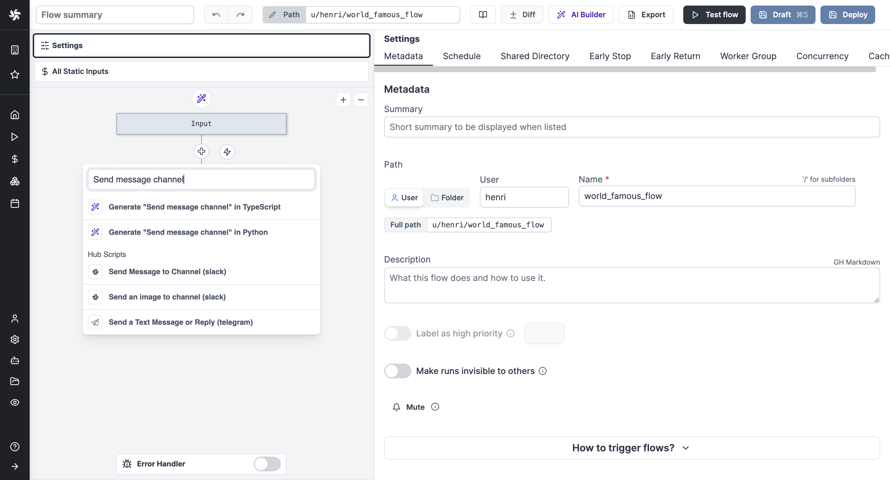

# Private Hub

[Windmill Hub](https://hub.windmill.dev/) is the community website of Windmill where you can find and share your Scripts, Flows, Apps and Resource types with every Windmill user. 
The best submissions get approved by the Windmill Team and get integrated directly in the app for everyone to reuse easily.

> Example of Hub scripts suggested in flow editor

 

On [Enterprise Edition](/pricing) and [Whitelabelling](/pricing), you can have your own Private Hub. 
You decide which scripts, flows, apps and resource types are approved and are shared with your Windmill instances, appearing directly in the app.

You can configure your Private Hub using Docker by following the instructions in the [Private Hub repository](https://github.com/windmill-labs/windmillhub-ee-public).
We also provide [values in our Helm chart](https://github.com/windmill-labs/windmill-helm-charts/blob/main/charts/windmill/values.yaml) for including the Private Hub in a Kubernetes cluster.

Once your Private Hub is up and running, you need to change the hub base url field in the core [instance settings](../../advanced/18_instance_settings/index.mdx#private-hub-base-url) to your Private Hub url.

:::warning
Authentication on the Hub is performed via the Windmill instance.
The Hub and Windmill instances must have the same root domain name for authentication to work.
For example, if the Windmill instance is available on windmill.example.com, the Hub must be accessible on a similar sub-domain such as hub.example.com.
You'll also need to set the COOKIE_DOMAIN [environment variable](../47_environment_variables/index.mdx) of the Windmill instance (server) to the root domain name (e.g. example.com). 
If you're using the [Helm chart](https://github.com/windmill-labs/windmill-helm-charts/blob/main/charts/windmill/values.yaml#L50), there is a built-in `cookieDomain` value for this.
**Make sure to log out and log back in after setting the cookie domain.**
:::

If you are interested in having your own Private Hub, please [contact us](mailto:contact@windmill.dev).

## Restricting access to your Private Hub

To restrict access to your Private Hub, you need to set the `API_SECRET` environment variable on your Private Hub instance.
You will also need to set the `Private Hub api secret` field in the [instance settings](../../advanced/18_instance_settings/index.mdx#private-hub-api-secret) on your Windmill instance to the same value.

When an `API_SECRET` is set, the Private Hub will only be accessible to logged in users or to requests authenticated with the `X-api-secret` header.

## Local syncing and syncing with the public Hub

We provide a [CLI](https://www.npmjs.com/package/@windmill-labs/hub-cli) to sync your Private Hub with your local file system. To use the CLI, set the following environment variables:

1. `HUB_URL`: The URL of your Private Hub
2. `TOKEN`: A superadmin user token

Use the commands `wmill-hub pull` and `wmill-hub push` for pulling and pushing, respectively.
The CLI will create a `hub` folder on your local system with all the integration folders inside.

If you want to partially or fully sync your private hub with the public one:

1. Pull the scripts locally from the public hub using `wmill-hub wm-pull`. This will pull the scripts to a folder named `hub`.
2. Delete any integration folders you don’t want to add to your Private Hub.
3. Push the scripts to your Private Hub using `wmill-hub push`.

:::info
If for some reason you can't pull from the official hub with `wmill-hub wm-pull`, we can provide you with a zip file of the public hub scripts.
Once extracted, you will see a hub folder with all the integration folders inside. Drag and drop those folders into your `hub` folder.
You can then push as usual using `wmill-hub push`.
:::

## Hub scripts search and embeddings

The search on your private hub and on your Windmill instance is powered by vector search.
Vector search requires embeddings of the hub scripts which are computed by your private hub every hour. 
Your Windmill instance then fetches those embeddings once a day and uses them for search in the app.

You can modify the embeddings computation and the embeddings retrieval frequencies.

- To update the embedding computation frequency, set the environment variable `EMBEDDINGS_REFRESH_INTERVAL_SECS` on your Hub server. We do not recommend setting this value to less than 3600 seconds, as it can be resource-intensive, especially for large hubs.
- To update the frequency of embedding retrieval, set the environment variable `HUB_EMBEDDINGS_PULLING_INTERVAL_SECS` on your Windmill server(s).

Both values are in seconds.
