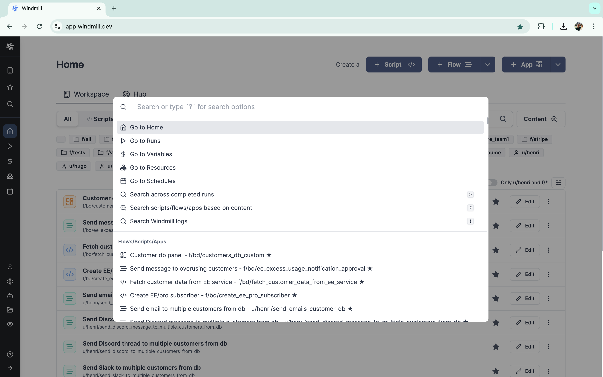
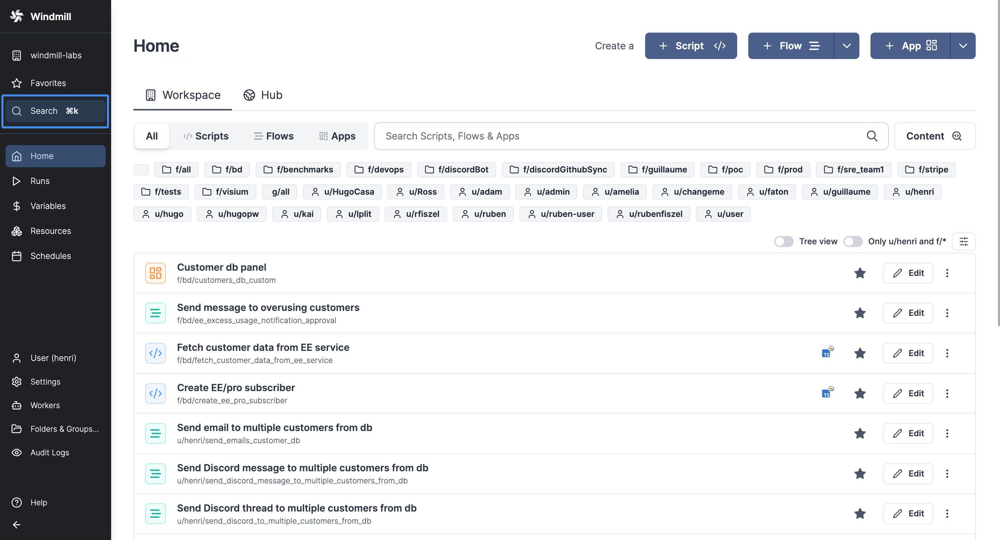
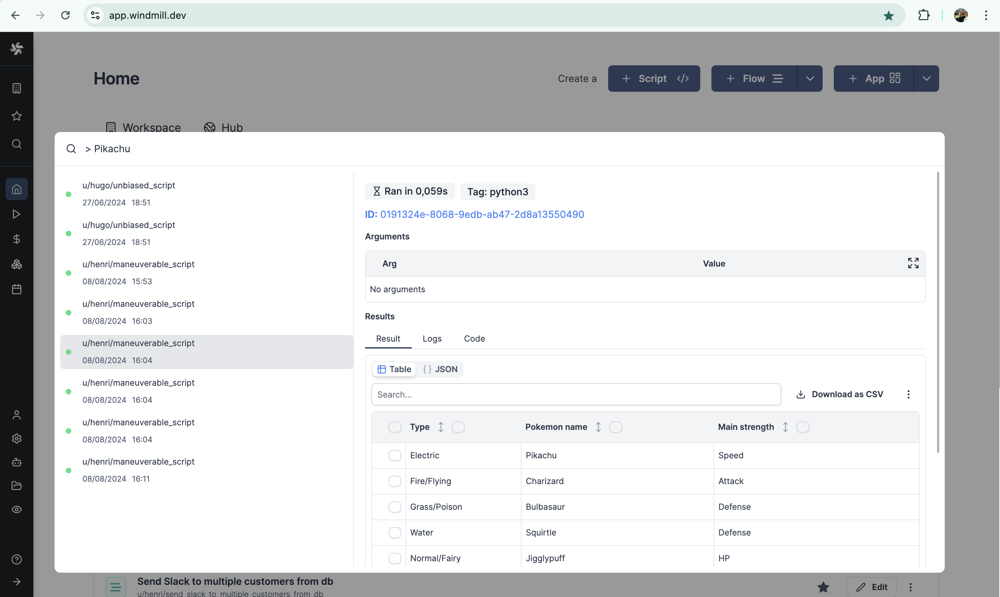
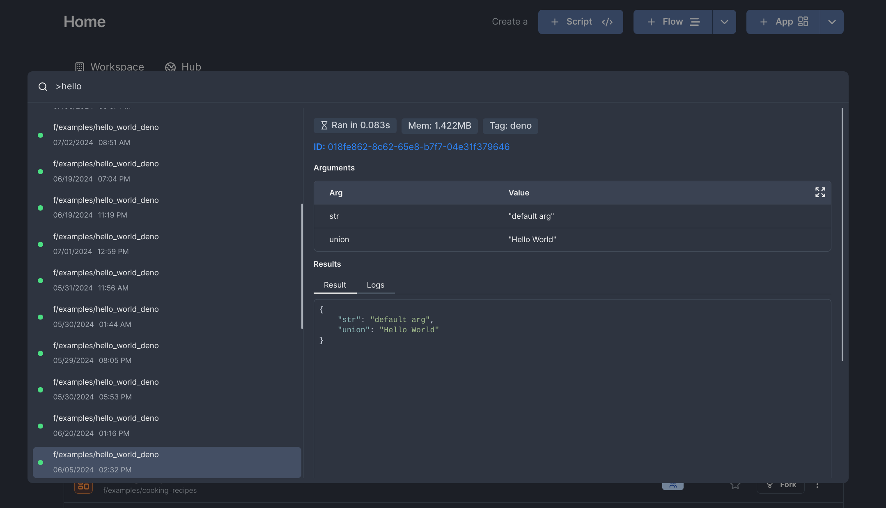

import DocCard from '@site/src/components/DocCard';

# Search bar

Every workspace has a Search bar to navigate through it.



It can be triggered with shortcut `Ctrl + K` & `⌘k` on Mac, or with Search button from sidebar. From here you can select from the options with the mouse or browse with the arrow keys.



Only [Superadmins, Admins & Developers](../16_roles_and_permissions/index.mdx#roles-in-windmill) (not Operators) have access to this feature.

It can go to several pages:
- Home
- [Runs](../5_monitor_past_and_future_runs/index.mdx)
- [Variables](../2_variables_and_secrets/index.mdx)
- [Resources](../3_resources_and_types/index.mdx)
- [Schedules](../1_scheduling/index.mdx)

<video
  className="border-2 rounded-xl object-cover w-full h-full dark:border-gray-800"
  autoPlay
  loop
  controls
  src="/videos/search_bar.mp4"
/>

## Prefix keys

With a special prefix key, you can search accros:
- [Completed runs](#searching-runs) (arguments, results) with with key `>`.
- [Content](#content-search) of scripts, flows and apps with key `#` (without [Enterprise Edition](/pricing), content search will only search among 10 scripts, 3 flows, 3 apps and 3 resources).
- [Logs](#searching-logs) with key `!`.


> Search accross runs with key `>`.

### Searching runs

:::info
Full text search is a feature available in Windmill EE, however, note that it is disabled by default in the example docker compose. To enable full text search on logs and completed jobs, you need to spin up the indexer service, [learn how to](../../misc/18_full_text_search/index.mdx).
:::

You can search through completed runs by selecting the option on the search menu, or by prefixing your search with `>`.



Queries are parsed by Tantivy's [QueryParser](https://docs.rs/tantivy/latest/tantivy/query/struct.QueryParser.html), which lets you build relatively complex and useful queries. For example, you can try searching:

```
> script_path:u/user/searchable_flow AND success:false
```

to get the jobs corresponding to said path that also failed.

Learn more about the query syntax: [Tantivy QueryParser docs](https://docs.rs/tantivy/latest/tantivy/query/struct.QueryParser.html)

#### Searchable fields for jobs

The fields that are indexed and that you can use with the `my_field:some_text` syntax, :

| Filed name       | Type |
| ---------------- | ---- |
| id	           | TEXT |
| parent_job       | TEXT |
| created_by       | TEXT |
| duration_ms      | INT  |
| success          | BOOL |
| script_hash      | TEXT |
| script_path      | TEXT |
| args             | TEXT |
| result           | TEXT |
| logs             | TEXT |
| deleted          | BOOL |
| canceled         | BOOL |
| canceled_by      | TEXT |
| canceled_reason  | TEXT |
| job_kind         | TEXT |
| schedule_path    | TEXT |
| permissioned_as  | TEXT |
| is_flow_step     | BOOL |
| language         | TEXT |
| is_skipped       | BOOL |
| email            | TEXT |
| visible_to_owner | BOOL |
| mem_peak         | INT  |
| tag              | TEXT |
| created_at       | DATE |
| started_at       | DATE |

### Content search

By using the `#` prefix, you can use windmill's [Content search](../26_content_search/index.mdx) and search through scripts, flows, and apps.

<div className="grid grid-cols-2 gap-6 mb-4">
	<DocCard
		title="Content search"
		description="Search any scripts, flows, resources, apps for a specific string similar to GitHub search."
		href="/docs/core_concepts/content_search"
	/>
</div>

### Searching logs

If you use the ! prefix and type any string, you will get an option to search that query on the Windmill [Service Logs](../36_service_logs/index.mdx#log-search) tool.
