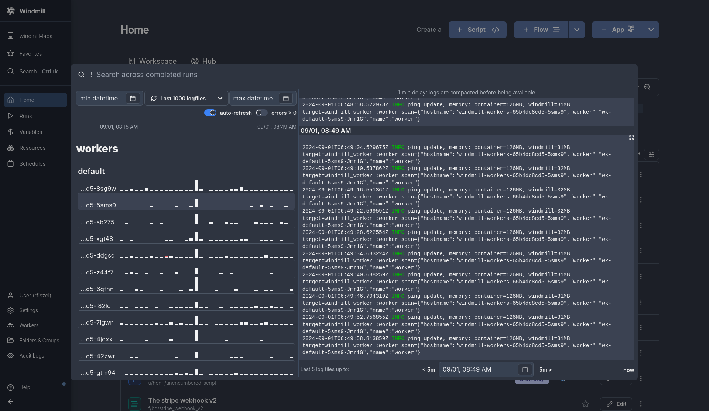
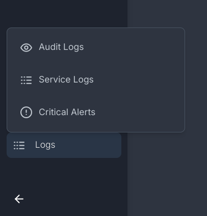
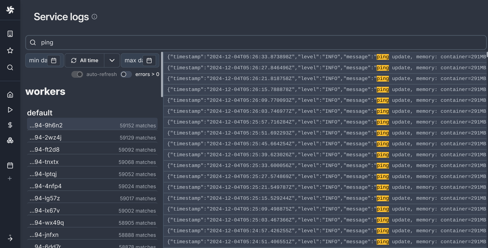

# Service logs

View logs from any [workers](../9_worker_groups/index.mdx) or servers directly within the service logs section of the [search modal](../35_search_bar/index.mdx).




Windmill provides direct access to the logs emitted by containers, removing the need to manually retrieve them from Docker or other container platforms. This enables monitoring services without needing to leave the Windmill environment.

You can view them from the [Workers](../9_worker_groups/index.mdx) page, in particular:

- **Real-Time Monitoring**: While logs are emitted continuously, there is a 1-minute latency before they appear in the interface.
- **Visual Graphs**: You can easily track the number of logs and errors over time, displayed in a graphical interface:
  - **Log Count**: Displayed in the mini-graph, showing how many logs were generated each minute.
  - **Error Count**: Displayed in red, highlighting errors separately for quick identification.
- **Separation by Type**: Logs are organized by type. You can see logs for workers, servers and indexers.


On the left menu, you can navigate to Service logs.



## Log search

:::info
Full text search is a feature available in Windmill EE, however, note that it is disabled by default in the example docker compose. To enable full text search on logs and completed jobs, you need to spin up the indexer service, [learn how to](../../misc/18_full_text_search/index.mdx).
:::

You can type any string on the search bar to query logs, the hosts that matched your query will be shown on the left pane with the count of lines that matched the query.

If you select a host, you will get the most recent lines that match your query (limited to 1000). This is very similar to what you would expect from a graphana setup.




Queries are parsed by Tantivy's [QueryParser](https://docs.rs/tantivy/latest/tantivy/query/struct.QueryParser.html), which lets you build relatively complex and useful queries. For example, you can try searching:

```
worker_group:default ping
```
To limit the search to workers in the default worker group.

The fields that are indexed and can be used for this kind of search are:

| Filed name  | Type | Description |
| ----------- | ---- | ----------- |
|host         | TEXT | The hostname, e.g windmill-workers-7cbf97c994-lptqj |
|mode         | TEXT | The mode, `worker`, `server` or `indexer` |
|worker_group | TEXT | Worker Group associated (if applicable) |
|timestamp    | DATE | This is the timestamp of the log file used to store the logs internally, meaning that it's innacurate of up to a minute. |
|file_name    | TEXT | Name of the file associated in s3 or in disk. |
|logs         | TEXT | the log lines themselves. `logs:<query>` is equivalent to `query` |


## Log storage

Windmill provides a flexible solution for log storage depending on your setup:

- **Standard Setup** (without [Enterprise Edition](/pricing)):
  Logs are stored locally on disk. For this to work, there must be a dedicated log disk, which is pre-configured in the Docker Compose setup.
  
- **Enterprise Edition** (with [Instance object storage](../38_object_storage_in_windmill/index.mdx#instance-object-storage)):
  For users with the Enterprise Edition (EE), logs can be stored in S3 if instance object storage is configured. This option provides more scalable storage and is ideal for larger-scale deployments or where long-term log retention is important.

### Log retention

Windmill retains logs no older than two weeks. You can decide if this retention policy also applies to the logs stored on s3 through the Instance Settings.

## Visibility

As these are the logs of the whole windmill instance, only users with the [superadmin](../16_roles_and_permissions/index.mdx#superadmin) or [devops](../16_roles_and_permissions/index.mdx#devops) roles can see this page.
