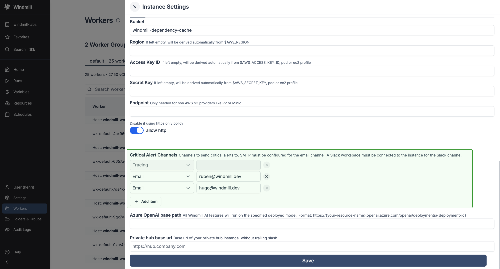

import DocCard from '@site/src/components/DocCard';

# Critical Alert Channels

Get a notification everytime a job is re-run after a crash.

This feature is available in the [Enterprise Edition](/pricing).

If the node it which it runs halt suddenly (such as a power loss), then the [job](../20_jobs/index.mdx) will be restarted automatically. Windmill itself doesn't crash and other softer interruptions like a pod termination involve a grace period (300s) to let the job finish.

You just need to [configure SMTP](../../advanced/1_self_host/index.mdx#set-up-smtp-from-the-ui) and setup a critical alert channel (aka email address) in the [instance settings](../../advanced/18_instance_settings/index.mdx#smtp) or connect your instance to Slack and fill in a channel name.

You can also set an alert to receive notification when the number of running workers in a group falls below a given number. It's available in the [worker group config](../9_worker_groups/index.mdx#alerts).

	<DocCard
		title="Workers Alerts"
		description="Set an alert to receive notification when the number of running workers in a group falls below a given number."
		href="/docs/core_concepts/worker_groups#alerts"
	/>

