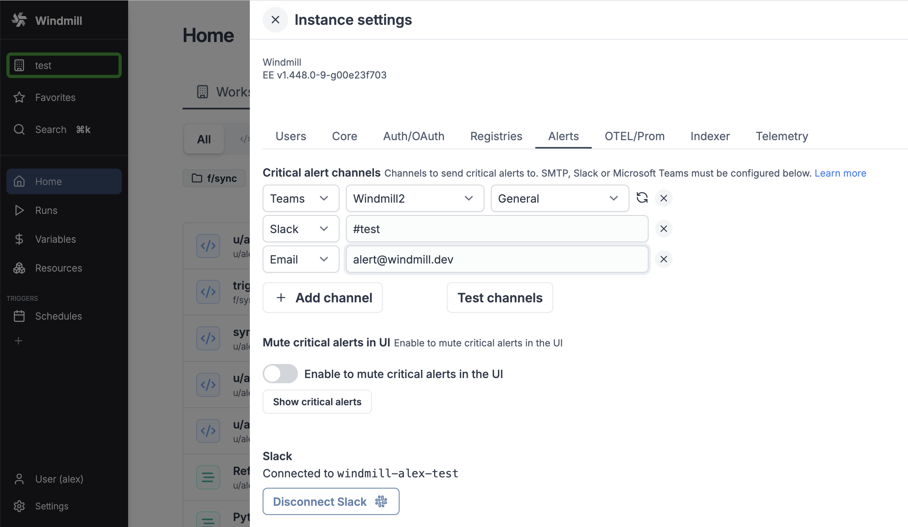

import DocCard from '@site/src/components/DocCard';

# Critical alerts

Get a notification everytime a job is re-run after a crash.

This feature is available in the [Enterprise Edition](/pricing).

If the node it which it runs halt suddenly (such as a power loss), then the [job](../20_jobs/index.mdx) will be restarted automatically. Windmill itself doesn't crash and other softer interruptions like a pod termination involve a grace period (300s) to let the job finish.

Critical alerts are generated under the following conditions:

- [Job](../20_jobs/index.mdx) is re-run after a crash.
- [License key](../../misc/7_plans_details/index.mdx#using-the-license-key-self-host) does not renew.
- [Workspace error handler](../10_error_handling/index.mdx#workspace-error-handler) fails.
- Number of running workers in a group falls below a specified threshold (has to be configured in the [worker group](../9_worker_groups/index.mdx) config).
- Number of [jobs waiting in queue](../9_worker_groups/index.mdx#queue-metric-alerts) is above a threshold for more than a specified amount of time.

## Critical alert channels

You just need to [configure SMTP](../../advanced/18_instance_settings/index.mdx#smtp) and setup a critical alert channel (aka email address) in the [instance settings](../../advanced/18_instance_settings/index.mdx#smtp) and/or connect your instance to [Slack and Microsoft Teams](../../advanced/18_instance_settings/index.mdx#critical-alert-channels) and fill in a channel name.

You can also set an alert to receive notification when the number of running workers in a group falls below a given number. It's available in the [worker group config](../9_worker_groups/index.mdx#alerts).

	<DocCard
		title="Workers Alerts"
		description="Set an alert to receive notification when the number of running workers in a group falls below a given number."
		href="/docs/core_concepts/worker_groups#alerts"
	/>

## Critical alerts in UI

Windmill itself sends critical alerts notifications through the UI.

You can disable this in the [instance settings](../../advanced/18_instance_settings/index.mdx#mute-critical-alerts-in-ui).

### Visibility

Instance wide Critical Alerts are only visible to users with the [superadmin](../16_roles_and_permissions/index.mdx#superadmin) or [devops](../16_roles_and_permissions/index.mdx#devops) roles. For workspace specifc alerts, users need to have admin privilege over that workspace.
