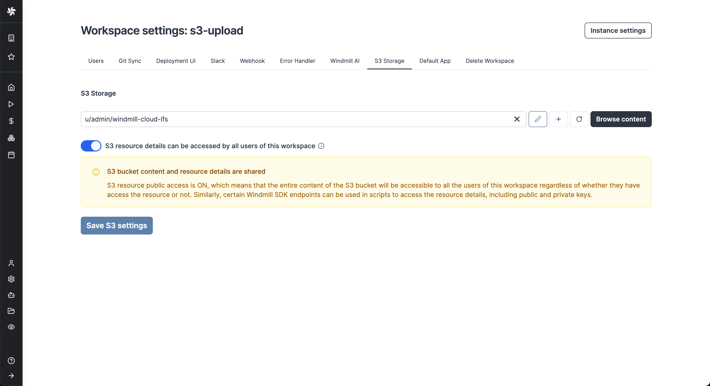
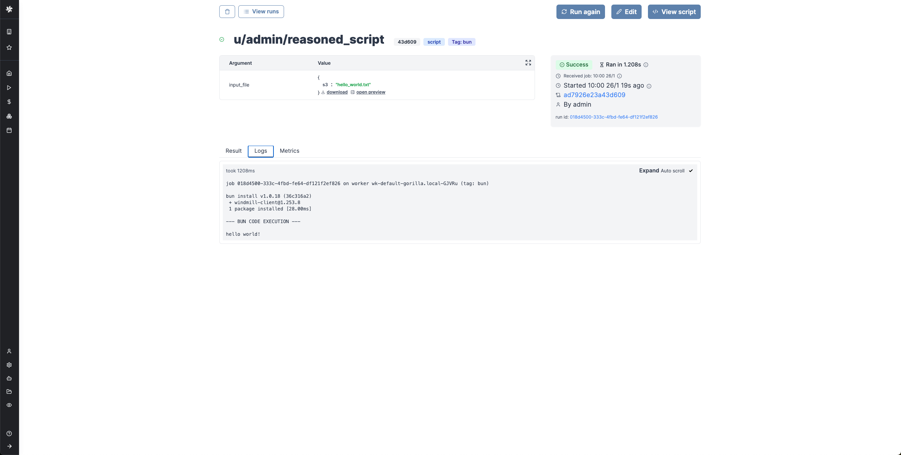

import Tabs from '@theme/Tabs';
import TabItem from '@theme/TabItem';
import DocCard from '@site/src/components/DocCard';

# Object storage in Windmill (S3)

Instance and workspace object storage are different from using [S3 resources](../../integrations/s3.mdx) within scripts, flows, and apps, which is free and unlimited.

At the [workspace level](#workspace-object-storage), what is exclusive to the [Enterprise](/pricing) version is using the integration of Windmill with S3 that is a major convenience layer to enable users to read and write from S3 without having to have access to the credentials.

Additionally, for [instance integration](#instance-object-storage), the Enterprise version offers advanced features such as large-scale log management and distributed dependency caching.


## Workspace object storage

Connect your Windmill workspace to your S3 bucket, Azure Blob storage, or GCS bucket to enable users to read and write from S3 without having to have access to the credentials. When you reference S3 objects in your code, Windmill automatically tracks these data flows through the [Assets](../52_assets/index.mdx) feature for better pipeline visibility.


Windmill S3 bucket browser will not work for buckets containing more than 20 files and uploads are limited to files < 50MB. Consider upgrading to Windmill [Enterprise Edition](/pricing) to use this feature with large buckets.

Once you've created an [S3, Azure Blob, or Google Cloud Storage resource](../../integrations/s3.mdx) in Windmill, go to the workspace settings > S3 Storage. Select the resource and click Save.



From now on, Windmill will be connected to this bucket and you'll have easy access to it from the code editor and the job run details. If a script [takes as input](#take-a-file-as-input) a `s3object`, you will see in the input form on the right a button helping you choose the file directly from the bucket.
Same for the result of the script. If you return an `s3object` containing a [key](../19_rich_display_rendering/index.mdx#s3) `s3` pointing to a file inside your bucket, in the result panel there will be a button to open the bucket explorer to visualize the file.

S3 files in Windmill are just pointers to the S3 object using its key. As such, they are represented by a simple JSON:

```json
{
	"s3": "path/to/file"
}
```

## Resources permissions

:::info

Advanced S3 permissions are only available on [Enterprise Edition](/pricing). Without advanced permissions, all users have R/W to all files on an S3 workspace storage, but they cannot list them

:::

When you configure a workspace storage, you can enable advanced permissions to finely control which users can access which files in the bucket.
The default rules enforce that users can only access files in S3 in paths that they would have access to in Windmill.

For example, user `alice` can access files in the path `u/alice/**/*` and files shared with her in `g/group1/**/*` if she is part of `group1`. If she has read-only access to `folder1`, and she tries to access the s3 object at path, `f/folder1/file.csv`, she will only be able to read the file, not write or delete it.

These rules are enforced when accessing data with the Windmill client (e.g in Typescript or Python), or from the Windmill S3 Proxy (used by DuckDB scripts).


You can customise these rules however you'd like. The rules are read in order, and the first one to match decides of the access. If no rules match, the access is denied. We support the unix glob syntax (`**`, `*`, `?`, `{a,b}` ...)

You can use interpolated variables like `{username}`, which will be replaced by the current user's username. A rule might get transformed to multiple ones, for example, for a user in group1 and group2, the rule `g/{group}/**/*` will expand to `['g/group1/**/*', 'g/group2/**/*']`.

Admins can always access everything.

All interactions with the S3 bucket are proxied through Windmill's backend. We guarantee that users who don't have access to the resource won't be able to retrieve any of its details (access key and secret key), unless the lecacy public mode is enabled (see below).

:::note Legacy

The resource can be set to be public by disabling advanced permissions which will show the "S3 resource details can be accessed by all users of this workspace" toggle.

In this case, permissions will be ignored when users interact with the S3 bucket via Windmill. Note that when the resource is public, the users might be able to access all of its details (including access keys and secrets) via some Windmill endpoints.

:::

### S3 input and output UI

When a script accepts a S3 file as input, it can be directly uploaded or chosen from the bucket explorer.


When a script outputs a S3 file, it can be downloaded or previewed directly in Windmill's UI (for displayable files like text files, CSVs, images, PDFs, and parquet files).


Even though the whole file is downloadable, the backend only sends the rows that the frontend needs for the preview. This means that you can manipulate objects of infinite size, and the backend will only return what is necessary.

You can even display several S3 files through an array of S3 objects:

```ts
export async function main() {
  return [{s3: "path/to/file_1"}, {s3: "path/to/file_2", {s3: "path/to/file_3"}}];
}
```


:::warning

Rendering JSON files straight from S3 is not supported. Instead you can load the file and parse it as a JSON object and return it as a [rich result](../19_rich_display_rendering/index.mdx).

:::

### Read a file from S3 or object storage within a script

`S3Object` is a type that represents a file in S3 or object storage.

S3 files in Windmill are just pointers to the S3 object using its key. As such, they are represented by a simple JSON:

```json
{
	"s3": "path/to/file"
}
```

You can read a file from S3 or object storage within a script using the `loadS3File` and `loadS3FileStream` functions from the [TypeScript client](../../advanced/2_clients/ts_client.mdx) and the `wmill.load_s3_file` and `wmill.load_s3_file_stream` functions from the [Python client](../../advanced/2_clients/python_client.md). When writing or manipulating file content, consider using `Blob` objects to efficiently handle binary data and ensure compatibility across different file types.

- **`loadS3File`**: This function loads the entire file content into memory as a single unit, which is useful for smaller files where you need immediate access to all data.
- **`loadS3FileStream`**: This function provides a stream of the file content, allowing you to process large files incrementally without loading the entire file into memory, which is ideal for handling large datasets or files.

<Tabs className="unique-tabs">

<TabItem value="bun" label="TypeScript (Bun)" attributes={{className: "text-xs p-4 !mt-0 !ml-0"}}>

```ts
import * as wmill from 'windmill-client';
import { S3Object } from 'windmill-client';

export async function main() {
	const example_file: S3Object = {
		s3: 'path/to/file'
	};

	// Load the entire file_content as a Uint8Array
	const file_content = await wmill.loadS3File(example_file);

	const decoder = new TextDecoder();
	const file_content_str = decoder.decode(file_content);
	console.log(file_content_str);

	// Or load the file lazily as a Blob
	let fileContentBlob = await wmill.loadS3FileStream(example_file);
	console.log(await fileContentBlob.text());
}
```

</TabItem>

<TabItem value="deno" label="TypeScript (Deno)" attributes={{className: "text-xs p-4 !mt-0 !ml-0"}}>

```ts
import * as wmill from 'npm:windmill-client@1.253.7';
import { S3Object } from 'npm:windmill-client@1.253.7';

export async function main() {
	const example_file: S3Object = {
		s3: 'path/to/file'
	};

	// Load the entire file_content as a Uint8Array
	const file_content = await wmill.loadS3File(example_file);

	const decoder = new TextDecoder();
	const file_content_str = decoder.decode(file_content);
	console.log(file_content_str);

	// Or load the file lazily as a Blob
	let fileContentBlob = await wmill.loadS3FileStream(example_file);
	console.log(await fileContentBlob.text());
}
```

</TabItem>

<TabItem value="python" label="Python" attributes={{className: "text-xs p-4 !mt-0 !ml-0"}}>

```python
import wmill
from wmill import S3Object

def main():

	example_file = S3Object(s3='path/to/file')

	# Load the entire file_content as a bytes array
    file_content = wmill.load_s3_file(example_file)
    print(file_content.decode('utf-8'))

    # Or load the file lazily as a Buffered reader:
    with wmill.load_s3_file_reader(example_file) as file_reader:
        print(file_reader.read())
```

</TabItem>
</Tabs>



Certain file types, typically parquet files, can be [directly rendered by Windmill](../19_rich_display_rendering/index.mdx).

### Take a file as input

Scripts can accept a S3Object as input.

<Tabs className="unique-tabs">

<TabItem value="bun" label="TypeScript (Bun)" attributes={{className: "text-xs p-4 !mt-0 !ml-0"}}>

```ts
import * as wmill from 'windmill-client';
import { S3Object } from 'windmill-client';

export async function main(input_file: S3Object) {
	// rest of the code
}
```

</TabItem>

<TabItem value="deno" label="TypeScript (Deno)" attributes={{className: "text-xs p-4 !mt-0 !ml-0"}}>

```ts
import * as wmill from 'npm:windmill-client@1.253.7';
import { S3Object } from 'npm:windmill-client@1.253.7';

export async function main(input_file: S3Object) {
	// rest of the code
}
```

</TabItem>

<TabItem value="python" label="Python" attributes={{className: "text-xs p-4 !mt-0 !ml-0"}}>

```python
import wmill
from wmill import S3Object

def main(input_file: S3Object):

# Rest of the code
```

</TabItem>
</Tabs>

The [auto-generated UI](../6_auto_generated_uis/index.mdx) will display a file uploader:


or you can fill path manually if you enable 'Raw S3 object input':


and access bucket explorer if [resource permissions](#resources-permissions) allow it:


That's also the recommended way to [pass](../../flows/16_architecture.mdx) S3 files as input to steps within [flows](../../flows/1_flow_editor.mdx).


### Create a file from S3 or object storage within a script

You can create a file from S3 or object storage within a script using the `writeS3File` function from the [TypeScript client](../../advanced/2_clients/ts_client.mdx) and the `wmill.write_s3_file` function from the [Python client](../../advanced/2_clients/python_client.md).

<Tabs className="unique-tabs">

<TabItem value="bun" label="TypeScript (Bun)" attributes={{className: "text-xs p-4 !mt-0 !ml-0"}}>

```ts
import * as wmill from 'windmill-client';
import { S3Object } from 'windmill-client';

export async function main(s3_file_path: string) {
	const s3_file_output: S3Object = {
		s3: s3_file_path
	};

	const file_content = 'Hello Windmill!';
	// file_content can be either a string or ReadableStream<Uint8Array>
	await wmill.writeS3File(s3_file_output, file_content);
	return s3_file_output;
}
```

</TabItem>

<TabItem value="deno" label="TypeScript (Deno)" attributes={{className: "text-xs p-4 !mt-0 !ml-0"}}>

```ts
import * as wmill from 'npm:windmill-client@1.253.7';
import { S3Object } from 'npm:windmill-client@1.253.7';

export async function main(s3_file_path: string) {
	const s3_file_output: S3Object = {
		s3: s3_file_path
	};

	const file_content = 'Hello Windmill!';
	// file_content can be either a string or ReadableStream<Uint8Array>
	await wmill.writeS3File(s3_file_output, file_content);
	return s3_file_output;
}
```

</TabItem>

<TabItem value="python" label="Python" attributes={{className: "text-xs p-4 !mt-0 !ml-0"}}>

```python
import wmill
from wmill import S3Object

def main(s3_file_path: str):
    s3_file_output = S3Object(s3=s3_file_path)

    file_content = b"Hello Windmill!"
	# file_content can be either bytes or a BufferedReader
    file_content = wmill.write_s3_file(s3_file_output, file_content)
    return s3_file_output
```

</TabItem>
</Tabs>


For more info on how to use files and S3 files in Windmill, see [Handling files and binary data](../18_files_binary_data/index.mdx).

### Secondary storage

Read and write from a storage that is not your main storage by specifying it in the S3 object as "secondary_storage" with the name of it.

From the workspace settings, in tab "S3 Storage", just click on "Add secondary storage", give it a name, and pick a resource from type "S3", "Azure Blob", "Google Cloud Storage", "AWS OIDC" or "Azure Workload Identity". You can save as many additional storages as you want as long as you give them a different name.

Then from script, you can specify the secondary storage with an object with properties `s3` (path to the file) and `storage` (name of the secondary storage).

```ts
const file = { s3: 'folder/hello.txt', storage: 'storage_1' };
```

Here is an example of the [Create](#create-a-file-from-s3-or-object-storage-within-a-script) then [Read](#read-a-file-from-s3-or-object-storage-within-a-script) a file from S3 within a script with secondary storage named "storage_1":

```ts
import * as wmill from 'windmill-client';

export async function main() {
	await wmill.writeS3File({ s3: 'data.csv', storage: 'storage_1' }, 'fooo\n1');

	const res = await wmill.loadS3File({ s3: 'data.csv', storage: 'storage_1' });

	const text = new TextDecoder().decode(res);

	console.log(text);
	return { s3: 'data.csv', storage: 'storage_1' };
}
```

<iframe
	style={{ aspectRatio: '16/9' }}
	src="https://www.youtube.com/embed/-nJs6E_1E8Y"
	title="Secondary Storage"
	frameBorder="0"
	allow="accelerometer; autoplay; clipboard-write; encrypted-media; gyroscope; picture-in-picture; web-share"
	allowFullScreen
	className="border-2 rounded-lg object-cover w-full dark:border-gray-800"
></iframe>

### Windmill integration with Polars and DuckDB for data pipelines

ETLs can be easily implemented in Windmill using its integration with Polars and DuckDB to facilitate working with tabular data. In this case, you don't need to manually interact with the S3 bucket, Polars/DuckDB does it natively and in a efficient way. Reading and Writing datasets to S3 can be done seamlessly.

Learn more about it in the [Data pipelines](../27_data_pipelines/index.mdx) section.

<div className="grid grid-cols-2 gap-6 mb-4">
	<DocCard
		title="Data pipelines"
		description="Windmill enables building fast, powerful, reliable, and easy-to-build data pipelines."
		href="/docs/core_concepts/data_pipelines"
	/>
</div>

### Dynamic S3 object access in public apps

For security reasons, dynamic S3 objects are not accessible by default in public apps when users aren't logged in.
To make them publicly accessible, you need to sign S3 objects using Windmill's built-in helpers:

- TypeScript: `wmill.signS3Object()` (single) / `wmill.signS3Objects()` (multiple)
- Python: `wmill.sign_s3_object()` (single) / `wmill.sign_s3_objects()` (multiple)

These functions take an `S3Object` as input and return an `S3Object` with an additional `presigned` property containing a signature that makes the object publicly accessible.

Signed S3 objects are supported by the [Image](../../apps/4_app_configuration_settings/image.mdx), [Rich result](../../apps/4_app_configuration_settings/rich_result.mdx) and [Rich result by job id](../../apps/4_app_configuration_settings/rich_result_by_job_id.mdx) app components.

## Instance object storage

Under [Enterprise Edition](/pricing), instance object storage offers advanced features to enhance performance and scalability at the [instance](../../advanced/18_instance_settings/index.mdx) level. This integration is separate from the [Workspace object storage](#workspace-object-storage) and provides solutions for large-scale log management and distributed dependency caching.


This can be configured from the [instance settings](../../advanced/18_instance_settings/index.mdx#instance-object-storage), with configuration options for S3, Azure Blob, Google Cloud Storage, or AWS OIDC.


### Large job logs management

To optimize log storage and performance, Windmill leverages S3 for log management. This approach minimizes database load by treating the database as a temporary buffer for up to 5000 characters of logs per job.

For jobs with extensive logging needs, Windmill [Enterprise Edition](/pricing) users benefit from seamless log streaming to S3. This ensures logs, regardless of size, are stored efficiently without overwhelming local resources.

This allows the handling of large-scale logs with minimal database impact, supporting more efficient and scalable workflows.

For large logs storage (and display) and cache for distributed Python jobs, you can [connect your instance to a bucket](../20_jobs/index.mdx#large-job-logs-management). This feature is at the Instance-level, and has no overlap with the Workspace object storage.

### Instance object storage distributed cache for Python, Rust, Go

[Workers](../../core_concepts/9_worker_groups/index.mdx) cache aggressively the [dependencies](../../advanced/6_imports/index.mdx) (and each version of them since every script has its own lockfile with a specific version for each dependency) so they are never pulled nor installed twice on the same worker. However, with a bigger cluster, for each script, the likelihood of being seen by a worker for the first time increases (and the cache hit ratio decreases).

However, you may have noticed that our multi-tenant [cloud solution](https://app.windmill.dev) runs as if most dependencies were cached all the time, even though we have hundreds of workers on there. For TypeScript, we do nothing special as npm has sufficient networking and npm packages are just tars that take no compute to extract. However, [Python](../../getting_started/0_scripts_quickstart/2_python_quickstart/index.mdx#caching) is a whole other story and to achieve the same swiftness in cold start the secret sauce is a global cache backed by S3.

This feature is available on [Enterprise Edition](/pricing) and is configurable from the [instance settings](../../advanced/18_instance_settings/index.mdx#instance-object-storage).

For [Bun](../../getting_started/0_scripts_quickstart/1_typescript_quickstart/index.mdx#caching), Rust, and [Go](../../getting_started/0_scripts_quickstart/3_go_quickstart/index.mdx#caching), the binary bundle is cached on disk by default. However, if Instance Object storage is configured, these bundles can also be stored on the configured object storage (like S3), providing a distributed cache across all workers.

<div className="grid grid-cols-2 gap-6 mb-4">
	<DocCard
		title="Instance object storage distributed cache for Python, Rust, Go"
		description="Leverage a global S3 cache to speed up Python dependency handling by storing and reusing pre-installed package."
		href="/docs/misc/s3_cache"
	/>
</div>

#### Global Python dependency cache

The first time a dependency is seen by a worker, if it is not cached locally, the worker search in the bucket if that specific `name==version` is there:

1. If it is not, install the dependency from pypi, then do a snapshot of installed dependency, tar it and push it to S3 (we call this a "piptar").
2. If it is, simply pull the "piptar" and extract it in place of installing from pypi. It is much faster than installing from pypi because that S3 is much closer to your workers than pypi and because there is no installation step to be done, a simple tar extract is sufficient which takes no compute.

### Service logs storage

[Logs are stored in S3](../36_service_logs/index.mdx) if S3 instance object storage is configured. This option provides more scalable storage and is ideal for larger-scale deployments or where long-term log retention is important.


<div className="grid grid-cols-2 gap-6 mb-4">
	<DocCard
		title="Service logs"
		description="View logs from any worker or servers directly within the service logs section of the search modal."
		href="/docs/core_concepts/service_logs"
	/>
</div>

## Streaming large SQL query results to S3 (Enterprise feature)

Sometimes, your SQL script will return too much data which exceeds the 10 000 rows query limit within Windmill. In this case, you will want to use the s3 flag to stream your query result to a file.

<DocCard
	title="SQL to S3 streaming"
	description="Stream an SQL query large result to a workspace storage file"
	href="/docs/core_concepts/sql_to_s3_streaming"
/>
