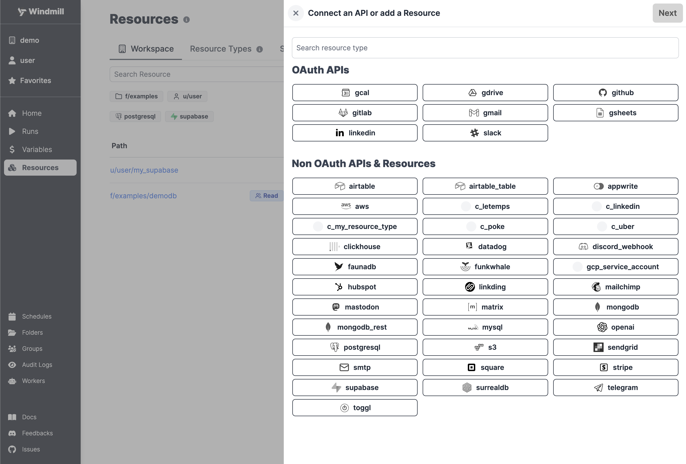
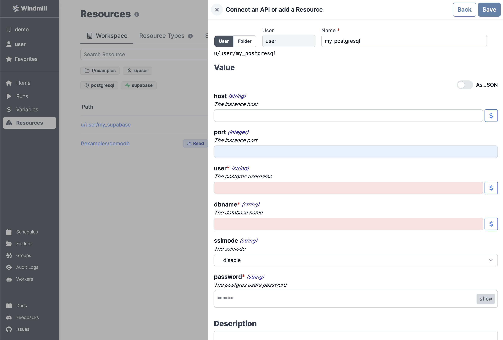
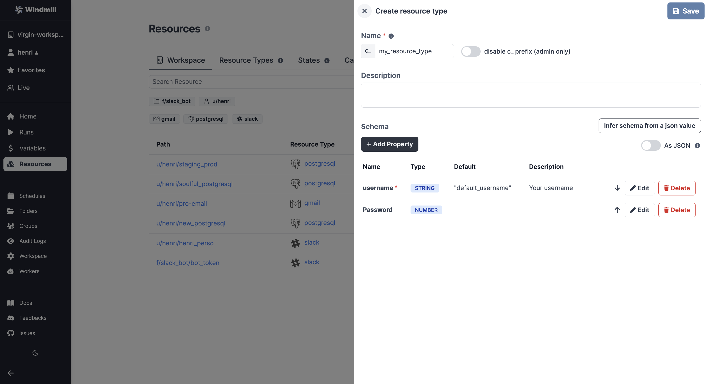
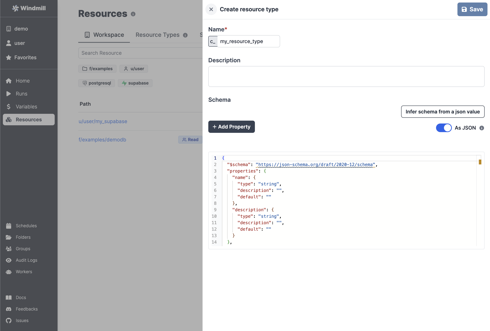
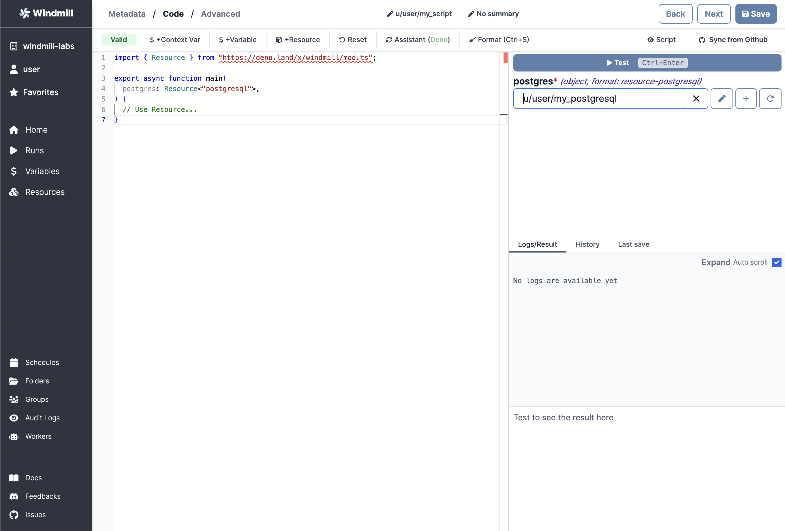

# Resources and Resource Types

Each Resource has a **Resource Type** (**RT** for short) - for example MySQL,
MongoDB, Slack, etc. - that defines the schema that the resource of this type
needs to implement. Schemas implement the
[JSON Schema specification](https://json-schema.org/).

## Create a Resource

To create a resource using an existing type, go to the
[Resources](https://app.windmill.dev/resources) page and click "Add a
resource/API".



Just like most objects in Windmill, Resources have a path that define their
permissions - see [ownership path prefix](../../reference/index.md#owner).

Each **Resource** has a **Resource Type**, that defines what fields that
resource contains. Select one from the list and check the schema to see what
fields are present.



Resources commonly need to access secrets or re-use
[Variables](../2_variables_and_secrets/index.md), for example passwords or API
tokens. To insert a Variable into a Resource, use **Insert variable** (the `$`
sign button) and select a Variable. The name of a Variable will look like
`$VAR:<NAME_OF_VAR>`. When resources are called from a Script, the Variable
reference will be replaced by its value.

:::tip

It's a good practice to **link a script template to Resources**, so that users can
easily get started with it. You can use markdown in the description field to add
a link, for example:

```md
[example script with this resource](/scripts/add?template=script/template/path)
```

:::

## Create a Resource Type

Windmill comes preloaded with some common Resource Types (databases, apps, SMTP,
etc. - see the list on [Windmill Hub](https://hub.windmill.dev/resources)). You
can also add custom Resource Types by clicking "Add a resource type" on the
[Resources](https://app.windmill.dev/resources) page.



Use the "Add Property" button to add a field to the resource type. You can
specify constraints for the field (a type, making it mandatory, specifying a
default, etc?). You can also view the schema by toggling the "As JSON" option:



## Using Resources

In Windmill, [Resources](../../reference/index.md#resource) represent
**connections to third party systems**. Resources are a good way to define a
connection to a frequently used third party system such as a database. Think of
Resources as a structured way to store configuration and credentials, and access
them from scripts.

Provided you have the right permissions, you can access resources from scripts
using the Windmill client. For example, to access the `u/user/my_postgresql`
resource of the `posgtgresql` Resource Type we would create a
[Script](../../reference/index.md#scripts):

```typescript
import { Resource } from "https://deno.land/x/windmill/mod.ts";

export async function main(
  postgres: Resource<"postgresql">,
) {
  // Use Resource...
}
```

```python
postgresql = dict

def main(postgres: postgresql):
    # Use Resource...
```


And then select the Resource in the arguments section on the right:

:::tip

You can also edit the Resource or even create a new one right **from the Script
editor**.

:::


