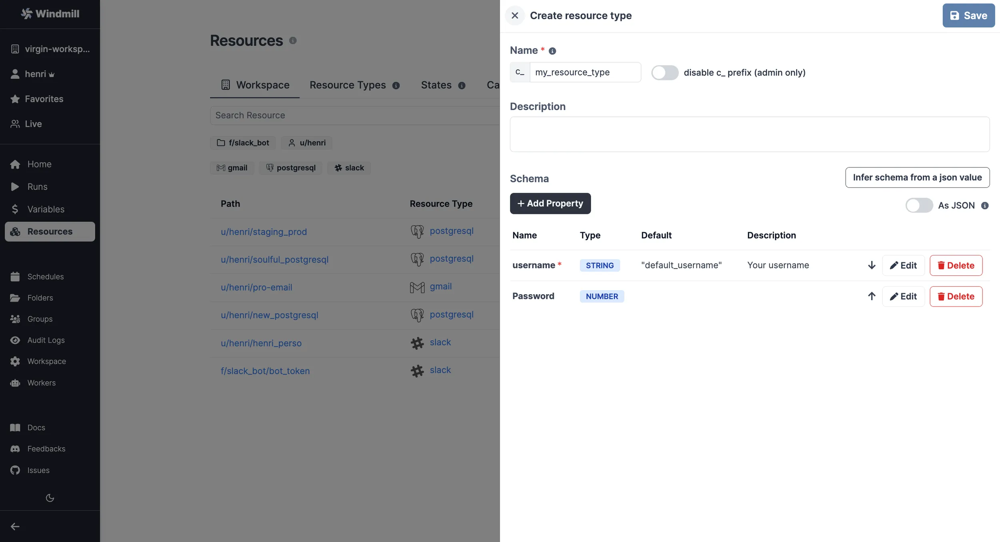
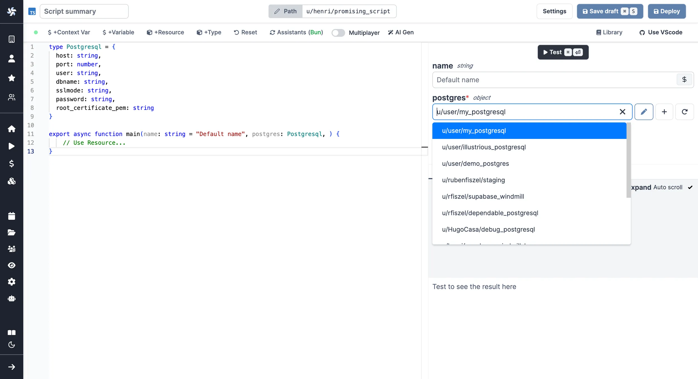

import DocCard from '@site/src/components/DocCard';
import Tabs from '@theme/Tabs';
import TabItem from '@theme/TabItem';

# Resources and resource types

Resources are rich objects in JSON that allow to store configuration and credentials.

In Windmill, Resources represent connections to third-party systems. Resources are a good way to define a
connection to a frequently used third-party system such as a database. Think of
Resources as a structured way to store configuration and credentials, and access them from scripts.

Each Resource has a **Resource Type** (RT for short) - for example [MySQL](https://hub.windmill.dev/resource_types/111/mysql),
[MongoDB](https://hub.windmill.dev/resource_types/22/mongodb), [OpenAI](https://hub.windmill.dev/resource_types/61/openai), etc. - that defines the schema that the resource of this type
needs to implement. Schemas implement the
[JSON Schema specification](https://json-schema.org/).


:::tip

Check our [list of integrations](../../integrations/0_integrations_on_windmill.mdx) (or, pre-made resource types). If one is missing, this very page details how to [create your own](#create-a-resource-type).

:::

<div className="grid grid-cols-2 gap-6 mb-4">
	<DocCard
		title="List of integrations"
		description="Windmill provides a framework to easily add integrations."
		href="/docs/integrations/integrations_on_windmill"
	/>
	<DocCard
		title="JSON Schema"
		description="JSON Schema is a declarative language that allows you to annotate and validate JSON documents."
		href="https://json-schema.org/"
		target="_blank"
	/>
</div>

## Create a resource

To create a resource using an existing type, go to the <a href="https://app.windmill.dev/resources" rel="nofollow">Resources </a> page and click "Add resource".


Just like most objects in Windmill, Resources have a path that defines their
permissions - see [ownership path prefix](../16_roles_and_permissions/index.mdx).

Each **Resource** has a **Resource Type**, that defines what fields that
resource contains. Select one from the list and check the schema to see what
fields are present.

Resources commonly need to access secrets or re-use
[Variables](../2_variables_and_secrets/index.mdx), for example, passwords or API
tokens. To insert a Variable into a Resource, use **Insert variable** (the `$`
sign button) and select a Variable. The name of a Variable will look like
`$VAR:<NAME_OF_VAR>`. When resources are called from a Script, the Variable
reference will be replaced by its value.

Resources can be assigned a description. It supports markdown.


:::tip

It's a good practice to **link a script template to Resources**, so that users can
easily get started with it. You can use markdown in the description field to add
a link, for example:

```md
[example script with this resource](/scripts/add?template=script/template/path)
```

:::

## Create a resource type

Windmill comes preloaded with some common Resource types, such as databases, apps, SMTP, etc. You can see the full list on [Windmill Hub](https://hub.windmill.dev/resources).
You can also add custom Resource types by clicking "Add a resource type" on the Resources page.



Use the "Add Property" button to add a field to the resource type. You can
specify constraints for the field (a type, making it mandatory, specifying a
default, etc). You can also view the schema by toggling the "As JSON" option:


The resources types created from the [Admins workspace](../../advanced/18_instance_settings/index.mdx#admins-workspace) are shared across all workspaces.

### Share resource type on Hub

You can contribute to the [Windmill Hub](https://hub.windmill.dev/) by sharing your Resource Type. To do so, add a Resource Type on the [Resources section](https://hub.windmill.dev/resources) of the Hub.

You will be asked to fill Name, Integration (the corresponding service it interacts with) and Schema (the JSON Schema of the Resource Type).

Verified Resource types on the Hub are directly added to the list of available Resource types on each new Windmill instance synced with the Hub.


### Sync resource types with WindmillHub

When creating a [self-hosted](../../advanced/1_self_host/index.mdx) instance, you are offered to set a [schedule](../1_scheduling/index.mdx) to regularly sync all resource types from [WindmillHub](https://hub.windmill.dev/). This will ensure that all the approved resource types are available in your instance. On Windmill cloud, it is done regularly by the Windmill team. Ask us if you need a specific [resource type from Hub](https://hub.windmill.dev/resources) to be added.

The [Bun](../../getting_started/0_scripts_quickstart/1_typescript_quickstart/index.mdx) script executed from the admin workspace is:

```ts
import * as wmill from "windmill-cli@1.393.2"

export async function main() {
  await wmill.hubPull({ workspace: "admins", token: process.env["WM_TOKEN"], baseUrl: globalThis.process.env["BASE_URL"] });
}
```

You can find this script on [WindmillHub](https://hub.windmill.dev/scripts/windmillhub/9069/synchronize-hub-resource-types-with-instance-windmillhub#approved).

This script is probably already on your [Admins workspace](../../advanced/18_instance_settings/index.mdx#admins-workspace), as it was suggested during Windmill [self-hosting setup](../../advanced/1_self_host/index.mdx). Having this script run on your Admins workspace will sync resources accross all workspaces of your instance.

To avoid running it manually, we recommend [scheduling](../1_scheduling/index.mdx) this script regularly.

## States

States are used by scripts to keep data persistent between runs of the same script by the same trigger (schedule or user).

In Windmill, states are considered as resources (rich objects in JSON), but they are excluded from the Workspace tab for clarity.
They are displayed on the Resources menu, under a dedicated tab.

A state is an object stored as a resource of the resource type `state` which is meant to persist across distinct executions of the same script.

```py
import requests
from wmill import set_state, get_state

def main():
	# Get temperature from last execution
    last_temperature = get_state()

    # Fetch the temperature in Paris from wttr.in
    response = requests.get("http://wttr.in/Paris?format=%t")

    new_temperature = response.text.strip("°F")

	# Set current temperature to state
    set_state(new_temperature)

    # Compare last_temperature and new_temperature
    if last_temperature < new_temperature:
        return "The temperature has increased."
    elif last_temperature > new_temperature:
        return "The temperature has decreased."
    else:
        return "The temperature has remained the same."
```

States are what enable Flows to watch for changes in most event watching scenarios ([trigger scripts](../../flows/10_flow_trigger.mdx)). The pattern is as follows:

- Retrieve the last state or, if undefined, assume it is the first execution.
- Retrieve the current state in the external system you are watching, e.g. the
  list of users having starred your repo or the maximum ID of posts on Hacker News.
- Calculate the difference between the current state and the last internal
  state. This difference is what you will want to act upon.
- Set the new state as the current state so that you do not process the
  elements you just processed.
- Return the differences calculated previously so that you can process them in
  the next steps. You will likely want to [forloop](../../flows/12_flow_loops.md) over the items and trigger
  one Flow per item. This is exactly the pattern used when your Flow is in the
  mode of "Watching changes regularly".

The convenience functions do this are:

_TypeScript_

- `getState()` which retrieves an object of any type (internally a simple
  Resource) at a path determined by `getStatePath`, which is unique to the user
  currently executing the Script, the Flow in which it is currently getting
  called in - if any - and the path of the Script.
- `setState(value: any)` which sets the new state.

> Please note it requires [importing](../../advanced/6_imports/index.mdx) the wmill client library from Deno/Bun.

<br />

_Python_

- `get_state()` which retrieves an object of any type (internally a simple
  Resource) at a path determined by `get_state_path`, which is unique to the user
  currently executing the Script, the Flow in which it is currently getting
  called in - if any - and the path of the Script.
- `set_state(value: Any)` which sets the new state.

> Please note it requires [importing](../../advanced/6_imports/index.mdx) the wmill client library from Python.

<br />

<div className="grid grid-cols-2 gap-6 mb-4">
	<DocCard
		title="Persistent storage & databases"
		description="Ensure that your data is safely stored and easily accessible whenever required."
		href="/docs/core_concepts/persistent_storage"
	/>
</div>

### States path

States are stored in a [path](../16_roles_and_permissions/index.mdx#path) that is unique to the [script](../../script_editor/index.mdx), script within a [flow](../../flows/1_flow_editor.mdx) or [schedule](../1_scheduling/index.mdx). The state path [is defined](https://github.com/windmill-labs/windmill/blob/19547e90c681db1566559c31a508eb093eb05968/backend/windmill-common/src/variables.rs#L150) as:

```rust
    let state_path = {
        let trigger = if schedule_path.is_some() {
            username.to_string()
        } else {
            "user".to_string()
        };

        if let Some(flow_path) = flow_path.clone() {
            format!(
                "{flow_path}/{}_{trigger}",
                step_id.clone().unwrap_or_else(|| "nostep".to_string())
            )
        } else if let Some(script_path) = path.clone() {
            let script_path = if script_path.ends_with("/") {
                "noname".to_string()
            } else {
                script_path
            };
            format!("{script_path}/{trigger}")
        } else {
            format!("u/{username}/tmp_state")
        }
    };
```

For example, if a script using states is used within a flow that is scheduled, the state will take a new path as: `folder/flow_path/script_path/schedule_path`, or more concretely: `u/username/u/username/flow_name/u/username/script_name/u/username/schedule_name`.

### Custom flow states

Custom flow states are a way to store data across steps in a [flow](../../flows/1_flow_editor.mdx). You can set and retrieve a value given a key from any step of flow and it will be available from within the flow globally. That state will be stored in the flow state itself and thus has the same lifetime as the flow [job](../20_jobs/index.mdx) itself.

It's a powerful escape hatch when [passing data as output/input](../../flows/16_architecture.mdx) is not feasible and using [getResource/setResource](#fetching-them-from-within-a-script-by-using-the-wmill-client-in-the-respective-language) has the issue of cluttering the workspace and inconvenient UX.

<Tabs className="unique-tabs">
<TabItem value="TypeScript" label="TypeScript" attributes={{className: "text-xs p-4 !mt-0 !ml-0"}}>

```typescript
import * as wmill from 'windmill-client@1.297.0';

export async function main(x: string) {
	await wmill.setFlowUserState('FOO', 42);
	return await wmill.getFlowUserState('FOO');
}
```

</TabItem>
<TabItem value="Python" label="Python" attributes={{className: "text-xs p-4 !mt-0 !ml-0"}}>

```python
import wmill
#extra_requirements:
#wmill==1.297.0

def main(x: str):
    wmill.set_flow_user_state("foobar", 43)
    return wmill.get_flow_user_state("foobar")
```

</TabItem>
</Tabs>

<video
	className="border-2 rounded-lg object-cover w-full h-full dark:border-gray-800"
	controls
	src="/videos/flow_state.mp4"
/>

## Using resources

Resources can be used [passed as script parameters](#passing-resources-as-parameters-to-scripts-preferred) or [directly fetched](#fetching-them-from-within-a-script-by-using-the-wmill-client-in-the-respective-language) within code.

<iframe
	style={{ aspectRatio: '16/9' }}
	src="https://www.youtube.com/embed/ggJQtzvqaqA"
	title="YouTube video player"
	frameBorder="0"
	allow="accelerometer; autoplay; clipboard-write; encrypted-media; gyroscope; picture-in-picture; web-share"
	allowFullScreen
	className="border-2 rounded-lg object-cover w-full dark:border-gray-800"
></iframe>

### Passing resources as parameters to scripts (preferred)

Resources can be passed using the [auto-generated UI](../6_auto_generated_uis/index.mdx).

Provided you have the right permissions and the resource type exists in the workspace, you can access resource types from scripts, flows and apps using the Windmill client or [TypedDict](https://mypy.readthedocs.io/en/stable/typed_dict.html) in Python.

From the code editor's toolbar, click on the `+ Type` button and pick the right resource type. For example, to access the `u/user/my_postgresql` resource of the `posgtgresql` Resource Type we would create a script:

<Tabs className="unique-tabs">
<TabItem value="TypeScript" label="TypeScript" attributes={{className: "text-xs p-4 !mt-0 !ml-0"}}>

```typescript
type Postgresql = object;
// OR one can fully type it
type Postgresql = {
	host: string;
	port: number;
	user: string;
	dbname: string;
	sslmode: string;
	password: string;
	root_certificate_pem: string;
};

export async function main(postgres: Postgresql) {
	// Use Resource...
}
```

</TabItem>
<TabItem value="Python" label="Python" attributes={{className: "text-xs p-4 !mt-0 !ml-0"}}>

```python
from typing import TypedDict

class postgresql(TypedDict):
    host: str
    port: int
    user: str
    dbname: str
    sslmode: str
    password: str
    root_certificate_pem: str

def main(selected_postgres: postgresql):
	# Use Resource...
```

</TabItem>
</Tabs>

<br />

And then select the Resource in the arguments section on the right:



:::tip

You can also edit the Resource or even create a new one right from the Code
editor.

:::

All details on the [Add resources and variables to code editor](../../code_editor/add_variables_resources.mdx) page:

<div className="grid grid-cols-2 gap-6 mb-4">
	<DocCard
		title="Add resources and variables to code editor"
		description="You can directly access Variables and Resources from the Code editor."
		href="/docs/code_editor/add_variables_resources"
	/>
</div>

### Fetching them from within a script by using the wmill client in the respective language

By clicking on `+ Resource`, you'll get to pick a resource from your workspace and be able to fetch it from within the script.

TypeScript:

```typescript
wmill.getResource('u/user/foo');
```

Python:

```python
wmill.get_resource("u/user/foo")
```

Go:

```go
wmill.GetResource("u/user/foo")
```

Bash:

```bash
curl -s -H "Authorization: Bearer $WM_TOKEN" \
  "$BASE_INTERNAL_URL/api/w/$WM_WORKSPACE/resources/get/u/user/foo" \
    | jq -r .value
```

PowerShell:

```powershell
$Headers = @{
  "Authorization" = "Bearer $Env:WM_TOKEN"
}
Invoke-RestMethod -Headers $Headers -Uri "$Env:BASE_INTERNAL_URL/api/w/$Env:WM_WORKSPACE/resources/get/u/user/foo"
```

Nu:

```python
get_resource u/user/foo
```


### Resources in Apps

Apps are [executed on behalf of publishers](../../apps/3_app-runnable-panel.mdx#policy) and by default cannot access viewer's resources.

If the resource passed here as a reference does not come from a static [Resource select](../../apps/4_app_configuration_settings/resource_select.mdx) component (which will be whitelisted by the auto-generated policy), you need to toggle "Resources from users allowed".

The toggle "Static resource select only / Resources from users allowed" can be found for each runnable input when the [source](../../apps/2_connecting_components/index.mdx) is an [eval](../../apps/3_app-runnable-panel.mdx#evals).


<div className="grid grid-cols-2 gap-6 mb-4">
	<DocCard
		color="orange"
		title="Runnable editor"
		description="Learn how to create and configure Apps runnables."
	/>
</div>

## Plain text file resources

In certain scenarios it is useful to store data as a a text file, with a format such as `.json`, `.cfg`, etc. Windmill can store plain text files as a resource, which can then be used as arguments for scripts, or have special support in certain languages (e.g. [Ansible](../../getting_started/0_scripts_quickstart/10_ansible_quickstart/index.mdx)).

### Creating a plain text resource

You first need to create the resource type. You will find a toggle to indicate this file is a text file, turn it on. You can then enter the file extension that will define the file format. In this example we will choose `ini` and create a type to represent Ansible Inventories.


Under the hood, this resource type is just like others, but the schema only has a `content` field where the file contents are stored. Additionally, the format that you input will be used to diplay the contents on the frontend and also when pulling with the CLI and create a type to represent Ansible Inventories.

Now you can create the resource by adding a resource and searching your newly created resource type:


As you will notice, the format specified will be used for syntax highlighting when editing and displaying this file. When pulling this resource on the CLI, you will find two files: `<resource_name>.resource.file.ini` and `<resource_name>.resource.yaml`.

### Using the resource

This resource only has a `content` field, so any language can [use it](../3_resources_and_types/index.mdx#using-resources) and access the `content` like for any other resource/object. In certain languages (currenttly only [Ansible](../../getting_started/0_scripts_quickstart/10_ansible_quickstart/index.mdx)), it can be preferable to have the file available on the file system instead of inlining its contents. You can ask Windmill to [create these files before the execution of the script](../getting_started/scripts_quickstart/ansible#other-non-inventory-file-resources).

## Mocked API files

Simulate API interactions locally by using a JSON file to store and retrieve variables and resources.

<div className="grid grid-cols-2 gap-6 mb-4">
	<DocCard
		title="Mocked API files"
		description="Simulate API interactions locally by using a JSON file to store and retrieve variables and resources."
		href="/docs/advanced/local_development/#mocked-api-files"
	/>
</div>

## Database manager

The Manager button will show up for every database resource in the Resources tab:


You can explore and manage your database tables with all CRUD operations. You can create and delete tables with support for foreign keys.  
If you need finer control, you can use the SQL interactive REPL on the bottom.


