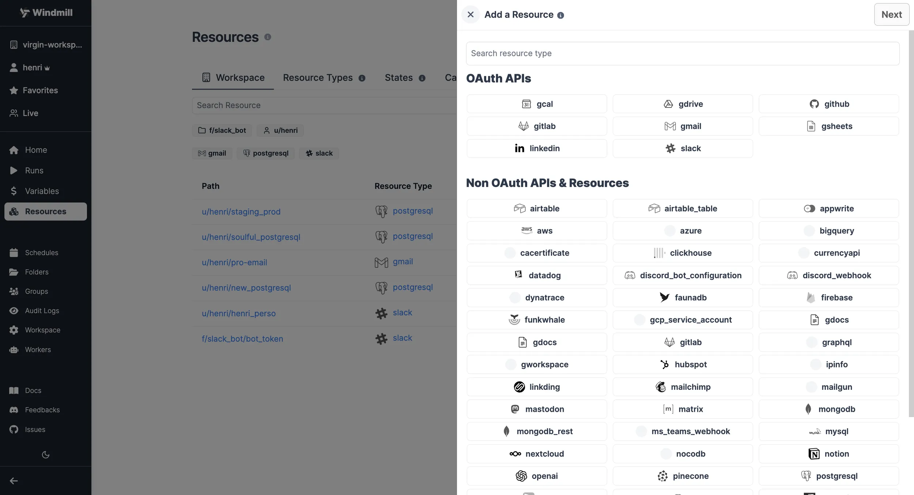
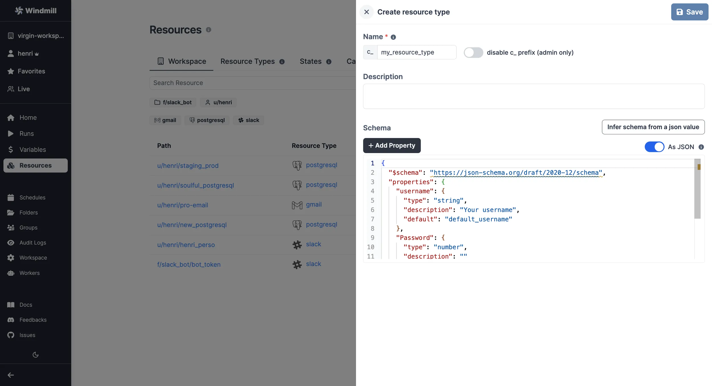
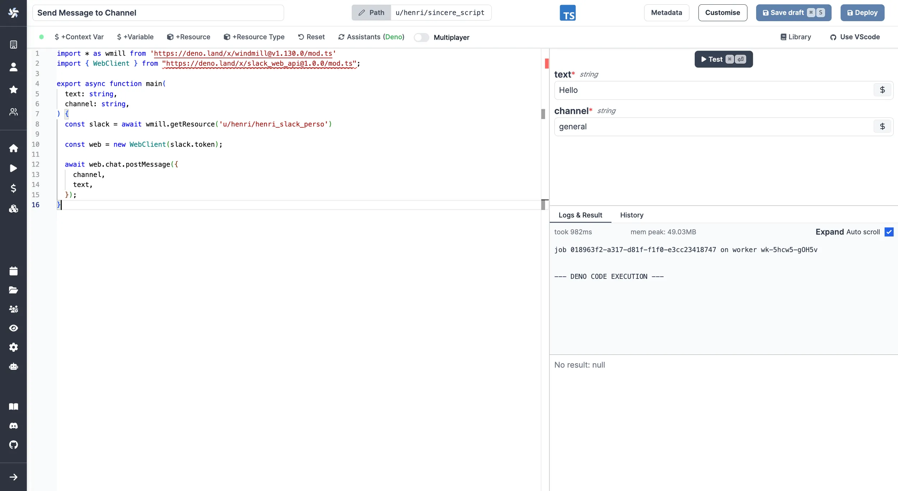

import DocCard from '@site/src/components/DocCard';
import Tabs from '@theme/Tabs';
import TabItem from '@theme/TabItem';

# Resources and Resource Types

Resources are rich objects in JSON that allow to store configuration and credentials.

In Windmill, Resources represent connections to third party systems. Resources are a good way to define a
connection to a frequently used third party system such as a database. Think of
Resources as a structured way to store configuration and credentials, and access them from scripts.

Each Resource has a **Resource Type** (**RT** for short) - for example [MySQL](https://hub.windmill.dev/resource_types/111/mysql),
[MongoDB](https://hub.windmill.dev/resource_types/22/mongodb), [OpenAI](https://hub.windmill.dev/resource_types/61/openai), etc. - that defines the schema that the resource of this type
needs to implement. Schemas implement the
[JSON Schema specification](https://json-schema.org/).

:::tip

Check our [list of integrations](../../integrations/0_integrations_on_windmill.mdx) (or, pre-made resource types). If one is missing, this very page details how to [create your own](#create-a-resource-type).

:::

<div class="text-xl mb-2 font-semibold"></div>
<div class="grid grid-cols-2 gap-6 mb-4">
	<DocCard
		title="List of integrations"
		description="Windmill provides a framework to easily add integrations."
		href="/docs/integrations/integrations_on_windmill"
	/>
	<DocCard
		title="JSON Schema"
		description="JSON Schema is a declarative language that allows you to annotate and validate JSON documents."
		href="https://json-schema.org/"
		target="_blank"
	/>
</div>

## Create a Resource

To create a resource using an existing type, go to the
<a href="https://app.windmill.dev/resources" rel="nofollow">Resources</a> page and click "Add a
resource/API".



Just like most objects in Windmill, Resources have a path that define their
permissions - see [ownership path prefix](../16_roles_and_permissions/index.mdx).

Each **Resource** has a **Resource Type**, that defines what fields that
resource contains. Select one from the list and check the schema to see what
fields are present.


Resources commonly need to access secrets or re-use
[Variables](../2_variables_and_secrets/index.mdx), for example passwords or API
tokens. To insert a Variable into a Resource, use **Insert variable** (the `$`
sign button) and select a Variable. The name of a Variable will look like
`$VAR:<NAME_OF_VAR>`. When resources are called from a Script, the Variable
reference will be replaced by its value.

:::tip

It's a good practice to **link a script template to Resources**, so that users can
easily get started with it. You can use markdown in the description field to add
a link, for example:

```md
[example script with this resource](/scripts/add?template=script/template/path)
```

:::

## Create a Resource Type

Windmill comes preloaded with some common Resource Types, such as databases, apps, SMTP, etc. You can see the full list on [Windmill Hub](https://hub.windmill.dev/resources).
You can also add custom Resource Types by clicking "Add a resource type" on the <a href="https://app.windmill.dev/resources" rel="nofollow">Resources</a> page.


Use the "Add Property" button to add a field to the resource type. You can
specify constraints for the field (a type, making it mandatory, specifying a
default, etc). You can also view the schema by toggling the "As JSON" option:



### Share Resource Type on Hub

You can contribute to the [Windmill Hub](https://hub.windmill.dev/) by sharing your Resource Type. To do so, add a Resource Type on the [Resources section](https://hub.windmill.dev/resources) of the Hub.

You will be asked to fill Name, Integration (the corresponding service it interacts with) and Schema (the JSON Schema of the Resource Type).

Verified Resource Types on the Hub are directly added to the list of available Resource Types on each new Windmill instance synced with the Hub.


## States

States are used by scripts to keep data persistent between runs of the same script by the same trigger (schedule or user).

In Windmill, states are considered as resources (rich objects in JSON), but they are excluded from the Workspace tab for clarity.
They are displayed on the Resources menu, under a dedicated tab.

A state is an object stored as a resource of the resource type `state` which is meant to persist across distinct executions of the same script.

```py
import requests
from wmill import set_state, get_state

def main():
	# Get temperature from last execution
    last_temperature = get_state()

    # Fetch the temperature in Paris from wttr.in
    response = requests.get("http://wttr.in/Paris?format=%t")

    new_temperature = response.text.strip("°F")

	# Set current temperature to state
    set_state(new_temperature)

    # Compare last_temperature and new_temperature
    if last_temperature < new_temperature:
        return "The temperature has increased."
    elif last_temperature > new_temperature:
        return "The temperature has decreased."
    else:
        return "The temperature has remained the same."
```

States are what enable Flows to watch for changes in most event watching scenarios ([trigger scripts](../../flows/10_flow_trigger.mdx)). The pattern is as follows:

- Retrieve the last state or, if undefined, assume it is the first execution.
- Retrieve the current state in the external system you are watching, e.g. the
  list of users having starred your repo or the maximum ID of posts on Hacker News.
- Calculate the difference between the current state and the last internal
  state. This difference is what you will want to act upon.
- Set the new state as the current state so that you do not process the
  elements you just processed.
- Return the differences calculated previously so that you can process them in
  the next steps. You will likely want to [forloop](../../flows/12_flow_loops.md) over the items and trigger
  one Flow per item. This is exactly the pattern used when your Flow is in the
  mode of "Watching changes regularly".

The convenience functions do this are:

_TypeScript_

- `getState()` which retrieves an object of any type (internally a simple
  Resource) at a path determined by `getStatePath`, which is unique to the user
  currently executing the Script, the Flow in which it is currently getting
  called in - if any - and the path of the Script.
- `setState(value: any)` which sets the new state.

> Please note it requires [importing](../../advanced/6_imports/index.md) the wmill client library from Deno/Bun.

<br />

_Python_

- `get_state()` which retrieves an object of any type (internally a simple
  Resource) at a path determined by `get_state_path`, which is unique to the user
  currently executing the Script, the Flow in which it is currently getting
  called in - if any - and the path of the Script.
- `set_state(value: Any)` which sets the new state.

> Please note it requires [importing](../../advanced/6_imports/index.md) the wmill client library from Python.

<br />

<div class="grid grid-cols-2 gap-6 mb-4">
	<DocCard
		title="Persistent Storage"
		description="Ensure that your data is safely stored and easily accessible whenever required."
		href="/docs/core_concepts/persistent_storage"
	/>
</div>

## Using Resources

Resources can be used [passed as script parameters](#passing-resources-as-parameters-to-scripts-preferred) or [directly fetched](#fetching-them-from-within-a-script-by-using-the-wmill-client-in-the-respective-language) within code.

<video
	className="border-2 rounded-xl object-cover w-full h-full dark:border-gray-800"
	controls
	src="/videos/add_resources_variables.mp4"
/>

### Passing resources as parameters to scripts (preferred)

Resources can be passed using the [auto-generated UI](../6_auto_generated_uis/index.mdx).

Provided you have the right permissions and the resource type exists in the workspace, you can access resource types from scripts, flows and apps using the Windmill client or [TypedDict](https://mypy.readthedocs.io/en/stable/typed_dict.html) in Python.

From the code editor's toolbar, click on the `+ Type` button and pick the right resource type. For example, to access the `u/user/my_postgresql` resource of the `posgtgresql` Resource Type we would create a script:

<Tabs className="unique-tabs">
<TabItem value="TypeScript" label="TypeScript" attributes={{className: "text-xs p-4 !mt-0 !ml-0"}}>

```typescript
type Postgresql = object;
// OR one can fully type it
type Postgresql = {
	host: string;
	port: number;
	user: string;
	dbname: string;
	sslmode: string;
	password: string;
	root_certificate_pem: string;
};

export async function main(postgres: Postgresql) {
	// Use Resource...
}
```

</TabItem>
<TabItem value="Python" label="Python" attributes={{className: "text-xs p-4 !mt-0 !ml-0"}}>

```python
from typing import TypedDict

class postgresql(TypedDict):
    host: str
    port: int
    user: str
    dbname: str
    sslmode: str
    password: str
    root_certificate_pem: str

def main(selected_postgres: postgresql):
	# Use Resource...
```

</TabItem>
</Tabs>

<br/>

And then select the Resource in the arguments section on the right:


:::tip

You can also edit the Resource or even create a new one right from the Code
editor.

:::

All details on the [Add Resources and Variables to Code Editor](../../code_editor/add_variables_resources.mdx) page:

<div class="grid grid-cols-2 gap-6 mb-4">
	<DocCard
		title="Add Resources and Variables to Code Editor"
		description="You can directly access Variables and Resources from the Code Editor."
		href="/docs/code_editor/add_variables_resources"
	/>
</div>

### Fetching them from within a script by using the wmill client in the respective language

By clicking on `+ Resource`, you'll get to pick a resource from your workspace and be able to fetch it from within the script.

Typescript:

```typescript
wmill.getResource('u/user/foo');
```

Python:

```python
wmill.get_resource("u/user/foo")
```

Go:

```go
wmill.GetResource("u/user/foo")
```

Bash:

```bash
curl -s -H "Authorization: Bearer $WM_TOKEN" \
  "$BASE_INTERNAL_URL/api/w/$WM_WORKSPACE/resources/get/u/user/foo" \
    | jq -r .value
```

PowerShell:

```powershell
$Headers = @{
  "Authorization" = "Bearer $Env:WM_TOKEN"
}
Invoke-RestMethod -Headers $Headers -Uri "$Env:BASE_INTERNAL_URL/api/w/$Env:WM_WORKSPACE/resources/get/u/user/foo"
```


