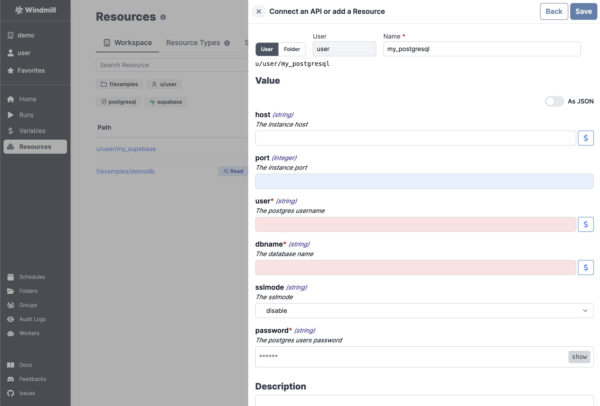

import DocCard from '@site/src/components/DocCard';

# Resources and Resource Types

In Windmill, Resources represent
connections to third party systems. Resources are a good way to define a
connection to a frequently used third party system such as a database. Think of
Resources as a structured way to store configuration and credentials, and access
them from scripts.

Each Resource has a **Resource Type** (**RT** for short) - for example MySQL,
MongoDB, Slack, etc. - that defines the schema that the resource of this type
needs to implement. Schemas implement the
[JSON Schema specification](https://json-schema.org/).

:::tip Available pre-made integrations

Check our [list of integrations](../../integrations/0_integrations_on_windmill.md) (or, pre-made resource types).

<br/>

If one is missing, this very page details how to [create your own](#create-a-resource-type).

:::

## Create a Resource

To create a resource using an existing type, go to the
[Resources](https://app.windmill.dev/resources) page and click "Add a
resource/API".


Just like most objects in Windmill, Resources have a path that define their
permissions - see [ownership path prefix](../16_roles_and_permissions/index.mdx).

Each **Resource** has a **Resource Type**, that defines what fields that
resource contains. Select one from the list and check the schema to see what
fields are present.



Resources commonly need to access secrets or re-use
[Variables](../2_variables_and_secrets/index.mdx), for example passwords or API
tokens. To insert a Variable into a Resource, use **Insert variable** (the `$`
sign button) and select a Variable. The name of a Variable will look like
`$VAR:<NAME_OF_VAR>`. When resources are called from a Script, the Variable
reference will be replaced by its value.

:::tip

It's a good practice to **link a script template to Resources**, so that users can
easily get started with it. You can use markdown in the description field to add
a link, for example:

```md
[example script with this resource](/scripts/add?template=script/template/path)
```

:::

## Create a Resource Type

Windmill comes preloaded with some common Resource Types, such as databases, apps, SMTP, etc. You can see the full list on [Windmill Hub](https://hub.windmill.dev/resources). You
can also add custom Resource Types by clicking "Add a resource type" on the
[Resources](https://app.windmill.dev/resources) page.


Use the "Add Property" button to add a field to the resource type. You can
specify constraints for the field (a type, making it mandatory, specifying a
default, etc). You can also view the schema by toggling the "As JSON" option:


## States

In Windmill, states are considered as resources, but they are excluded from the Workspace tab for clarity. States are used by scripts to keep data persistent between runs of the same script by the same trigger (schedule or user).

They are displayed on the Resources menu, under a dedicated tab.

## Using Resources

<div class="grid grid-cols-2 gap-6 mb-4">
     <DocCard
    	title="Add Resources and Variables to Code Editor"
    	description="You can add directly access Variables and Resources from the Code Editor."
    	href="/docs/code_editor/add_variables_resources"
    />
</div>

There are 2 main ways resources are used within scripts:

### Passing resources as parameters to scripts (prefered)

Provided you have the right permissions and the resource type exists in the workspace, you can access resources from scripts, flows and apps using the Windmill client. For example, to access the `u/user/my_postgresql` resource of the `posgtgresql` Resource Type we would create a script.

Typescript:

```typescript
type Postgresql = object;
// OR one can fully type it
type Postgresql = {
	host: string;
	port: number;
	user: string;
	dbname: string;
	sslmode: string;
	password: string;
};

export async function main(postgres: Postgresql) {
	// Use Resource...
}
```

Python:

```python
postgresql = dict

def main(postgres: postgresql):
    # Use Resource...
```

And then select the Resource in the arguments section on the right:


:::tip

You can also edit the Resource or even create a new one right from the Code
editor.

:::

### Fetching them from within a script by using the wmill client in the respective language

By clicking on `+ Resource`, you'll get to pick a resource from your workspace and be able to fetch it from within the script.

Typescript:

```typescript
wmill.getResource('u/user/foo');
```

Python:

```python
wmill.get_resource("u/user/foo")
```

Go:

```go
wmill.GetResource("u/user/foo")
```

Bash:

```bash
curl -s -H "Authorization: Bearer $WM_TOKEN" \
  "$BASE_INTERNAL_URL/api/w/$WM_WORKSPACE/resources/get/u/user/foo" \
    | jq -r .value
```

