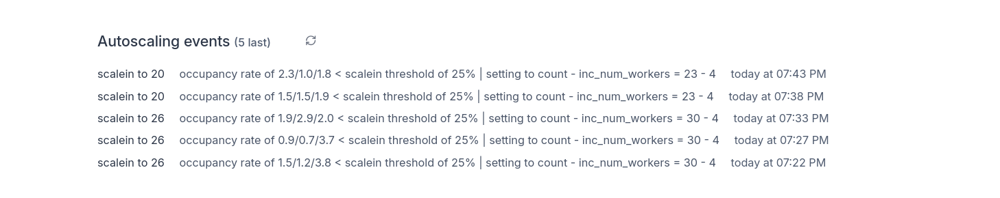

# Autoscaling

Autoscaling automatically adjusts the number of workers based on your workload demands.

Autoscaling is available in the [Enterprise plan](/pricing).

## Autoscaling configuration

You configure a minimum and maximum number of workers. The autoscaler will adjust the number of workers between the minimum and maximum based on the workload by calling a script which call your underlying infra orchestrator such as Kubernetes, ECS or Nomad. Coming soon, those will be hanlded natively by Windmill without the need for running a job.

Autoscaling is configured in each worker group config under "Autoscaling". It takes the following configuration:


When using a custom script, the arguments that are passed to the script are, worker group, desired workers, reason, and event type. For instance, if you are using Kubernetes, you can use the following script:

```bash
worker_group="$1"
desired_workers="$2"
reason="$3"
event_type="$4"
namespace="mynamespace"

echo "Applying $event_type of $desired_workers to $worker_group bc $reason"

# authenticate to the cluster here if needed
kubectl scale deployment windmill-workers-$worker_group --replicas=$desired_workers -n $namespace
```

## Autoscaling algorithm

The autoscaling algorithm is based on the number of jobs waiting for workers in the queue for the tags that the worker group is listening from (tags can be overriden) and based on the occupancy rate of the workers of that worker group.

The algorithm is as follows:

Every 30s, for every worker group autoscaling configuration:
1. It checks if the current number of workers (`count`) is within the allowed range (between `min_workers` and `max_workers`). If not, it adjusts the number to fit within this range.
2. If there are more than (`full_scale_jobs_waiting` OR `max_workers` if not defined) jobs , it will increase the number of workers up to `max_workers` if there are less (otherwise if workers already above or equal taret, do nothing), that's a "full scale-out". Note that full-scale out events are not subject to the cooldown period since they are meant to handle sudden spike.
3. The function looks at the last autoscaling event (`last_event`) to see if it's too soon to make another change (this is called a cooldown period, defined by `full_scale_cooldown_seconds` for full scale out events or `cooldown_seconds` for normal events). Note that a full scale
4. If there are enough jobs waiting in the queue (more than `full_scale_jobs_waiting` OR `max_workers` if not defined), it will increase the number of workers up to `max_workers`.

5. If there aren't many jobs waiting, it looks at how busy the current workers are using the `occupancy` data:
   - If they're not very busy (below `dec_scale_occupancy_rate`, default 25%) for a while, it will reduce the number of workers by `inc_num_workers`.
   - If they're very busy (above `inc_scale_occupancy_rate`, default 75%) for a while, it will increase the number of workers by `inc_num_workers`.

6. When making changes, it doesn't just jump to the minimum or maximum. Instead, it increases or decreases by `inc_num_workers` each time, which is calculated based on value set or the difference between `max_workers` and `min_workers` divided by 5.
7. Every time it decides to change the number of workers, it logs this decision as an "autoscaling event" with an explanation, using the `add_autoscaling_event` function.

The function uses occupancy rates over different time periods (`occupancy_rate_15s`, `occupancy_rate_5m`, `occupancy_rate_30m`) to make decisions, ensuring that changes are based on sustained trends rather than momentary spikes.

The goal is to have just enough workers to handle the current workload (represented by `queue_counts`) efficiently, without having too many idle workers or too few to handle the jobs.


## Autoscaling events

Autoscaling events can be viewed under the worker group details:

