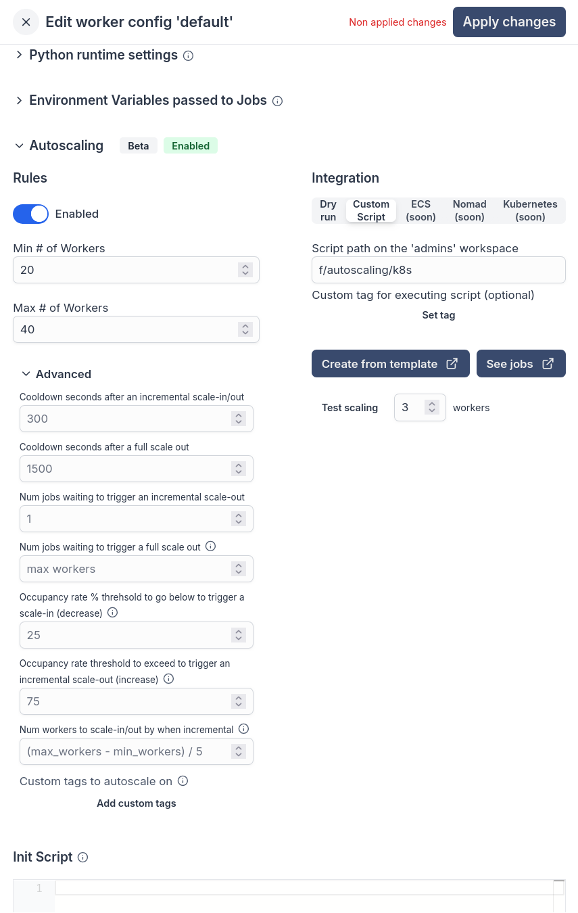

# Autoscaling

Autoscaling automatically adjusts the number of workers based on your workload demands.

Autoscaling is available in the [Enterprise plan](/pricing).

## Autoscaling configuration

You configure a minimum and maximum number of workers, and the desired number of workers. The autoscaler will adjust the number of workers between the minimum and maximum based on the workload by calling one of the native integration for Kubernetes, ECS, Nomad, Docker Swarm or you can use a custom script.

Autoscaling is configured in each worker group config under "Autoscaling". It takes the following configuration:


When using a custom script, the arguments that are passed to the script are, worker group, desired workers, reason, and event type. For instance, if you are using Kubernetes, you can use the following script:

```bash
worker_group="$1"
desired_workers="$2"
reason="$3"
event_type="$4"
namespace="mynamespace"

echo "Applying $event_type of $desired_workers to $worker_group bc $reason"

# authenticate to the cluster here if needed
kubectl scale deployment windmill-workers-$worker_group --replicas=$desired_workers -n $namespace
```

## Autoscaling events

Autoscaling events can be viewed under the worker group details:

