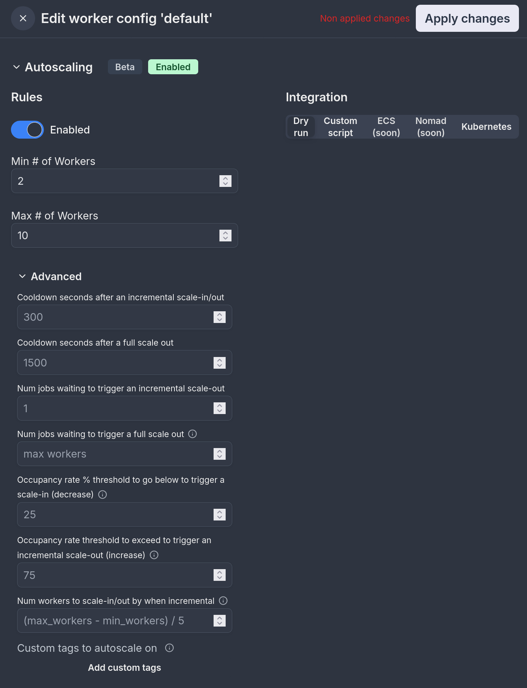
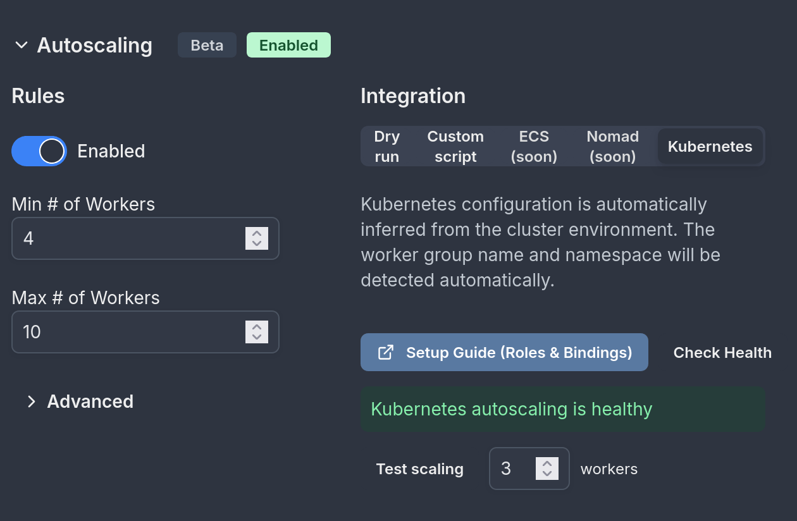

# Autoscaling

Autoscaling automatically adjusts the number of workers based on your workload demands.

Autoscaling is available in the [Enterprise plan](/pricing).

## Autoscaling configuration

You configure a minimum and maximum number of [workers](../9_worker_groups/index.mdx). The autoscaler will adjust the number of workers between the minimum and maximum based on the workload by calling a script which call your underlying infra orchestrator such as Kubernetes, ECS or Nomad. Coming soon, those will be hanlded natively by Windmill without the need for running a job.

Autoscaling is configured in each [worker group](/core_concepts/9_worker_groups/index.mdx) config under "Autoscaling". It takes the following configuration:



### Rules

| Parameter        | Description                                         |
| ---------------- | --------------------------------------------------- |
| Enabled          | Whether autoscaling is enabled for the worker group |
| Min # of Workers | The minimum number of workers to scale down to      |
| Max # of Workers | The maximum number of workers to scale up to        |

### Integration

| Integration Type | Description                                             |
| ---------------- | ------------------------------------------------------- |
| Dry run          | Test autoscaling behavior without making actual changes |
| Custom script    | Use your own script to handle scaling workers           |
| ECS              | Native ECS integration (coming soon)                    |
| Nomad            | Native Nomad integration (coming soon)                  |
| Kubernetes       | Native Kubernetes integration                            |

### Custom script

When using a custom script, you'll need to provide a path to script in the [admins workspace](../../advanced/18_instance_settings/index.mdx#admins-workspace), and optionally a custom [tag](../9_worker_groups/index.mdx#set-tags-to-assign-specific-queues) for executing the script.

The arguments that are passed to the script are: worker group, desired workers, reason, and event type. For instance, if you are using Kubernetes, you can use the following script:

```bash
worker_group="$1"
desired_workers="$2"
reason="$3"
event_type="$4"
namespace="mynamespace"

echo "Applying $event_type of $desired_workers to $worker_group bc $reason"

# authenticate to the cluster here if needed
kubectl scale deployment windmill-workers-$worker_group --replicas=$desired_workers -n $namespace
```

### Kubernetes

Kubernetes native autoscaling integration can automatically infer the worker-group, namespace and credentials when running within a Kubernetes cluster. This autoscaling will only work if you run your server in the k8s cluster and will only scale workers within the same cluster.

For proper functionality, you need to configure RBAC roles and rolebindings to allow autoscaling from within the pod:

#### Using Helm

In your values.yaml set:
```yaml
enterprise:
  createKubernetesAutoscalingRolesAndBindings: true
```

#### Using pure manifests

Sometimes creating a Role/RoleBinding is forbidden by RBAC or rejected by an admission controller, that's why you might want to do this outside this helm release.

```yaml
apiVersion: rbac.authorization.k8s.io/v1
kind: Role
metadata:
  name: deployment-scaler
  namespace: <windmill-namespace>
rules:
- apiGroups: ["apps"]
  resources: ["deployments"]
  verbs: ["patch", "get"]  # Crucial to include both verbs

---

apiVersion: rbac.authorization.k8s.io/v1
kind: RoleBinding
metadata:
  name: deployment-scaler-binding
  namespace: <windmill-namespace>
subjects:
- kind: ServiceAccount
  name: <serviceaccount>
  namespace: <windmill-namespace>
roleRef:
  kind: Role
  name: deployment-scaler
  apiGroup: rbac.authorization.k8s.io

```

You need to bind the role to the correct ServiceAccount which is bound to 'fullname' (the name you gave to your windmill deployment). You can verify which ServiceAccount name you have by running:

```bash
kubectl get serviceaccount -n <your-namespace>
```

Look for the non-default ServiceAccount name.

#### Verifying configuration

After configuring RBAC using either method above, you can hit "Check Health" to verify everything is configured properly:



You are ready to go!

For more sophisticated autoscaling designs, refer to the 'Custom script' section above.

### Advanced

| Parameter                                                                         | Description                                                                                                                                                                                                                                     |
| --------------------------------------------------------------------------------- | ----------------------------------------------------------------------------------------------------------------------------------------------------------------------------------------------------------------------------------------------- |
| Cooldown seconds after an incremental scale-in/out                                | Time to wait after an incremental scaling event before allowing another                                                                                                                                                                         |
| Cooldown seconds after a full scale out                                           | Time to wait after a full scale out event before allowing another                                                                                                                                                                               |
| Num jobs waiting to trigger an incremental scale-out                              | Number of waiting jobs needed to trigger a gradual scale out                                                                                                                                                                                    |
| Num jobs waiting to trigger a full scale out                                      | Number of waiting jobs needed to trigger scaling to max workers (Default: max_workers, full scale out = scale out to max workers)                                                                                                               |
| Occupancy rate % threshold to go below to trigger a scale-in (decrease)           | Default: 25%. When the average worker occupancy rate across 15s, 5m and 30m intervals falls below this threshold, the system will trigger a scale-in event to reduce the number of workers. This helps prevent having too many idle workers.    |
| Occupancy rate threshold to exceed to trigger an incremental scale-out (increase) | Default: 75%. When the average worker occupancy rate across 15s, 5m and 30m intervals exceeds this threshold, the system will trigger a scale-out event to add more workers. This helps ensure there is enough capacity to handle the workload. |
| Num workers to scale-in/out by when incremental                                   | Number of workers to add/remove during incremental scaling events (Default: (max_workers - min_workers) / 5)                                                                                                                                    |
| Custom tags to autoscale on                                                       | By default, autoscaling will apply to the tags the worker group is assigned to but you can override this here.                                                                                                                                  |

## Autoscaling algorithm

The autoscaling algorithm is based on the number of jobs waiting for workers in the queue for the tags that the worker group is listening from (tags can be overriden) and based on the occupancy rate of the workers of that worker group.

The algorithm is as follows:

Every 30s, for every worker group autoscaling configuration:

1. It checks if the current number of workers (`count`) is within the allowed range (between `min_workers` and `max_workers`). If not, it adjusts the number to fit within this range.
2. If there are more than (`full_scale_jobs_waiting` OR `max_workers` if not defined) jobs , it will increase the number of workers up to `max_workers` if there are less (otherwise if workers already above or equal target, do nothing), that's a "full scale-out". Note that full-scale out events are not subject to the cooldown period since they are meant to handle sudden spike.
3. The function looks at the last autoscaling event (`last_event`) to see if it's too soon to make another change (this is called a cooldown period, defined by `full_scale_cooldown_seconds` for full scale out events or `cooldown_seconds` for normal events).
4. If there are enough jobs waiting in the queue (more than `inc_scale_jobs_waiting`), it will increase the number of workers by an `inc_num_workers` (default: (max_workers - min_workers) / 5), that's an "incremental scale-out".

5. If there aren't many jobs waiting, it looks at how busy the current workers are using the `occupancy` data:

   - If they're not very busy (below `dec_scale_occupancy_rate`, default 25%) for a while (`occupancy_rate_15s && occupancy_rate_5m && occupancy_rate_30m < inc_scale_occupancy_rate`), it will reduce the number of workers by `inc_num_workers`.
   - If they're very busy (`occupancy_rate_15s && occupancy_rate_5m && occupancy_rate_30m > dec_scale_occupancy_rate`) for a while, it will increase the number of workers by `inc_num_workers`.

The function uses occupancy rates over different time periods (`occupancy_rate_15s`, `occupancy_rate_5m`, `occupancy_rate_30m`) to make decisions, ensuring that changes are based on sustained trends rather than momentary spikes. The 3 values MUST be below or above the threshold to trigger a scale in or out.
When making scale in or scale out, it doesn't just jump to the minimum or maximum. Instead, it increases or decreases by `inc_num_workers` each time, which is calculated based on the custom parameter provided for incremental scale-in/out (default: (max_workers - min_workers) / 5).

7. Every time it decides to change the number of workers, it logs this decision as an "autoscaling event" with an explanation of why it made the change.

The goal is to have just enough workers to handle the current workload (represented by `queue_counts`) efficiently, without having too many idle workers or too few to handle the jobs.

## Autoscaling events

Autoscaling events can be viewed under the worker group details:


## Billing

In terms of billing for Windmill [Enterprise Edition](/pricing), Windmill measures how long the workers are online with a minute granularity. If you use 10 workers with 2GB for 1/10th of the month, it will count the same as if you had a single worker for the full month. It's like if in your [Windmill setup](../../misc/7_plans_details/index.mdx#setup-and-compute-units), the replicas of the worker group would adjust for a given amount of time.
