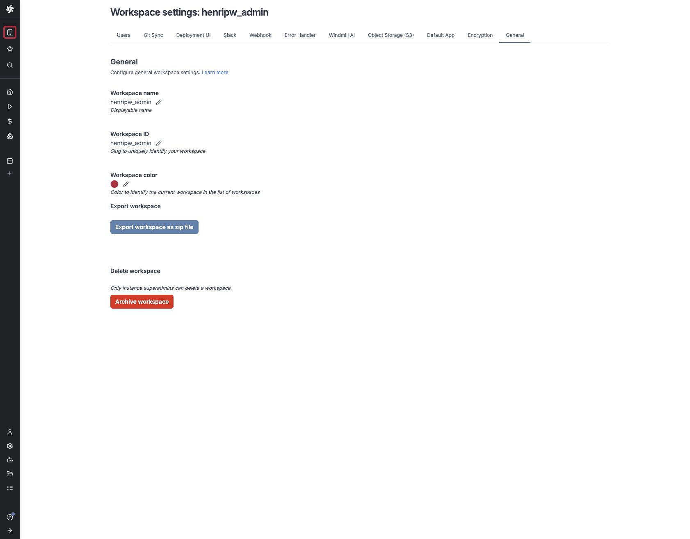
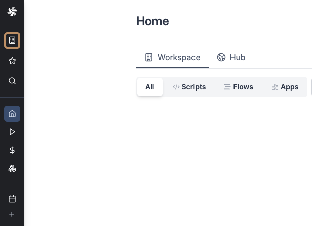

# Workspace settings

Workspace settings are configuration options specific to each workspace and can be accessed by workspace [admin](../16_roles_and_permissions/index.mdx#admin) and instance [superadmin](../16_roles_and_permissions/index.mdx#superadmin). These settings should not be confused with [Instance settings](../../advanced/18_instance_settings/index.mdx).

Each workspace can be configured through the following sections:

- [Users](../16_roles_and_permissions/index.mdx) - Manage workspace members and their permissions, in particular the operator visibility settings
- [Git Sync](../../advanced/11_git_sync/index.mdx) - Configure Git synchronization for your workspace
- [Deployment UI](../12_staging_prod/index.md) - Customize the deployment interface
- [Slack](../../integrations/slack.mdx) / [Teams](../../integrations/teams.mdx) - Set up Slack and Teams integration and notifications
- [Webhook](../4_webhooks/index.mdx#workspace-webhook) - Configure webhook endpoints and triggers
- [Error Handler](../10_error_handling/index.mdx#workspace-error-handler) - Define error handling behavior
- [Windmill AI](../22_ai_generation/index.mdx) - Configure AI-assisted features
- [Object Storage (S3)](../38_object_storage_in_windmill/index.mdx#workspace-object-storage) - Set up S3-compatible storage
- [Default App](../../apps/1_default_app/index.md) - Configure the default application settings
- [Encryption](../30_workspace_secret_encryption/index.mdx) - Manage encryption keys and settings
- [Workspace dependencies](../55_workspace_dependencies/index.mdx) - Centralized dependency management for scripts
- [General](#general)

## General

The General settings section provides basic workspace configuration options.

### Workspace name
The display name of your workspace. This can be changed at any time and will be reflected throughout the interface.

### Workspace ID
A unique identifier for your workspace. This is set during workspace creation and cannot be modified.

### Workspace color
Choose a custom color for your workspace. This helps visually distinguish between different workspaces in the interface. It is not a styling option.

### Export workspace
Download a ZIP file containing all workspace resources, including:
- Scripts
- Flows
- Apps
- Resources
- Variables (secrets are exported as encrypted values)

This is useful for backup purposes. For migrating workspace content, see [CLI](../../advanced/3_cli/index.mdx).

### Delete workspace
There are two options for removing a workspace:

#### Archive workspace

Only workspace admins and instance superadmins can archive a workspace. Temporarily disable a workspace while preserving all its content. Archived workspaces:
- Cannot be accessed by regular users
- Maintain all data and configurations
- Can be unarchived by workspace admins or instance superadmins
- Do not count towards workspace limits

#### Delete workspace
Only instance superadmins can delete a workspace. Permanently remove the workspace and all associated content. This action:
- Cannot be undone
- Requires instance superadmin permissions
- Deletes all scripts, flows, apps, and other workspace resources