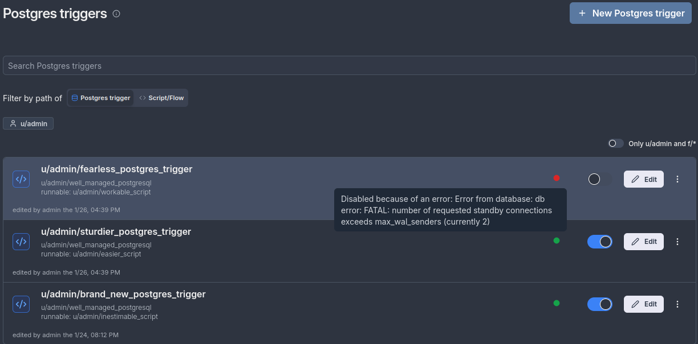
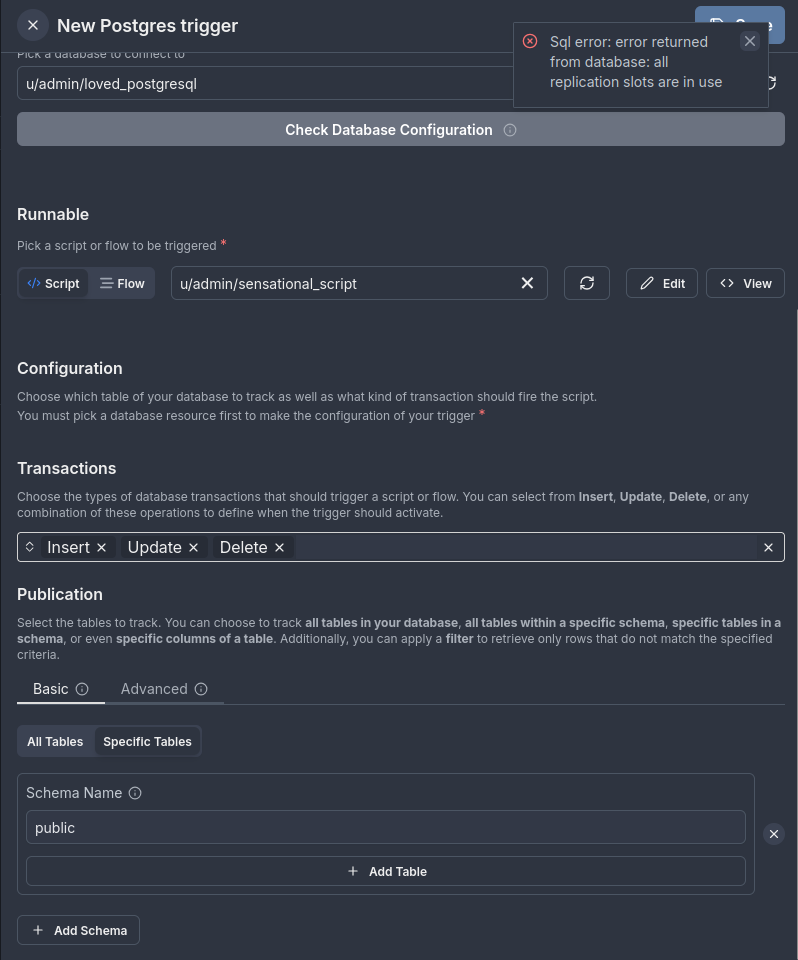

# Postgres triggers

Windmill can connect to a [Postgres](https://www.postgresql.org/) database and trigger runnables (scripts, flows) in response to database transactions (INSERT, UPDATE, DELETE) on specified tables, schemas, or the entire database.  
Listening is done using Postgres's logical replication streaming protocol, ensuring efficient and low-latency triggering.  
Postgres triggers are not available on the [Cloud](/pricing).

<iframe
	style={{ aspectRatio: '16/9' }}
	src="https://www.youtube.com/embed/V50Jl4D_RTY"
	title="Postgres triggers"
	frameBorder="0"
	allow="accelerometer; autoplay; clipboard-write; encrypted-media; gyroscope; picture-in-picture; web-share"
	allowFullScreen
	className="border-2 rounded-lg object-cover w-full dark:border-gray-800"
></iframe>

## What is logical replication?

Windmill's Postgres trigger feature is built on Postgres's logical replication protocol, which allows changes to a database to be streamed in real time to subscribers. Logical replication provides fine-grained control over what data is replicated by allowing the user to define publications and subscribe to specific changes.

### How logical replication works
1. **Publications**: Define what changes (e.g., INSERT, UPDATE, DELETE) should be made available for replication. Publications allow you to select specific tables or schemas to track.
2. **Replication slots**: Ensure that all changes from a publication are retained until they are successfully delivered to the subscriber (e.g., Windmill triggers). This guarantees data reliability and prevents data loss.

Windmill uses logical replication to efficiently stream database changes to your configured triggers, ensuring minimal latency and high reliability.

For more details, see the [Postgres documentation on logical replication](https://www.postgresql.org/docs/current/logical-replication.html).  
For more details, see the [Postgres documentation on logical replication streaming protocol](https://www.postgresql.org/docs/current/protocol-logical-replication.html).


## Requirements

Before using Postgres triggers with Windmill, your database must be properly configured for logical replication. The primary requirement is setting the Write-Ahead Log (WAL) level to `'logical'`.

### Setting `wal_level` to `logical`

You have two options to configure this setting. Both options require a restart of your Postgres instance to take effect.

#### Option 1: Using SQL (requires database restart)

1. Run the following SQL command to set `wal_level` to `'logical'`:         
   
  ```sql
   ALTER SYSTEM SET wal_level = 'logical';
  ```

2. After executing the command, restart your Postgres instance for the changes to take effect.

#### Option 2: Editing the `postgresql.conf` file (requires database restart)

1. Locate and open your `postgresql.conf` file. The location of this file may vary depending on your installation.

2. Look for the `wal_level` setting. If it's not already present, **add** the following line to the file:

  ```ini
   wal_level = logical
  ```

   If the setting is already there, **update** it to `logical`.

3. Save the file and restart your Postgres instance for the changes to take effect.

### Verifying logical replication

You can verify that logical replication is enabled by running the following query:

```sql
SHOW wal_level;
```

This should return:

```plaintext
 wal_level
-----------
 logical
```

### Impact of Enabling Logical Replication

Enabling logical replication turns on detailed logging, which is essential for supporting the replication process. Be aware that this will increase the amount of data written to the Write-Ahead Log (WAL). Typically, you can expect a 10% to 30% increase in the amount of data written to the WAL, depending on the volume of write activity in your database.

---

## Additional Configuration for Logical Replication

For logical replication to work properly, you need to configure additional parameters in your `postgresql.conf` file. These parameters control the number of replication processes and slots available for replication. Both settings require a restart of your Postgres instance to take effect.

#### `max_wal_senders`

The `max_wal_senders` setting determines the maximum number of **walsender** processes that can run concurrently. A **walsender** is responsible for sending the Write-Ahead Log (WAL) data to subscribers for logical replication. The default value is 10, but you can increase this based on your replication needs.

```ini
#max_wal_senders = 10  # max number of walsender processes (change requires restart)
```

- **Impact on Triggers**: Each active trigger in logical replication will use a **walsender** process. So, if `max_wal_senders` is set to 10, only 10 active triggers can be used at the same time. If you reach this limit, you will need to increase the `max_wal_senders` value to accommodate more active triggers.

#### `max_replication_slots`

The `max_replication_slots` setting determines how many **replication slots** can be created. Replication slots are used to maintain state for each logical replication subscription. This setting also limits the number of triggers that can be created for logical replication.

```ini
#max_replication_slots = 10  # max number of replication slots (change requires restart)
```

- **Impact on Trigger Creation**: You can only create as many triggers as there are replication slots available. So if `max_replication_slots` is set to 10, you will be able to create a maximum of 10 triggers. If you need more triggers, you will need to increase the `max_replication_slots` value.

### Summary of limits

- **Active triggers**: The number of active triggers you can have is limited by `max_wal_senders`. If you set `max_wal_senders` to 10, only 10 active triggers can be running simultaneously.
  
- **Trigger creation**: The number of triggers you can create is limited by `max_replication_slots`. If you set `max_replication_slots` to 10, you can only create 10 triggers in total.

---

### Final considerations

When configuring these settings, make sure to account for the number of active triggers and replication slots needed for your application. If you expect to have many triggers or high replication activity, you may need to increase both `max_wal_senders` and `max_replication_slots`.
## How to use
Learn how to set up and configure Postgres triggers in Windmill through these key steps.

### Create a Postgres trigger
To begin, navigate to the Postgres triggers page and create a new trigger. Follow the steps below to set up your environment.

### Set up a Postgres resource
You need to either:
- Create a new Postgres resource by providing:
  - Hostname, port, database name, username, and password.
  - Advanced options such as SSL settings if needed.
- Reuse an existing Postgres resource.

### Define what to track
Once the Postgres resource is configured, you can choose what to track.

#### All tables
The trigger will listen for transactions on all tables in the database.

Example:


#### Specific schemas
The trigger will listen for transactions on all tables within the selected schemas. Any new tables added to these schemas in the future will also be tracked automatically.

Example:  
Tracking the `public` and `marketing` schemas:


#### Specific tables
The trigger will listen only for transactions on the specified tables. You can also choose which columns to retrieve when tracking specific tables.

Example:  
In this setup, the `bakery` table in the `paris` schema is tracked, but only the `name` and `address` columns are retrieved.


---

## Limitations and examples

This section outlines the supported and unsupported combinations of tracking configurations, helping you avoid common setup issues and ensure your triggers work as intended.

### Valid configuration
You can combine:
- Schema-level tracking (e.g., `public` schema).
- Specific table tracking without selecting columns.

Example:  
Tracking the `bakery` table in the `paris` schema and all tables in the `private` and `public` schemas:


### Invalid configuration
You cannot combine:
- Schema-level tracking with specific table tracking that includes column selection.

Example:  
Tracking all tables in the `public` schema and the `bakery` table in the `paris` schema with selected columns (`name` and `address`):


---

## Additional options
The following section showcases additional options provided by PostgreSQL's logical replication feature that Windmill integrates with.

### Filtering rows with WHERE condition
When tracking specific tables, you can filter rows by providing a WHERE condition.

Key notes:
- The `WHERE` clause allows only simple expressions.
- It cannot contain:
  - User-defined functions, operators, types, and collations.
  - System column references.
  - Non-immutable built-in functions.

Important:
- You only need to provide the condition, not the entire `WHERE` clause. For example, instead of writing `WHERE speciality = 'croissant'`, just provide the condition: `speciality = 'croissant'`.
- If your trigger is set to track `UPDATE` and/or `DELETE` transactions, the `WHERE` clause can only reference columns that are part of the table’s replica identity.  
  See the [REPLICA IDENTITY documentation](https://www.postgres.org/docs/current/sql-altertable.html#SQL-ALTERTABLE-REPLICA-IDENTITY) for more details.
- If your trigger tracks only `INSERT` transactions, the `WHERE` clause can reference any column.

For more details, refer to the [Postgres WHERE clause documentation](https://www.postgresql.org/docs/current/logical-replication-row-filter.html#LOGICAL-REPLICATION-ROW-FILTER-RESTRICTIONS).

Illustration:  
Here’s an example showing how to filter rows based on the condition `speciality = 'croissant'` in the `bakery` table of the `paris` schema:


---

### Selecting specific columns

When tracking specific tables, you can reduce the data sent to the triggered function by retrieving only the columns you need.

However, **if the transaction being tracked includes `UPDATE` or `DELETE` transactions**, selecting specific columns can introduce constraints:

#### Key considerations for `INSERT`, `UPDATE`, and `DELETE` transactions:
- **INSERT** transactions are unaffected by this limitation, and you can select any columns, regardless of whether they are included in the replica identity.
- For `UPDATE` or `DELETE` transactions, the columns you select **must be part of the table's replica identity**. If the selected columns are not part of the replica identity, the database will fail to process the query.

#### What happens if the configuration is invalid?
- If a trigger includes `UPDATE` or `DELETE` transactions while excluding columns required for the replica identity, the associated database query will fail.
- To resolve this issue, you have two options:
  1. **Update the trigger configuration**: Modify the trigger to include the columns that are part of the replica identity.
  2. **Delete and recreate the publication**: Delete the existing publication and configure a new one that accommodates the necessary columns.

For more details, see the [REPLICA IDENTITY documentation](https://www.postgresql.org/docs/current/sql-altertable.html#SQL-ALTERTABLE-REPLICA-IDENTITY).

---

#### Example

Consider the `bakery` table in the `paris` schema. The table has three columns: `id`, `name`, and `address`.
By default, PostgreSQL uses the `DEFAULT` replica identity, which means it tracks the primary key column(s) to identify rows for updates and deletes. If your trigger includes `UPDATE` or `DELETE` transactions and only non-primary key columns are selected (e.g., `name` and `address`), those transactions will fail because the primary key column is required for tracking changes.

#### 1. `DEFAULT` replica identity
The default replica identity tracks only the primary key column(s). For the `bakery` table, the primary key could be any column, such as `id`, `bakery_id`, or another column designated by the user.

- **Correct configuration**: 
    - The trigger should track the primary key column (e.g., `id`, `bakery_id`, etc.), along with any additional columns required for your logic.
    - For example, if `id` is the primary key, the trigger should at least track `id`.
    - This ensures that `UPDATE` and `DELETE` transactions will succeed.
    - Here’s an example of the correct column selection (assuming the primary key is `id`):

    

- **Incorrect configuration**:
    - If only `name` and `address` are selected, and the primary key column (e.g., `id`) is not included in the tracked columns, `UPDATE` and `DELETE` transactions will fail.
    - To fix this:
      - Add the primary key column (e.g., `id`, `bakery_id`, or whatever the primary key column is named) to the trigger's tracked columns.
      - Alternatively, update or delete the publication and recreate it with the correct configuration.

#### 2. `USING INDEX` replica identity
With `USING INDEX index_name`, the replica identity tracks the columns of a unique index.

- **Correct configuration**: 
    - The trigger must track at least the columns that are part of the unique index.
    - If the `bakery` table has a unique index (e.g., `idx_bakery_name_address`) covering `name` and `address`, the trigger should track **at least** those two columns, but it can also track other columns, such as `id`, if needed for your logic.

- **Incorrect configuration**:
    - If the columns tracked by the trigger do not match those in the unique index, `UPDATE` and `DELETE` transactions will fail.
    - To fix this:
      - Ensure the trigger tracks **at least** the columns in the `USING INDEX` replica identity or create an appropriate unique index.

#### 3. `FULL` replica identity
The `FULL` replica identity records the old values of **all columns** in the row.

- **Correct configuration**: 
    - The trigger can track any combination of columns, as all columns are tracked with `FULL` replica identity.
    - For example, tracking `name`, `address`, and the primary key column (e.g., `id`, `bakery_id`) is completely acceptable and won’t cause any issues.

- **Incorrect configuration**:
    - There is no issue with tracking any columns when using the `FULL` replica identity because the replica identity covers all columns in the row. However, using more columns than necessary may be inefficient.
    - If performance is a concern, it's recommended to limit the tracked columns to those that are necessary for the trigger.

#### 4. `NOTHING` replica identity
The `NOTHING` replica identity records no information about the old row, which is typically used for system tables.

- **Correct configuration**:
    - This configuration is generally not applicable to user tables like `bakery`, but if applied to the `bakery` table, the trigger would not be able to track `UPDATE` or `DELETE` transactions.
    - This means no `UPDATE` or `DELETE` operations would work with the trigger, as no data would be recorded for the affected rows.

- **Incorrect configuration**:
    - The `NOTHING` replica identity will cause the trigger to fail for `UPDATE` and `DELETE` transactions. You cannot fix this without changing the replica identity to one of the other options (`DEFAULT`, `USING INDEX`, or `FULL`).

#### Conclusion
- **For `UPDATE` and `DELETE` operations**, ensure that the tracked columns include the primary key column (e.g., `id`, `bakery_id`, or whatever the primary key column is named) or match the requirements of the replica identity configuration.
- If the default replica identity is used (`DEFAULT`), ensure that the primary key column is included in the tracked columns to avoid failures with `UPDATE` and `DELETE`.
- For `USING INDEX`, make sure the trigger tracks **at least** the columns in the unique index. You can also track other columns, but the index columns must be tracked to ensure the correct behavior for `UPDATE` and `DELETE` transactions.
- If the replica identity is set to `FULL`, you can safely track any columns.
- Avoid using `NOTHING` replica identity if you need to track `UPDATE` and `DELETE` operations.

---

## Advanced
The Advanced section provides granular control over publications and replication slots, offering flexibility beyond Windmill's default automatic management.
### Managing Postgres publications
By default, Windmill automatically creates a publication and a replication slot for you when setting up a trigger. However, in the Advanced section, you can:

- **Create a custom publication**: If you prefer to use your own publication, you can create it directly from the interface.
    - Example: Create a publication named `windmill_publication_gracious`, which tracks all tables in the `public` and `private` schemas, and is set to track only update and delete transactions.

      

- **Choose an existing publication**: Instead of relying on the default publication created by Windmill, you can select an existing publication from your database to use for your trigger.
    - For example, when retrieving the publication `windmill_publication_non_violent`, all tables are tracked, and the publication tracks insert, update, and delete transactions by default.
    - In the image below, the tracked tables and insert transaction type for the publication are displayed. You can use the publication as is or:
      - Update the publication by adding or removing tables and schemas being tracked, or modifying the transaction types.
      - Delete the publication if no longer needed.

      

For more information on Postgres publications, refer to the [Postgres documentation on publications](https://www.postgresql.org/docs/current/logical-replication-publication.html).

---

### Managing Postgres replication slots
In the Advanced section, you can also manage your replication slots. Windmill will automatically create a replication slot for you by default, but you can interact with replication slots as follows:

- **Create a custom replication slot**: If needed, you can create your own replication slot directly in the interface.
    - Example: Create a replication slot named `windmill_replication_adored`.

      

- **Choose an existing replication slot**: You can select an existing replication slot from your database and link it to the trigger.
    - Example: Retrieve and manage the replication slot `windmill_1737909146368_4zuvg52h3pge` for your trigger.

      

- **Delete a replication slot**: If a replication slot is no longer necessary, you can delete it through the interface.

Windmill will display only logical replication slots and inactive slots. For more details, refer to the [Postgres documentation on replication slots](https://www.postgresql.org/docs/current/warm-standby.html#STREAMING-REPLICATION-SLOTS).

---

## Creating a script from tracked tables

Windmill enables you to automatically generate a script template for specific tables and/or schemas tracked by a trigger. This feature simplifies the creation of a TypeScript script with the necessary structure to handle data passed by the trigger.

### Prerequisites

- Postgres resource: a Postgres [resource](../3_resources_and_types/index.mdx) must be configured in your environment to enable this feature.
- At least one schema: you need to select at least one schema to track.
- Specific tables and/or schema: This feature works only for specific tables and/or schemas. Make sure your selection matches the criteria for script generation.

### How to use

1. Set up Postgres resource: Ensure that a Postgres resource is configured in the resources page.

2. Select schema and tables: Choose the schema and tables you want to track. Note that this feature does not work for all tables; only those meeting the criteria for tracking will be available.

3. Click on "Create from template": After selecting the desired tables and schemas, click on the Create from Template button. This will open a new tab containing a TypeScript script.

   - The script will include a main function that takes an argument representing the information sent to the script. This argument is a JSON object structured as follows:

```json
{
  "transaction_type": "insert" | "update" | "delete",
  "schema_name": "string",
  "table_name": "string",
  "old_row?": {
    ...
  },
  "row": {
    ...
  }
}
```
### Explanation of fields

- transaction_type: Specifies the type of change (either `insert`, `update`, or `delete`).
- schema_name: The name of the schema being tracked (type: `string`).
- table_name: The name of the table being tracked (type: `string`).
- old_row (optional): Contains the previous state of the row before the change occurred. This field is only present for `update` transactions and reflects the values of the row prior to the update.
- row: Contains the data of the row involved in the transaction. The data type of each field in `row` depends on the column's data type in the Postgres table. For `insert` and `update` transactions, this represents the new or updated values. For `delete` transactions, this represents the deleted row.

#### Example table schema

Consider a table `users` in the public schema with the following SQL definition:

```sql
CREATE TABLE users (
    id SERIAL PRIMARY KEY, 
    name VARCHAR(100) NOT NULL,
    lastname VARCHAR(100) NOT NULL,
    age INT CHECK (age > 0),
    personal_information JSONB,
    created_at TIMESTAMP DEFAULT CURRENT_TIMESTAMP NOT NULL,
    updated_at TIMESTAMP DEFAULT CURRENT_TIMESTAMP NOT NULL
);
```
For this schema, the corresponding row in the JSON object would look like this:

```json
{
    row: {
		id?: number,
		name?: string,
		lastname?: string,
		age: number,
		personal_information: unknown,
		created_at?: Date,
		updated_at?: Date,
	}
}
```
### Key notes

- Transaction types: The `transaction_type` field in the JSON object can be one of `insert`, `update`, or `delete`, depending on the change type in the tracked table.
- Row data: The `row` field contains the data of the specific table or schema, and can be used directly in your script for processing.
- Old row: The `old_row` field is included only for `update` transactions and contains the previous values of the row before the update occurred. This is useful for comparing changes or auditing modifications.

### Script template example

Once the template is generated, you can modify it to meet your needs. Below is an example of the generated script template, based on a sample transaction, with a `users` table in the public schema.

```typescript
export async function main(
  transaction_type: "insert" | "update" | "delete",
  schema_name: string,
  table_name: string,
  old_row?: {
		id?: number,
		name?: string,
		lastname?: string,
		age: number,
		personal_information: unknown,
		created_at?: Date,
		updated_at?: Date,
	},
  row: {
		id?: number,
		name?: string,
		lastname?: string,
		age: number,
		personal_information: unknown,
		created_at?: Date,
		updated_at?: Date,
	}
) {
}
```
---

## Handling external database hosters

When using a Postgres database hosted by external providers, special configurations might be necessary to ensure compatibility with Windmill's Postgres triggers feature. This section provides guidelines for handling various database hosters to avoid common connection issues.

---

### Neon
If your Postgres database is hosted on [**Neon**](https://neon.tech), special considerations are required when configuring your Postgres resource in Windmill. By default, Neon uses **pooled connections** with `pgbouncer`, which are not compatible with Windmill's triggers due to restrictions on the `replica` parameter.

#### Why pooled connections fail by default
Neon’s pooled connections are managed using `pgbouncer`. By default, `pgbouncer` allows only a specific subset of startup parameters, and **logical replication**, which Windmill uses to create triggers, requires the `replica` parameter, which is not allowed by default.

If you attempt to use Neon's `-pooler` host without modifying the `pgbouncer` configuration, Windmill's triggers will fail to connect because `pgbouncer` will reject the `replica` parameter.

---

#### Avoiding common pitfalls: Configuring Neon with Windmill

When entering the database details manually (`host`, `port`, `db_name`, `password`, `ssl_mode`, `root_certificate_pem`, etc.), you have two options:

---

#### Option 1: Use the non-pooled connection host

**Recommended for simplicity.**  
Avoid using the `-pooler` host provided by Neon.

1. Remove the `-pooler` suffix from the host.
   Example:
   - **Original `host` (with pooled connection)**:  
     `<cluster-name>-pooler.neon.tech`
   - **Updated `host` (without pooled connection)**:  
     `<cluster-name>.neon.tech`

2. Enter the remaining parameters as provided by Neon:
   - **`db_name`**: The name of the database
   - **`password`**: The password for your database
   - **`port`**: The port (usually `5432`)
   - **`ssl_mode`**: Typically `require`
   - **`root_certificate_pem`**: Optional certificate for secure SSL connections

This configuration works without requiring changes to Neon's `pgbouncer` settings.

##### **Good configuration**
For example, if Neon provides the following details:
- `host`: `<cluster-name>-pooler.neon.tech`
- `db_name`: `my_database`
- `password`: `my_password`
- `port`: `5432`
- `ssl_mode`: `require`

Configure the Postgres resource as follows:
- **`host`**: `<cluster-name>.neon.tech`  
  _(Remove the `-pooler` suffix.)_
- **`db_name`**: `my_database`  
- **`password`**: `my_password`  
- **`port`**: `5432`  
- **`ssl_mode`**: `require`  
- **`root_certificate_pem`**: Provide if required by Neon.

---

#### Option 2: Enable pooled connections by modifying `pgbouncer`

**For advanced users who prefer using pooled connections.**  
To use Neon’s `-pooler` host with Windmill's Postgres triggers, you must update the `pgbouncer` configuration on your Neon instance to allow the `replica` parameter. 

1. **Locate the `pgbouncer` configuration file**:  
   Check [Neon’s documentation](https://neon.tech/docs/introduction) for guidance on accessing and modifying the `pgbouncer` configuration.

2. **Update the `ignore_startup_parameters` setting**:  
   Add `replica` to the `ignore_startup_parameters` list in the `pgbouncer` configuration file.

   Example:
   ```txt
   ignore_startup_parameters = replica

---

### Future updates for other database hosting services

This section will be updated if additional database hosting services require special configurations for Postgres triggers.  
If you are using a database service other than Neon and encounter issues when setting up triggers, please **contact Windmill support** for assistance.  
We’ll work with you to identify and document the specific requirements needed for compatibility.


---

## Troubleshooting
If you're experiencing issues when creating or running Postgres triggers, here are some common problems and how to resolve them.

### Failed to start trigger
When a trigger fails to start, you may encounter one of these issues:

#### 1. WAL sender limit reached
When starting a trigger, you may encounter an error indicating no more room for WAL sender connections. This occurs when an active trigger attempts to establish a connection but the `max_wal_senders` limit has been reached.

##### Try any of these following solutions:
- **Disable one of the running triggers**: You can disable one of the triggers using the same Postgres resource. By doing so, the resource will free up a connection, allowing you to use the newly created trigger.
- **Increase the `max_wal_senders` limit**: You can increase this limit on your Postgres server to allow more connections. For more information, refer to the [Postgres documentation on max_wal_senders](https://www.postgresql.org/docs/current/runtime-config-replication.html#GUC-MAX-WAL-SENDERS).
  **Note**: Simply increasing the limit may not be enough if the `max_replication_slots` limit is also reached.

##### Example Error:
In this example, the database has `max_wal_senders` set to 2. Two triggers are already running (shown as "currently 2" in the error), preventing a third trigger from starting. To resolve this, either disable one of the running triggers or increase the database's `max_wal_senders` limit.



### Failed to create trigger
When creating a new trigger, you may encounter these issues:

#### 1. Replication slot limit reached
If you encounter an error stating that the `max_replication_slots` limit is reached, this error happens because Windmill, in basic mode, tries to create both a replication slot and a publication when a new trigger is set up. If the `max_replication_slots` limit is exceeded, the new replication slot cannot be created.

##### Try any of these following solutions:
- **Delete an existing replication slot**: You can navigate to the [Advanced](#advanced) section and delete an unused replication slot. This will free up space for a new replication slot.
- **Increase the `max_replication_slots` limit**: Increase the replication slots limit on your Postgres server to allow more replication slots. For more information, refer to the [Postgres documentation on max_replication_slots](https://www.postgresql.org/docs/current/runtime-config-replication.html#GUC-MAX-REPLICATION-SLOTS).
- **Manage replication slots and publications directly**: Since Windmill automatically creates a publication and replication slot when setting up a trigger, you can go to the Advanced section of the interface to manage these elements manually. This includes creating, selecting, or deleting replication slots and publications as needed. For more information, see the section on [Managing Postgres publications and replication slots](#advanced).

##### Example Error:
In this example, the database has reached its maximum number of replication slots (shown as "all replication slots are in use" in the error). This prevents the creation of a new trigger since Windmill cannot create the required replication slot. To resolve this, either delete unused replication slots or increase the database's `max_replication_slots` limit.



---

For more help with troubleshooting, refer to the Postgres logs or contact Windmill support.

## Error handling

Postgres triggers support local error handlers that override workspace error handlers for specific triggers. See the [error handling documentation](../10_error_handling/index.mdx#trigger-error-handlers) for configuration details and examples.