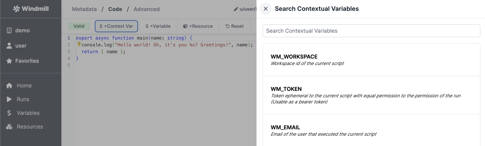
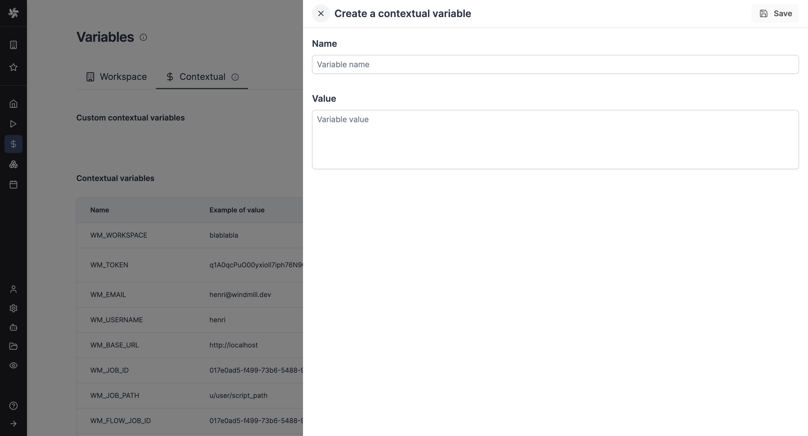

import DocCard from '@site/src/components/DocCard';

# Environment variables

Environment variables are used to configure the behavior of scripts and services, allowing for dynamic and flexible execution across different environments.

## List of environment variables

| Name | Default                | Description                                                                                                                                                                                        | Api Server/Worker/All |
| ------------------------- | ---------------------- | -------------------------------------------------------------------------------------------------------------------------------------------------------------------------------------------------- | --------------------- |
| DATABASE_URL              |                        | The Postgres database url.                                                                                                                                                                         | All                   |
| WORKER_GROUP              | default                | The worker group the worker belongs to and get its configuration pulled from                                                                                                                       | Worker                |
| MODE                      | standalone             | The mode if the binary. Possible values: standalone, worker, server, agent                                                                                                                                | All                   |
| METRICS_ADDR              | None                   | (ee only) The socket addr at which to expose Prometheus metrics at the /metrics path. Set to "true" to expose it on port 8001                                                                      | All                   |
| JSON_FMT                  | false                  | Output the logs in json format instead of logfmt                                                                                                                                                   | All                   |
| BASE_URL                  | http://localhost:8000  | The base url that is exposed publicly to access your instance. Is overriden by the instance settings if any.                                                                                       | Server                |
| ZOMBIE_JOB_TIMEOUT        | 30                     | The timeout after which a job is considered to be zombie if the worker did not send pings about processing the job (every server check for zombie jobs every 30s)                                  | Server                |
| RESTART_ZOMBIE_JOBS       | true                   | If true then a zombie job is restarted (in-place with the same uuid and some logs), if false the zombie job is failed                                                                              | Server                |
| SLEEP_QUEUE               | 50                     | The number of ms to sleep in between the last check for new jobs in the DB. It is multiplied by NUM_WORKERS such that in average, for one worker instance, there is one pull every SLEEP_QUEUE ms. | Worker                |
| KEEP_JOB_DIR              | false                  | Keep the job directory after the job is done. Useful for debugging.                                                                                                                                | Worker                |
| LICENSE_KEY (EE only)     | None                   | License key checked at startup for the Enterprise Edition of Windmill                                                                                                                              | Worker                |
| SLACK_SIGNING_SECRET      | None                   | The signing secret of your Slack app. See [Slack documentation](https://api.slack.com/authentication/verifying-requests-from-slack)                                                                | Server                |
| COOKIE_DOMAIN             | None                   | The domain of the cookie. If not set, the cookie will be set by the browser based on the full origin                                                                                               | Server                |
| DENO_PATH                 | /usr/bin/deno          | The path to the deno binary.                                                                                                                                                                       | Worker                |
| PYTHON_PATH (not recommended) | /usr/local/bin/python3 | The path to the python binary. If used [selecting python version](http://localhost:3000/docs/getting_started/scripts_quickstart/python#select-python-version) will not work and scripts will be executed using provided python.                                                             | Worker                |
| GO_PATH                   | /usr/bin/go            | The path to the go binary.                                                                                                                                                                         | Worker                |
| GOPRIVATE                 |                        | The GOPRIVATE env variable to use private go modules                                                                                                                                               | Worker                |
| GOPROXY                   |                        | The GOPROXY env variable to use                                                                                                                                                                    | Worker                |
| NETRC                     |                        | The netrc content to use a private go registry                                                                                                                                                     | Worker                |                                                                                                                                                                  | Worker                |
| PY_CONCURRENT_DOWNLOADS   | 20                     | Sets the maximum number of in-flight concurrent python downloads that windmill will perform at any given time.                                                                                     | Worker                |
| PATH                      | None                   | The path environment variable, usually inherited                                                                                                                                                   | Worker                |
| HOME                      | None                   | The home directory to use for Go and Bash , usually inherited                                                                                                                                      | Worker                |
| DATABASE_CONNECTIONS      | 50 (Server)/3 (Worker) | The max number of connections in the database connection pool                                                                                                                                      | All                   |
| SUPERADMIN_SECRET         | None                   | A token that would let the caller act as a virtual superadmin superadmin@windmill.dev                                                                                                              | Server                |
| TIMEOUT_WAIT_RESULT       | 20                     | The number of seconds to wait before timeout on the 'run_wait_result' endpoint                                                                                                                     | Worker                |
| QUEUE_LIMIT_WAIT_RESULT   | None                   | The number of max jobs in the queue before rejecting immediately the request in 'run_wait_result' endpoint. Takes precedence on the query arg. If none is specified, there are no limit.           | Worker                |
| DENO_AUTH_TOKENS          | None                   | Custom DENO_AUTH_TOKENS to pass to worker to allow the use of private modules                                                                                                                      | Worker                |
| DISABLE_RESPONSE_LOGS          | false                   | Disable response logs                                                   | Server                |
| CREATE_WORKSPACE_REQUIRE_SUPERADMIN | true | If true, only superadmins can create new workspaces | Server |
| WM_MOCKED_API_FILE | /path/to/mocked_api.json | Path to the mocked API file | All |

## Contextual variables

Contextual variables are environment variables automatically set by Windmill. This is how the Deno and Python clients get their implicit
credentials to interact with the platform.

See the `Contextual` tab on the [Variable](../2_variables_and_secrets/index.mdx) page for the list of reserved variables and what they are used for.

You can use them in a Script by clicking on "+Context Var":

| Name | Example of value | Description |
|------|------------------|-------------|
| WM_WORKSPACE | demo | Workspace id of the current script |
| WM_TOKEN | q1E2qcLyO00yxioll7oph76N9CJDqn | Token ephemeral to the current script with equal permission to the \ permission of the run (Usable as a bearer token)" |
| WM_EMAIL | demo@windmill.dev | Email of the user that executed the current script |
| WM_USERNAME | ruben | Username of the user that executed the current script |
| WM_BASE_URL | https://app.windmill.dev/ | base url of this instance |
| WM_JOB_ID | 017e0ad5-f499-73b6-5488-92a61c5196dd | Job id of the current script |
| WM_JOB_PATH | u/user/script_path | Path of the script or flow being run if any |
| WM_FLOW_JOB_ID | 017e0ad5-f499-73b6-5488-92a61c5196dd | Job id of the encapsulating flow if the job is a flow step |
| WM_ROOT_FLOW_JOB_ID | 017e0ad5-f499-73b6-5488-92a61c5196dd | Job id of the root flow if the job is a flow step |
| WM_FLOW_PATH | u/user/flow_path | Path of the encapsulating flow if the job is a flow step |
| WM_SCHEDULE_PATH | u/user/triggering_flow_path | Path of the schedule if the job of the step or encapsulating step has \ been triggered by a schedule" |
| WM_PERMISSIONED_AS | u/henri | Fully Qualified (u/g) owner name of executor of the job |
| WM_STATE_PATH | u/user/flow_path/c_henri | State resource path unique to a script and its trigger |
| WM_STATE_PATH_NEW | u/user/flow_path/c_henri | State resource path unique to a script and its trigger (legacy) |
| WM_FLOW_STEP_ID | c | The node id in a flow (like 'a', 'b', or 'f') |
| WM_OBJECT_PATH | u_user_flow_path/u_user_flow_path/c/17[...]196dd | Script or flow step execution unique path, useful for storing results in an external service |
| WM_OIDC_JWT | eyJh[...]ciOiJIUzI1NiIsInR5 | OIDC JWT token (EE only) |

### Custom contextual variables

From Variables tab, [admins](../16_roles_and_permissions/index.mdx) can create custom contextual variables that will act as env variables for all jobs within a workspace.

We still recommend using [user-defined variables](../2_variables_and_secrets/index.mdx#user-defined-variables) but in some cases (e.g. your imports depend on env variables), this might be a good escape hatch.

## Custom environment variables

In a self-hosted environment, Windmill allows you to set custom environment variables for your scripts. This feature is useful when a script needs an environment variable prior to the main function executing itself. For instance, some libraries in Go do some setup in the 'init' function that depends on environment variables.

To add a custom environment variable to a script in Windmill, you should follow this format: `<KEY>=<VALUE>`. Where `<KEY>` is the name of the environment variable and `<VALUE>` is the corresponding value of the environment variable.

	<DocCard
		title="Custom environment variables"
		description="In a self-hosted environment, Windmill allows you to set custom environment variables for your scripts."
		href="/docs/script_editor/custom_environment_variables"
	/>

## Environment variables passed to jobs

From a [worker group](../9_worker_groups/index.mdx), you can add static and dynamic environment variables that will be [passed to jobs](../9_worker_groups/index.mdx#environment-variables-passed-to-jobs) handled by this worker group. Dynamic environment variable values will be loaded from the worker host environment variables while static environment variables will be set directly from their values below.

	<DocCard
		title="Workers and worker groups"
		description="Worker Groups allow users to run scripts and flows on different machines with varying specifications."
		href="/docs/core_concepts/worker_groups"
	/>

