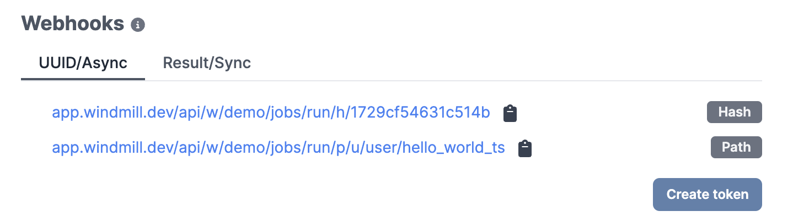

# Webhooks

:::tip

Snippet of a Deno/TypeScript script using only native JavaScript to trigger a
webhook can be found on [Windmill Hub][script].

<br/>

Some use cases include triggering scripts and flows from [Slack](/blog/handler-slack-commands) or [Emails](../../integrations/mailchimp_mandrill.md).

:::

## Getting started

Webhooks are a way to interact with Windmill using standard web technologies.
Each Script and Flow created in the app gets autogenerated webhooks, depending on how they are triggered, and what their return values are.

### Addresses



Webhook links can be found on the "Detail" page of the Scripts and Flows. For
more information about
[Scripts](../../getting_started/0_scripts_quickstart/1_typescript_quickstart/index.md)
or [Flows](../../getting_started/6_flows_quickstart/index.md), refer to the
Getting Started section.

Each webhook has two URLs, one with the path to the script, i.e.
`/p/u/<your_user>/<your_script_name>`, which will always trigger the latest
version of the Script/Flow and the other one with just a hash, i.e. `/h/<hash>`,
hiding potentially sensitive information and always corresponding to that
version of the script, even with overwrites.

#### Asynchronous

Jobs can be triggered in **asynchronous** mode, meaning that the webhook is
triggered, and the returning value is the `uuid` of the job that was assigned
the execution of the underlying code.

These links are available in the "UUID/Async" tab.

#### Synchronous

The second type of autogenerated endpoint is the **synchronous** webhook. This
webhook triggers the execution, automatically extracts the underlying code's
return value and returns it as the response.

These links are available in the "Result/Sync" tab.

:::info

For scripts, there is an additional **synchronous** webhook available that accepts a `GET` request. The payload must be passed as the query arg `payload` and encoded in JSON first, then in an URL safe base64, e.g: `encodeURIComponent(btoa(JSON.stringify({a: 2})))`. This endpoint has the same URL as the Result/Sync POST Path URLs.

:::

:::caution

Be cautious with potentially long-running jobs in **synchronous** mode.

:::

:::tip Asynchronous vs. Synchronous

It's always better to use asynchronous mode as it allows your client not to wait for the response and it avoids Windmill to have to maintain a connection to your client while the job is running. However, for short-running jobs where it's easier in your code to block until you get a response, then use the synchronous mode.

<br/>

When using the **synchronous mode**, the webhook returns the result of the script directly. If the script returns an error, the endpoint still returns the `200` status code with the error as a JSON object.

<br/>

When using the **asynchronous mode**, the webhook returns a `uuid` and you can poll the [get job](https://app.windmill.dev/openapi.html#/operations/getJob) API call to fetch the status and results once it is completed.

:::

### API token

To interact with Windmill you always need to use `Bearer` token authentication.

You can generate tokens for your own account in the
**User Settings menu** on the app. Open it by
clicking your username on the side menu, then select "Account settings".

Labels are only used to allow users to easily distinguish keys.

:::caution

You can only see the token once, when it's created. Make sure to store it
securely!

:::


## Triggering

Once you have a webhook URL and a user token, issue a request to the
endpoint and you will get the appropriate return as response.

The bearer token must be passed as either an `Authorization: Bearer <TOKEN>`
header, or as a `token` query parameter:
`https://<instance>/<route>?token=<TOKEN>`

:::caution

Because of security reasons it is highly recommended to pass token in the
header. If it's not possible, then URL that contains the token should be treated
as a secret (for more context please check [OWASP ref.1] and [OWASP ref.2]).

:::

Examples using cURL for `POST` requests:

```bash
# Header
curl -X POST \
    --data '{}'                            \
    -H "Content-Type: application/json"    \
    -H "Authorization: Bearer supersecret" \
    ".../w/demo/jobs/run_wait_result/p/u/bot/hello_world_deno"
```

```bash
# Query parameter
curl -X POST                               \
    --data '{}'                            \
    -H "Content-Type: application/json"    \
    ".../w/demo/jobs/run_wait_result/p/u/bot/hello_world_deno?token=supersecret"
```

Examples using cURL for synchronous GET requests:

```bash
# Header
curl -X GET \
    -H "Content-Type: application/json"    \
    -H "Authorization: Bearer supersecret" \
    ".../w/demo/jobs/run_wait_result/p/u/bot/hello_world_deno?payload=<URL_SAFE_BASE64_ENCODED_JSON>"
```

You can find an example using only standard Deno libraries on the
[Windmill Hub][script].

You can also verify that the job has been triggered and ran (or investigate any
encountered issues), by checking the [Runs page][runs] on the app.


<!-- Resources -->

[runs]: ../5_monitor_past_and_future_runs/index.md
[user-settings]: https://app.windmill.dev/#user-settings
[script]: https://hub.windmill.dev/scripts/windmill/1325/trigger-windmill-webhook-with-native-fetch-api-windmill
[OWASP ref.1]: https://cheatsheetseries.owasp.org/cheatsheets/REST_Security_Cheat_Sheet.html#sensitive-information-in-http-requests
[OWASP ref.2]: https://github.com/OWASP/CheatSheetSeries/blob/083890d18ca40bcfc4bdfa80e04dd0a2245c34ea/cheatsheets_draft/Webhook_Security_Guidelines_CheatSheet.md#treat-webhooks-as-secrets