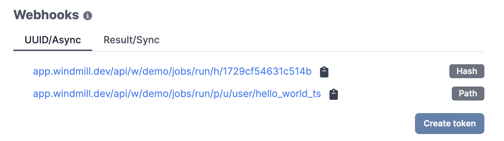
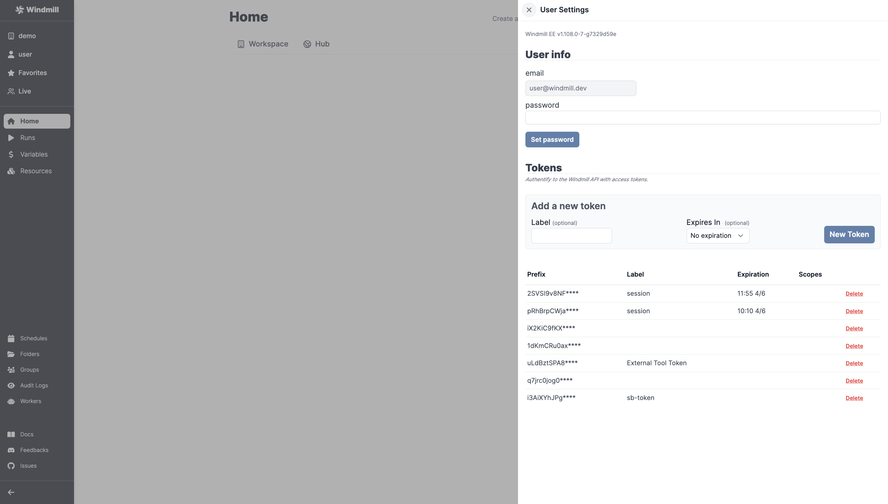
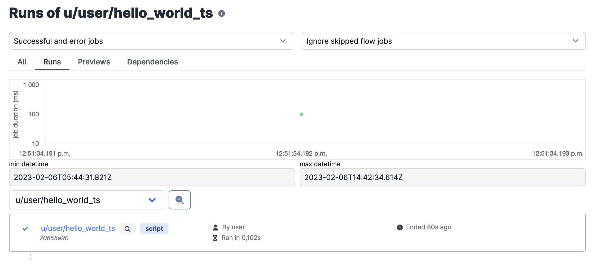
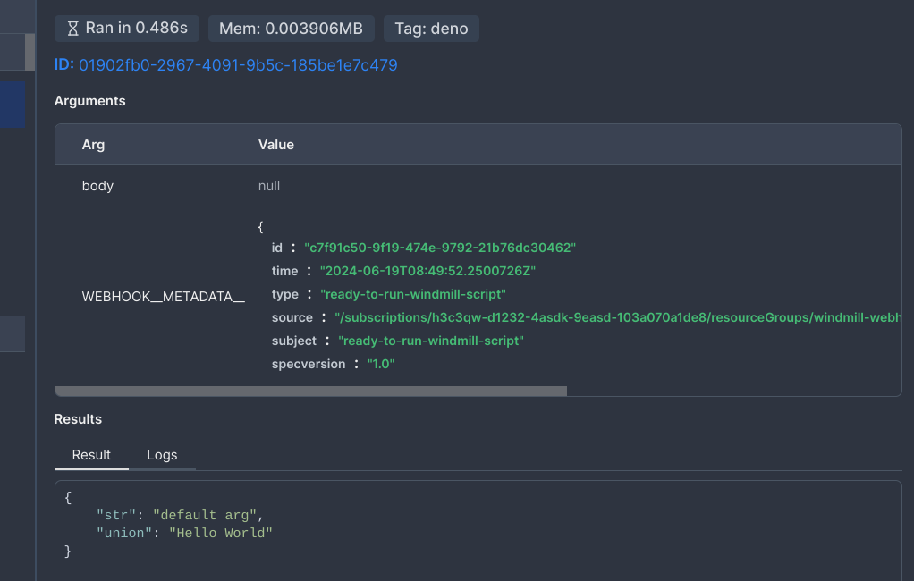
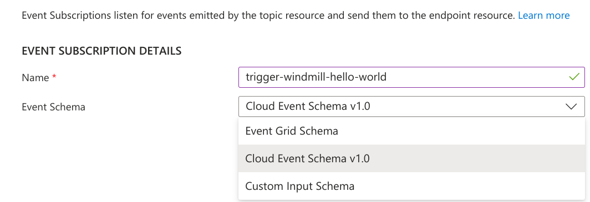

import Tabs from '@theme/Tabs';
import TabItem from '@theme/TabItem';
import DocCard from '@site/src/components/DocCard';

# Webhooks

Webhooks are a way to interact with Windmill using standard web technologies.

:::tip

Snippet of a Deno/TypeScript script using only native JavaScript to trigger a
webhook can be found on [Windmill Hub][script].

<br />

Some use cases include triggering scripts and flows from [Slack](/blog/handler-slack-commands) or [Emails](../../integrations/mailchimp_mandrill.md).

:::

## Webhooks for scripts & flows

Each script and flow created in Windmill gets autogenerated webhooks. The webhooks depend on how they are triggered, and what their return values are.

### Addresses



Webhook links can be found on the Detail page of each Script and Flow, on the Details and Triggers tab.
For more information about
[Scripts](../../getting_started/0_scripts_quickstart/1_typescript_quickstart/index.mdx)
or [Flows](../../getting_started/6_flows_quickstart/index.mdx), refer to the
Getting started section.

Each webhook has two URLs, one with the path to the script, i.e.
`/p/u/<your_user>/<your_script_name>`, which will always trigger the latest
version of the Script/Flow and the other one with just a hash, i.e. `/h/<hash>`,
hiding potentially sensitive information and always corresponding to that
version of the script, even with overwrites.

#### Asynchronous

Jobs can be triggered in asynchronous mode, meaning that the webhook is triggered, and the returning value is the uuid of the job assigned to execute the underlying code

These links are available in the "UUID/Async" tab.

#### Synchronous

The second type of autogenerated endpoint is the **synchronous** webhook. This
webhook triggers the execution, automatically extracts the underlying code's
return value and returns it as the response.

Every script exposes an endpoint that triggers the Script but waits for its
full execution before returning.

The endpoint has the following format:

```bash
https://app.windmill.dev/api/w/$WORKSPACE_ID/jobs/run_wait_result/$SCRIPT_PATH
```

where $SCRIPT_PATH is the path of the Script in the workspace, including the prefix `u/` or `f/`

These links are available in the "Result/Sync" tab.

:::info

For scripts, there is an additional **synchronous** webhook available that accepts a `GET` request. The payload must be passed as the query arg `payload` and encoded in JSON first, then in an URL safe base64, e.g: `encodeURIComponent(btoa(JSON.stringify({a: 2})))`. This endpoint has the same URL as the Result/Sync POST Path URLs.

:::

:::caution Custom timeout for sync endpoints

Be cautious with potentially long-running jobs in **synchronous** mode.

<br />

You can set a [max timeout for sync endpoints](../../advanced/18_instance_settings/index.mdx#max-timeout-for-sync-endpoints) at the instance-level.

:::

#### Asynchronous vs. Synchronous

It's always better to use asynchronous mode as it allows your client not to wait for the response and it avoids Windmill to have to maintain a connection to your client while the job is running. However, for short-running jobs where it's easier in your code to block until you get a response, then use the synchronous mode.

When using the **synchronous mode**, the webhook returns the result of the script directly. If the script returns an error, the default behavior is to return a `200` status code with the error as a JSON object. You can [customize the https status code](#custom-response-code) if needed.

When using the **asynchronous mode**, the webhook returns a `uuid` and you can poll the [get job](https://app.windmill.dev/openapi.html#/operations/getJob) API call to fetch the status and results once it is completed.

### User token

To interact with Windmill you always need to use `Bearer` token authentication.

You can generate tokens for your own account in the
**Account Settings menu** in the app. Open it by
clicking your username on the side menu, then select "Account settings".

Labels are only used to allow users to easily distinguish keys.

:::caution

You can only see the token once, when it's created. Make sure to store it
securely!

:::



### Webhook specific tokens

Webhook specific tokens allow sharing tokens publicly without fear since the token will only be able to trigger a specific script/flow and not impersonate you for any other operations.

It also avoids the hassle of having to create an anonymous user and check their permissions. If you can run the script yourself, then the webhook specific token will still inherit your own permissions.


### Triggering

Once you have a webhook URL and a user token, issue a request to the
endpoint and you will get the appropriate return as response.

The bearer token must be passed as either an `Authorization: Bearer <TOKEN>`
header, or as a `token` query parameter:
`https://<instance>/<route>?token=<TOKEN>`

:::caution

Due to security reasons, it is highly recommended to pass the token in the
header. If it's not possible, then URL that contains the token should be treated
as a secret (for more context please check [OWASP ref.1] and [OWASP ref.2]).

:::

Examples using cURL for `POST` requests:

```bash
## Request with Header
curl -X POST \
    --data '{}'                            \
    -H "Content-Type: application/json"    \
    -H "Authorization: Bearer supersecret" \
    ".../w/demo/jobs/run_wait_result/p/u/bot/hello_world_deno"
```

```bash
## Query parameter
curl -X POST                               \
    --data '{}'                            \
    -H "Content-Type: application/json"    \
    ".../w/demo/jobs/run_wait_result/p/u/bot/hello_world_deno?token=supersecret"
```

Examples using cURL for synchronous GET requests:

```bash
## Request with Header".
curl -X GET \
    -H "Content-Type: application/json"    \
    -H "Authorization: Bearer supersecret" \
    ".../w/demo/jobs/run_wait_result/p/u/bot/hello_world_deno?payload=<URL_SAFE_BASE64_ENCODED_JSON>"
```

You can find an example using only standard Deno libraries on the
[Windmill Hub][script].

You can also verify that the job has been triggered and run (or investigate any
encountered issues), by checking the [Runs menu][runs] on the app.



### Body

The webhook endpoints accept a JSON object or url encoded form data as the body, where each key corresponds to an argument of the script/flow.

#### Non object payload / body

If the payload is not an object, it will be wrapped in an object with the key `body` and the value will be the payload/body itself. e.g:

```
[1,2,3] => {"body": [1,2,3]}
```

and your script can process it as:

```python
def main(body: List[int]):
    print(body)
```

#### Wrapping body, handling arbitrary payload

You can also force the payload to be wrapped in an object at the key `body` by passing the query arg `wrap_body=true`. This is useful when the payload is not not known in advance and you want to handle it in your script. e.g:

Python:

```python
def main(body: Any):
	print(body)
```

Typescript:

```typescript
export async function main(body: any) {
	console.log(body);
}
```

#### Raw payload / body

Similarly to request headers, if the query args contain `raw=true`, then an additional argument will be added: `raw_string` which contains the entire json payload as a string (without any parsing). This is useful to verify the signature of the payload for example (discord require the endpoints to verify the signature for instance).

#### Handling form data (file uploads)

The webhook endpoints also accept `multipart/form-data`, useful for file uploads. The payload should be a `FormData` object, where each key corresponds to an argument of the script/flow.

For file fields, the value will be an array containing [s3 objects](../38_object_storage_in_windmill/index.mdx#read-a-file-from-s3-or-object-storage-within-a-script) with the path to the uploaded files in the [workspace object storage](../38_object_storage_in_windmill/index.mdx#workspace-object-storage) (e.g., S3).

Here's an example script for handling form data with a file field:

<Tabs className="unique-tabs">
<TabItem value="bun" label="TypeScript" attributes={{className: "text-xs p-4 !mt-0 !ml-0"}}>

```ts
import { S3Object } from 'windmill-client';

export async function main(mytextfield: string, myfilefield: S3Object[]) {
	return myfilefield;
}
```

</TabItem>
<TabItem value="python" label="Python" attributes={{className: "text-xs p-4 !mt-0 !ml-0"}}>

```python
import wmill
from typing import List

def main(mytextfield: str, myfilefield: List[wmill.S3Object]):
    return myfilefield
```

</TabItem>
</Tabs>

:::warning
A [workspace object storage](../38_object_storage_in_windmill/index.mdx#workspace-object-storage) must be configured to accept form data payloads.
:::

### Request headers

It is possible for jobs to take request headers as arguments. To do so, either specify in the query args the headers to process at `include_header`, separated with `,`. e.g:

```
/api/w/workspace/jobs/run_wait_result/p/u/user/new_script?include_header=X-Sign,foo
```

or use the env variable: `INCLUDE_HEADERS` with the same format so that all requests to any job will include the headers.

### Query args

It is possible to pass query args to the job. To do so, either specify in the query args the headers to process at `include_query`, separated with `,`. e.g for a [sync](#synchronous) get request (works for all endpoints):

```
/api/w/workspace/jobs/run_wait_result/p/u/user/new_script?include_query=a,b,c&a=foo&b=bar&c=foobar
```

to have a: "foo", b: "bar", c: "foobar", passed as args.

### Custom response code

For all sync run jobs endpoints, if the response contains a key `windmill_status_code` with a number value, that value will be used as the status code. For example, if a script or flow returns:

```json
{
	"windmill_status_code": 201,
	"result": {
		"Hello": "World"
	}
}
```

the synchronous endpoint will return:

```json
{
	"Hello": "World"
}
```

with a status code `201`.

Note that if the status code is invalid (w.r.t [RFC9110](https://httpwg.org/specs/rfc9110.html#overview.of.status.codes)), the endpoint will return an error.

### Custom response content type

Similarly to the above, for all sync run jobs endpoints, if the response contains a key `windmill_content_type`, the associated value will be used as the content type header of the response. For example, if a script or flow returns:

```json
{
	"windmill_content_type": "text/csv",
	"result": "Hello;World"
}
```

the synchronous endpoint will return:

```csv
"Hello;World"
```

with the response header: "Content-Type: text/csv".

### Custom response headers

Similar to the above, for all sync run jobs endpoints, if the response contains a key `windmill_headers`, the headers will be added to the response. For example, if a script or flow returns:

```json
{
	"windmill_headers": { "X-Custom-Header": "foo" },
	"result": {
		"Hello": "World"
	}
}
```

the synchronous endpoint with return the result with the header `X-Custom-Header: foo` (in addition to `Content-Type: application/json`).

It's better to use `windmill_content_type` to override the content type, as the output will be correctly formatted.

### Return early for flows

It is possible to define a node at which the flow will return at for sync endpoints. The rest of the flow will continue asynchronously.

Useful when some webhooks need to return extremely fast but not just the uuid (define first step as [early return](../../flows/19_early_return.mdx)) or when the expected return from the webhook doesn't need to the full flow being computed.

<div className="grid grid-cols-2 gap-6 mb-4">
	<DocCard
		title="Return Early for Flows"
		description="Define a node at which the flow will return at for sync endpoints."
		href="/docs/flows/early_return"
	/>
</div>

### Exposing a webhook URL

Single port proxy can be leveraged to expose a webhook with a custom URL. In its docker-compose, Windmill uses Caddy but the logic can be adapted for others.

In the Caddyfile, the [`handle_path`](https://caddyserver.com/docs/caddyfile/directives/handle_path#handle-path) and [`rewrite`](https://caddyserver.com/docs/caddyfile/directives/rewrite#rewrite) directive can be used:

```
{$BASE_URL} {
	bind {$ADDRESS}

	handle_path /mywebhook {
		rewrite * /api/w/demo/jobs/run_wait_result/p/u/bot/hello_world_deno"
		## You can optionally inject the token in Caddy to have the endpoint exposed publicly
		## request_header Authorization "Bearer <WINDMILL_GENERATED_TOKEN>"
	}

	...
	reverse_proxy /* http://windmill_server:8000
}
```

The job can then be triggered with:

```
curl -X POST                               \
    --data '{}'                            \
    -H "Content-Type: application/json"    \
    ".../mywebhook?payload=<URL_SAFE_BASE64_ENCODED_JSON>"
```

### Cloud events 1.0

Windmill's webhooks aim to be compatible with the [Cloud Events 1.0](https://cloudevents.io/) specification. The envelope metadata will be parsed into a special argument `WEBHOOK__METADATA__` for scripts and flows.



Nothing extra needs to be done on Windmill's side, if a request has the cloudevent content header it will automatically be handled according to the specification. When using webhook producers that allow it, you can select to use the cloud events schema. For example with Azure Event Grid:



:::caution

Windmill does not support batching cloud events yet. This means that requests with the content type set to `'application/cloudevents-batch+json'` will return an error response.

:::

Learn more about what Cloud Events are [here](https://cloudevents.io/).

### Delete after use

For a script, delete [logs](../14_audit_logs/index.mdx), arguments and results after use.

:::warning

This settings ONLY applies to [synchronous](#synchronous) webhooks. If used individually, this script must be triggered using a synchronous endpoint to have the desired effect.

<br />
The logs, arguments and results of the job will be completely deleted from Windmill once it is complete
and the result has been returned.
<br />
The deletion is irreversible.

:::

## SSE stream webhooks

In addition to classical webhooks, runnables are associated with SSE Stream Webhooks.
These are only useful when the runnable returns a stream. [Learn more about result streaming here](../20_jobs/index.mdx#result-streaming).
They trigger the job and then return an SSE stream.

The endpoints follow the same convention as classical webhooks, but use the base path `/api/w/workspace/jobs/run_and_stream/`.
You can find the SSE Stream Webhook URL on the Detail page of each Script and Flow, under the Details and Triggers tab.
They support both `GET` and `POST` requests.

To get the stream updates of an existing job with SSE, use `/api/w/:workspace/job_u/getupdate_sse/:id` (pass query arg `?fast=true` for a new job to get fast polling at first)

For flows, a stream will be returned if the last step is a script that returns a stream.

The SSE stream returns JSON objects with the detailed shape available [here](../20_jobs/index.mdx#job-progress-event-response).
For the stream endpoint, you will mainly get the following events with different available fields:

```json
// update event with new result stream data
{
	"type": "update",
	"new_result_stream": "string", // string: new result stream data since last update
	"stream_offset": 456 // integer: current result stream offset
}
```

```json
// update event with result once job is complete
{
	"type": "update",
	"completed": true, // boolean: whether the job is completed
	"only_result": {...} // JSON result
}
```

The first event is sent one or more times as the stream progresses with new data.
The second event is sent when the job is complete, containing the result of the job in the `only_result` field.
The result will be a string containing the complete stream or a JSON object with the complete stream in the `wm_stream` field if there is already a result.
Always use the `only_result` field to get the complete result at the end, as the final part of the stream might not be sent separately in a new_result_stream event.

## Export webhook definitions to OpenAPI

Windmill supports generating an OpenAPI 3.1 specification that includes both HTTP routes and webhook triggers.

Webhook endpoints included in the spec:

- Are matched using filters you define
- Include `summary` and `description` if available
- Are automatically mapped to use **JWT Bearer authentication** in the spec

You can generate this from the [Custom HTTP routes](/docs/core_concepts/http_routing#generate-an-openapi-specification-from-http-routes-and-webhooks) page.

## Workspace webhook

Connect your Windmill workspace to an external service to sync or get notified about any change.

From workspace settings, go to the "Webhooks" tab and fill an URL under "URL to send requests to".


<!-- Resources -->

[runs]: ../5_monitor_past_and_future_runs/index.mdx
[user-settings]: https://app.windmill.dev/#user-settings
[script]: https://hub.windmill.dev/scripts/windmill/1325/trigger-windmill-webhook-with-native-fetch-api-windmill
[OWASP ref.1]: https://cheatsheetseries.owasp.org/cheatsheets/REST_Security_Cheat_Sheet.html#sensitive-information-in-http-requests
[OWASP ref.2]: https://github.com/OWASP/CheatSheetSeries/blob/083890d18ca40bcfc4bdfa80e04dd0a2245c34ea/cheatsheets_draft/Webhook_Security_Guidelines_CheatSheet.md#treat-webhooks-as-secrets
