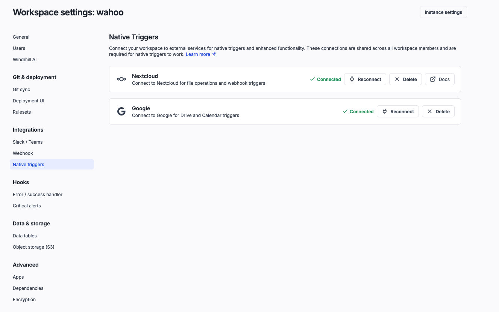
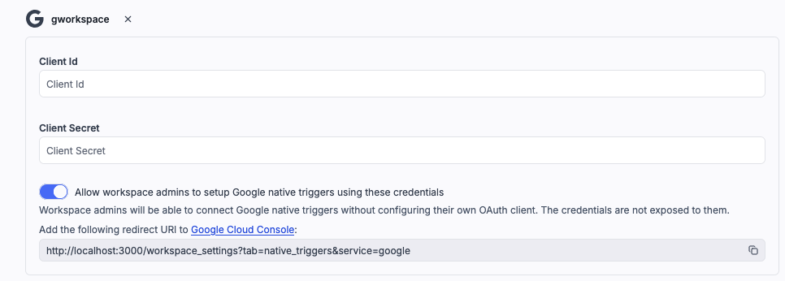
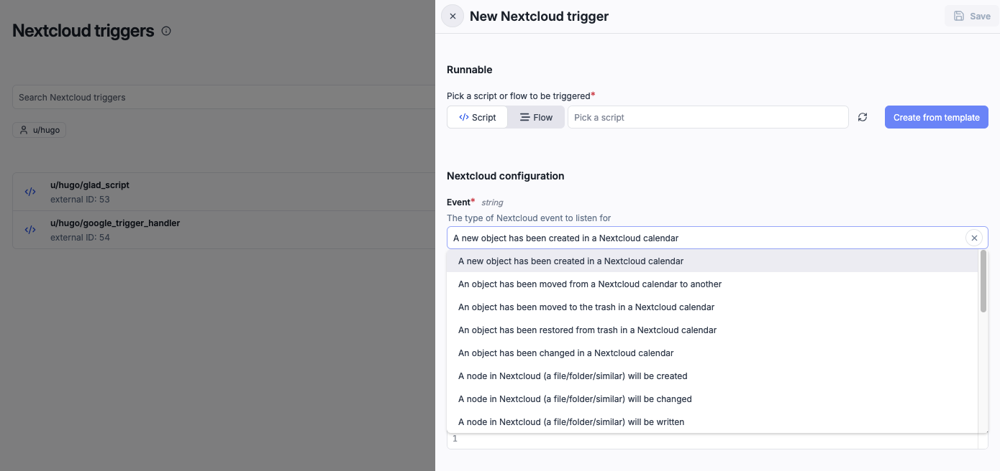
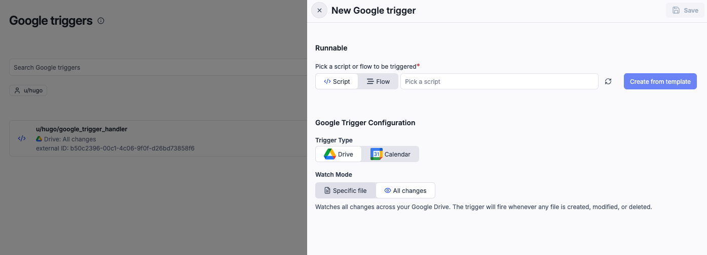

import DocCard from '@site/src/components/DocCard';

# Native triggers

Native triggers allow external services to push events directly to Windmill and trigger [scripts](../../script_editor/index.mdx) and [flows](../../flows/1_flow_editor.mdx). Unlike [scheduled polls](../../flows/10_flow_trigger.mdx), native triggers receive real-time push notifications from the external service via webhooks, so your runnables execute as soon as events occur.

Currently supported services:

- [Nextcloud](#nextcloud-triggers) - file, folder, and calendar change events
- [Google](#google-triggers) - drive and calendar change events

---

## How it works

Native triggers use [OAuth](../../misc/2_setup_oauth/index.mdx) to authenticate with the external service. Each trigger registers a webhook or watch channel on the external service, which sends notifications to Windmill when events occur. Windmill then executes the configured script or flow with the event data.

The general setup follows two steps:

1. **Connect the service** via workspace settings (OAuth authentication)
2. **Create a trigger** on a script or flow, selecting the service and configuring which events to watch

---

## Setup

### Workspace integration

Before creating native triggers, you need to connect the external service in your workspace settings.

1. Go to **Workspace settings** > **Integrations** > **Native triggers**
2. Click **Connect** on the service you want to use (Nextcloud or Google)
3. Provide the [OAuth](../../misc/2_setup_oauth/index.mdx) credentials (client ID and client secret)
4. Complete the OAuth authorization flow
5. Choose a [resource](../3_resources_and_types/index.mdx) path where the connection will be stored in the workspace



The integration creates a [resource](../3_resources_and_types/index.mdx) in your workspace at the path you specify. The OAuth token is refreshed automatically, so you don't need to re-authenticate manually. You can use this resource in your scripts to query the service API with the same credentials used by the trigger.

For Google integrations, the created [resource](../3_resources_and_types/index.mdx) is of type `gworkspace`. The OAuth scopes used are:
- `https://www.googleapis.com/auth/drive.readonly`
- `https://www.googleapis.com/auth/calendar.readonly`
- `https://www.googleapis.com/auth/calendar.events`

If you need additional scopes (e.g. write access), set up a separate resource with the desired scopes.

A superadmin can share [instance-level](../../advanced/18_instance_settings/index.mdx) Google workspace settings so that workspace admins can connect Google native triggers without configuring their own OAuth client.
The credentials are not exposed to workspace admins.



For Nextcloud, you also need to provide the base URL of your Nextcloud instance.

### Create a trigger

Once the workspace integration is configured:

1. Go to **Nextcloud** or **Google** tab (only visible once the corresponding [workspace integration](#workspace-integration) is configured)
2. Click **New trigger**
3. Select the script or flow to trigger
4. Configure the service-specific options (see sections below)
5. Save the trigger

You can also create native triggers directly from a script or flow's **Triggers** tab.

---

## Nextcloud triggers

Nextcloud native triggers watch for file, folder, and calendar changes on a [Nextcloud](https://nextcloud.com/) instance and trigger a script or flow when events occur.

### Prerequisites

- Nextcloud 33 or later
- The [Windmill integration app](https://apps.nextcloud.com/apps/integration_windmill) installed on your Nextcloud instance
- [Pretty URLs](https://docs.nextcloud.com/server/latest/admin_manual/installation/source_installation.html#pretty-urls) enabled on your Nextcloud instance

### Configuration

When creating a Nextcloud trigger, pick a script or flow (or use **Create from template**), then configure:

- **Event** - select the event type to listen for. Available events include:
  - Calendar events: object created, moved, trashed, restored, or changed in a Nextcloud calendar
  - File/folder events: node created, changed, or written



### Event payload

Nextcloud sends the full event data to your script. The payload includes the authenticated user, a timestamp, and the event details:

```typescript
export async function main(
  authentication: {
    owner: RT.Nextcloud;
    trigger: RT.Nextcloud;
  },
  user: {
    uid: string;
    displayName: string;
  },
  time: number,
  event: any
) {
  // event contains the Nextcloud event details (file, folder, or calendar object)
}
```

---

## Google triggers

Google native triggers watch for changes in [Google Drive](https://drive.google.com/) or [Google Calendar](https://calendar.google.com/) and trigger a script or flow when events occur.

### Prerequisites

- A Google Cloud project with the relevant API enabled ([Drive API](https://developers.google.com/drive/api), [Calendar API](https://developers.google.com/calendar/api), or both)
- [OAuth 2.0](https://console.cloud.google.com/apis/credentials) credentials (client ID and client secret) configured with the appropriate scopes

### Configuration

When creating a Google trigger, pick a script or flow (or use **Create from template**), then configure:

- **Trigger Type** - choose between **Drive** and **Calendar**
- **Watch Mode** (Drive only) - choose between:
  - **Specific file** - watch a single file or folder from My Drive, Shared with me, or Shared drives
  - **All changes** - watch all changes across your Google Drive (fires whenever any file is created, modified, or deleted)
- **Calendar** (Calendar only) - select a calendar from your Google account to watch for event changes



Both use push notifications via Google watch channels. Windmill automatically renews channels before they expire. The expiration period differs by service: 24 hours for Drive, 7 days for Calendar.

### Event payload

Google push notifications only contain metadata about the change, not the full event details. To get the actual content of the change, use the [`gworkspace` resource](../3_resources_and_types/index.mdx) created during workspace integration to query the Google API.

```typescript
type GoogleTriggerPayload = {
  channel_id: string;
  resource_id: string;
  resource_state: string; // "sync" | "exists" | "not_exists" | "update"
  resource_uri: string;
  message_number: string;
  channel_expiration: string;
  channel_token: string; // custom token set when creating the watch
  changed: string; // Drive-only: comma-separated list (e.g. "content,properties,permissions")
};

export async function main(payload: GoogleTriggerPayload) {
  // Use the gworkspace resource to query the Google API for full details
}
```

Use the [Google native trigger template script](https://hub.windmill.dev/scripts/gworkspace/22221/google-native-trigger-template-script-gworkspace) (also available from the UI when creating a trigger) as a starting point.

---
