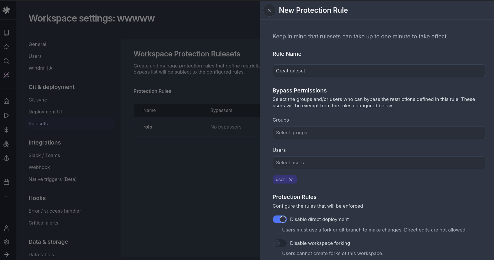

# Protection Rulesets

:::info Enterprise Edition
Protection Rulesets are an [Enterprise Edition](/docs/misc/plans_details) feature.
:::

Protection rulesets allow workspace admins to enforce governance policies that control how changes can be made within a workspace. These rules help maintain code quality, enforce review processes, and prevent accidental modifications in production environments.

## Available Rules

#### Disable Direct Deployment

When enabled, this rule prevents users from directly deploying scripts, flows, or apps to the workspace. Instead, users must:
- Use [workspace forks](../../advanced/20_workspace_forks/index.mdx) to develop and test changes in isolation
- Submit changes through [Git Sync](../../advanced/11_git_sync/index.mdx) workflows
- Use the [Deploy to Prod](../12_staging_prod/index.md) feature to promote changes

This rule is particularly useful for production workspaces where all changes should go through a review process before being deployed.

#### Disable Workspace Forking

When enabled, this rule prevents users from creating [workspace forks](../../advanced/20_workspace_forks/index.mdx) of the current workspace.

## Creating a Protection Ruleset

1. Navigate to **Workspace Settings** > **Protection Rulesets**
2. Click **Add Rule** to create a new protection rule
3. Select the rules to enable
4. Optionally configure bypass permissions for specific users or groups
5. Save the rule

The rule can take up to 60s to activate.

## Bypass Permissions

Each protection rule can be configured with bypass permissions, allowing specific users or groups to override the rule when necessary.

Users with bypass permissions will see a checkbox to bypass the rule. Once checked, the disabled actions become available.
When using the CLI or API endpoints directly, bypassers will be able to perform the actions as if no rule was in place.

## Use Cases

**Production Environment Protection**

Enable "Disable Direct Deployment" on production workspaces to ensure all changes go through proper review and testing before deployment. Combined with Git Sync, this creates a robust CI/CD pipeline.

**Controlled Development Workflow**

Use "Disable Workspace Forking" when you want developers to work exclusively through Git branches rather than workspace forks. This keeps all development activity tracked in your version control system.

**Compliance Requirements**

Protection rulesets help meet compliance requirements that mandate separation of duties or change approval processes. The bypass permissions feature allows you to document and control exceptions.
