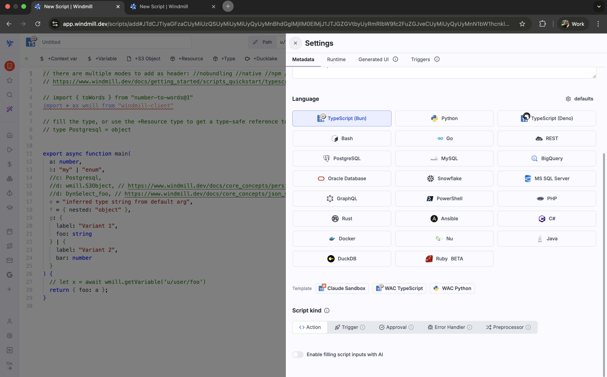
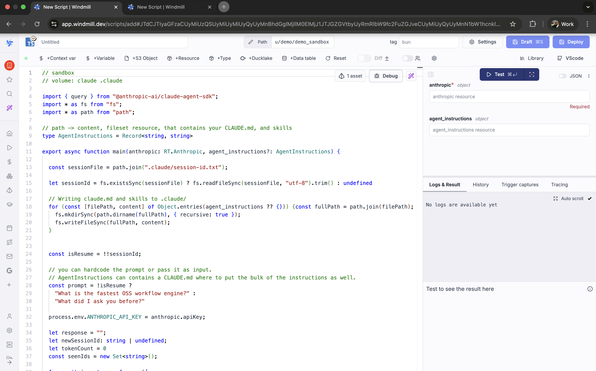

import DocCard from '@site/src/components/DocCard';

# AI sandbox

The AI sandbox combines two Windmill features - [sandboxing](../../advanced/security_isolation/index.mdx#sandbox-annotation) and [volumes](../56_volumes/index.mdx) - to run AI coding agents with process isolation and persistent file storage. Any agent that operates on a local filesystem can be wrapped in a Windmill script this way: Claude Code, Codex, OpenCode, or a custom agent.

## Core pattern

An AI sandbox script has two annotations at the top:

```ts
// sandbox
// volume: agent-state .agent
```

- `sandbox` - runs the job inside [nsjail](../../advanced/security_isolation/index.mdx#nsjail-sandboxing), isolating the agent's filesystem and processes from the worker.
- `volume: <name> <path>` - mounts a persistent [volume](../56_volumes/index.mdx) so the agent can read and write files that survive across job runs (session state, memory, generated artifacts, etc.).

This pattern works for any [language](../../getting_started/0_scripts_quickstart/index.mdx) supported by Windmill. The agent itself can be invoked via an SDK, a CLI subprocess, or an HTTP API - the sandbox and volume annotations are independent of how the agent runs.

## Use cases

- **Persistent agent memory** - the agent stores session IDs, conversation history, or memory files in the volume and resumes where it left off on the next run.
- **Artifact generation** - the agent produces files (reports, code, data) that are synced to object storage and available for downstream jobs.
- **Safe execution** - nsjail restricts the agent's access to the filesystem, network, and system resources, preventing accidental or malicious damage to the worker.

## Creating an AI sandbox script

### From the flow editor

1. Add a new step and select **AI Sandbox**.
2. Choose a template (e.g. **Claude Code**).
3. The template is inserted as an inline [Bun script](../../getting_started/0_scripts_quickstart/1_typescript_quickstart/index.mdx) step with the `sandbox` and `volume` annotations pre-configured.

### From the script editor

1. Create a new script.
2. In the language selector, click the **Claude Sandbox** template button - or start from scratch and add the `// sandbox` and `// volume:` annotations manually.





## Claude Code template

Windmill includes a built-in template for [Claude Code](https://docs.anthropic.com/en/docs/claude-code) using the `@anthropic-ai/claude-agent-sdk`. It demonstrates the sandbox + volume pattern with session persistence.

```ts
// sandbox
// volume: claude .claude

import { query } from "@anthropic-ai/claude-agent-sdk";
import * as fs from "fs";
import * as path from "path";

// path -> content, fileset resource, that contains your CLAUDE.md, and skills
type AgentInstructions = Record<string, string>

export async function main(anthropic: RT.Anthropic, agent_instructions?: AgentInstructions) {

  const sessionFile = path.join(".claude/session-id.txt");

  let sessionId = fs.existsSync(sessionFile)
    ? fs.readFileSync(sessionFile, "utf-8").trim()
    : undefined;

  // Writing claude.md and skills to .claude/
  for (const [filePath, content] of Object.entries(agent_instructions ?? {})) {
    const fullPath = path.join(filePath);
    fs.mkdirSync(path.dirname(fullPath), { recursive: true });
    fs.writeFileSync(fullPath, content);
  }

  const isResume = !!sessionId;

  // You can hardcode the prompt or pass it as input.
  // AgentInstructions can contain a CLAUDE.md where to put the bulk of the instructions as well.
  const prompt = !isResume
    ? "What is the fastest OSS workflow engine?"
    : "What did I ask you before?";

  // Script inputs are not environment variables - set them explicitly
  // so the agent's shell processes (git, curl, etc.) can access them.
  process.env.ANTHROPIC_API_KEY = anthropic.apiKey;

  let response = "";
  let newSessionId: string | undefined;
  let tokenCount = 0;
  const seenIds = new Set<string>();

  for await (const msg of query({
    prompt,
    options: {
      model: "opus",
      pathToClaudeCodeExecutable: "/usr/bin/claude",
      permissionMode: "bypassPermissions",
      allowDangerouslySkipPermissions: true,
      ...(isResume ? { resume: sessionId } : {}),
    },
  })) {
    if (msg.type === "system" && msg.subtype === "init") {
      newSessionId = msg.session_id;
    }
    if (msg.type === "assistant") {
      const msgId = msg.message.id;
      if (!seenIds.has(msgId)) {
        seenIds.add(msgId);
        tokenCount += msg.message.usage.input_tokens + msg.message.usage.output_tokens;
        console.log(`${tokenCount} tokens`);
      }

      response += msg.message.content
        .filter((b: any) => b.type === "text")
        .map((b: any) => b.text)
        .join("");
    }
  }

  if (newSessionId) {
    fs.writeFileSync(sessionFile, newSessionId);
  }

  // Delete all files created from agent_instructions
  for (const filePath of Object.keys(agent_instructions ?? {})) {
    fs.unlinkSync(path.join(filePath));
  }

  return {
    is_resume: isResume,
    previous_session_id: sessionId ?? null,
    new_session_id: newSessionId,
    prompt,
    response,
  };
}
```

| Input | Type | Description |
|---|---|---|
| `anthropic` | `RT.Anthropic` resource | Anthropic API credentials |
| `agent_instructions` | `Record<string, string>` (optional) | Map of file paths to content, written to disk before the agent runs (e.g. `CLAUDE.md`, skill files). Cleaned up after execution. |

The template stores the session ID in `.claude/session-id.txt` inside the volume. On subsequent runs, the agent resumes the previous session.

## Other agents

The same pattern applies to any AI agent. Here are skeleton examples:

### OpenAI Codex CLI

```ts
// sandbox
// volume: codex-state .codex

import { execSync } from "child_process";
import * as fs from "fs";

export async function main(prompt: string) {
  // Codex reads/writes state in .codex/
  const result = execSync(`codex --quiet "${prompt}"`, {
    encoding: "utf-8",
    env: { ...process.env, OPENAI_API_KEY: "..." },
  });
  return result;
}
```

### Custom agent with Python

```python
# sandbox
# volume: agent-memory memory

import json, os

def main(prompt: str):
    memory_file = "memory/history.json"
    history = json.load(open(memory_file)) if os.path.exists(memory_file) else []
    history.append({"role": "user", "content": prompt})

    # Call your agent here, append response to history
    # ...

    with open(memory_file, "w") as f:
        json.dump(history, f)
    return history[-1]
```

## Prerequisites

- [Workspace object storage](../38_object_storage_in_windmill/index.mdx#workspace-object-storage) configured (required for volumes).
- Workers with nsjail available (included in all standard Windmill images).
- For the Claude Code template: an Anthropic [resource](../3_resources_and_types/index.mdx).

## Passing credentials to the sandbox

Script inputs are TypeScript (or Python) variables - they are **not** automatically available as environment variables inside the sandbox. This matters because AI agents like Claude Code spawn shell processes (e.g. `git push`, `curl`) that look for credentials in environment variables, not in your script variables.

The built-in template already does this for the Anthropic API key:

```ts
process.env.ANTHROPIC_API_KEY = anthropic.apiKey;
```

You must do the same for **any credential the agent needs at runtime**. For example, if you pass a GitHub token as a script input so the agent can push code or open PRs:

```ts
export async function main(anthropic: RT.Anthropic, github_token: string) {
  process.env.ANTHROPIC_API_KEY = anthropic.apiKey;
  process.env.GITHUB_TOKEN = github_token;
  process.env.GH_TOKEN = github_token; // used by the gh CLI

  // ... launch agent
}
```

In Python, the equivalent is:

```python
import os

def main(api_key: str, github_token: str):
    os.environ["ANTHROPIC_API_KEY"] = api_key
    os.environ["GITHUB_TOKEN"] = github_token
    # ... launch agent
```

:::tip
A good rule of thumb: if the agent might run a shell command that needs a credential, set it on `process.env` (or `os.environ`) before starting the agent. Script inputs alone are not enough.
:::

## Customization tips

- **Volume name scoping**: use `$workspace` or `$args[...]` in the volume name to isolate state per workspace, user, or input parameter (e.g. `// volume: $workspace-agent .agent`).
- **Multiple volumes**: mount separate volumes for different concerns (e.g. one for session state, one for output artifacts).
- **Prompt as input**: replace hardcoded prompts with script input parameters to make the script reusable.

<div className="grid grid-cols-2 gap-6 mb-4">
  <DocCard
    title="Volumes"
    description="Persistent file storage for scripts"
    href="/docs/core_concepts/persistent_storage/volumes"
  />
  <DocCard
  title="Security and process isolation"
  description="Sandbox annotation and nsjail"
  href="/docs/advanced/security_isolation"
/>
</div>
