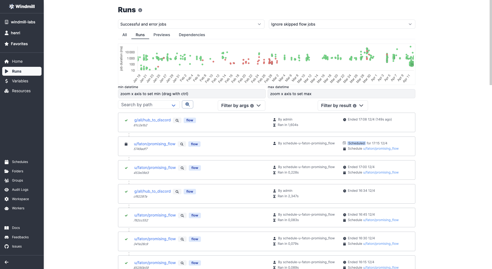
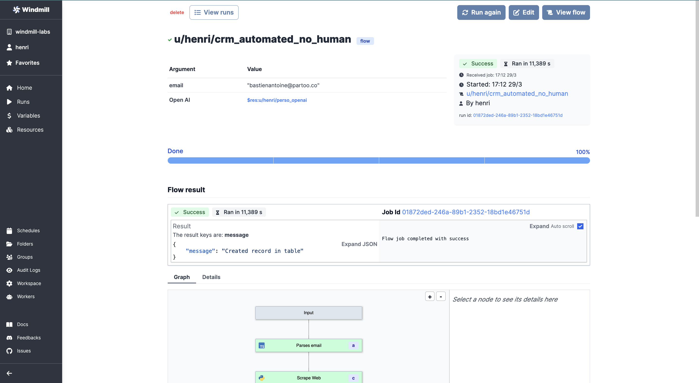
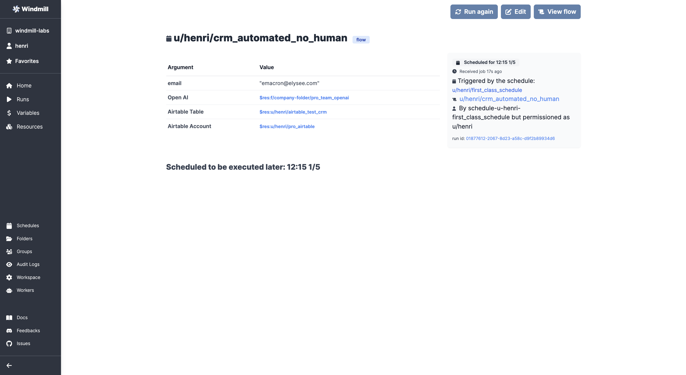
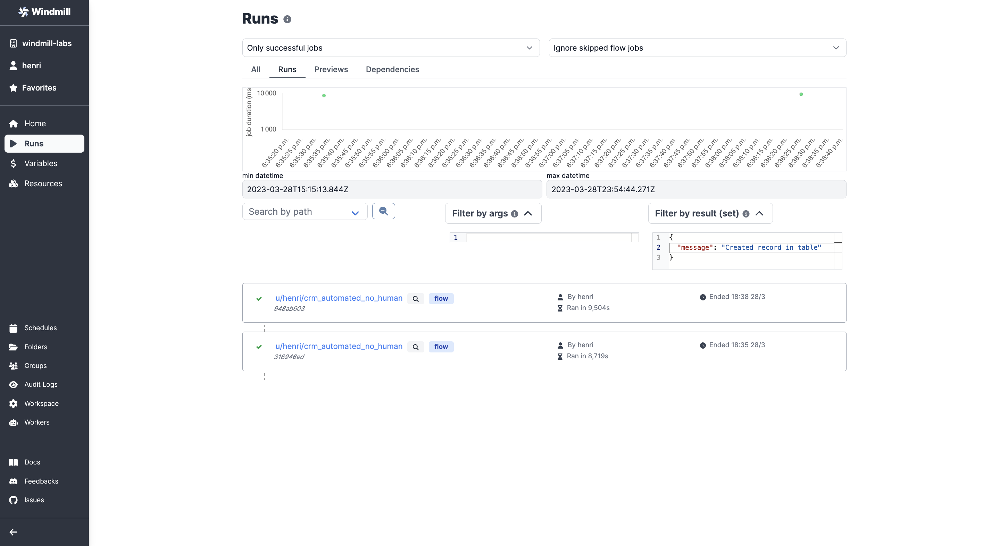

# Monitor Past and Future Runs

Each workspace has a dedicated Runs menu that allows you to visualise all past and future runs.

<video
    className="border-2 rounded-xl object-cover w-full h-full"
    autoPlay
    loop
    controls
    id="main-video"
    src="/videos/runs-menu.mp4"
/>

## Aggregated View

From the Runs menu, you have a time series where you can choose the time slot you want to monitor. The green (resp. red) dots being the tasks that succeeded (resp. failed). You can play with the level of details by picking "All", "Runs", "Previews" or "Dependecies".

## Details per Run

Each run on the menu is clickable. The run page allows you to visualize the state of the run, the inputs, reasons of success/failure etc.

View of a past run:

You can also have a view on runs that are [scheduled](../1_scheduling/index.md) from the run menu, with a view on arguments used and next trigger.

View of a scheduled run:

## Filters

There are multiple ways to filter the Runs menu:
- by Datetime
- Success / Failure
- Skipped / Not skipped
- Runs / Previews / Dependencies / Alls
- by [Path](../../reference/index.md#path)
- by Arguments
- by Result

Example of a few filters being used:

