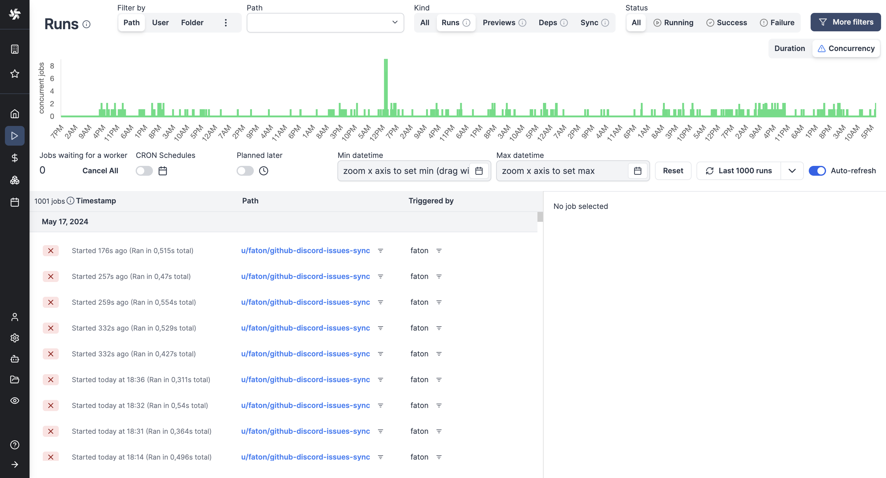

import DocCard from '@site/src/components/DocCard';

# Jobs runs

Each workspace has a dedicated Runs menu that allows you to visualise all past and future runs. In Windmill, each run is associated with a [job](../20_jobs/index.mdx).

<video
	className="border-2 rounded-lg object-cover w-full h-full dark:border-gray-800"
	autoPlay
	loop
	controls
	id="main-video"
	src="/videos/runs-menu.mp4"
/>

<br />

You might also be interested in Audit logs:

<div className="grid grid-cols-2 gap-6 mb-4">
	<DocCard
		title="Audit logs"
		description="Audit logs are another feature, available in the Cloud & Enterprise Self-Hosted only. They capture and record every operation and action with side-effects."
		href="/docs/core_concepts/audit_logs"
	/>
</div>

## Aggregated view

The Runs menu in each workspace provides a time series view where you can monitor different time slots.
The green (respectively, red) dots being the tasks that succeeded (respectively, failed).

You can filter the view per datetime, toggle "CRON schedules" to disable the display of past [scheduled](../1_scheduling/index.mdx) jobs and "Planned later" to disable the display of [schedules](../1_scheduling/index.mdx) planned for later.


> All past and future runs of the workspace are visible from the menu.

<br/>

The graph can represent jobs on their Duration (default) or by Concurrency, meaning the number of concurrent jobs at a given time.



> Graphical view by concurrent jobs.

## Details per run

Clicking on each run in the menu opens a run page where you can view the run's state, inputs, and success/failure reasons.


> View of a past run.

<br />

You can also view [scheduled](../1_scheduling/index.mdx) runs from the run menu, which provides information on the arguments used and the next trigger.

View of a scheduled run:


> Although scheduled scripts and flows are visible on their [dedicated tab](../1_scheduling/index.mdx), the run menu helps you see the next scheduled one.

## Filters

You can adjust the level of details by picking playing with filters on:

- **Datetime**
- **Metadata**: [Path](../16_roles_and_permissions/index.mdx#path) / [User](../16_roles_and_permissions/index.mdx#users) / [Folder](../8_groups_and_folders/index.mdx) / [Concurrency key](../21_concurrency_limits/index.md#custom-concurrency-key) / [Labels](#jobs-labels)
- **Kind**: All / Runs / Previews / Dependencies
- **Status**: All / Success / Failure
- **Skipped flows**
- **Arguments**
- **Results**

Example of filters in use:


> Here were filtered successful runs from August 2023 which returned `{"baseNumber": 11}`.

## Jobs labels

Labels allow to add static or dynamic tags to [jobs](../20_jobs/index.mdx) with property "wm_labels" followed by an array of strings.

```js
export async function main() {
  return {
    "wm_labels": ["showcase_labels", "another_label"]
  }
}
```

Jobs can be filtered by labels in the Runs menu to monitor specific groups of jobs.


## Invisible runs

When this option is enabled, manual executions of this script or flow are invisible to users other than the user running it, including the owner(s). This setting can be overridden when this script is run manually from the advanced menu.