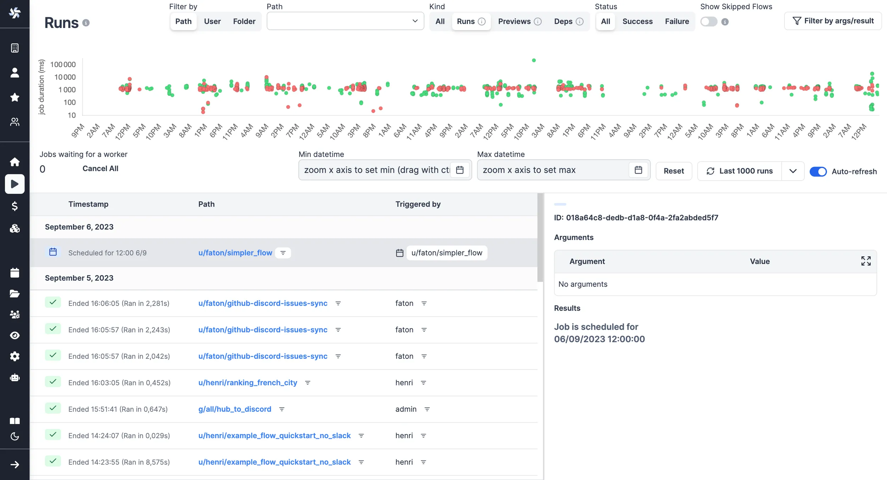

import DocCard from '@site/src/components/DocCard';

# Monitor Past and Future Runs

Each workspace has a dedicated Runs menu that allows you to visualise all past and future runs.

<video
	className="border-2 rounded-xl object-cover w-full h-full dark:border-gray-800"
	autoPlay
	loop
	controls
	id="main-video"
	src="/videos/runs-menu.mp4"
/>

 

You might also be interested in Audit Logs:

	<DocCard
		title="Audit Logs"
		description="Audit logs are another feature, available in the Cloud & Enterprise Self-Hosted only. They capture and record every operation and action with side-effects."
		href="/docs/core_concepts/audit_logs"
	/>

## Aggregated View

The Runs menu in each workspace provides a time series view where you can monitor different time slots.
The green (respectively, red) dots being the tasks that succeeded (respectively, failed).

> All past and future runs of the workspace are visible from the menu.

## Details per Run

Clicking on each run in the menu opens a run page where you can view the run's state, inputs, and success/failure reasons.

> View of a past run.

 

You can also view [scheduled](../1_scheduling/index.mdx) runs from the run menu, which provides information on the arguments used and the next trigger.

View of a scheduled run:

> Although scheduled scripts and flows are visible on their [dedicated tab](../1_scheduling/index.mdx), the run menu helps you see the next scheduled one.

## Filters

You can adjust the level of details by picking playing with filters on:

- **Datetime**
- **Metadata**: [Path](../16_roles_and_permissions/index.mdx#path) / User / Folder
- **Kind**: All / Runs / Previews / Dependencies
- **Status**: All / Success / Failure
- **Skipped flows**
- **Arguments**
- **Results**

Example of filters in use:

> Here were filtered successful runs from August 2023 which returned `{"baseNumber": 11}`.
