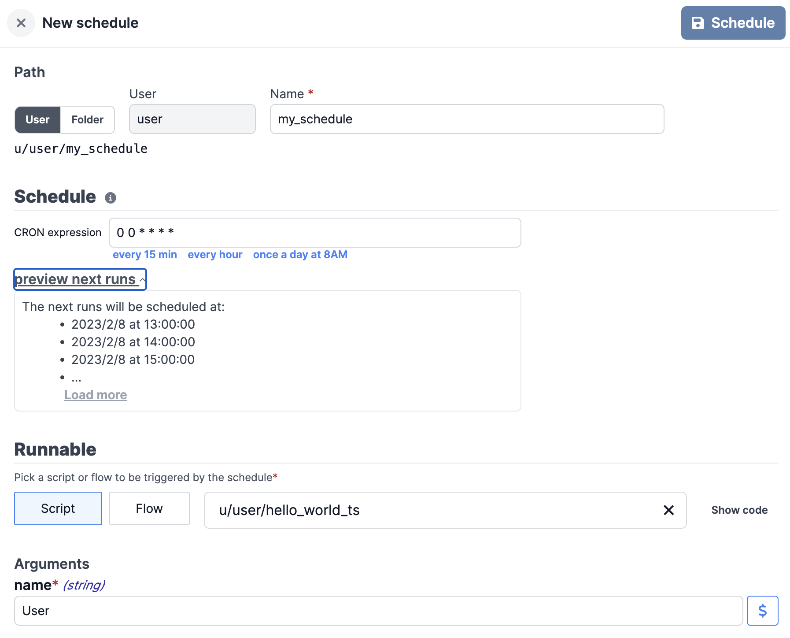
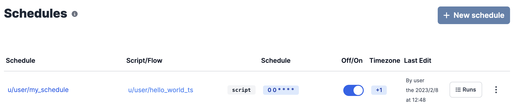
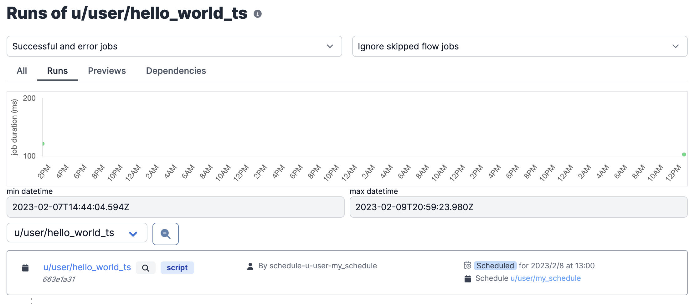

# Run on a Schedule

Windmill allows you to define Schedules for Scripts and Flows. Once a Schedule
is defined, it will automatically run the script at the set frequency. Think of
it as an easy-to-use CRON scheduler that you can share with other users.

A Schedule consists of a **Script or Flow**, its **arguments** and a **CRON
expression** that controls the execution frequency.

:::tip

If you're not experienced with CRON syntax make sure to use https://crontab.guru

:::

## Creating a Schedule

To create a Schedule, go to the [Schedules](https://app.windmill.dev/schedules)
page and click on **New schedule**.

## Toggling the Schedule

Schedules can also be disabled from the Schedules page. Once disabled, the
schedule will not run the script anymore and will clear any upcoming runs:

## Upcoming runs

Once a Schedule is defined and enabled, the next occurrence of the script will
be listed on the [Runs](https://app.windmill.dev/runs) page:

