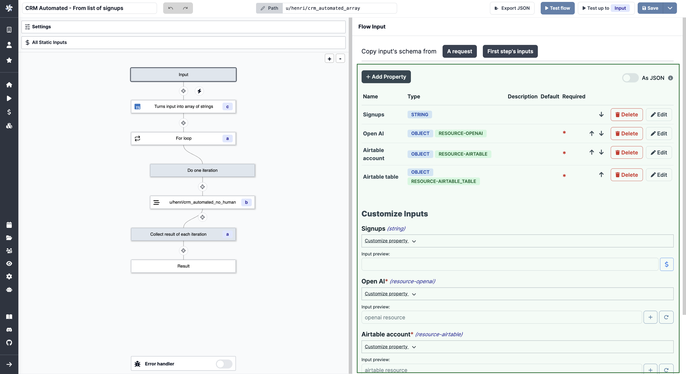

# Auto-Generated UIs

Windmill automatically generates UIs for scripts and flows from their parameters.

<video
    className="border-2 rounded-xl object-cover w-full h-full"
    autoPlay
    loop
    controls
    id="main-video"
    src="/videos/auto_generated_uis.mp4"
/>

 

:::info

If you're looking for a way to have customized UIs and interactions for your scripts and flows, look at Windmill's **[App editor](../../getting_started/7_apps_quickstart/index.md)**.

:::

By reading the main function parameters, Windmill generates the input specification of the script in the [JSON Schema](https://json-schema.org/) format. Windmill then renders the UI for the Script or Flow from that specification.

You do not need to deal with the JSON Schema directly associated with the Script or Flow directly. It is the result of the analysis of the script parameters of the main function and the UI customisation that you can optionaly do.

In the UI customisation interface, you may **refine all the information** that were not possible to infer directly from the parameters such as restricting a string to an enum, or precising that a list contains only numbers. You can also add helpful descriptions to each field.

:::tip

This feature can be used directly in the [script](../../getting_started/0_scripts_quickstart/1_typescript_quickstart/index.md) & [flow](../../getting_started/6_flows_quickstart/index.md) editors for testing your code.

 

<video
    className="border-2 rounded-xl object-cover w-full h-full"
    loop
    controls
    id="main-video"
    src="/videos/ui_from_script_editor.mp4"
/>

:::