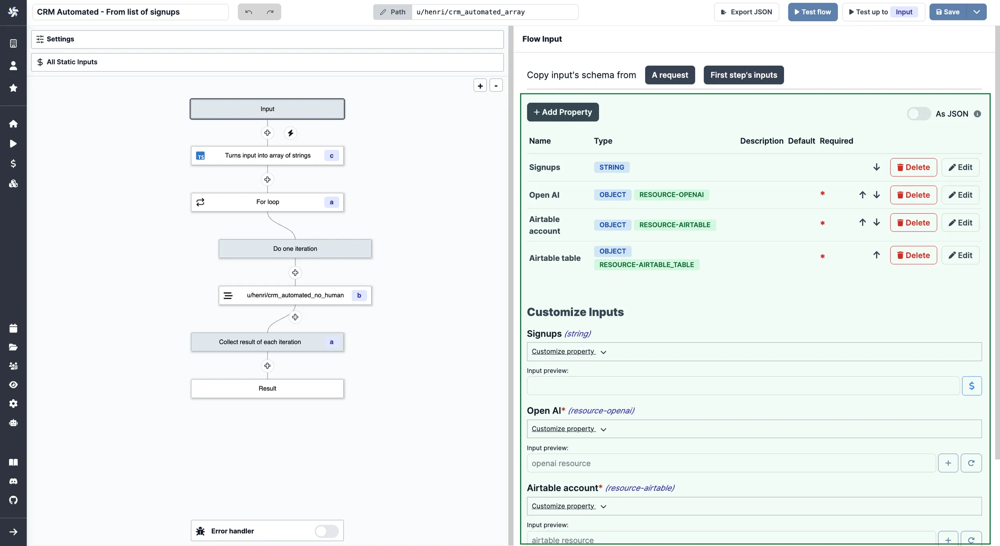

import DocCard from '@site/src/components/DocCard';

# Auto-Generated UIs

Windmill automatically generates user interfaces (UIs) for scripts and flows based on their parameters.

<video
    className="border-2 rounded-xl object-cover w-full h-full dark:border-gray-800"
    autoPlay
    controls
    id="main-video"
    src="/videos/auto_generated_uis.mp4"
/>

 

:::info Windmill App Editor

You might also be interested by Windmill's [App editor](../../getting_started/7_apps_quickstart/index.mdx), providing a comprehensive solution to customize UIs and interactions for your scripts and flows.

:::

By analyzing the parameters of the main function, Windmill generates an input specification for the script or flow in the [JSON Schema](../13_json_schema_and_parsing/index.md) format. Windmill then renders the UI for the Script or Flow from that specification.

You don't need to directly interact with the JSON Schema associated with the Script or Flow. It is the result of the analysis of the script parameters of the main function and the optional UI customization.

In the [UI customization interface](../../script_editor/customize_ui.mdx), you can refine information that couldn't be inferred directly from the parameters, such as specifying string enums or restricting lists to numbers. You can also add helpful descriptions to each field.

	<DocCard
		title="Customize UI"
		description="Some arguments' types can be given advanced settings that will affect the inputs' auto-generated UI and JSON Schema."
		href="/docs/script_editor/customize_ui"
	/>

## Test code

This feature can be directly used in the [script](../../getting_started/0_scripts_quickstart/index.mdx) & [flow](../../getting_started/6_flows_quickstart/index.mdx) editors to [test your code](../23_instant_preview/index.mdx).

<video
    className="border-2 rounded-xl object-cover w-full h-full dark:border-gray-800"
    controls
    src="/videos/ui_from_script_editor.mp4"
/>

 

	<DocCard
    	title="Instant Preview & Testing"
    	description="Windmill allows users to see and test what they are building directly from the editor, even before deployment."
    	href="/docs/core_concepts/instant_preview"
    />

## Build App

You can generate a dedicated [app](../../apps/0_app_editor/index.mdx) to execute your script or flow.

<video
    className="border-2 rounded-xl object-cover w-full h-full dark:border-gray-800"
    controls
    src="/videos/cowsay_app.mp4"
/>

 

This is the recommend way to share scripts and flows with [operators](../16_roles_and_permissions/index.mdx), with the second option being of sharing the script and [variables](../2_variables_and_secrets/index.mdx) it depends on (but operators won't be able to load variable directly from the UI/api, only use them within the scripts they have access to).

The apps will be permissioned on behalf of the [admin/author](../16_roles_and_permissions/index.mdx), the user is still identified at the time of execution from the [Runs](../5_monitor_past_and_future_runs/index.mdx) and [Audit Logs](../14_audit_logs/index.mdx) menus.

> View from the [Runs](../5_monitor_past_and_future_runs/index.mdx) menu.

 

At last, this is an easy way to get an app for your scripts and flows to be customized with [Styling](../../apps/4_app_configuration_settings/4_app_styling.mdx) and [Components](../../apps/4_app_configuration_settings/1_app_component_library.mdx).

	<DocCard
    	title="Instant Preview & Testing"
    	description="Windmill allows users to see and test what they are building directly from the editor, even before deployment."
    	href="/docs/core_concepts/instant_preview"
    />

