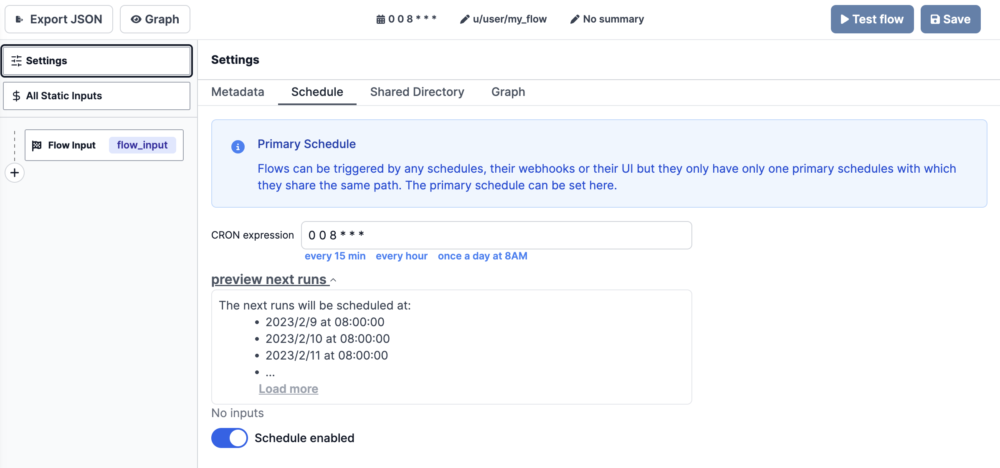

# Trigger Flows

There are two ways to trigger a Windmill Flow: by a [Schedule](../5_schedules/)
or by direct trigger. Direct triggering can be done through the Windmill UI or
the [Webhook](../4_webhooks/index.md) of the Flow.

## Scheduled

The first module - first step in other words - of this type of Flow is a
**Trigger Script** whose purpose is to pull data from an external source and
return all of the new items since the last run. This type of Flow is meant to be
scheduled regularly to reduce latency when reacting to new events. It will
trigger the rest of the Flow once per new item that is returned. If there are no
new items, the flow will be skipped.

:::tip

Think of this as someone who checks the mailbox every day. If there is a new
letter, they will continue to process it - open and read it - and if there is no
new letter, they won't do anything.

The key part is that opened letters are not placed back in the mailbox. In
Windmill, a **Trigger Script** has the job to keep track of what's processed and
what's not.

:::

Flows can be scheduled through the Flow UI using a CRON expression and then
activating the schedule as seen in the image below.


The following TypeScript code is an example of the first module of a Flow that
checks for new documents in a MongoDB collection on a regular schedule. In this
case we query documents that were created after a specific time, expressed with
a timestamp. The timestamp is stored with the help of Windmill's built-in
[state functions](../../reference/index.md#state--internal-state) and is updated
in each run.

```ts
import {
  getState,
  type Resource,
  setState,
} from "https://deno.land/x/windmill/mod.ts";
import { MongoClient, ObjectId } from "https://deno.land/x/atlas_sdk/mod.ts";

export async function main(
  auth: Resource<"mongodb_rest">,
  data_source: string,
  database: string,
  collection: string,
) {
  const client = new MongoClient({
    endpoint: auth.endpoint,
    dataSource: data_source,
    auth: { apiKey: auth.api_key },
  });
  const documents = client.database(database).collection(collection);
  const lastCheck = await getState() || 0;
  await setState(Date.now() / 1000);
  const id = ObjectId.createFromTime(lastCheck);
  return await documents.find({ "_id": { "$gt": id } });
}
```

:::tip

You can find this exact Trigger Script on
[Windmill Hub](https://hub.windmill.dev/scripts/mongodb/1462/get-recently-inserted-documents-mongodb),
or many more examples [here](https://hub.windmill.dev/triggers).

:::

## Triggered

A Flow can start with a
[Trigger Script](../../reference/index.md#trigger-scripts), which determines
whether the remainder of the Flow will be executed.

The first module of this type of Flow is a Script who's purpose is to run when
it receives an input from it's associated webhook or when it is run manually
through the Flow's automatically generated UI.

Webhooks can be retrieved from the "Details" page of a Flow as seen in the image
below.


:::tip

You can find examples of how to start a FLow using curl below the webhooks.

:::
