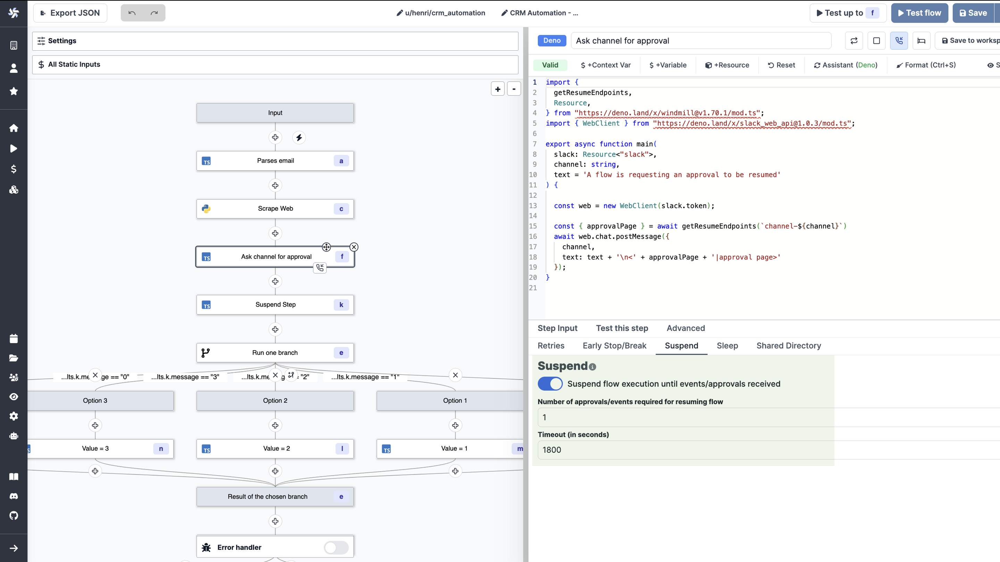
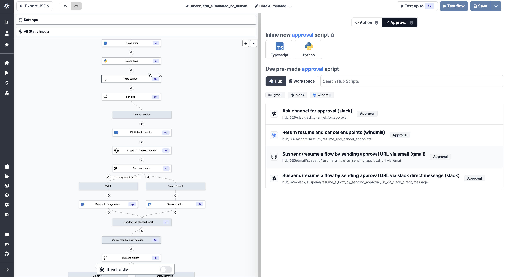
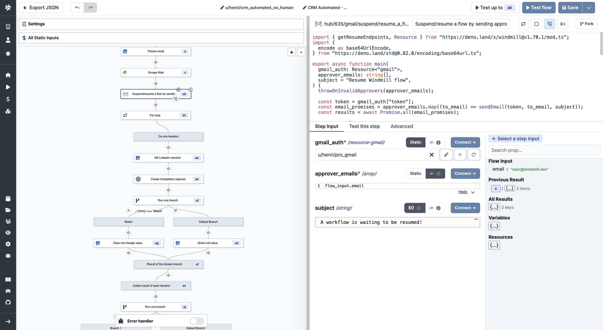
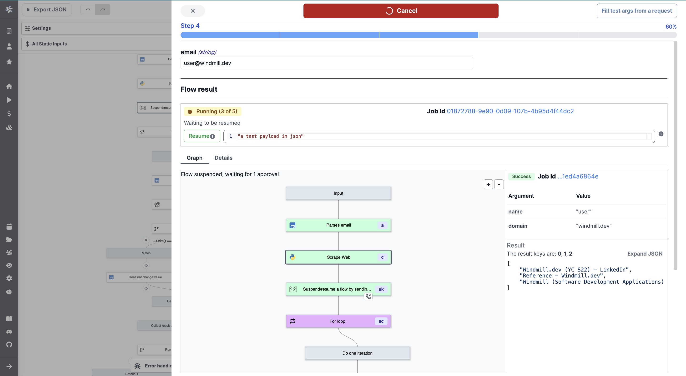
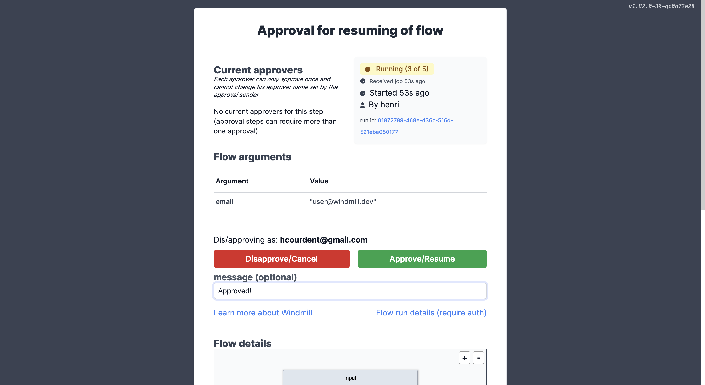
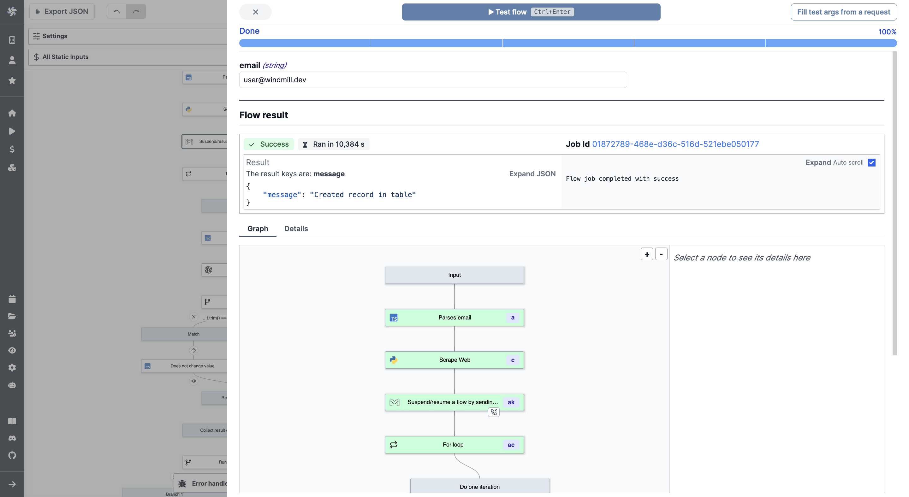

# Suspend and Resume

Flows can be suspended until resumed or cancelled event(s) are received. This
feature is most useful to implement approval steps but can be used for other
purposes as well.

:::tip

You can find ready-to-use [Approval Scripts](https://hub.windmill.dev/approvals)
on Windmill Hub. For example:

- [Suspend/resume a Flow by sending approval URL via email](https://hub.windmill.dev/scripts/gmail/1397/suspend%2Fresume-a-flow-by-sending-approval-url-via-email-gmail).
- [Ask channel for approval](https://hub.windmill.dev/scripts/slack/1503/ask-channel-for-approval-slack).

:::

## Add Approval Script

You can think of a scenario where only specific people can resume or cancel a
Flow. To achieve this they would need to receive a personalized URL via some
external communication channel (like e-mail, SMS or chat message).

Important thing to remember is that **the number of required approvals can be
customized**. This allows some flexibility for cases where you either require
approvals from all authorized people or only from one.

## Example with Gmail

### Add Gmail Resource

Lets start with adding a Gmail Resource. On the
[Resources](https://app.windmill.dev/resources) page, click "Add a
resource/API", select the `gmail` OAuth API and click "Sign in with Google".

:::info

As Google is an OAuth provider, you will be redirected to select your Google
account. To make the Approval Script work, you need to sign in and allow
Windmill to send e-mails on your behalf.

:::

### Reusing Script from Windmill Hub

Let's create a Flow as described in the
[getting started](../../getting_started/6_flows_quickstart/index.md) section.
Our first step will be an **Approval Script** from
[Windmill Hub](https://hub.windmill.dev), so click the `+` sign in the left pane
and select "Approval (Script)".

Once the step is added, you'll be presented with some pre-made Scripts from the
Hub. Select the one named "Suspend/resume a flow by sending approval URL via
email (gmail)".

Make sure to fill required fields: for `gmail_auth`, select your newly added
Gmail resource and define email addresses in the `approver_emails` input.

### Run the Flow

For the sake of this example let's add a "dummy" Script as a second step in our
Flow.

The Flow is now ready for testing, let's click "Test flow" in the top-right
corner.

You can notice that after the first step, the Flow is suspended and is waiting
for approval. An e-mail should have been sent to the email addresses you
specified. It contains a link to a webpage that looks like the following:

Let's approve and resume the Flow and see that it has successfully ran the
second step as well.

