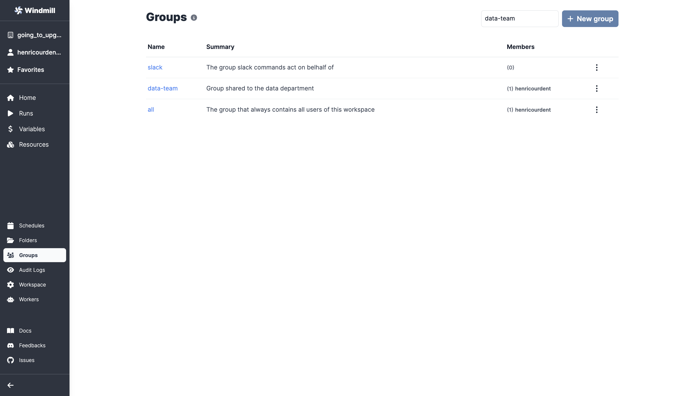
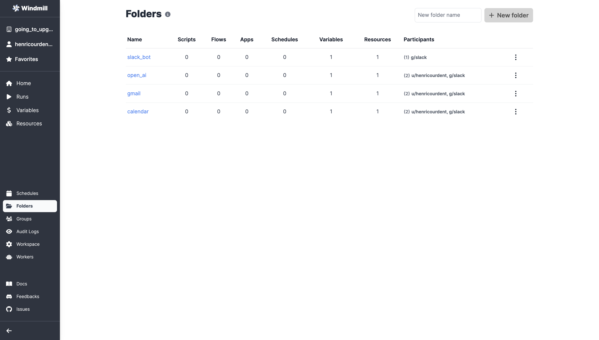
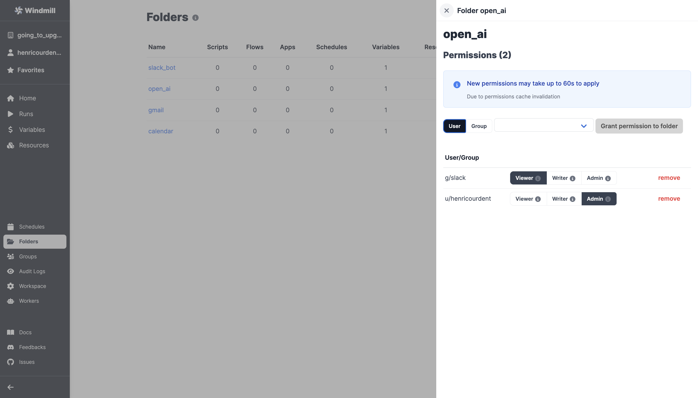

# Groups and Folders

Groups and folders are made to split and share permissions within workspace.

## Groups

Groups are **users** classed together. Users within a same group (you can also call it role) will have homogenous permissions. Same users can be in multiple groups at the same time.

As for users, groups can be given 3 levels of permission for a given item:
- Viewer: read-only access.
- Writer: read and write access.
- Admin: read and write access, and can manage permissions and new admins.

## Folders

Folders allow to group **items** such as scripts/flows/resources/schedule together and to grant homogenous (Role-based access control) permissions to groups and individual users towards them.

## Groups and Folders together

Groups can be part of folders, not the other way around.

It means that if you want to allow a team to use a given resource, you can save it in a folder, and either add each member of the team as a user in the folder, or add a group containing the whole team to the folder.

:::tip Example

For example, you [build a Slackbot](https://www.windmill.dev/blog/handler-slack-commands) and want it to use manipulate some resources. Then you should add the group "slack" (automatically created once you [configured Slack on Windmill](../../integrations/slack.md) to the given resource).

 

:::