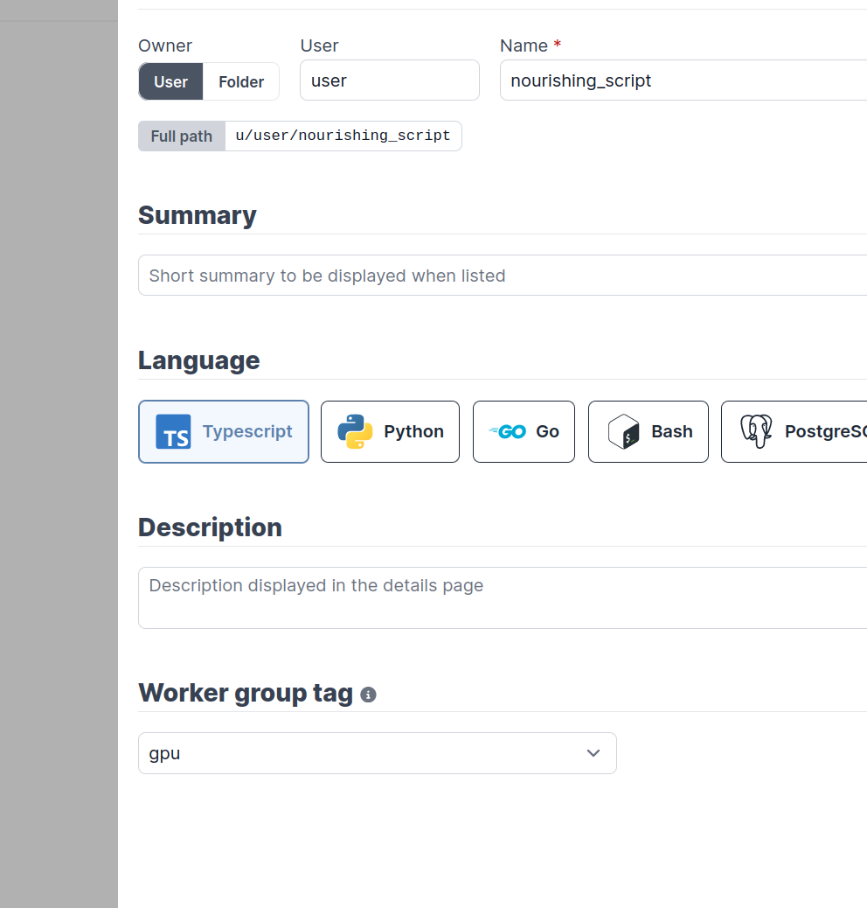
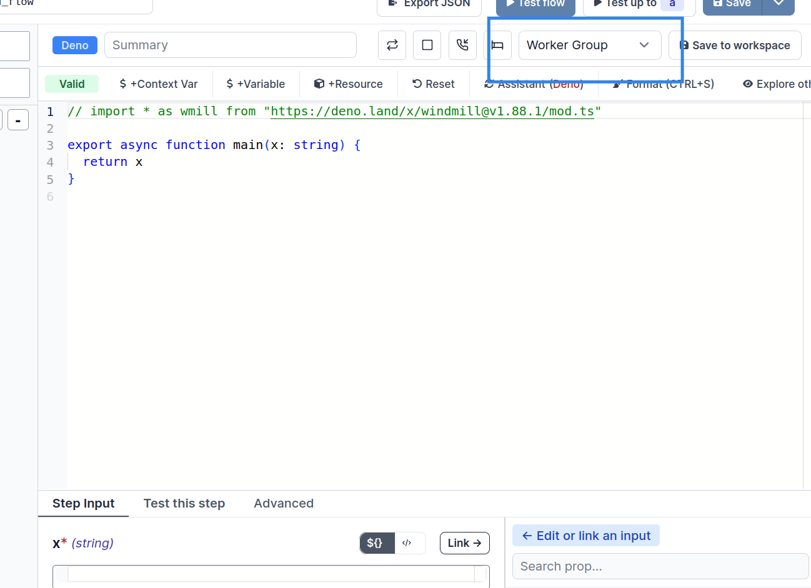
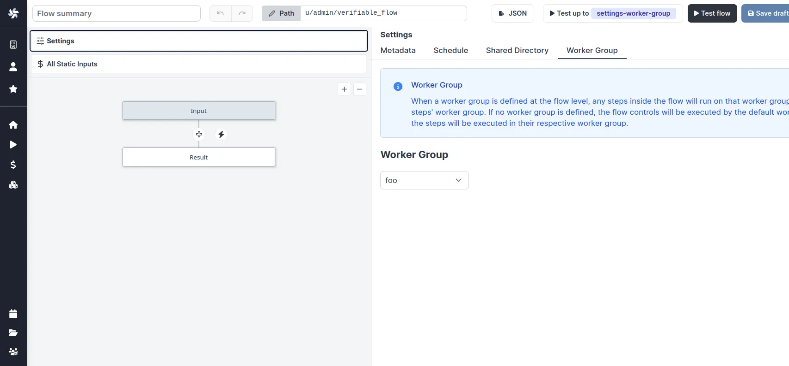

import DocCard from '@site/src/components/DocCard';

# Workers and worker groups

Workers are autonomous processes that run one script at a time using the entire cpu and memory available
to them. They are at the basis of [Windmill's architecture](../../misc/10_architecture/index.md) as run the jobs.
The number of workers can be horizontally scaled up or down depending on needs without any overhead.
Each worker on Windmill can run up to 26 million jobs a month, where each job lasts approximately 100ms.

Workers pull [jobs](../20_jobs/index.mdx) from the queue of jobs in the order of their
`scheduled_for` datetime as long as it is in the past. As soon as a worker pulls
a job, it atomically sets its state to "running", runs it, streams its logs then
once it is finished, the final result and logs are stored for as long as the retention period allows. Logs are optionally stored to S3.

By default, every worker is the same and interchangeable. However, there are often needs to assign jobs to a specific worker pool, and to configure this worker pool to behave specifically or have different pre-installed binaries. To that end, we introduce the concept of "worker groups".

You can assign groups to flows and flow steps to be executed on specific queues. The name of those queues are called tags. Worker groups listen to those tags.


In the [Community Edition](/pricing), worker management is done using tags that can be respectively assigned to workers (through the [env variable](#how-to-assign-worker-tags-to-a-worker-group) `WORKER_TAGS`) and scripts or flows, so that the workers listen to specific jobs queues.

<div className="grid grid-cols-2 gap-6 mb-4">
	<DocCard
		title="Set tags to assign specific queues"
		description="You can assign groups to flows and flow steps to be executed on specific queues."
		href="#set-tags-to-assign-specific-queues"
	/>
</div>

<br />

In the [Cloud plans & Self-Hosted Enterprise Edition](/pricing), workers can be commonly managed based on the group they are in, from the UI. Specifically, you can group the workers into worker groups, groups for which you can manage the tags they listen to, assignment to a single script, or the worker init scripts, from the UI.

<div className="grid grid-cols-2 gap-6 mb-4">
	<DocCard
		title="Create worker group config"
		description="workers can be commonly managed based on the group they are in, from the UI."
		href="#create-worker-group-config"
	/>
</div>

<br />

Examples of configurations include:

1. [Assign different jobs to specific worker groups](#set-tags-to-assign-specific-queues) by giving them tags.
2. [Set an init or periodic script](#worker-scripts) that will run at the start of the workers or periodically (e.g. to pre-install binaries).
3. [Dedicate your worker to a specific script or flow](#dedicated-workers--high-throughput) for high throughput.

## Assign custom worker groups

Assign custom worker groups to scripts and flows in Windmill for efficient execution on different machines with varying specifications.

This feature is useful if you want to run some scripts on a GPU machine, or if you want to run some scripts on high-memory machine.

### How to have a worker join a worker group

<iframe
	style={{ aspectRatio: '16/9' }}
	src="https://www.youtube.com/embed/LbjgWKFQWJc"
	title="YouTube video player"
	frameBorder="0"
	allow="accelerometer; autoplay; clipboard-write; encrypted-media; gyroscope; picture-in-picture; web-share"
	allowFullScreen
	className="border-2 rounded-lg object-cover w-full dark:border-gray-800"
></iframe>

<br />

Create a worker group in your [docker-compose.yml](https://github.com/windmill-labs/windmill/blob/main/docker-compose.yml) and simply pass the worker group as the env variable `WORKER_GROUP=<name_of_worker_group>` for it to automatically join its corresponding worker group.

Windmill's responsibility is not to spawn the worker itself but to play well with existing service orchestrator such as Kubernetes, ECS, Nomad or Docker Compose, and any IaC. In those, you define the number of replicas (which can be auto-scaled up or down), the resource to allocate to those workers and the `WORKER_GROUP` passed as env.

Upon start, those workers will automatically join their worker group and fetch their configurations (including init scripts). They will also listen for changes on the worker group configuration for hot reloading.

Here is an example of a worker group specification in [docker-compose](https://github.com/windmill-labs/windmill/blob/main/docker-compose.yml):

```yaml
windmill_worker_highmem:
  image: ghcr.io/windmill-labs/windmill-ee:main
  pull_policy: always
  deploy:
    replicas: 2
    resources:
      limits:
        cpus: '1'
        memory: 4096M
  restart: unless-stopped
  environment:
    - DATABASE_URL=${DATABASE_URL}
    - MODE=worker
    - WORKER_GROUP=highmem
```

Assign replicas, resource constraints, and that's it, the worker will automatically join the worker group on start and be displayed on the Workers page in the Windmill app!

Worker only require a database URL and can thus be spawned in separate VPCs if needed (as long as there is a tunnel to the database). There is also an agent mode for situations where workers are running in an untrusted environment.

### Set tags to assign specific queues

You can assign groups to flows and flow steps to be executed on specific queues. The name of those queues are called tags. Worker groups listen to those tags.


<br />

There are 2 worker groups by default: [default](#default-worker-group) and [native](#native-worker-group).

#### Default worker group

The tags of _default_ worker group are:

- `deno`: The default worker group for [Deno scripts](../../getting_started/0_scripts_quickstart/1_typescript_quickstart/index.mdx).
- `python3`: The default worker group for [Python scripts](../../getting_started/0_scripts_quickstart/2_python_quickstart/index.mdx).
- `go`: The default worker group for [Go scripts](../../getting_started/0_scripts_quickstart/3_go_quickstart/index.mdx).
- `bash`: The default worker group for [Bash scripts](../../getting_started/0_scripts_quickstart/4_bash_quickstart/index.mdx).
- `powershell`: The default worker group for [Powershell scripts](../../getting_started/0_scripts_quickstart/4_bash_quickstart/index.mdx).
- `dependency`: Where [dependency](../../advanced/6_imports/index.mdx) jobs are run.
- `flow`: The default worker group for executing [flows](../../flows/1_flow_editor.mdx) modules outside of the script steps.
- `hub`: The default worker group for executing [Hub](https://hub.windmill.dev/) scripts.
- `bun`: The default worker group for [Bun](../../getting_started/0_scripts_quickstart/1_typescript_quickstart/index.mdx) scripts.
- `php`: The default worker group for [PHP](../../getting_started/0_scripts_quickstart/8_php_quickstart/index.mdx) scripts.
- `rust`: The default worker group for [Rust](../../getting_started/0_scripts_quickstart/9_rust_quickstart/index.mdx) scripts.
- `ansible`: The default worker group for [Ansible](../../getting_started/0_scripts_quickstart/10_ansible_quickstart/index.mdx) scripts.
- `csharp`: The default worker group for [C#](../../getting_started/0_scripts_quickstart/11_csharp_quickstart/index.mdx) scripts.
- `java`: The default worker group for [Java](../../getting_started/0_scripts_quickstart/13_java_quickstart/index.mdx) scripts.
- `nu`: The default worker group for [Nu scripts](../../getting_started/0_scripts_quickstart/4_bash_quickstart/index.mdx#nu).
- `ruby`: The default worker group for [Ruby](../../getting_started/0_scripts_quickstart/14_ruby_quickstart/index.mdx) scripts.
- `other`: Everything else (other than the [native](#native-worker-group) tags).

#### Native worker group

Native workers are workers within the _native_ worker group.
This group is pre-configured to listen to native jobs tags. Those jobs are executed under a special mode with subworkers for increased throughput.

You can set the number of native workers to 0. Just make sure that you assign the native tags to other worker groups. Otherwise, the jobs with those tags will never be executed.

The tags of _native_ worker group are:

- `nativets`: The default worker group for [Rest](../../getting_started/0_scripts_quickstart/6_rest_grapqhql_quickstart/index.mdx) scripts.
- `postgresql`: The default worker group for [PostgreSQL](../../getting_started/0_scripts_quickstart/5_sql_quickstart/index.mdx) scripts.
- `mysql`: The default worker group for [MySQL](../../getting_started/0_scripts_quickstart/5_sql_quickstart/index.mdx) scripts.
- `mssql`: The default worker group for [MS SQL](../../getting_started/0_scripts_quickstart/5_sql_quickstart/index.mdx) scripts.
- `graphql`: The default worker group for [Graphql](../../getting_started/0_scripts_quickstart/5_sql_quickstart/index.mdx) scripts.
- `snowflake`: The default worker group for [Snowflake](../../getting_started/0_scripts_quickstart/5_sql_quickstart/index.mdx) scripts.
- `bigquery`: The default worker group for [Bigquery](../../getting_started/0_scripts_quickstart/5_sql_quickstart/index.mdx) scripts.

<br />
<br />

If you assign custom worker groups to all your workers, make sure that they cover all tags above, otherwise those jobs will never be executed.

Button `Reset to native tags` will reset the tags of [_native_](#native-worker-group) worker group to a given worker group.

Button `Reset to all tags` will reset the tags of [_default_](#default-worker-group) and [_native_](#native-worker-group) worker group to a given worker group.

Button `Reset to all tags minus native ones` will reset the tags of [_default_](#default-worker-group) worker group to a given worker group.


To make custom tags available from the UI, go to the dedicated "Workers" tab on the workspace and click on the "Assignable Tags" button:


#### Restrict tags to specific workspaces

It is possible to restrict some tags to specific workspace using the following syntax:

```
gpu(workspace+workspace2)
```

Only 'workspace' and 'workspace2' will be able to use the `gpu` tags.

Jobs within a same job queue can be given a [priority](../20_jobs/index.mdx#high-priority-jobs) between 1 and 100. Jobs with a higher priority value will be given precedence over jobs with a lower priority value in the job queue.

### How to assign worker tags to a worker group

Use the edit/create config next to the worker group name in Windmill UI:


**Note**: The worker group management UI is a [Cloud plans & Self-Hosted Enterprise Edition](/pricing) feature. It is still possible to use worker groups with the community edition by passing to each worker the env variable `WORKER_TAGS`:

```
WORKER_TAGS=tag1,tag2
```

### How to assign a custom worker group to a script or flow

For scripts deployed on the script editor, select the corresponding worker group tag in the settings section.



For scripts inlined in the flow editor, select it in the module header:



If no worker group is assigned to a script, it will be assigned the default worker group for its language.

You can assign a worker group to an entire flow in the flow's settings:



### Dynamic tag

If a workspace tag contains the substring `$workspace`, it will be replaced by the workspace id corresponding to the job. This is especially useful to have the same script deployed to different workspace and have them run on different workers.

With the following assignable tag:

```
normal-$workspace
```

the workspaces, `dev`, `staging`, `prod` and the worker groups: `normal-dev`, `normal-staging`, `normal-prod`. The same script wih the tag `normal-$workspace` will run on the corresponding worker group depending on the workspace it is deployed to. This enable to share the same control plane but use workers with different network restrictions for tighter security.

Last, if the tags contain `$args[argName]` (e.g: `foo-$args[foobar])` then the tag will be replaced by the string value at the arg key `argName` and thus can be fully dynamic.

See [Deploy to staging prod](../12_staging_prod/index.md) to see a full UI flow to deploy to staging and prod.

## Alerts

You can set an alert to receive notification via Email, Slack, or Microsoft Teams when the number of running workers in a group falls below a given number. It's available in the worker group config.


Enable 'Send an alert when the number of alive workers falls below a given threshold', and enter a number of workers below which the notification will be sent.

You need to configure [Critical alert channels](../37_critical_alerts/index.mdx) to receive notifications.


<div className="grid grid-cols-2 gap-6 mb-4">
	<DocCard
		title="Critical alerts"
		description="Get a notification for critical events such as everytime a job is re-run after a crash."
		href="/docs/core_concepts/critical_alerts"
	/>
</div>

## Create worker group config


<br />

In the [Cloud plans & Self-Hosted Enterprise Edition](/pricing), workers can be commonly managed based on the group they are in, from the UI. Specifically, you can group the workers into worker groups, groups for which you can manage the tags they listen to (queue), assignment to a single script, or the worker init scripts, from the UI.

> In [Community Edition](/pricing) Workers can still have their WORKER_TAGS passed as env.

<br />

Pick "New worker group config" and just write the name of your worker group.


You can then configure it directly from the UI.


<br />

Examples of configurations include:

1. [Assign different jobs to specific worker groups](#set-tags-to-assign-specific-queues) by giving them tags.
2. [Set an init or periodic script](#worker-scripts) that will run at the start of the workers or periodically (e.g. to pre-install binaries).
3. [Dedicate your worker to a specific script or flow](#dedicated-workers--high-throughput) for high throughput.


## Alerts

You can set an alert to receive notification via Email, Slack, or Microsoft Teams when the number of running workers in a group falls below a given number. It's available in the worker group config.


Enable 'Send an alert when the number of alive workers falls below a given threshold', and enter a number of workers below which the notification will be sent.

You need to configure [Critical alert channels](../37_critical_alerts/index.mdx) to receive notifications.


<div className="grid grid-cols-2 gap-6 mb-4">
	<DocCard
		title="Critical alerts"
		description="Get a notification everytime a job is re-run after a crash."
		href="/docs/core_concepts/critical_alerts"
	/>
</div>

## Python runtime settings

Add Python runtime specific settings like additional Python paths and PIP local dependencies.


<div className="grid grid-cols-2 gap-6 mb-4">
	<DocCard
		title="Dependencies in Python"
		description="How to manage dependencies in Python scripts."
		href="/docs/advanced/dependencies_in_python"
	/>
</div>

## Environment variables passed to jobs

Add static and dynamic environment variables that will be passed to jobs handled by this worker group. Dynamic environment variable values will be loaded from the worker host environment variables while static environment variables will be set directly from their values below.


<div className="grid grid-cols-2 gap-6 mb-4">
	<DocCard
		title="Environment variables"
		description="Environment variables are used to configure the behavior of scripts and services, allowing for dynamic and flexible execution across different environments."
		href="/docs/core_concepts/environment_variables"
	/>
</div>

## Autoscaling

[Autoscaling](../42_autoscaling/index.mdx) automatically adjusts the number of workers based on your workload demands.

Autoscaling is available in the [Enterprise plan](/pricing).

<div className="grid grid-cols-2 gap-6 mb-4">
	<DocCard
		title="Autoscaling"
		description="Autoscaling automatically adjusts the number of workers based on your workload demands."
		href="/docs/core_concepts/autoscaling"
	/>
	<DocCard
		title="Scaling workers"
		description="Interactive simulator and guide for sizing your worker pool."
		href="/docs/advanced/scaling"
	/>
</div>

## Worker scripts

Worker scripts provide methods to run bash scripts on workers at different stages of the worker lifecycle. There are two types of worker scripts: init scripts that run once at worker startup, and periodic scripts that run at regular intervals for ongoing maintenance.

Under the [Cloud plans & Self-Hosted Enterprise Edition](/pricing), both types of worker scripts can be configured from the Windmill UI in the worker group settings.

When adjustments are made in the Worker Management UI, the workers will shut down and are expected to be restarted by their supervisor (Docker or k8s).

### Init scripts

[Init scripts](../../advanced/8_preinstall_binaries/index.mdx#init-scripts) provide a method to pre-install binaries or set initial configurations without the need to modify the base image. This approach offers added convenience. Init scripts are executed at the beginning when the worker starts, ensuring that any necessary binaries or configurations are set up before the worker undertakes any other job.

<div style={{ display: 'flex', justifyContent: 'center', alignItems: 'center', height: '100%' }}>
	
</div>

<br />

The execution of init scripts is inspectable in the superadmin workspace, with Kind = All filter. The path of those executions are `init_script_{worker_name}`.

### Periodic scripts

Periodic scripts are bash scripts that run at regular intervals on workers, designed for ongoing maintenance tasks that need to be executed repeatedly during the worker's lifetime, with the **minimum interval settable between periodic script executions being 60 seconds**.


The execution of periodic scripts is inspectable in the superadmin workspace, with Kind = All filter. The path of those executions are `periodic_script_{worker_name}_{timestamp}`.

## Worker scripts

Worker scripts are bash scripts that run at regular intervals on workers, complementing init scripts which only run at worker startup. While init scripts handle one-time setup tasks like installing dependencies or configuring the environment, worker scripts are designed for ongoing maintenance tasks that need to be executed repeatedly during the worker's lifetime.

### Key differences from init scripts

- **Init scripts**: Run once when the worker starts, ideal for setup and configuration tasks
- **Worker scripts**: Run continuously at specified intervals (minimum 60 seconds), ideal for maintenance and monitoring tasks

### Common use cases

Worker scripts are particularly useful for:

- **System maintenance**: Cleaning temporary files, rotating logs, or performing health checks
- **Cache management**: Clearing expired cache entries or warming up caches  
- **Resource monitoring**: Collecting metrics or monitoring system resources
- **Security tasks**: Running periodic security scans or updating security configurations

### Configuration and execution

Under the [Cloud plans & Self-Hosted Enterprise Edition](/pricing), worker scripts can be configured from the Windmill UI in the worker group settings, similar to init scripts.

When adjustments are made in the Worker Management UI, the workers will shut down and are expected to be restarted by their supervisor (Docker or k8s).

The execution of worker scripts is inspectable in the superadmin workspace, with Kind = All filter. The path of those executions are `periodic_script_{worker_name}_{timestamp}`.

## Dedicated workers / High throughput

Dedicated Workers are workers that are dedicated to a particular script. They are able to execute any job that target this script much faster than normal workers at the expense of being capable to only execute that one script.
They are as fast as running the same logic in a forloop, but keep the benefit of showing separate jobs per execution.

Dedicated workers / High throughput is a [Cloud plans & Self-Hosted Enterprise Edition](/pricing) feature.


<div className="grid grid-cols-2 gap-6 mb-4">
	<DocCard
		title="Dedicated workers / High throughput"
		description="Dedicated Workers are workers that are dedicated to a particular script."
		href="/docs/core_concepts/dedicated_workers"
	/>
</div>

## Service logs

View logs from any workers or servers directly within the service logs section of the search modal.


<div className="grid grid-cols-2 gap-6 mb-4">
	<DocCard
		title="Service logs"
		description="View logs from any worker or servers directly within the service logs section of the search modal."
		href="/docs/core_concepts/service_logs"
	/>
</div>

## Interactive SSH REPL for worker host

Windmill includes a built-in interactive SSH-like REPL for each worker. This allows you to execute bash commands directly on the machine running the worker, making it significantly easier to debug, explore the filesystem, or run quick system-level commands.

### How to use

- Go to the **Workers** page in the Windmill.
- Find the worker you want to connect to in the table.
- Click the **Command** button in the "Live Shell" column.
- A drawer will open with an interactive bash shell.
- Type and run bash commands directly in the terminal.

> This feature is especially useful for debugging init scripts, verifying pre-installed binaries, inspecting the file system, or quickly running bash commands without needing to deploy a script.
<br />
**Note:**  
- Use `cd` to navigate directories — the REPL remembers your working directory across commands.  
- You can press `Ctrl+C` or use the **Cancel** button to stop a running job.  
- If no command has run in the past 2 minutes, the first one may take up to ~15 seconds to start.

## Queue metrics

You can visualize metrics for delayed jobs per tag and queue delay per tag.

Queue metrics is an [Enterprise Edition](/pricing) feature.

Metrics are available under "Queue metrics" button on the Workers page.

Only tags for jobs that have been delayed by more than 3 seconds in the last 14 days are included in the graph.


### Queue metric alerts

[Enterprise Edition](/pricing) users can set up [Critical alerts](../37_critical_alerts/index.mdx) on the [Queue Metrics page](#queue-metrics), and be notified when the number of delayed jobs in a queue is above a certain threshold for more than a configured amount of time. The "cooldown" parameter determines the minimum duration between two consecutive alerts if the number of waiting jobs are fluctuating around the configured threshold.


## Process isolation and security

Windmill workers provide multiple layers of process isolation to protect your infrastructure from potentially malicious or buggy code execution.

### Isolation mechanisms

Windmill supports two primary isolation mechanisms that can be used independently or together:

1. **PID namespace isolation** (enabled by default in docker-compose) - Protects process memory and environment variables
2. **NSJAIL sandboxing** (optional, requires special image) - Provides filesystem, network, and resource isolation

### Environment variables

Configure worker isolation through these environment variables:

| Variable | Default | Description |
|----------|---------|-------------|
| `ENABLE_UNSHARE_PID` | `false` (true in docker-compose) | Enable PID namespace isolation using Linux unshare |
| `DISABLE_NSJAIL` | `true` | Enable NSJAIL sandboxing (requires `-nsjail` image, set to `false` to enable) |
| `UNSHARE_ISOLATION_FLAGS` | `--user --map-root-user --pid --fork --mount-proc` | Customize unshare isolation flags |

### Default configuration

The official docker-compose enables PID namespace isolation by default:

```yaml
windmill_worker:
  environment:
    - DATABASE_URL=${DATABASE_URL}
    - MODE=worker
    - WORKER_GROUP=default
    - ENABLE_UNSHARE_PID=true # Enabled by default
```

PID namespace isolation prevents jobs from accessing parent process memory and environment variables, protecting sensitive credentials like `DATABASE_URL`.

For complete documentation on security isolation, see the [Security and Process Isolation](/docs/advanced/security_isolation) guide.

## Workers and compute units

Even though Windmill's architecture relies on workers, Windmill's [pricing](/pricing) is based on compute units. A compute unit corresponds to 2 worker-gb-month. For example, a worker with 2GB of memory limit (standard worker) counts as 1 compute unit. A worker with 4GB of memory counts as 2 compute units. On self-hosted plans, any worker with memory above 2GB counts as 2 compute units (16GB worker counts as 2 compute units). Each worker can run up to ~26M jobs per month (at 100ms per job).

The number of compute units will depend on the workload and the jobs Windmill will need to run. Each worker only executes one job at a time, by design to use the full resource of the worker. Workers come in different sizes based on memory: small (1GB), standard (2GB), and large (> 2GB). Each worker is extremely efficient to execute a job, and you can execute up to 26 million jobs per month per worker if each one lasts 100ms. However, it completely depends on the nature of the jobs, their number and duration.

As a note, keep in mind that the number of compute units considered is the number of production compute units of your workers, not of development staging, if you have separate instances. You can set staging instances as 'Non-prod' in the [Instance settings](../../advanced/18_instance_settings/index.mdx#non-prod-instance). The compute units are calculated based on the memory limits set in [docker-compose](https://github.com/windmill-labs/windmill/blob/main/docker-compose.yml) or in Kubernetes. For example, a standard worker with 2GB memory counts as 1 compute unit, while a large worker with >2GB memory counts as 2 compute units (on self-hosted plans, any worker with memory above 2GB still counts as 2 compute units Small workers are counted as 0.5 compute unit.

Also, for the [Enterprise Edition](/pricing), the free trial of one month is meant to help you evaluate your needs in practice.
