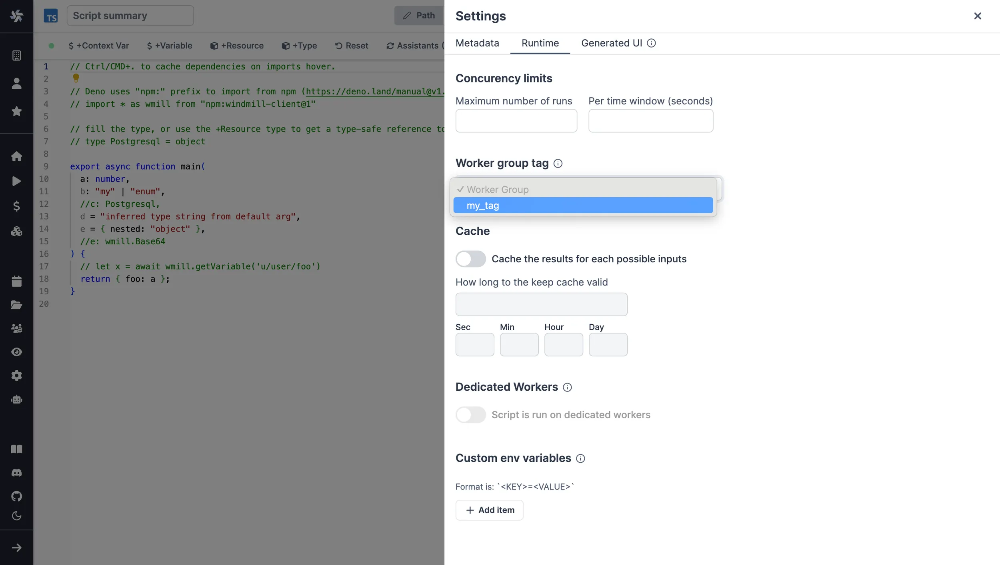

import DocCard from '@site/src/components/DocCard';

# Workers and Worker Groups

Workers are autonomous processes that run one script at a time using the full
machines resources available to them. They are at the basis of [Windmill's architecture](../../misc/10_architecture/index.md).

Workers pull [jobs](../20_jobs/index.md) from the queue of jobs in the order of their
`scheduled_for` datetime as long as it is in the past. As soon as a worker pulls
a job, it atomically sets its state to "running", runs it, streams its logs then
once it is complete, saves it back in the database as a "complete job". The
final result and logs are stored forever.

The number of workers can be horizontally scaled up or down depending on needs
without any overhead.

Each worker on Windmill can run up to 26 millions jobs a month, where each job lasts approximatively 100ms.

## Assign custom worker groups

Assign custom worker groups to scripts and flows in Windmill for efficient execution on different machines with varying specifications.

This feature is useful if you want to run some scripts on a GPU machine, or if you want to run some scripts on high-memory machine.

Individual scripts saved on a workspace and inline scripts of a flow can be assigned a custom worker group. By default, they are assigned the worker group corresponding to their respective programming languages.

Workers can belong to multiple worker groups simultaneously. The default worker groups a worker is part of are:

- `dependency`: Where dependency jobs are run.
- `deno`: The default worker group for deno scripts.
- `python3`: The default worker group for python scripts.
- `bash`: The default worker group for bash scripts.
- `go`: The default worker group for go scripts.
- `flow`: The default worker group for executing flows modules outside of the script steps.
- `hub`: The default worker group for executing hub scripts.

If you assign custom worker groups to all your workers, make sure that they cover all worker groups above, otherwise those jobs will never be executed.

To make custom tags available from the UI, go to the dedicated "Workers" tab on the workspace and click on the "Assignable Tags" button:


It is possible to restrict some tags to specific workspace using the following syntax:

```
gpu(workspace+workspace2)
```

Only 'workspace' and 'workspace2' will be able to use the `gpu` tags.

## How to have a worker join a worker group

Simply pass the worker group as the env variable `WORKER_GROUP`:

```
WORKER_GROUP=worker_group_name
```

The worker will automatically join the worker group on start and be displayed on the Workers page.

## How to assign worker tags to a worker group

Use the edit/create config next to the worker group name in windmill UI:


**Note**: The worker group management UI is an [enterprise only](../../misc/7_plans_details/index.mdx) feature. It is still possible to use worker groups with the community edition by passing to each worker the env variable `WORKER_TAGS`:

```
WORKER_TAGS=tag1,tag2
```

## How to assign a custom worker group to a script or flow

For scripts saved on the script editor, select the corresponding worker group tag in the metadata section.



For scripts inlined in the flow editor, select it in the module header:


If no worker group is assigned to a script, it will be assigned the default worker group for its language.

You can assign a worker group to an entire flow in the flow's settings:


## Dynamic tag

If a workspace tag contains the substring `$workspace`, it will be replaced by the workspace id corresponding to the job. This is especially useful to have the same script deployed to different workspace and have them run on different workers.

With the following assignable tag:

```
normal-$workspace
```

the workspaces, `dev`, `staging`, `prod` and the worker groups: `normal-dev`, `normal-staging`, `normal-prod`. The same script wih the tag `normal-$workspace` will run on the corresponding worker group depending on the workspace it is deployed to. This enable to share the same control plane but use workers with different network restrictions for tighter security.

See [Deploy to staging prod](../12_staging_prod/index.md) to see a full UI flow to deploy to staging and prod.

## Dedicated Workers / Native Performance

Dedicated Workers are workers that are dedicated to a particular script. They are able to execute any job that target this script much faster than normal workers at the expense of being capable to only execute that one script.
They are as fast as running the same logic in a forloop, but keep the benefit of showing separate jobs per execution.

Dedicated Workers / Native Performance is an [Enterprise & Team Edition](../../misc/7_plans_details/index.mdx) feature.

<div class="grid grid-cols-2 gap-6 mb-4">
	<DocCard
		title="Dedicated Workers / Native Performance"
		description="Dedicated Workers are workers that are dedicated to a particular script."
		href="/docs/core_concepts/dedicated_workers"
	/>
</div>
