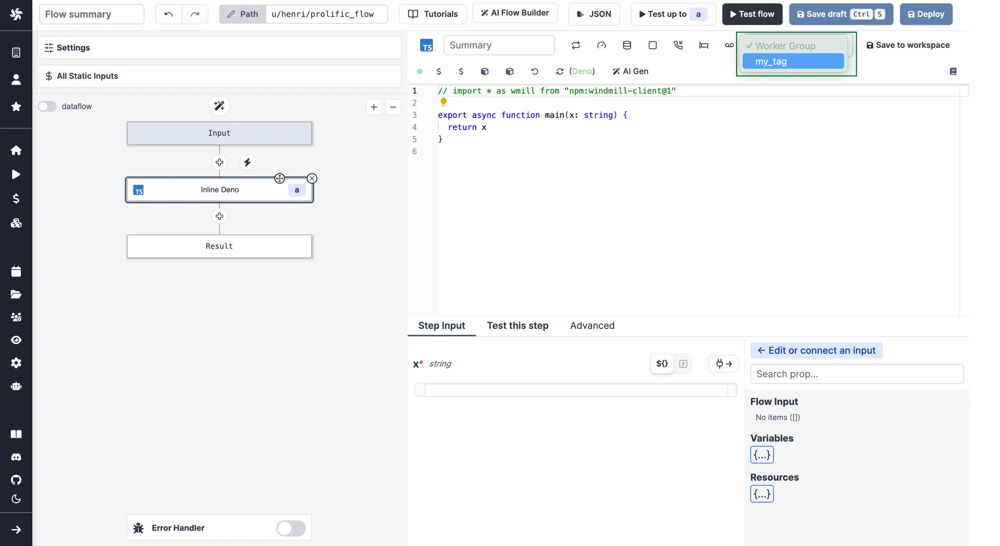

import DocCard from '@site/src/components/DocCard';

# Workers and Worker Groups

Workers are autonomous processes that run one script at a time using the entire cpu and memory available
to them. They are at the basis of [Windmill's architecture](../../misc/10_architecture/index.md) as run the jobs.
The number of workers can be horizontally scaled up or down depending on needs without any overhead.
Each worker on Windmill can run up to 26 million jobs a month, where each job lasts approximately 100ms.

Workers pull [jobs](../20_jobs/index.mdx) from the queue of jobs in the order of their
`scheduled_for` datetime as long as it is in the past. As soon as a worker pulls
a job, it atomically sets its state to "running", runs it, streams its logs then
once it is finished, the final result and logs are stored for as long as the retention period allows. Logs are optionally stored to S3.

By default, every worker is the same and interchangeable. However, there are often needs to assign jobs to a specific worker pool, and to configure this worker pool to behave specifically or have different pre-installed binaries. To that end, we introduce the concept of "worker groups".

You can assign groups to flows and flow steps to be executed on specific queues. The name of those queues are called tags. Worker groups listen to those tags.


In the [Community Edition](/pricing), worker management is done using tags that can be respectively assigned to workers (through the [env variable](#how-to-assign-worker-tags-to-a-worker-group) `WORKER_TAGS`) and scripts or flows, so that the workers listen to specific jobs queues.

<div className="grid grid-cols-2 gap-6 mb-4">
	<DocCard
		title="Set Tags to Assign Specific Queues"
		description="You can assign groups to flows and flow steps to be executed on specific queues."
		href="#set-tags-to-assign-specific-queues"
	/>
</div>

<br />

In the [Cloud plans & Self-Hosted Enterprise Edition](/pricing), workers can be commonly managed based on the group they are in, from the UI. Specifically, you can group the workers into worker groups, groups for which you can manage the tags they listen to, assignment to a single script, or the worker init scripts, from the UI.

<div className="grid grid-cols-2 gap-6 mb-4">
	<DocCard
		title="Create Worker Group config"
		description="workers can be commonly managed based on the group they are in, from the UI."
		href="#create-worker-group-config"
	/>
</div>

<br />

Examples of configurations include:

1. [Assign different jobs to specific worker groups](#set-tags-to-assign-specific-queues) by giving them tags.
2. [Set an init script](#init-scripts) that will run at the start of the workers (e.g. to pre-install binaries).
3. [Dedicate your worker to a specific script or flow](#dedicated-workers--high-throughput) for high throughput.

## Assign custom Worker Groups

Assign custom worker groups to scripts and flows in Windmill for efficient execution on different machines with varying specifications.

This feature is useful if you want to run some scripts on a GPU machine, or if you want to run some scripts on high-memory machine.

### How to have a Worker join a Worker Group

<iframe
	style={{ aspectRatio: '16/9' }}
	src="https://www.youtube.com/embed/LbjgWKFQWJc"
	title="YouTube video player"
	frameBorder="0"
	allow="accelerometer; autoplay; clipboard-write; encrypted-media; gyroscope; picture-in-picture; web-share"
	allowFullScreen
	className="border-2 rounded-lg object-cover w-full dark:border-gray-800"
></iframe>

<br />

Create a worker group in your [docker-compose.yml](https://github.com/windmill-labs/windmill/blob/main/docker-compose.yml) and simply pass the worker group as the env variable `WORKER_GROUP=<name_of_worker_group>` for it to automatically join its corresponding worker group.

Windmill's responsibility is not to spawn the worker itself but to play well with existing service orchestrator such as Kubernetes, ECS, Nomad or Docker Compose, and any IaC. In those, you define the number of replicas (which can be auto-scaled up or down), the resource to allocate to those workers and the `WORKER_GROUP` passed as env.

Upon start, those workers will automatically join their worker group and fetch their configurations (including init scripts). They will also listen for changes on the worker group configuration for hot reloading.

Here is an example of a worker group specification in [docker-compose](https://github.com/windmill-labs/windmill/blob/main/docker-compose.yml):

```yaml
windmill_worker_highmem:
  image: ghcr.io/windmill-labs/windmill-ee:main
  pull_policy: always
  deploy:
    replicas: 2
    resources:
      limits:
        cpus: '1'
        memory: 4096M
  restart: unless-stopped
  environment:
    - DATABASE_URL=${DATABASE_URL}
    - MODE=worker
    - WORKER_GROUP=highmem
```

Assign replicas, resource constraints, and that's it, the worker will automatically join the worker group on start and be displayed on the Workers page in the Windmill app!

Worker only require a database URL and can thus be spawned in separate VPCs if needed (as long as there is a tunnel to the database). There is also an agent mode for situations where workers are running in an untrusted environment.

### Set Tags to Assign Specific Queues

You can assign groups to flows and flow steps to be executed on specific queues. The name of those queues are called tags. Worker groups listen to those tags.


<br />

There are 2 worker groups by default: _default_ and _native_.

The tags of _default_ worker group are:

- `deno`: The default worker group for deno scripts.
- `python3`: The default worker group for python scripts.
- `go`: The default worker group for go scripts.
- `bash`: The default worker group for bash scripts.
- `powershell`: The default worker group for powershell scripts.
- `dependency`: Where dependency jobs are run.
- `flow`: The default worker group for executing flows modules outside of the script steps.
- `hub`: The default worker group for executing hub scripts.
- `bun`: The default worker group for bun scripts.
- `other`: Everything else.

Button `Reset to all tags minus native ones` will reset the tags of _default_ worker group to a given worker group.

The tags of _native_ worker group are:

- `nativets`: The default worker group for rest scripts.
- `postgresql`: The default worker group for postgresql scripts.
- `mysql`: The default worker group for mysql scripts.
- `mssql`: The default worker group for mssql scripts.
- `graphql`: The default worker group for graphql scripts.
- `snowflake`: The default worker group for snowflake scripts.
- `bigquery`: The default worker group for bigquery scripts.
- `mssql`: The default worker group for mssql scripts.

If you assign custom worker groups to all your workers, make sure that they cover all tags above, otherwise those jobs will never be executed.

Button `Reset to native tags` will reset the tags of _native_ worker group to a given worker group.

Button `Reset to all tags` will reset the tags of _default_ and _native_ worker group to a given worker group.


To make custom tags available from the UI, go to the dedicated "Workers" tab on the workspace and click on the "Assignable Tags" button:


It is possible to restrict some tags to specific workspace using the following syntax:

```
gpu(workspace+workspace2)
```

Only 'workspace' and 'workspace2' will be able to use the `gpu` tags.

### How to assign Worker tags to a Worker Group

Use the edit/create config next to the worker group name in Windmill UI:


**Note**: The worker group management UI is a [Cloud plans & Self-Hosted Enterprise Edition](/pricing) feature. It is still possible to use worker groups with the community edition by passing to each worker the env variable `WORKER_TAGS`:

```
WORKER_TAGS=tag1,tag2
```

### How to assign a custom Worker Group to a script or flow

For scripts deployed on the script editor, select the corresponding worker group tag in the settings section.


For scripts inlined in the flow editor, select it in the module header:



If no worker group is assigned to a script, it will be assigned the default worker group for its language.

You can assign a worker group to an entire flow in the flow's settings:


### Dynamic tag

If a workspace tag contains the substring `$workspace`, it will be replaced by the workspace id corresponding to the job. This is especially useful to have the same script deployed to different workspace and have them run on different workers.

With the following assignable tag:

```
normal-$workspace
```

the workspaces, `dev`, `staging`, `prod` and the worker groups: `normal-dev`, `normal-staging`, `normal-prod`. The same script wih the tag `normal-$workspace` will run on the corresponding worker group depending on the workspace it is deployed to. This enable to share the same control plane but use workers with different network restrictions for tighter security.

Last, if the tags contain `$args[argName]` (e.g: `foo-$args[foobar])` then the tag will be replaced by the string value at the arg key `argName` and thus can be fully dynamic.

See [Deploy to staging prod](../12_staging_prod/index.md) to see a full UI flow to deploy to staging and prod.

## Alerts

You can set an alert to receive notification via Email or Slack when the number of running workers in a group falls below a given number. It's available in the worker group config.


Enable 'Send an alert when the number of alive workers falls below a given threshold', and enter en number of workers below which the notificationi will be sent.

You need to configre [Critical alert channels](../37_critical_alert_channels/index.mdx) to receive notifications.


<div className="grid grid-cols-2 gap-6 mb-4">
	<DocCard
		title="Critical alert channels"
		description="Get a notification everytime a job is re-run after a crash."
		href="/docs/core_concepts/critical_alert_channels"
	/>
</div>

## Create Worker Group config


<br />

In the [Cloud plans & Self-Hosted Enterprise Edition](/pricing), workers can be commonly managed based on the group they are in, from the UI. Specifically, you can group the workers into worker groups, groups for which you can manage the tags they listen to (queue), assignment to a single script, or the worker init scripts, from the UI.

> In [Community Edition](/pricing) Workers can still have their WORKER_TAGS passed as env.

<br />

Pick "New worker group config" and just write the name of your worker group.


You can then configure it directly from the UI.


<br />

Examples of configurations include:

1. [Assign different jobs to specific worker groups](#set-tags-to-assign-specific-queues) by giving them tags.
2. [Set an init script](#init-scripts) that will run at the start of the workers (e.g. to pre-install binaries).
3. [Dedicate your worker to a specific script or flow](#dedicated-workers--high-throughput) for high throughput.

## Init Scripts

[Init scripts](../../advanced/8_preinstall_binaries/index.mdx#init-scripts) provide a method to pre-install binaries or set initial configurations without the need to modify the base image. This approach offers added convenience. Init Scripts are executed at the beginning when the worker starts, ensuring that any necessary binaries or configurations are set up before the worker undertakes any other job.

Under the [Cloud plans & Self-Hosted Enterprise Edition](/pricing), they can be set from Windmill UI.

<div style={{ display: 'flex', justifyContent: 'center', alignItems: 'center', height: '100%' }}>
	
</div>

<br />

<div className="grid grid-cols-2 gap-6 mb-4">
	<DocCard
		title="Init Scripts"
		description="Init Scripts are executed at the beginning when the worker starts."
		href="/docs/advanced/preinstall_binaries#init-scripts"
	/>
</div>

## Dedicated Workers / High Throughput

Dedicated Workers are workers that are dedicated to a particular script. They are able to execute any job that target this script much faster than normal workers at the expense of being capable to only execute that one script.
They are as fast as running the same logic in a forloop, but keep the benefit of showing separate jobs per execution.

Dedicated Workers / High Throughput is a [Cloud plans & Self-Hosted Enterprise Edition](/pricing) feature.


<div className="grid grid-cols-2 gap-6 mb-4">
	<DocCard
		title="Dedicated Workers / High Throughput"
		description="Dedicated Workers are workers that are dedicated to a particular script."
		href="/docs/core_concepts/dedicated_workers"
	/>
</div>

## Service Logs

View logs from any workers or servers directly within the service logs section of the search modal.


<div className="grid grid-cols-2 gap-6 mb-4">
	<DocCard
		title="Service Logs"
		description="View logs from any worker or servers directly within the service logs section of the search modal."
		href="/docs/core_concepts/service_logs"
	/>
</div>

## Queue Metrics

You can visualize metrics for Delayed jobs per tag and Queue delay per tag.

Metrics are available under "Queue metrics" button on the Workers page.

Only tags for jobs that have been delayed by more than 3 seconds in the last 14 days are included in the graph.


## Workers and vCPUs

Even though Windmill's architecture relies on workers, Windmill's [pricing](/pricing) is vCPU-based. For example, 4 workers with 0.25 vCPU each is 1 vCPU. 1 worker with 4 vCPU would count as 4 vCPU. But if it only runs for 1h every day, you would divide that by 24. Each vCPU can run up to ~26M jobs per month.

The number of vCPUs will depend on the workload and the jobs Windmill will need to run. Each worker only executes one job at a time, by design to use the full resource of the worker, and you can assign it an arbitrary vCPU limit - typically 1 vCPU but it can vary between 0.2 to 4 vCPUs. Each worker is extremely efficient to execute a job, and you can execute up to 26 million jobs per month per worker if each one lasts 100ms. However, it completely depends on the nature of the jobs, their number and duration.

As a note, keep in mind that the number of vCPUs considered is the number of production vCPUs of your workers, not of development staging, if you have separate instances. The vCPU numbers are the aggregate limit of all of your pods set in [docker-compose](https://github.com/windmill-labs/windmill/blob/main/docker-compose.yml) or in Kubernetes. We set a quota of 2Gb memory per vCPU.

Also, for the Enterprise Edition, the free trial of one month is meant to help you evaluate your needs in practice.