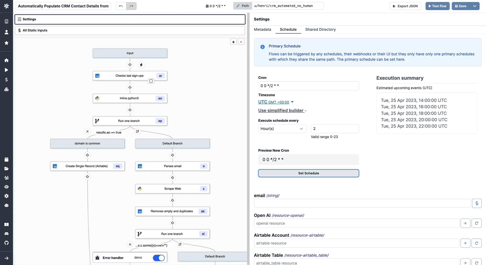

# Trigger Scripts

Triggers are special actions that run periodically given a schedule.
By default, adding a trigger will set the schedule to 15 minutes.

:::info

Check our pages dedicated to [Scheduling](../core_concepts/1_scheduling/index.md) and [Triggering flows](../getting_started/9_trigger_flows/index.md).

:::

Triggers scripts are designed to pull data from an external source and return all of the new items since the last run.

This type of Flow is meant to be scheduled regularly to reduce latency when reacting to new events. It will **trigger the rest of the Flow once per new item that is returned**. If there are no new items, the flow will be skipped.

:::tip

Think of this as someone who checks the mailbox every day. If there is a new
letter, they will continue to process it - open and read it - and if there is no
new letter, they won't do anything.

The key part is that opened letters are not placed back in the mailbox. In
Windmill, **a Trigger Script has the job to keep track of what's processed and
what's not**.

:::

**Flows can be scheduled through the Flow UI** using a CRON expression and then
activating the schedule as seen in the image below.



Examples of trigger scripts include:

- [Trigger everytime a new item text on HackerNews match at least one mention](https://hub.windmill.dev/scripts/hackernews/1301/trigger-everytime-a-new-item-text-on-hackernews-match-at-least-one-mention-hackernews)
- [Notify of new Github repo stars](https://hub.windmill.dev/scripts/github/1208/notify-of-new-github-repo-stars-github)
- [Check new uploaded files on Google Drive](https://hub.windmill.dev/scripts/gdrive/1457/get-new-files-gdrive)

The following TypeScript code is an example of the first module of a Flow that
checks for new documents in a MongoDB collection on a regular schedule. In this
case we query documents that were created after a specific time, expressed with
a timestamp. The timestamp is stored with the help of Windmill's built-in
[state functions](../core_concepts/3_resources_and_types/index.mdx#state) and is
updated in each run.

<details>
  <summary>Code below:</summary>

```ts
import { getState, type Resource, setState } from 'https://deno.land/x/windmill/mod.ts';
import { MongoClient, ObjectId } from 'https://deno.land/x/atlas_sdk/mod.ts';

type MongodbRest = {
	endpoint: string;
	api_key: string;
};

export async function main(
	auth: MongodbRest,
	data_source: string,
	database: string,
	collection: string
) {
	const client = new MongoClient({
		endpoint: auth.endpoint,
		dataSource: data_source,
		auth: { apiKey: auth.api_key }
	});
	const documents = client.database(database).collection(collection);
	const lastCheck = (await getState()) || 0;
	await setState(Date.now() / 1000);
	const id = ObjectId.createFromTime(lastCheck);
	return await documents.find({ _id: { $gt: id } });
}
```

</details>

:::tip

You can find this exact Trigger Script on
[Windmill Hub](https://hub.windmill.dev/scripts/mongodb/1462/get-recently-inserted-documents-mongodb),
or many more examples [here](https://hub.windmill.dev/triggers).

:::
