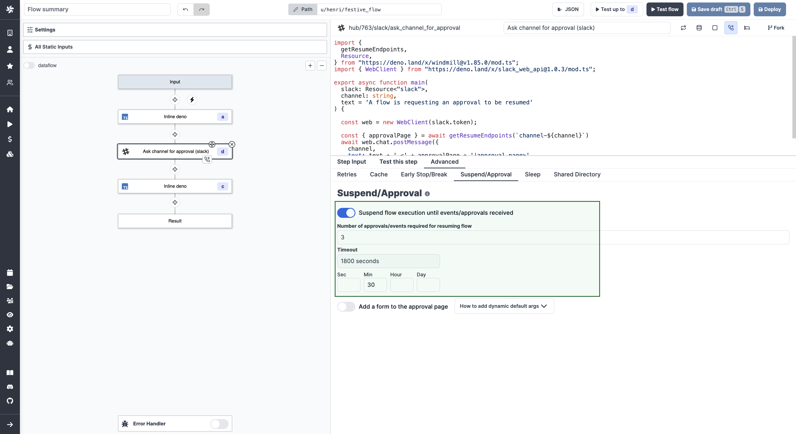
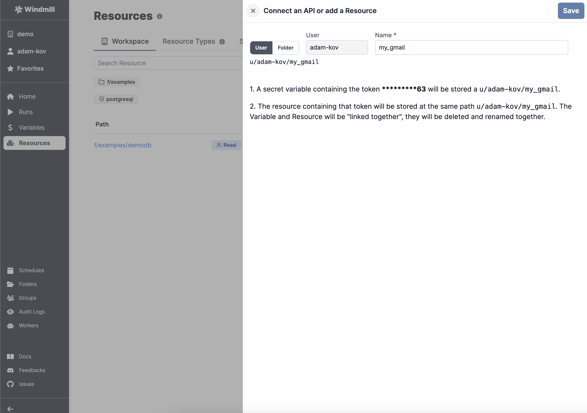
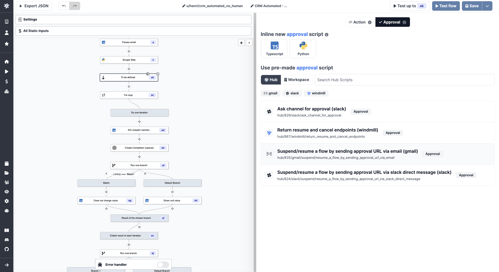
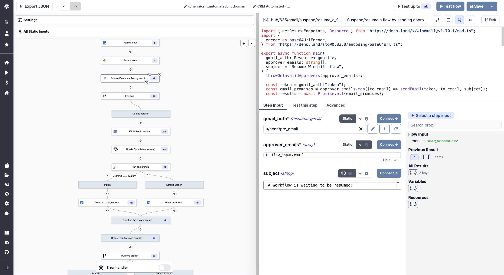
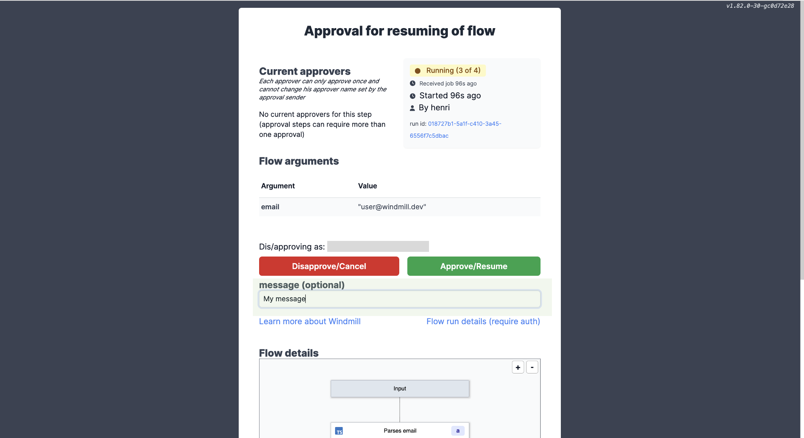
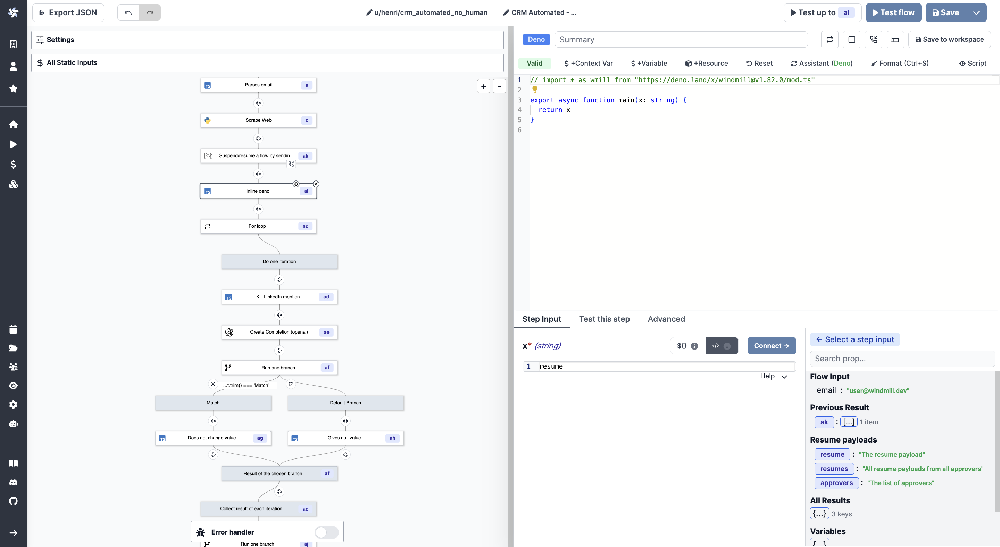
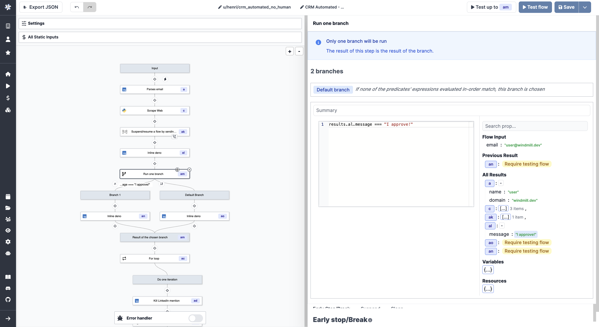
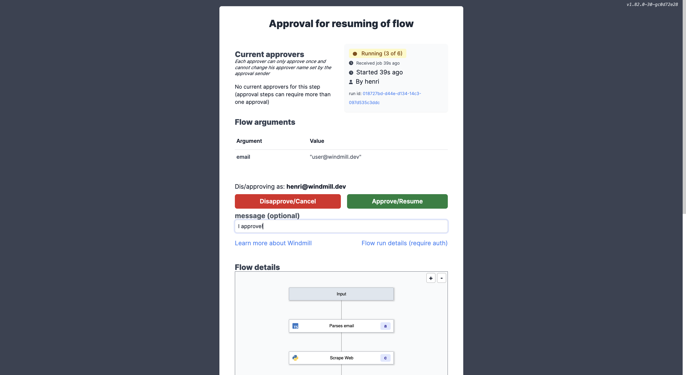

# Approval Steps in Flows

Flows can be suspended until resumed or cancelled event(s) are received. This
feature is most useful to implement approval steps but can be used for other
purposes as well.

<video
    className="border-2 rounded-xl object-cover w-full h-full dark:border-gray-800"
    autoPlay
    loop
    controls
    id="main-video"
    src="/videos/flow-approval.mp4"
/>

 

:::info

If you look for ways to pause a workflow, you might be interested in:

- **[Early stop/Break](./2_early_stop.md)**: if defined, at the end of the step, the predicate expression will be evaluated to decide if the flow should stop early.
- **[Sleep](./15_sleep.md)**: if defined, at the end of the step, the flow will sleep for a number of seconds before scheduling the next job (if any, no effect if the step is the last one). Sleeping is passive and does not consume any resources.
- **[Retry](./14_retries.md)** a step a step until it comes successful.
- **[Schedule the trigger](../core_concepts/1_scheduling/index.md)** of a script or flow.

:::

An approval step will suspend the execution of a flow until it has been approved
through the resume endpoints or the approval page by and solely by the recipients of
those secret urls. Use `wmill.getResumeUrls()` in Typescript or
`wmill.get_resume_urls()` in Python from the wmill client to generate those URLs.

An event can be:

- a **cancel**
- a **pre-set number of approval** that is met

For the moment we receive the approval steps in the form of an HTTP request. For each event, a single URL is generated. It is not unique to each user to whom it is sent.

:::tip

You can also find ready-to-use [Approval Scripts](https://hub.windmill.dev/approvals)
on Windmill Hub:

- [Suspend/resume a Flow by sending approval URL via email](https://hub.windmill.dev/scripts/gmail/1397/suspend%2Fresume-a-flow-by-sending-approval-url-via-email-gmail).
- [Ask channel for approval](https://hub.windmill.dev/scripts/slack/1503/ask-channel-for-approval-slack).

:::

## Add Approval Script

You can think of a scenario where only specific people can resume or cancel a
Flow. To achieve this they would need to receive a personalized URL via some
external communication channel (like e-mail, SMS or chat message).

Important thing to remember is that **the number of required approvals can be
customized**. This allows some flexibility for cases where you either require
approvals from all authorized people or only from one.

Note that approval steps can be applied the same configurations as regular steps ([Retries](./14_retries.md), [Early stop/Break](./2_early_stop.md) or [Suspend](./15_sleep.md)).

## Example with Gmail

### Add Gmail Resource

Lets start with adding a Gmail Resource. On the
[Resources](../core_concepts/3_resources_and_types/index.md) page, click "Add a
resource/API", select the `gmail` OAuth API and click "Sign in with Google".

:::info

As Google is an OAuth provider, you will be redirected to select your Google
account. To make the Approval Script work, you need to sign in and allow
Windmill to send e-mails on your behalf.

:::

### Reusing Script from Windmill Hub

Let's create a Flow as described in the
[getting started](../getting_started/6_flows_quickstart/index.md) section.
Our first step will be an **Approval Script** from
[Windmill Hub](https://hub.windmill.dev), so click the `+` sign in the left pane
and select "Approval (Script)".

Once the step is added, you'll be presented with some pre-made Scripts from the
Hub. Select the one named "Suspend/resume a flow by sending approval URL via
email (gmail)".

Make sure to fill required fields: for `gmail_auth`, select your newly added
Gmail resource and define email addresses in the `approver_emails` input.

### Run the Flow

The Flow is now ready for testing, let's click "Test flow" in the top-right
corner.

You can notice that after the first step, the Flow is suspended and is waiting
for approval. An e-mail should have been sent to the email addresses you
specified. It contains a link to a webpage that looks like the following:

Let's approve and resume the Flow and see that it has successfully ran the
second step as well.

## Condition branches on approval steps inputs

In the default URL approval steps there is a text box where users can enter a string. This input can be the condition of further [branches](./13_flow_branches.md) or scripts.

Currently, you need to create an intermediary step that should return '`resume`: "The resume payload"'

Once executed, this step will return an output called `message` with the actual message as a string. Use it as a condition expression for your branch one.

You're ready to execute the flow! Let the user enter the message + approve and you're good to execute the branch based on it!.

