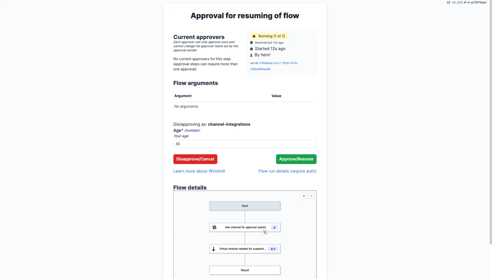
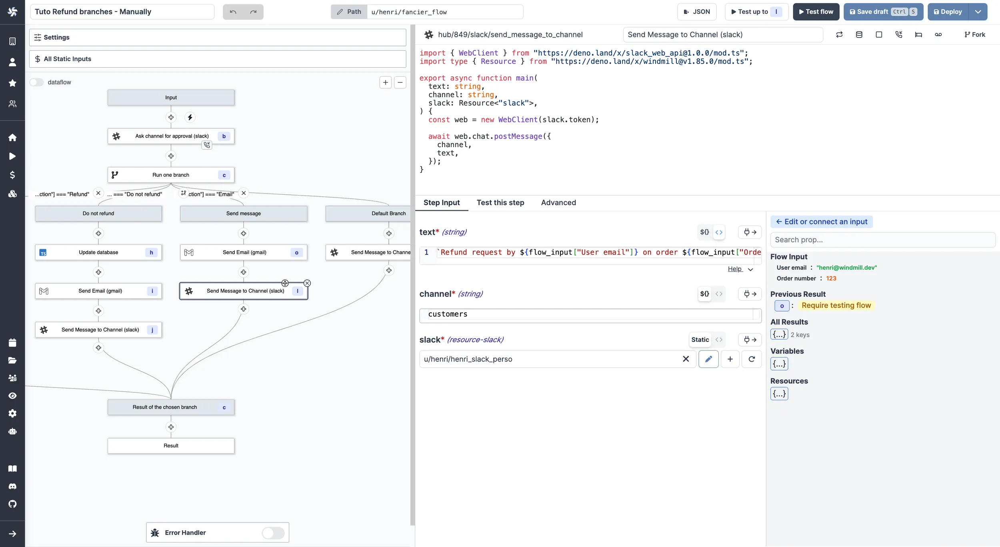

import DocCard from '@site/src/components/DocCard';

# Approval Steps / Suspend in Flows

Flows can be suspended until resumed or cancelled event(s) are received. This
feature is most useful to implement approval steps but can be used for other
purposes as well.

<video
    className="border-2 rounded-xl object-cover w-full h-full dark:border-gray-800"
    autoPlay
    controls
    id="main-video"
    src="/videos/flow-approval.mp4"
/>

 

An approval step will suspend the execution of a flow until it has been approved
through the resume endpoints or the approval page by and solely by the recipients of
the secret urls.

:::info Suspending a flow in Windmill

Other ways to pause a workflow include:

- [Early stop/Break](./2_early_stop.md): if defined, at the end of the step, the predicate expression will be evaluated to decide if the flow should stop early.
- [Sleep](./15_sleep.md): if defined, at the end of the step, the flow will sleep for a number of seconds before scheduling the next job (if any, no effect if the step is the last one).
- [Retry](./14_retries.md) a step a step until it comes successful.
- [Schedule the trigger](../core_concepts/1_scheduling/index.mdx) of a script or flow.

:::

An event can be:

- a cancel
- a pre-set number of approval that is met.

For the moment we receive the approval steps in the form of an HTTP request. For each event, a single URL is generated. It is not unique to each user to whom it is sent.

	<DocCard
		title="WindmillHub | Approval"
		description="Find a library of Approval Scripts on WindmillHub."
		href="https://hub.windmill.dev/approvals"
		color="teal"
	/>

## Add Approval Script

You can think of a scenario where only specific people can resume or cancel a
Flow. To achieve this they would need to receive a personalized URL via some
external communication channel (like e-mail, SMS or chat message).

When adding a step to a flow, pick `Approval`, and write a new approval script or pick one from [WindmillHub](https://hub.windmill.dev/approvals). This will create a step where the option in tab "Advanced" - "Suspend" is enabled.

Use `wmill.getResumeUrls()` in Typescript or `wmill.get_resume_urls()` in Python from the wmill client to generate secret URLs.

The number of required approvals can be
customized. This allows flexibility and security for cases where you either require
approvals from all authorized people or only from one.

Note that approval steps can be applied the same configurations as regular steps ([Retries](./14_retries.md), [Early stop/Break](./2_early_stop.md) or [Suspend](./15_sleep.md)).

## Add a form to the approval page

You can add an arbitrary schema form to be provided and displayed on the approval page. Users opening the approval page would then be offered to fill arguments you can use in the flow.

<video
    className="border-2 rounded-xl object-cover w-full h-full"
    controls
    src="/videos/form_approval_page.mp4"
/>

 

In the `Advanced` menu of a step, go to the "Suspend/Approval" tab and enable the `Add a form to the approval page` button.

Add properties and define their Name, Description, Type, Default Value and Advanced settings.

That will the be displayed on the approval page.

You can use the arguments values [connecting](./16_architecture.mdx#input-transform) to `resume["argument_name"]` in further steps.

This is a way to introduce human-in-the-loop workflows and condition branches on approval steps inputs.

## Tutorial: A Slack Approval Step Conditioning Flow Branches

The answer to the arguments of an approval page can be used as an input to condition branches in human-in-the-loop workflows.

Here is a basic example we will detail below.

<video
    className="border-2 rounded-xl object-cover w-full h-full"
    controls
    src="/videos/example_approval_branches.mp4"
/>

 

This flow:

1. Receives a refund request form a user.
2. Asks on Slack via an approval step what action to take.
3. The answer is a condition to [branches](./13_flow_branches.md) that lead either a refund, a refusal or a deeper investigation.

:::tip Fork and try the flow

An [automated trigger version](#automated-trigger-version) of this flow is available on [Windmill Hub](https://hub.windmill.dev/flows/49/).

:::

For the sake of the example, we made this flow simple with a [manual trigger](../getting_started/9_trigger_flows/index.mdx#auto-generated-uis). Two input were used: "User email" and "Order number", both strings.

Then, we picked an approval step on the Hub to [Ask channel for approval on Slack](https://hub.windmill.dev/scripts/slack/1503/). With inputs:

- "slack": your [Slack resource](../integrations/slack.mdx).
- "channel": Slack channel to publish message, as string.
- "text: `Refund request by _${flow_input["User email"]}_ on order ${flow_input["Order number"]}.`.

In the `Advanced` settings of the step, for "Suspend/Approval". We added the following properties to the form.

This will lead to the following approval page:

This approval page will generate two keys you can use for further steps: `resume["Action"]` and `resume["Message"]`. `resume` is the resume payload.

Those are the keys you can use as predicate expressions for your [branches](./13_flow_branches.md).

> With [Branch one](./13_flow_branches.md#branch-one), the first branch whose predicate expression is `true` will execute.

 

The content of each branch is of little importance for this tutorial as it depends each operations and tech stack. For the example we used two Hub scripts: [Send Email](https://hub.windmill.dev/scripts/gmail/1291/) with [Gmail](../integrations/gmail.md) and [Send Message to Channel](https://hub.windmill.dev/scripts/slack/1284/) with [Slack](../integrations/slack.mdx).

  
Example of arguments used for Gmail and Slack scripts:

 

### Automated Trigger Version

You could use the [Mailchimp Mandrill integration](../integrations/mailchimp_mandrill.md) to trigger this flow manually by an email reception.

<video
    className="border-2 rounded-xl object-cover w-full h-full"
    controls
    src="/videos/automated_refund.mp4"
/>

 

:::tip Find it on Windmill Hub

This flow can be found and forked on [Windmill Hub](https://hub.windmill.dev/flows/49/).

:::
