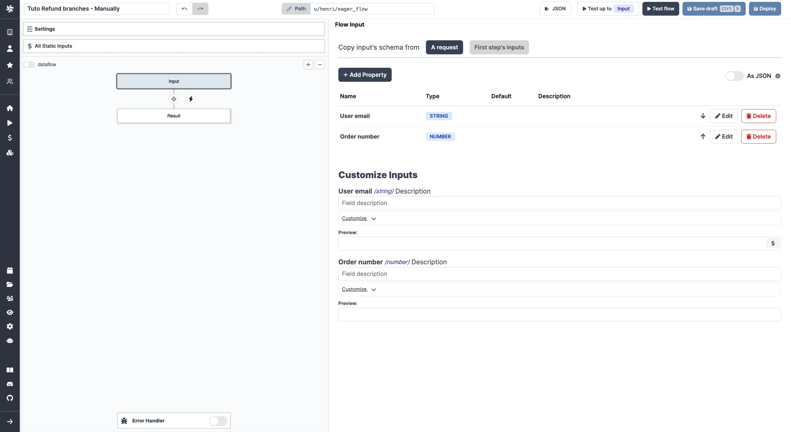
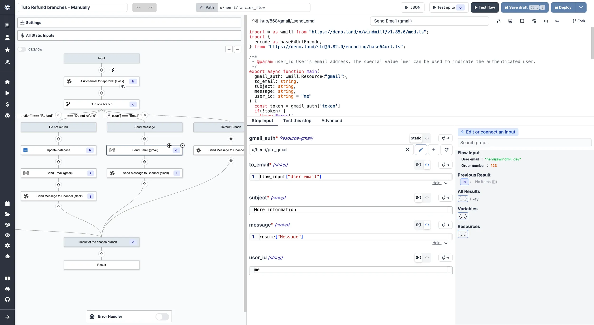

import DocCard from '@site/src/components/DocCard';
import Tabs from '@theme/Tabs';
import TabItem from '@theme/TabItem';

# Suspend & Approval / Prompts

Flows can be suspended until resumed or canceled event(s) are received. This
feature is most useful for implementing approval steps.


An approval step is a normal script with the **Suspend** option enabled in the step's advanced settings. This will suspend the execution of a flow until it has been approved through the resume endpoints or the approval page by and solely by the recipients of the secret URLs.

:::info Suspending a flow in Windmill

Other ways to pause a workflow include:

- [Early stop/Break](./2_early_stop.md): if defined, at the end of the step, the predicate expression will be evaluated to decide if the flow should stop early.
- [Sleep](./15_sleep.md): if defined, at the end of the step, the flow will sleep for a number of seconds before scheduling the next job (if any, no effect if the step is the last one).
- [Retry](./14_retries.md) a step a step until it comes successful.
- [Schedule the trigger](../core_concepts/1_scheduling/index.mdx) of a script or flow.

:::

An event can be:

- a cancel
- a pre-set number of approval that is met.

The approval step generates a unique URL for each required approval using `wmill.getResumeUrls()` (or `wmill.get_resume_urls()` in [Python](../getting_started/0_scripts_quickstart/2_python_quickstart/index.mdx)). The approval step works like a webhook mechanism - the flow remains suspended until the required number of approval events are received via HTTP requests to these generated URLs. Each approval event is an HTTP request to one of these URLs, which then resumes or cancels the flow execution.

<div className="grid grid-cols-2 gap-6 mb-4">
	<DocCard
		title="WindmillHub | Approval"
		description="Find a library of Approval scripts on WindmillHub."
		href="https://hub.windmill.dev/approvals"
		color="teal"
	/>
</div>

<video
	className="border-2 rounded-lg object-cover w-full h-full dark:border-gray-800"
	autoPlay
	controls
	id="main-video"
	src="/videos/flow-approval.mp4"
/>

<br />

## Add approval script

You can think of a scenario where only specific people can resume or cancel a
Flow. To achieve this they would need to receive a personalized URL via some
external communication channel (like e-mail, SMS or chat message).

When adding a step to a flow, pick `Approval`, and write a new approval script or pick one from [WindmillHub](https://hub.windmill.dev/approvals). This will create a step where the option in tab "Advanced" - "Suspend" is enabled.


Use `wmill.getResumeUrls()` in [TypeScript](../getting_started/0_scripts_quickstart/1_typescript_quickstart/index.mdx) or `wmill.get_resume_urls()` in [Python](../getting_started/0_scripts_quickstart/2_python_quickstart/index.mdx) from the [wmill client](../advanced/2_clients/ts_client.mdx) to generate secret URLs.

## Core

### Number of approvals/events required for resuming flow

The number of required approvals can be customized.
This allows flexibility and security for cases where you either require approvals from all authorized people or only from one.

**Important**: The flow will remain suspended and will not proceed to the next step until the exact number of required approval events is received. If fewer approvals than required are received, the flow stays suspended indefinitely (unless a timeout is configured).


Note that approval steps can be applied the same configurations as regular steps ([Retries](./14_retries.md), [Early stop/Break](./2_early_stop.md) or [Suspend](./15_sleep.md)).

### Timeout

Set a custom timeout after which the flow will be automatically canceled if no approval is received.


### Continue on disapproval/timeout

If set, instead of failing the flow and bubbling up the error, continue to the next step which would allow to put a [branchone](./13_flow_branches.md) right after to handle both cases separately. If any disapproval/timeout event is received, the resume payload will be similar to every error result in Winmdill, an object containing an `error` field which you can use to distinguish between approvals and disapproval/timeouts.


<video
	className="border-2 rounded-lg object-cover w-full h-full"
	controls
	src="/videos/continue_on_disapproval.mp4"
/>

## Form

You can add an arbitrary schema form to be provided and displayed on the approval page. Users opening the approval page would then be offered to fill arguments you can use in the flow.

Adding a form to an approval step is a [Cloud & Enterprise Self-Hosted](/pricing) only feature.

<video
	className="border-2 rounded-lg object-cover w-full h-full"
	controls
	src="/videos/form_approval_page.mp4"
/>

<br />

In the `Advanced` menu of a step, go to the "Suspend/Approval" tab and enable the `Add a form to the approval page` button.

Add properties and define their Name, Description, Type, Default Value and Advanced settings.


That will the be displayed on the approval page.


### Use arguments

The approval form argument values can be accessed in the subsequent step by [connecting](./16_architecture.mdx#input-transform) input fields to either `resume["argument_name"]` for a specific argument, or simply `resume` to obtain the complete payload.


This is a way to introduce human-in-the-loop workflows and condition branches on approval steps inputs.

### Prompts

A prompt is simply an approval step that can be self-approved. To do this, include the resume url in the returned payload of the step. The UX will automatically adapt and show the prompt to the operator when running the flow. e.g:

<Tabs className="unique-tabs">
<TabItem value="bun" label="TypeScript (Bun)" attributes={{className: "text-xs p-4 !mt-0 !ml-0"}}>

```ts
import * as wmill from "windmill-client"

export async function main() {
    const resumeUrls = await wmill.getResumeUrls("approver1")

    return {
        resume: resumeUrls['resume'],
        default_args: {}, // optional
        enums: {} // optional
    }
}
```

Find this script on [Windmill Hub](https://hub.windmill.dev/scripts/windmill/7120/approval-prompt-windmill).

</TabItem>
<TabItem value="deno" label="TypeScript (Deno)" attributes={{className: "text-xs p-4 !mt-0 !ml-0"}}>

```ts
import * as wmill from "npm:windmill-client@^1.158.2"

export async function main() {
    const resumeUrls = await wmill.getResumeUrls("approver1")

    return {
        resume: resumeUrls['resume'],
        default_args: {}, // optional
        enums: {} // optional
    }
}
```

</TabItem>
<TabItem value="python" label="Python" attributes={{className: "text-xs p-4 !mt-0 !ml-0"}}>

```python
import wmill

def main():
    urls = wmill.get_resume_urls()
    return {
        "resume": urls["resume"],
        "default_args": {}, # optional
        "enums": {} # optional
    }
```

</TabItem>
<TabItem value="go" label="Go" attributes={{className: "text-xs p-4 !mt-0 !ml-0"}}>

```go
package inner

import (
	wmill "github.com/windmill-labs/windmill-go-client"
)

func main() (map[string]interface{}, error) {
	urls, err := wmill.GetResumeUrls("approver1")
	if err != nil {
		return nil, err
	}
	return map[string]interface{}{
		"resume":      urls.Resume,
		"default_args": make(map[string]interface{}), // optional
		"enums":       make(map[string]interface{}), // optional
	}, nil
}
```

</TabItem>
</Tabs>

In the video below, you can see a user creating an approval step within a flow including the resume url in the returned payload of the step.
Then another user ([operator](../core_concepts/16_roles_and_permissions/index.mdx#operator), since is only "Viewer" in the [folder](../core_concepts/8_groups_and_folders/index.mdx) of the flow), runs the flow and sees the prompt automatically shown when running the flow.

<video
	className="border-2 rounded-lg object-cover w-full h-full"
	controls
	src="/videos/prompt_example.mp4"
/>

<br />

### Default args

As one of the return key of this step, return an object `default_args` that contains the default arguments of the form argument. e.g:

```ts
//this assumes the Form tab has a string field named "foo" and a checkbox named "bar"

import * as wmill from 'npm:windmill-client@^1.158.2';

export async function main() {
	// if no argument is passed, if user is logged in, it will use the user's username
	const resumeUrls = await wmill.getResumeUrls('approver1');

	// send the resumeUrls to the recipient or see Prompt section above

	return {
		default_args: {
			foo: 'foo',
			bar: true
		}
	};
}
```

Find this script on [Windmill Hub](https://hub.windmill.dev/scripts/windmill/7121/default-arguments-in-approval-steps-windmill).

### Dynamics enums

As one of the return key of this step, return an object `enums` that contains the default options of the form argument. e.g:

```ts
//this assumes the Form tab has a string field named "foo"

import * as wmill from 'npm:windmill-client@^1.158.2';

export async function main() {
	// if no argument is passed, if user is logged in, it will use the user's username
	const resumeUrls = await wmill.getResumeUrls('approver1');

	// send the resumeUrls to the recipient or see Prompt section above

	return {
		enums: {
			foo: ['choice1', 'choice2']
		}
	};
}
```

Find this script on [Windmill Hub](https://hub.windmill.dev/scripts/windmill/7122/dynamics-enums-in-approval-step-windmill).

That's a powerful way of having dynamic enums as flow inputs. As shown in the video below, you can have a dynamic list of choices as a first step of a flow. Just run the flow and see the list of choices.

<video
	className="border-2 rounded-lg object-cover w-full h-full"
	controls
	src="/videos/dynamic_input.mp4"
/>

<br />

And below is the flow YAML used for this example:

```yaml
summary: ""
value:
  modules:
    - id: a
      value:
        type: rawscript
        content: >-
          import * as wmillClient from "windmill-client"


          export async function main() {
            // Constant array, but could come from dynamic source
            const customers: string[] = [
              "New York",
              "Los Angeles",
              "Chicago",
              "Houston",
              "Phoenix",
              "Philadelphia",
              "San Antonio",
              "San Diego",
              "Dallas",
              "San Jose"
            ];

            const resumeUrls = await wmillClient.getResumeUrls("approver1");

            // Remove duplicates and sort the customers array in alphabetical order
            const sortedCustomers = Array.from(new Set(customers)).sort();

            return {
              resume: resumeUrls['resume'],
              enums: {
                "Customers to send to": sortedCustomers
              },
              default_args: {
                "Customers to send to": sortedCustomers
              }
            }
          }
        language: bun
        input_transforms: {}
        is_trigger: false
      continue_on_error: false
      suspend:
        required_events: 1
        timeout: 1800
        hide_cancel: false
        resume_form:
          schema:
            properties:
              Customers to send to:
                items:
                  type: string
                type: array
                description: ""
            required: []
            order:
              - Customers to send to
      summary: Approval step with dynamic enum
    - id: b
      summary: Use the selected arguments
      value:
        type: rawscript
        content: |-
          # import wmill


          def main(x):
              return x
        language: python3
        input_transforms:
          x:
            type: javascript
            expr: resume["Customers to send to"]
        is_trigger: false
  same_worker: false
schema:
  $schema: https://json-schema.org/draft/2020-12/schema
  properties: {}
  required: []
  type: object
```

### Description

You can add a description to give clear instructions that support the whole range of [rich display rendering](../core_concepts/19_rich_display_rendering/index.mdx) (including markdown).

```ts
import * as wmill from "windmill-client@^1.158.2"

export async function main(approver?: string) {
  const urls = await wmill.getResumeUrls(approver)
  // send the urls to their intended recipients


  // if the resumeUrls are part of the response, they will be available to any persons having access
  // to the run page and allowed to be approved from there, even from non owners of the flow
  // self-approval is disablable in the suspend options
  return {
        ...urls,
        default_args: {},
        enums: {},
        description: {
      render_all: [
        {
          markdown: "# We have located the secret vault with thousands of H100"
        },
        {
          map: { lat: -30, lon: 10, markers: [{lat: -30, lon: 0, title: "It's here"}]}
        },
        "Just kidding"
      ]
    }
        // supports all formats from rich display rendering such as simple strings,
        // but also markdown, html, images, tables, maps, render_all, etc...
        // https://www.windmill.dev/docs/core_concepts/rich_display_rendering
  }
}
```


### Hide cancel button on approval page

By enabling this option, the cancel button will not be displayed on the approval page to force more complex patterns using forms with enums processed in ulterior steps.


Alternatively, adding the cancel url as a result of the stpep will also render a cancel button, providing the operator with an option to cancel the step. e.g:

```ts
import * as wmill from "windmill-client"

export async function main() {
    const urls = await wmill.getResumeUrls("approver1")

    return {
        resume: urls['resume'],
        cancel: urls['cancel'],
    }
}
```

## Permissions

Customizing permissions of approval steps is a [Cloud & Enterprise Self-Hosted](/pricing) only feature.

### Require approvers to be logged in

By enabling this option, only users logged in to Windmill can approve the step.


### Disable self-approval

The user who triggered the flow will not be allowed to approve it.


### Require approvers to be members of a group

By enabling this option, only logged in users who are members of the specified [group](../core_concepts/8_groups_and_folders/index.mdx) can approve the step.


You can also dynamically set the group by connecting it to another node's output.


### Get the users who approved the flow

The input `approvers` is an array of the users who approved the flow.

To get the list of users, just have the step after the approval step return the `approvers` key. For example by taking an input [connected](./16_architecture.mdx) to the `approvers` key.

The step could be as simple as:

```ts
export async function main(list_of_approvers) {
  return list_of_approvers
}
```

With input list_of_approvers taking as JavaScript expression `approvers`.

<video
	className="border-2 rounded-lg object-cover w-full h-full"
	controls
	src="/videos/list_of_approvers.mp4"
/>

## Slack approval step

The Windmill [Python](../advanced/2_clients/python_client.md) and [TypeScript](../advanced/2_clients/ts_client.mdx) clients both have a helper function to request an interactive approval on Slack. An interactive approval is a Slack message that can be approved or rejected directly from Slack without having to go back to the Windmill UI.

<iframe
	style={{ aspectRatio: '16/9' }}
	src="https://www.youtube.com/embed/wUvqom8nmM4"
	title="Slack approval step"
	allow="accelerometer; autoplay; clipboard-write; encrypted-media; gyroscope; picture-in-picture; web-share"
	allowFullScreen
	className="border-2 rounded-lg object-cover w-full dark:border-gray-800"
></iframe>

<br />

The following hub scripts can be used:
 - Python: [Request Interactive Slack Approval](https://hub.windmill.dev/scripts/slack/11403/request-interactive-slack-approval-(python)-slack)
 - TypeScript [Request Interactive Slack Approval](https://hub.windmill.dev/scripts/slack/11402/request-interactive-slack-approval-slack)

If you define a [form](./flow_approval#form) on the approval step, the form will be displayed in the Slack message as a modal.


Both of these scripts are using the Windmill client helper function:

<Tabs className="unique-tabs">
<TabItem value="python" label="Python" attributes={{className: "text-xs p-4 !mt-0 !ml-0"}}>
```python
wmill.request_interactive_slack_approval(
    slack_resource_path="/u/username/my_slack_resource",
    channel_id="admins-slack-channel",
    message="Please approve this request",
    approver="approver123",
    default_args_json={"key1": "value1", "key2": 42},
	dynamic_enums_json={"foo": ["choice1", "choice2"], "bar": ["optionA", "optionB"]},
)
```
</TabItem>


<TabItem value="bun" label="Bun" attributes={{className: "text-xs p-4 !mt-0 !ml-0"}}>
```ts
 await wmill.requestInteractiveSlackApproval({
   slackResourcePath: "/u/username/my_slack_resource",
   channelId: "admins-slack-channel",
   message: "Please approve this request",
   approver: "approver123",
   defaultArgsJson: { key1: "value1", key2: 42 },
   dynamicEnumsJson: { foo: ["choice1", "choice2"], bar: ["optionA", "optionB"] },
 });
```
</TabItem>
</Tabs>

Where [dynamic_enums](./flow_approval#slack-approval-step) can be used to dynamically set the options of enum form arguments and [default_args](./flow_approval#default-args) can be used to dynamically set the default values of form arguments.

If multiple approvals are required you can use the client helper directly and send approval requests to different channels:

<Tabs className="unique-tabs">
<TabItem value="python" label="Python" attributes={{className: "text-xs p-4 !mt-0 !ml-0"}}>
```python
import wmill

def main():
	# Send approval request to customers
    wmill.request_interactive_slack_approval(
        'u/username/slack_resource',
        'customers',
    )

	# Send approval request to admins
    wmill.request_interactive_slack_approval(
        'u/username/slack_resource',
        'admins',
    )
```
</TabItem>

<TabItem value="bun" label="Bun" attributes={{className: "text-xs p-4 !mt-0 !ml-0"}}>
```ts
import * as wmill from "windmill-client"

export async function main() {
  await wmill.requestInteractiveSlackApproval({
    slackResourcePath: "/u/username/slack_resource",
   channelId: "customers"
  })
  await wmill.requestInteractiveSlackApproval({
    slackResourcePath: "/u/username/slack_resource",
    channelId: "admins"
  })
}
```
</TabItem>
</Tabs>

## Microsoft Teams approval step

The Windmill [TypeScript](../advanced/2_clients/ts_client.mdx) client exposes helper functions to request a approval on Microsoft Teams. The interactive approval is a Teams message that can be approved or rejected directly from Teams without having to go back to the Windmill UI where as the non-interactive approval will be a simple link that will open the approval page in the Windmill UI in your browser.

<iframe
	style={{ aspectRatio: '16/9' }}
	src="https://www.youtube.com/embed/gc6P7nnMORk"
	title="Microsoft Teams approval step"
	allow="accelerometer; autoplay; clipboard-write; encrypted-media; gyroscope; picture-in-picture; web-share"
	allowFullScreen
	className="border-2 rounded-lg object-cover w-full dark:border-gray-800"
></iframe>

<br />

The following hub scripts can be used:
 - [Request Interactive Teams Approval](https://hub.windmill.dev/scripts/teams/13935/interactive-microsoft-teams-approval-teams)
 - [Request Basic Teams Approval](https://hub.windmill.dev/scripts/teams/13936/microsoft-teams-approval-teams)

If you define a [form](./flow_approval#form) on the approval step, the form will be displayed in the Teams message as a modal.


Both of these scripts are using the Windmill client helper function:

<Tabs className="unique-tabs">
<TabItem value="ts_interactive" label="TypeScript Interactive" attributes={{className: "text-xs p-4 !mt-0 !ml-0"}}>
```javascript
  await wmill.requestInteractiveTeamsApproval({
      teamName: "Windmill",
      channelName: "General",
      message: "Please approve this request",
      approver: "approver123",
      defaultArgsJson: { key1: "value1", key2: 42 },
      dynamicEnumsJson: { foo: ["choice1", "choice2"], bar: ["optionA", "optionB"] },
  });
```
</TabItem>


<TabItem value="ts_basic" label="TypeScript Basic" attributes={{className: "text-xs p-4 !mt-0 !ml-0"}}>
```ts
const card_block = {
        "type": "message",
        "attachments": [
            {
                "contentType": "application/vnd.microsoft.card.adaptive",
                "content": {
                    "type": "AdaptiveCard",
                    "$schema": "https://adaptivecards.io/schemas/adaptive-card.json",
                    "version": "1.6",
                    "body": [
                        ... // card body
                    ],
                },
            }
        ],
        "conversation": {"id": `${conversation_id}`},
    }

  await wmill.TeamsService.sendMessageToConversation({
    requestBody: { conversation_id, text: "A workflow has been suspended and is waiting for approval!", card_block }
  })
```
</TabItem>
</Tabs>

Where [dynamic_enums](./flow_approval#slack-approval-step) can be used to dynamically set the options of enum form arguments and [default_args](./flow_approval#default-args) can be used to dynamically set the default values of form arguments.

If multiple approvals are required you can use the client helper directly and send approval requests to different channels (same as the Slack example above).

## Tutorial: a Slack approval step conditioning flow branches

The answer to the arguments of an approval page can be used as an input to condition branches in human-in-the-loop workflows.

Here is a basic example we will detail below.

<video
	className="border-2 rounded-lg object-cover w-full h-full"
	controls
	src="/videos/example_approval_branches.mp4"
/>

<br />

This flow:

1. Receives a refund request form a user.
2. Asks on Slack via an approval step what action to take.
3. The answer is a condition to [branches](./13_flow_branches.md) that lead either a refund, a refusal or a deeper investigation.

:::tip Fork and try the flow

An [automated trigger version](#automated-trigger-version) of this flow is available on [Windmill Hub](https://hub.windmill.dev/flows/49/).

:::

For the sake of the example, we made this flow simple with a [manual trigger](../getting_started/8_triggers/index.mdx). Two input were used: "User email" and "Order number", both strings.



Then, we picked an approval step on the Hub to [Request Interactive Slack Approval](https://hub.windmill.dev/scripts/slack/11402/request-interactive-slack-approval-slack). With inputs:

- "slackResourcePath": the path to your [Slack resource](../integrations/slack.mdx).
- "channel": Slack channel to publish message, as string.
- "text: `Refund request by _${flow_input["User email"]}_ on order ${flow_input["Order number"]}.`.

This will alow the user to approve or reject the refund request directly from Slack without having to go back to the Windmill UI.


In the `Advanced` settings of the step, for "Suspend/Approval". We added the following properties to the form.


This will lead to the following approval page and slack form:


This approval page will generate two keys you can use for further steps: `resume["Action"]` and `resume["Message"]`. `resume` is the resume payload.

Those are the keys you can use as predicate expressions for your [branches](./13_flow_branches.md).


> With [Branch one](./13_flow_branches.md#branch-one), the first branch whose predicate expression is `true` will execute.

<br />

The content of each branch is of little importance for this tutorial as it depends each operations and tech stack. For the example we used two Hub scripts: [Send Email](https://hub.windmill.dev/scripts/gmail/1291/) with [Gmail](../integrations/gmail.md) and [Send Message to Channel](https://hub.windmill.dev/scripts/slack/1284/) with [Slack](../integrations/slack.mdx).

<details>
  <summary>Example of arguments used for Gmail and Slack scripts:</summary>



<br />


</details>

### Automated trigger version

You could use the [Mailchimp Mandrill integration](../integrations/mailchimp_mandrill.md) to trigger this flow manually by an email reception.

<video
	className="border-2 rounded-lg object-cover w-full h-full"
	controls
	src="/videos/automated_refund.mp4"
/>

<br />

This flow can be found and forked on [Windmill Hub](https://hub.windmill.dev/flows/49/).