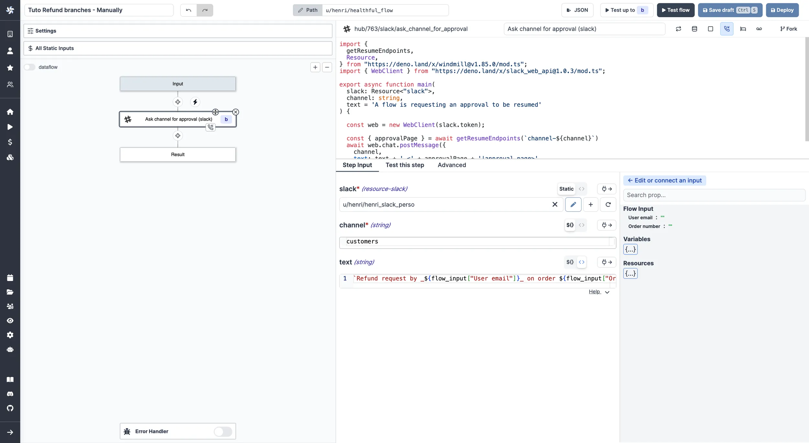
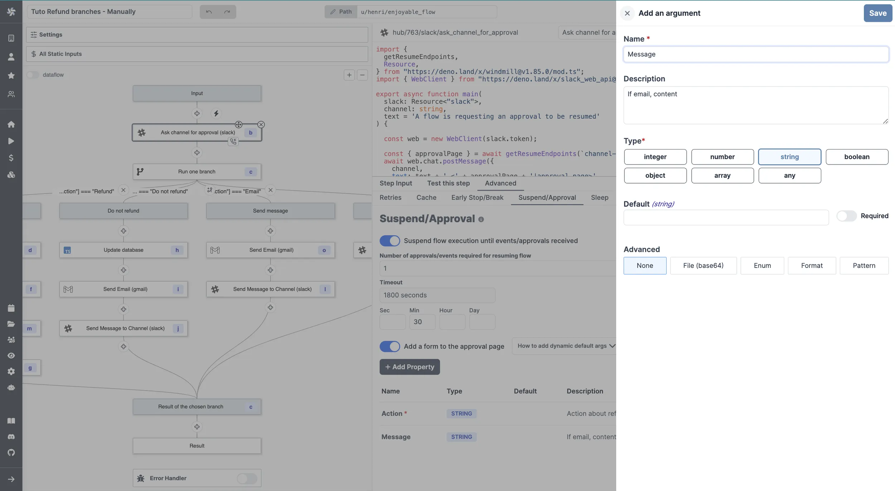

import DocCard from '@site/src/components/DocCard';
import Tabs from '@theme/Tabs';
import TabItem from '@theme/TabItem';

# Suspend & Approval / Prompts

Flows can be suspended until resumed or canceled event(s) are received. This
feature is most useful for implementing approval steps but can be used for other
purposes as well.

<video
	className="border-2 rounded-lg object-cover w-full h-full dark:border-gray-800"
	autoPlay
	controls
	id="main-video"
	src="/videos/flow-approval.mp4"
/>

<br />

An approval step will suspend the execution of a flow until it has been approved
through the resume endpoints or the approval page by and solely by the recipients of
the secret urls.

:::info Suspending a flow in Windmill

Other ways to pause a workflow include:

- [Early stop/Break](./2_early_stop.md): if defined, at the end of the step, the predicate expression will be evaluated to decide if the flow should stop early.
- [Sleep](./15_sleep.md): if defined, at the end of the step, the flow will sleep for a number of seconds before scheduling the next job (if any, no effect if the step is the last one).
- [Retry](./14_retries.md) a step a step until it comes successful.
- [Schedule the trigger](../core_concepts/1_scheduling/index.mdx) of a script or flow.

:::

An event can be:

- a cancel
- a pre-set number of approval that is met.

For the moment we receive the approval steps in the form of an HTTP request. For each event, a single URL is generated. It is not unique to each user to whom it is sent.

<div className="grid grid-cols-2 gap-6 mb-4">
	<DocCard
		title="WindmillHub | Approval"
		description="Find a library of Approval Scripts on WindmillHub."
		href="https://hub.windmill.dev/approvals"
		color="teal"
	/>
</div>

## Add Approval Script

You can think of a scenario where only specific people can resume or cancel a
Flow. To achieve this they would need to receive a personalized URL via some
external communication channel (like e-mail, SMS or chat message).

When adding a step to a flow, pick `Approval`, and write a new approval script or pick one from [WindmillHub](https://hub.windmill.dev/approvals). This will create a step where the option in tab "Advanced" - "Suspend" is enabled.


Use `wmill.getResumeUrls()` in Typescript or `wmill.get_resume_urls()` in Python from the wmill client to generate secret URLs.

## Core

### Number of approvals/events required for resuming flow

The number of required approvals can be customized.
This allows flexibility and security for cases where you either require approvals from all authorized people or only from one.


Note that approval steps can be applied the same configurations as regular steps ([Retries](./14_retries.md), [Early stop/Break](./2_early_stop.md) or [Suspend](./15_sleep.md)).

### Timeout

Set a custom timeout after which the flow will be automatically canceled if no approval is received.


## Form

You can add an arbitrary schema form to be provided and displayed on the approval page. Users opening the approval page would then be offered to fill arguments you can use in the flow.

Adding a form to an approval step is a [Cloud & Enterprise Self-Hosted](/pricing) only feature.

<video
	className="border-2 rounded-lg object-cover w-full h-full"
	controls
	src="/videos/form_approval_page.mp4"
/>

<br />

In the `Advanced` menu of a step, go to the "Suspend/Approval" tab and enable the `Add a form to the approval page` button.

Add properties and define their Name, Description, Type, Default Value and Advanced settings.


That will the be displayed on the approval page.


You can use the arguments values [connecting](./16_architecture.mdx#input-transform) to `resume["argument_name"]` in further steps.


This is a way to introduce human-in-the-loop workflows and condition branches on approval steps inputs.

### Prompts

A prompt is simply an approval step that can be self-approved. To do this, include the resume url in the returned payload of the step. The UX will automatically adapt and show the prompt to the operator when running the flow. e.g:

<Tabs className="unique-tabs">
<TabItem value="bun" label="TypeScript (Bun)" attributes={{className: "text-xs p-4 !mt-0 !ml-0"}}>

```ts
import * as wmill from "windmill-client"

export async function main() {
    const resumeUrls = await wmill.getResumeUrls("approver1")

    return {
        resume: resumeUrls['resume'],
        default_args: {}, // optional
        enums: {} // optional
    }
}
```

Find this script on [Windmill Hub](https://hub.windmill.dev/scripts/windmill/7120/approval-prompt-windmill).

</TabItem>
<TabItem value="deno" label="TypeScript (Deno)" attributes={{className: "text-xs p-4 !mt-0 !ml-0"}}>

```ts
import * as wmill from "npm:windmill-client@^1.158.2"

export async function main() {
    const resumeUrls = await wmill.getResumeUrls("approver1")

    return {
        resume: resumeUrls['resume'],
        default_args: {}, // optional
        enums: {} // optional
    }
}
```

</TabItem>
<TabItem value="python" label="Python" attributes={{className: "text-xs p-4 !mt-0 !ml-0"}}>

```python
import wmill

def main():
    urls = wmill.get_resume_urls()
    return {
        "resume": urls["resume"],
        "default_args": {}, # optional
        "enums": {} # optional
    }
```

</TabItem>
<TabItem value="go" label="Go" attributes={{className: "text-xs p-4 !mt-0 !ml-0"}}>

```go
package inner

import (
	wmill "github.com/windmill-labs/windmill-go-client"
)

func main() (map[string]interface{}, error) {
	urls, err := wmill.GetResumeUrls("approver1")
	if err != nil {
		return nil, err
	}
	return map[string]interface{}{
		"resume":      urls.Resume,
		"default_args": make(map[string]interface{}), // optional
		"enums":       make(map[string]interface{}), // optional
	}, nil
}
```

</TabItem>
</Tabs>

In the video below, you can see a user creating an approval step within a flow including the resume url in the returned payload of the step.
Then another user ([operator](../core_concepts/16_roles_and_permissions/index.mdx#roles-in-windmill), since is only "Viewer" in the [folder](../core_concepts/8_groups_and_folders/index.mdx) of the flow), runs the flow and sees the prompt automatically shown when running the flow.

<video
	className="border-2 rounded-lg object-cover w-full h-full"
	controls
	src="/videos/prompt_example.mp4"
/>

<br />

### Default args

As one of the return key of this step, return an object `default_args` that contains the default arguments of the form arguments. e.g:

```ts
//this assumes the Form tab has a string field named "foo" and a checkbox named "bar"

import * as wmill from 'npm:windmill-client@^1.158.2';

export async function main() {
	// if no argument is passed, if user is logged in, it will use the user's username
	const resumeUrls = await wmill.getResumeUrls('approver1');

	// send the resumeUrls to the recipient or see Prompt section above

	return {
		default_args: {
			foo: 'foo',
			bar: true
		}
	};
}
```

Find this script on [Windmill Hub](https://hub.windmill.dev/scripts/windmill/7121/default-arguments-in-approval-steps-windmill).

### Dynamics enums

As one of the return key of this step, return an object `enums` that contains the default arguments of the form arguments. e.g:

```ts
//this assumes the Form tab has a string field named "foo"

import * as wmill from 'npm:windmill-client@^1.158.2';

export async function main() {
	// if no argument is passed, if user is logged in, it will use the user's username
	const resumeUrls = await wmill.getResumeUrls('approver1');

	// send the resumeUrls to the recipient or see Prompt section above

	return {
		enums: {
			foo: ['choice1', 'choice2']
		}
	};
}
```

Find this script on [Windmill Hub](https://hub.windmill.dev/scripts/windmill/7122/dynamics-enums-in-approval-step-windmill).

### Description

You can add a description to give clear instructions that support the whole range of [rich display rendering](../core_concepts/19_rich_display_rendering/index.md) (including markdown).

```ts
import * as wmill from "windmill-client@^1.158.2"

export async function main(approver?: string) {
  const urls = await wmill.getResumeUrls(approver)
  // send the urls to their intended recipients


  // if the resumeUrls are part of the response, they will be available to any persons having access
  // to the run page and allowed to be approved from there, even from non owners of the flow
  // self-approval is disablable in the suspend options
  return {
        ...urls,
        default_args: {},
        enums: {},
        description: {
      render_all: [
        {
          markdown: "# We have located the secret vault with thousands of H100"
        },
        {
          map: { lat: -30, lon: 10, markers: [{lat: -30, lon: 0, title: "It's here"}]}
        },
        "Just kidding"
      ]
    }
        // supports all formats from rich display rendering such as simple strings,
        // but also markdown, html, images, tables, maps, render_all, etc...
        // https://www.windmill.dev/docs/core_concepts/rich_display_rendering
  }
}
```


### Hide cancel button on approval page

By enabling this option, the cancel button will not be displayed on the approval page to force more complex patterns using forms with enums processed in ulterior steps.


## Permissions

Customizing permissions of approval steps is a [Cloud & Enterprise Self-Hosted](/pricing) only feature.

### Require approvers to be logged in

By enabling this option, only users logged in to Windmill can approve the step.


### Disable self-approval

The user who triggered the flow will not be allowed to approve it.


### Require approvers to be members of a group

By enabling this option, only logged in users who are members of the specified [group](../core_concepts/8_groups_and_folders/index.mdx) can approve the step.


You can also dynamically set the group by connecting it to another node's output.


## Tutorial: A Slack Approval Step Conditioning Flow Branches

The answer to the arguments of an approval page can be used as an input to condition branches in human-in-the-loop workflows.

Here is a basic example we will detail below.

<video
	className="border-2 rounded-lg object-cover w-full h-full"
	controls
	src="/videos/example_approval_branches.mp4"
/>

<br />

This flow:

1. Receives a refund request form a user.
2. Asks on Slack via an approval step what action to take.
3. The answer is a condition to [branches](./13_flow_branches.md) that lead either a refund, a refusal or a deeper investigation.

:::tip Fork and try the flow

An [automated trigger version](#automated-trigger-version) of this flow is available on [Windmill Hub](https://hub.windmill.dev/flows/49/).

:::

For the sake of the example, we made this flow simple with a [manual trigger](../getting_started/9_trigger_flows/index.mdx). Two input were used: "User email" and "Order number", both strings.


Then, we picked an approval step on the Hub to [Ask channel for approval on Slack](https://hub.windmill.dev/scripts/slack/1503/). With inputs:

- "slack": your [Slack resource](../integrations/slack.mdx).
- "channel": Slack channel to publish message, as string.
- "text: `Refund request by _${flow_input["User email"]}_ on order ${flow_input["Order number"]}.`.



In the `Advanced` settings of the step, for "Suspend/Approval". We added the following properties to the form.




This will lead to the following approval page:


This approval page will generate two keys you can use for further steps: `resume["Action"]` and `resume["Message"]`. `resume` is the resume payload.

Those are the keys you can use as predicate expressions for your [branches](./13_flow_branches.md).


> With [Branch one](./13_flow_branches.md#branch-one), the first branch whose predicate expression is `true` will execute.

<br />

The content of each branch is of little importance for this tutorial as it depends each operations and tech stack. For the example we used two Hub scripts: [Send Email](https://hub.windmill.dev/scripts/gmail/1291/) with [Gmail](../integrations/gmail.md) and [Send Message to Channel](https://hub.windmill.dev/scripts/slack/1284/) with [Slack](../integrations/slack.mdx).

<details>
  <summary>Example of arguments used for Gmail and Slack scripts:</summary>


<br />


</details>

### Automated Trigger Version

You could use the [Mailchimp Mandrill integration](../integrations/mailchimp_mandrill.md) to trigger this flow manually by an email reception.

<video
	className="border-2 rounded-lg object-cover w-full h-full"
	controls
	src="/videos/automated_refund.mp4"
/>

<br />

:::tip Find it on Windmill Hub


This flow can be found and forked on [Windmill Hub](https://hub.windmill.dev/flows/49/).

:::
