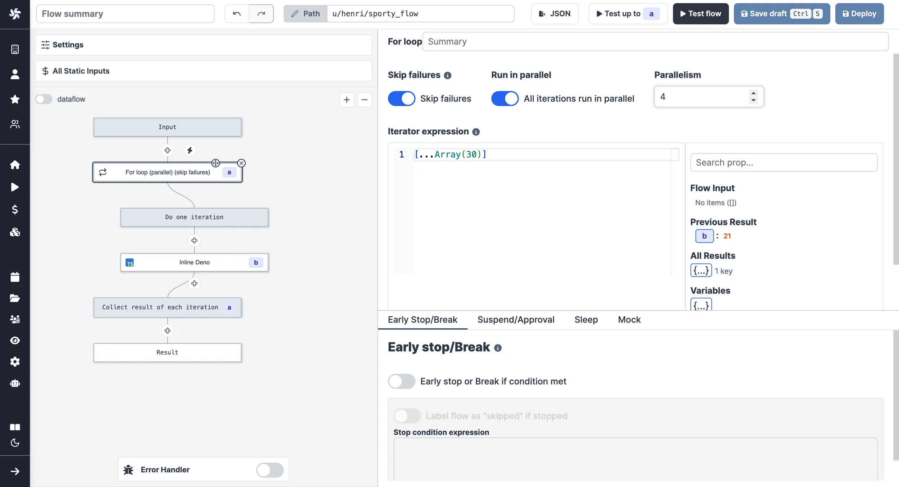

# For loops

For loops is a special type of steps that allows you to iterate over a list of items, given by an iterator expression.

Clicking on the `For loop` step on the mini-map, it will open the `For loop` step editor.
There are three configuration options:

- **Iterator expression**: the expression that will be evaluated to get the list of items to iterate over. You can also connect with a previous result that contain several items, it will iterate over all of them.
- **Skip failure**: if set to `true`, the loop will continue to the next item even if the current item failed.
- **Run in parallel**: if set to `true`, all iterations will be run in parallel.

