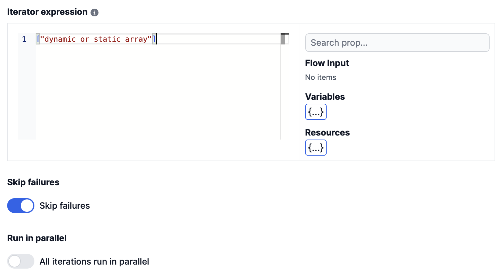
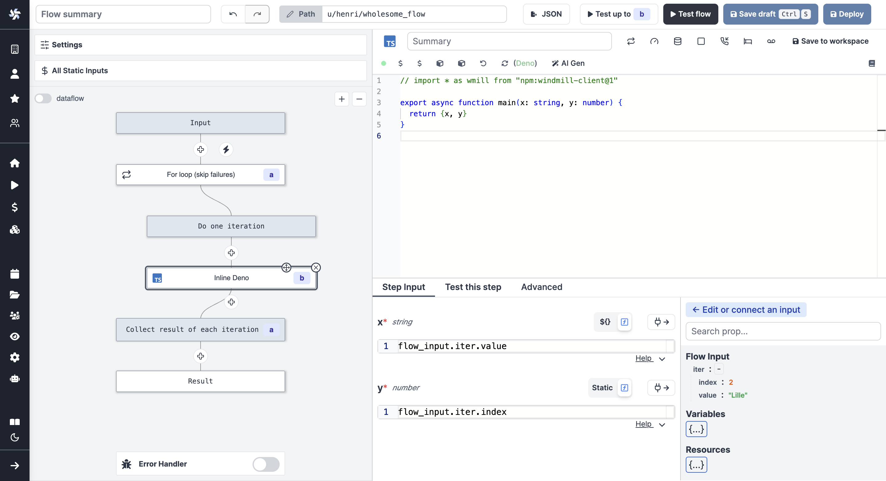

# For loops

For loops is a special type of steps that allows you to iterate over a list of items, given by an iterator expression.

<video
    className="border-2 rounded-xl object-cover w-full h-full dark:border-gray-800"
    autoPlay
    loop
    controls
    id="main-video"
    src="/videos/flow-loop.mp4"
/>

 

Clicking on the `For loop` step on the mini-map, it will open the `For loop` step editor.
There are 4 configuration options:

- **Iterator expression**: the [JS expression](https://developer.mozilla.org/en-US/docs/Web/JavaScript/Guide/Expressions_and_Operators) that will be evaluated to get the list of items to iterate over. You can also [connect with a previous result](./16_architecture.mdx) that contain several items, it will iterate over all of them.
- **Skip failure**: if set to `true`, the loop will continue to the next item even if the current item failed.
- **Run in parallel**: if set to `true`, all iterations will be run in parallel.
- **Parallelism**: assign a given number of parallel branches to control huge for-loops.

 

Steps within the flow can use both the iteration index and value. For example in `["Paris", "Lausanne", "Lille"]`, for iteration index "1", "Lausanne" is the value.

