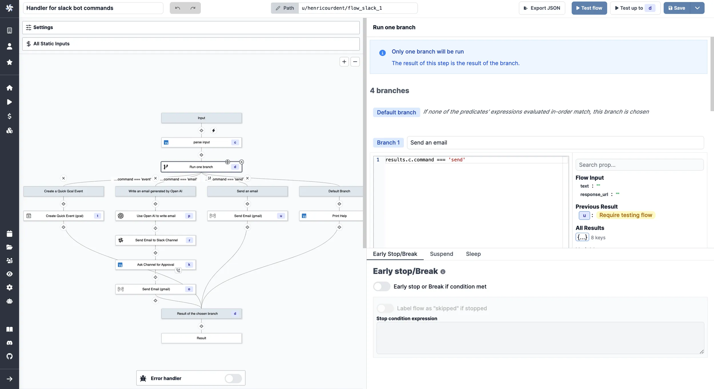

# Branches

Branches allow to split the execution of the flow based on a condition.

<video
    className="border-2 rounded-xl object-cover w-full h-full dark:border-gray-800"
    autoPlay
    loop
    controls
    id="main-video"
    src="/videos/flow-branch.mp4"
/>

 

There are two types of branches:

- **Branch one**: the branch will be executed if its condition is true, otherwise the default branch will be executed.
- **Branch all**: all the branches will be executed.

## Branch one

A branch one is a special type of step that allows you to execute a branch if a condition is true. If the condition is false, the default branch will be executed. If several branches are true, the first one will execute. Each branch is a flow.

Clicking on one branch will open the branch editor. You can configure the:

- **Summary**: gives a name to the branch, useful when several branches. By default Branch 1, 2, 3...
- **Predicate expression**: the expression that will be evaluated to determine if the branch should be executed. It can be simple `true`/`false` but also comparison operators (`results.c.command === 'email'`, `flow_input.number >= 2` etc.)

_Example of branches to [handle a Slackbot](/blog/handler-slack-commands)_.

All the predicates can also be configured in the `Run one branch` step (parent box). The predicates are evaluated in the order they are defined. The first predicate that evaluates to true will be executed. If no predicate evaluates to true, the default branch will be executed.

## Branch all

A branch all is a special type of step that allows you to execute all the branches in parallel. Each branch is a flow.

Clicking on the parent box `Run all branches` will open the branches editor. You can configure for each branch:

- **Summary**: the summary of the branch.
- **Skip failure**: if set to `true`, the branch will be skipped if it fails.

You can also configure whether the branches should be run in parallel.

Clicking on one branch will open the branch editor. You can configure the:

- **Summary**: the summary of the branch.
- **Skip failure**: if set to `true`, the branch will be skipped if it fails.

## Predicate expression

The predicate expression is the JavaScript expression that will be evaluated to determine if the branch should be executed. It can be simple `true`/`false` but also comparison operators (`results.c.command === 'email'`, `flow_input.number >= 2` etc.)

It can be set with a prompt using [Windmill AI](../core_concepts/22_ai_generation/index.mdx):

<video
	className="border-2 rounded-lg object-cover w-full h-full dark:border-gray-800"
	controls
	src="/videos/branch_predicate_copilot.mp4"
/>