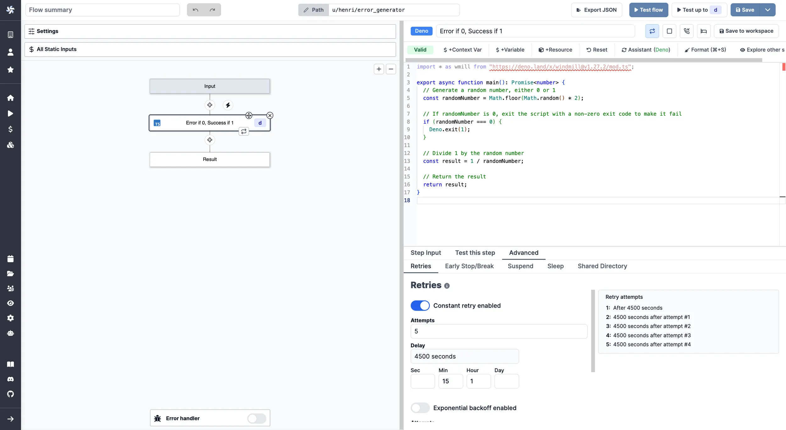
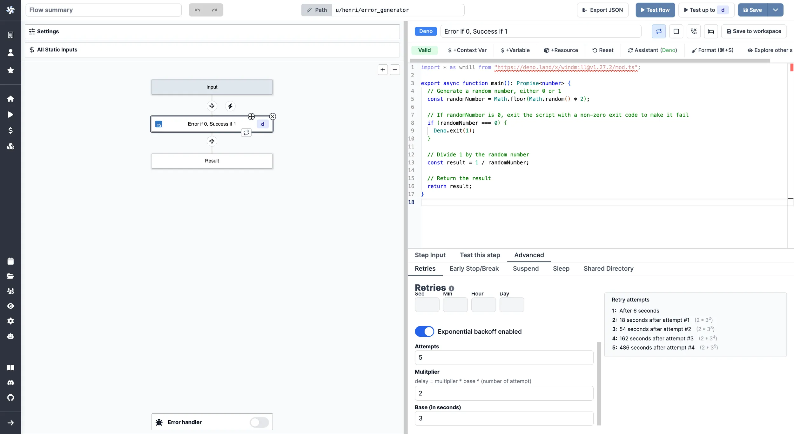

# Retries

Steps within a flow can be re-tried in case of error. This feature is useful to keep a flow trying to execute even if a step momentarily failed.

<video
    className="border-2 rounded-xl object-cover w-full h-full dark:border-gray-800"
    autoPlay
    loop
    controls
    id="main-video"
    src="/videos/retries_example.mp4"
/>

 

If defined, upon error this step will be retried with a delay and a maximum number of attempts as defined below. If both static and exponential delay is defined, the static delay attempts are tried before the exponential ones.

Note that errors have a [specific shape](../core_concepts/19_rich_display_rendering/index.mdx#error).

From a single flow, this feature can for example help you with:

- **API requests**: Retry failed API calls due to temporary server issues or network timeouts every 5 minutes, for a maximum of 5 attempts, ensuring eventual data retrieval or synchronization with third-party services.
- **Payment processing**: Try again failed transactions caused by temporary issues with the payment gateway or the customer's bank for up to 3 attempts and each time clocked by longer delay (thanks to exponential backoff), reducing the likelihood of lost sales.
- **[Batch processing](/blog/stantt-case-study)**: Reattempt failed batch processing jobs caused by temporary resource constraints or server issues every 30 minutes, for a maximum of 6 attempts, ensuring that all tasks are eventually completed.

As well as many other examples (inventory synchronization, data backups, file uploads, scraping etc.)

## Constant retries

From the `Advanced` menu, pick `Retries` and toggle `Constant retry enabled`.

From there, define a maximum number of attempts and a given delay.

Although the delay is set in seconds, inputs can be given in minutes, hours or days.

## Exponential backoff enabled

From the `Advanced` menu, pick `Retries` and toggle `Exponential backoff enabled`.

From there, define a maximum number of attempts and a given exponential delay defined by a base (in seconds), a multiplier and the number of the attempt.

The formula being given by `delay = multiplier * base ^ (number of attempt)`.

For example, for:

- base = 3
- multiplier = 2
- attempts = 5

Here are the delays between each attempts:

|   # | Delay                        | Formula  |
| --: | :--------------------------- | :------- |
|   1 | After 6 seconds              | -        |
|   2 | 18 seconds after attempt #1  | 2 \* 3^2 |
|   3 | 54 seconds after attempt #2  | 2 \* 3^3 |
|   4 | 162 seconds after attempt #3 | 2 \* 3^4 |
|   5 | 486 seconds after attempt #4 | 2 \* 3^5 |

## Continue on error with error as step's return

When enabled, the flow will continue to the next step after going through all the retries (if any) even if this step fails. This enables to process the error in a [branch one](./13_flow_branches.md) for instance.

By default, each step is set to "Stop on error and propagate error up".

