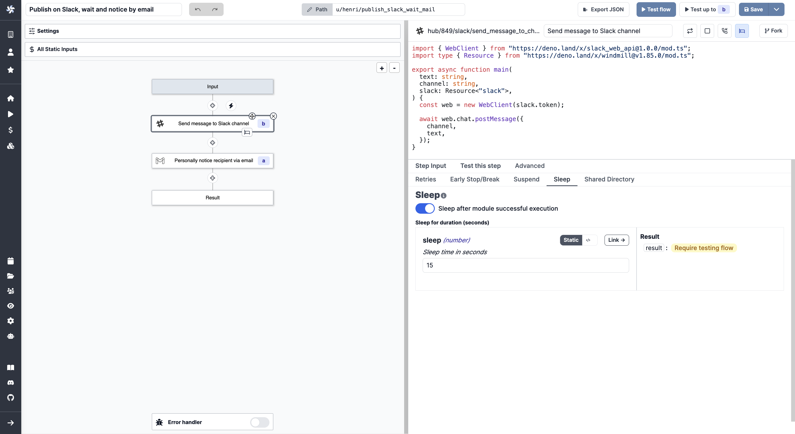
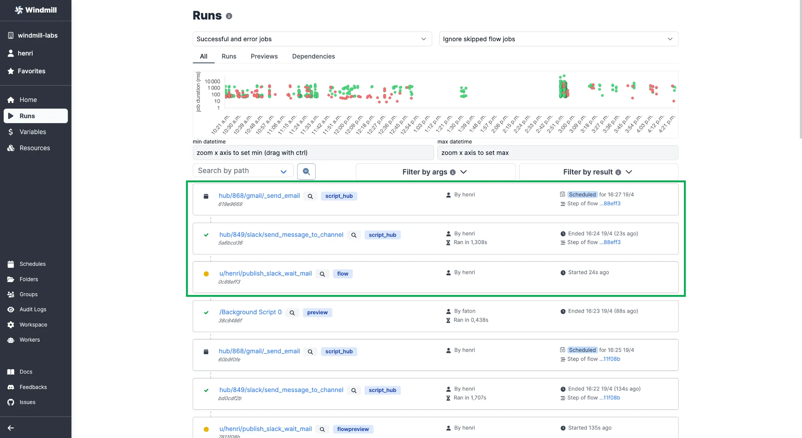

# Sleeps / Delays in flows

Executions within a flow can be suspended for a given time.

<video
    className="border-2 rounded-xl object-cover w-full h-full dark:border-gray-800"
    autoPlay
    loop
    controls
    id="main-video"
    src="/videos/sleep_step.mp4"
/>

 

:::tip

This feature is made to hold a flow **inside of it**. Based on your specific needs, you may want to utilize other features:

- [Schedule the trigger](../core_concepts/1_scheduling/index.mdx) of a script or flow.
- [Suspend a flow until a step is approved](./11_flow_approval.mdx).
- [Retry](./14_retries.md) a step multiple times until it is successful.
- [Early stop/Break](./2_early_stop.md) the flow if a step met a predicate expression.

:::

Each step of a flow can be paused after execution of a given amount of seconds. Although in seconds, this input can in fact handle several hours, days, months (years). Sleeping is passive and does not consume any resources.

From a single flow, this feature can for example help you with:

- **Customer relations**: after each user signs up, hold off for one day before dispatching a welcome email to prevent information overload.
- **Support ticketing**: when a user submits a ticket, introduce a 30-minute wait to give an opportunity for potential self-resolution prior to escalating to the support team.
- **Cybersecurity**: after an automated system identifies a possible threat, impose a 5-minute delay before alerting the security team, providing a window to filter out false positives.
- **Content moderation**: pause the release of user-submitted content for several hours, offering a chance for review and necessary adjustments.

And many more use cases.

## How to do it

Within a [flow](../getting_started/6_flows_quickstart/index.mdx), pick the step **after which** you want to suspend:

- go to `Advanced`
- click on `Sleep`
- set the duration of the pause
- toggle on

The bed icon will show the sleep step is activated.

## Keep control of slept steps

The [Runs menu](../core_concepts/5_monitor_past_and_future_runs/index.mdx) provides a dashboard to monitor all past, current and future runs. While a flow is executed and paused, you can see in a single view:

- the current state of the flow
- the steps that were already executed
- the incoming ones

