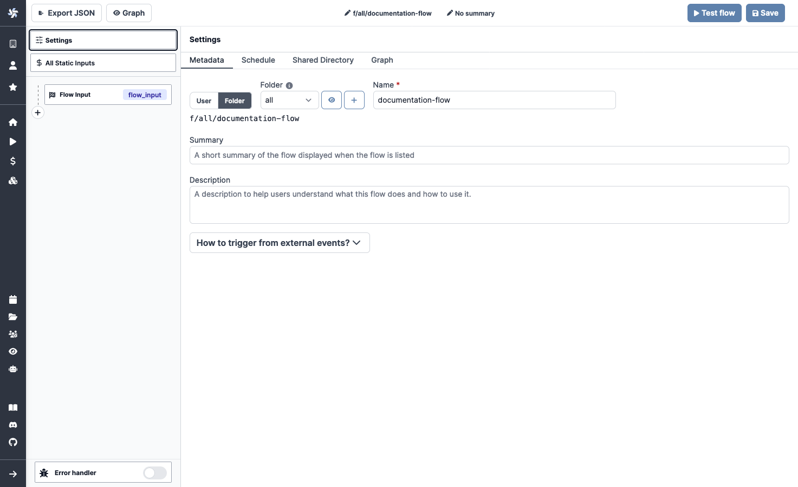

# Overview

Windmill's Flow editor allows you to build flows. Windmill's Flow editor has the following major components:

- [Toolbar](https://app.windmill.dev/docs/flows/flow-toolbar): The toolbar allows you to export the flow, configure the flow settings, and test the flow.
- [Settings](https://app.windmill.dev/docs/flows/flow-settings): Configure the flow settings.
- [Static Inputs](https://app.windmill.dev/docs/flows/flow-inputs): View all flow static inputs
- [Mini Map](https://app.windmill.dev/docs/flows/flow-mini-map): View the flow in a mini map.
- [Flow Inputs](https://app.windmill.dev/docs/flows/flow-inputs): View all flow inputs
- [Steps](https://app.windmill.dev/docs/flows/flow-steps): Steps are the building blocks of a flow. They are the actions that will be executed when the flow is run.
- [Error Handler](https://app.windmill.dev/docs/flows/flow-error-handler): Configure the flow error handler.
- [Flow Test](https://app.windmill.dev/docs/flows/flow-test): Test the flow.

  
