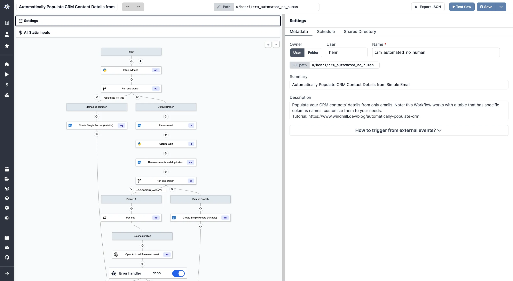

import DocCard from '@site/src/components/DocCard';
import { Timer, TerminalSquare } from 'lucide-react';

# Flow Editor

Windmill's Flow Editor allows you to build flows with a low-code builder.

Workflows are graphs ([DAG](https://en.wikipedia.org/wiki/Directed_acyclic_graph)) that represent the dependencies between steps.

The goal of an orchestrator or workflow engine is to execute the steps on different workers that respect that graph's dependencies, and pass the required data defined in the steps' inputs while applying parallelism when possible.

In Windmill, each step is code with a main function in TypeScript, Python, Go, PHP, Bash or raw queries to databases.

	<DocCard
		color="teal"
		title="Flows Quickstart"
		description="4-minute presentation of our Flow editor."
		href="/docs/getting_started/flows_quickstart"
		Icon={Timer}
	/>
	<DocCard
		color="teal"
		title="Local Development"
		description="Develop locally, push to git and deploy automatically to Windmill."
		href="/docs/advanced/local_development"
		Icon={TerminalSquare}
	/>
	<DocCard
		color="teal"
		title="Architecture and Data Exchange"
		description="A workflow is a JSON serializable value in the OpenFlow format."
		href="/docs/flows/architecture"
	/>
	<DocCard
		color="teal"
		title="OpenFlow Spec"
		description="OpenFlow is an open standard for defining Flows."
		href="/docs/openflow"
	/>

 

Another approach is to write a program that defines the jobs and their dependencies, and then execute that program. This is known as workflows as code.

	<DocCard
		title="Workflows as Code"
		description="Automate tasks and their flow with only code."
		href="/docs/core_concepts/workflows_as_code"
	/>

The Flow Editor has the following features which are the subject of specific pages:

	<DocCard
		color="teal"
		title="Triggering Flows"
		description="Trigger flows on-demand, by schedule or on external events."
		href="/docs/getting_started/trigger_flows"
	/>
	<DocCard
		color="teal"
		title="Testing Flows"
		description="Iterate quickly and get control on your flow testing."
		href="/docs/flows/test_flows"
	/>
	<DocCard
		color="teal"
		title="AI-Generated Flows"
		description="Generate flows from prompts."
		href="/docs/flows/ai_flows"
	/>
	<DocCard
		color="teal"
		title="Flow Editor Components"
		description="Details on the flow editor's major components."
		href="/docs/flows/editor_components"
	/>
	<DocCard
		color="teal"
		title="Error Handling in Flows"
		description="There are four ways to handle errors in Windmill flows."
		href="/docs/flows/error_handling"
	/>
	<DocCard
		color="teal"
		title="Branches"
		description="Split the execution of the flow based on a condition."
		href="/docs/flows/flow_branches"
	/>
	<DocCard
		color="teal"
		title="For Loops"
		description="Iterate a series of tasks."
		href="/docs/flows/flow_loops"
	/>
	<DocCard
		color="teal"
		title="While Loops"
		description="While loops execute a sequence of code indefinitely until the user cancels or a step set to Early Stop stops."
		href="/docs/flows/while_loops"
	/>
	<DocCard
		color="teal"
		title="Error Handler"
		description="Configure a script to handle errors."
		href="/docs/flows/flow_error_handler"
	/>
	<DocCard
		color="teal"
		title="Trigger Scripts"
		description="Trigger scripts are designed to pull data from an external source and return all of the new items since the last run, without resorting to external webhooks."
		href="/docs/flows/flow_trigger"
	/>
	<DocCard
		color="teal"
		title="Retries"
		description="Re-try a step in case of error."
		href="/docs/flows/retries"
	/>
	<DocCard
		color="teal"
		title="Concurrency Limits"
		description="The Concurrency Limit feature allows you to define concurrency limits for scripts and inline scripts within flows."
		href="/docs/flows/concurrency_limit"
	/>
	<DocCard
		color="teal"
		title="Custom Timeout for Step"
		description="If the execution takes longer than the time limit, the execution of the step will be interrupted."
		href="/docs/flows/early_stop"
	/>
	<DocCard
		color="teal"
		title="Priority for Steps"
		description="Prioritize a flow step in the execution queue."
		href="/docs/flows/priority"
	/>
	<DocCard
		color="teal"
		title="Lifetime / Delete after Use"
		description="The logs, arguments and results of this flow step will be completely deleted from Windmill once the flow is complete."
		href="/docs/flows/lifetime"
	/>
	<DocCard
		color="teal"
		title="Cache for Steps"
		description="Re-use a step's previous results."
		href="/docs/flows/cache"
	/>
	<DocCard
		color="teal"
		title="Early Stop / Break"
		description="Stop early a flow based on a step's result."
		href="/docs/flows/early_stop"
	/>
	<DocCard
		color="teal"
		title="Early Return"
		description="Define a node at which the flow will return at for sync endpoints. The rest of the flow will continue asynchronously."
		href="/docs/flows/early_return"
	/>
	<DocCard
		color="teal"
		title="Suspend & Approval / Prompts"
		description="Suspend a flow until specific event(s) are received, such as approvals or cancellations."
		href="/docs/flows/flow_approval"
	/>
	<DocCard
		color="teal"
		title="Sleep / Delays in Flows"
		description="Executions within a flow can be suspended for a given time."
		href="/docs/flows/sleep"
	/>
	<DocCard
		color="teal"
		title="Step Mocking"
		description="When a step is mocked, it will immediately return the mocked value without performing any computation."
		href="/docs/flows/step_mocking"
	/>

 

> _Example of a [flow](https://hub.windmill.dev/flows/38/automatically-populate-crm-contact-details-from-simple-email) in Windmill._

 
