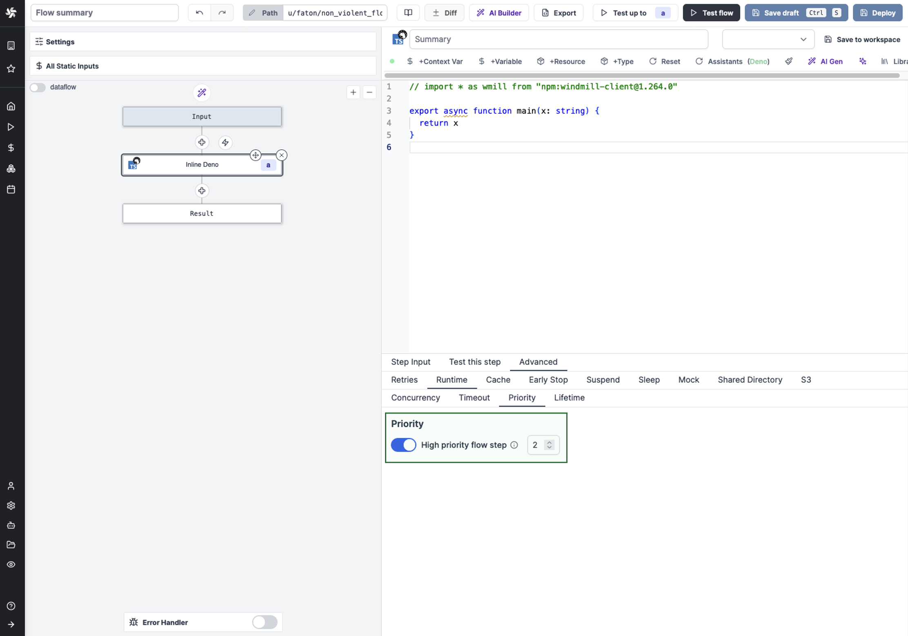

# Priority for steps

Prioritize a flow step in the execution queue.

By enabling "Priority", jobs scheduled from this step when the flow is executed are labeled as high priority and take precedence over the other jobs in the jobs queue.

Priority can be assigned from 1 to 100, with 100 being the highest priority. All jobs for which this option is not enabled are assigned priority 0.

This feature is exclusive to [Self-Hosted Enterprise](/pricing).