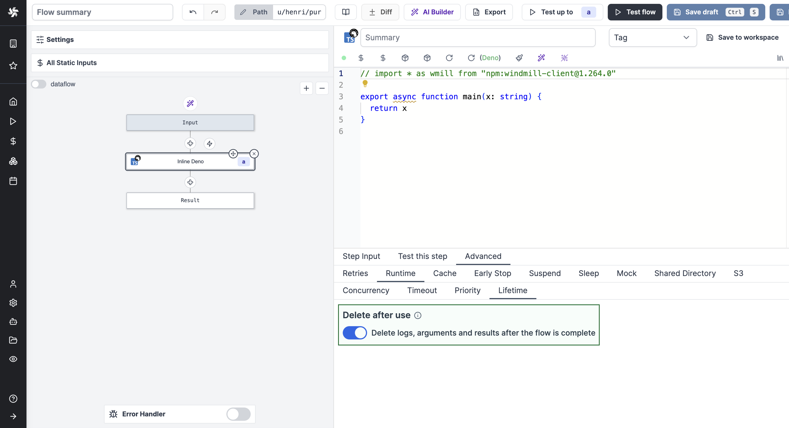

# Lifetime / Delete after use

The logs, arguments and results of this flow step will be completely deleted from Windmill once the flow is complete. They might be temporarily visible in UI while the flow is running.
This also applies to a flow step that has failed: the error will not be accessible.

The deletion is irreversible.

This feature is exclusive to [Cloud plans and Self-Hosted Enterprise](/pricing).