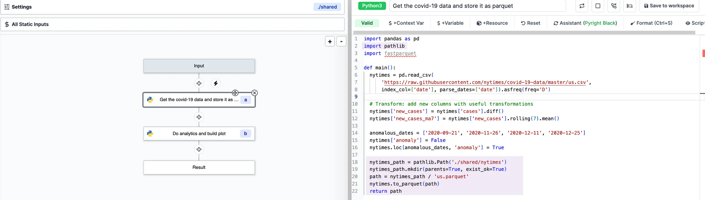
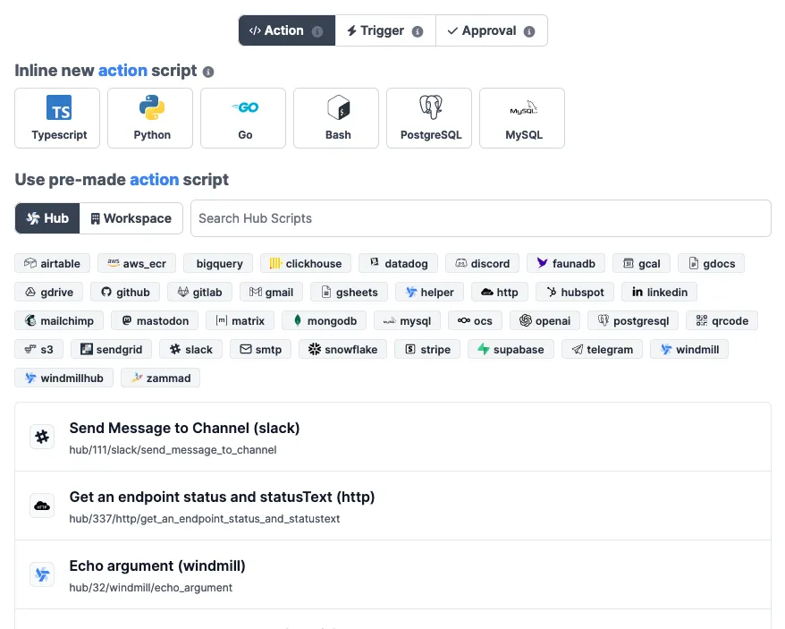
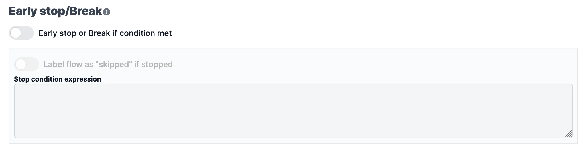
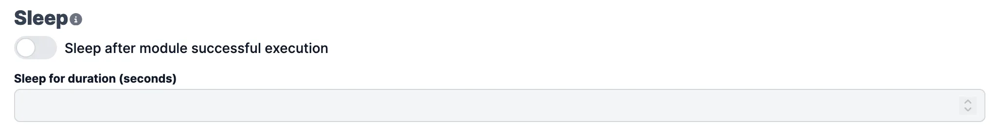

import DocCard from '@site/src/components/DocCard';

# Flow Editor Components

The Flow Builder has the following major components we will detail below:

- [Toolbar](#toolbar): the toolbar allows you to export the flow, configure the flow settings, and test the flow.
- [Settings](#settings): configure the flow settings.
- [Static Inputs](#static-inputs): view all flow static inputs.
- [Flow Inputs](#flow-inputs): view all flow inputs.
- [Action](#flow-actions): steps are the building blocks of a flow. They are the actions that will be executed when the flow is run.
- [Action editor](#action-editor): configure the action.

<br />


> _Example of a [flow](https://hub.windmill.dev/flows/38/automatically-populate-crm-contact-details-from-simple-email) in Windmill._

## Toolbar


The toolbar allows you to export the flow, configure the flow settings, and test the flow.
Here are the different options available in the toolbar:

- **Export JSON**: export the flow as a JSON file.
- **Edit name**: shortcut to edit the flow name.
- **Edit summary**: shortcut to edit the flow summary.
- **Test flow**: open the flow test slider.
- **Save**: save the flow.

## Settings

The flow settings are divided into four tabs:

- [Metadata](#metadata)
- [Schedule](#schedule)
- [Shared Directory](#shared-directory)

### Metadata

Each flow has metadata associated with it, enabling it to be defined and configured in depth.

#### Summary

Summary (optional) is a short, human-readable summary of the Script. It will be displayed as a title across Windmill. If omitted, the UI will use the `path` by default.

#### Path

**Path** is the Flow's unique identifier that consist of the [flow's owner](../core_concepts/16_roles_and_permissions/index.mdx#permissions-and-access-control), and the script's name.
The owner can be either a user, or a group of users ([folder](../core_concepts/8_groups_and_folders/index.mdx#folders)).

<div class="grid grid-cols-2 gap-6 mb-4">
	<DocCard
    	title="Roles and Permissions"
    	description="Control access and manage permissions within your instance and workspaces."
    	href="/docs/core_concepts/roles_and_permissions"
    />
    <DocCard
    	title="Groups and Folders"
    	description="Groups and Folders enable efficient permission management by grouping users with similar access levels."
    	href="/docs/core_concepts/groups_and_folders"
    />
</div>

#### Description

This is where you can give instructions to users on how to run your Flow. It supports markdown.


### Schedule

Flows can be [triggered](../getting_started/9_trigger_flows/index.mdx) by any [schedules](../core_concepts/1_scheduling/index.md), their [webhooks](../core_concepts/4_webhooks/index.md) or their [UI](../core_concepts/6_auto_generated_uis/index.md) but they only have only one primary schedules with which they share the same path. The primary schedule can be set here.

A CRON expression is used to define the schedule. Schedules can also be disabled.


:::tip

Have more details on all the ways to trigger flows [here](../getting_started/9_trigger_flows/index.mdx).

:::

<div class="grid grid-cols-2 gap-6 mb-4">
  <DocCard
  		color="teal"
    	title="Scheduling"
    	description="Scheduling allows you to define schedules for Scripts and Flows, automatically running them at set frequencies."
    	href="/docs/core_concepts/scheduling"
    />
</div>

### Shared Directory

Flows on Windmill are by default based on a result basis. A step will take as inputs the results of previous steps. And this works fine for lightweight automation.

For heavier ETLs, you might want to use the `Shared Directory` to share data between steps. Steps will share a folder at `./shared` in which they can store heavier data and pass them to the next step.

Beware that the `./shared` folder is not preserved across [suspends](./11_flow_approval.md) and [sleeps](./15_sleep.md). The directory is temporary and active for the time of the execution.

To enable the shared directory, on the `Settings` menu, go to `Shared Directory` and toggle on `Shared Directory on './shared'`.


To use the shared directory, just load outputs using `./shared/${path}` and call it for following steps.

:::tip Example from the Demo workspace _Same worker example of using the './shared' folder_

Loading output


<br />

Calling as input


This flow can be found on the Demo workspace.

:::

Another example is to be found from the [Hub](https://hub.windmill.dev/flows/32/same-worker-example-of-using-the-'.%2Fshared'-folder).

<div class="grid grid-cols-2 gap-6 mb-4">
    <DocCard
		color="teal"
		title="Persistent Storage"
    	description="Ensure that your data is safely stored and easily accessible whenever required."
    	href="/docs/core_concepts/persistent_storage"
    />
</div>

## Test flow

Test your current version of the flow with the `Test flow` button. This will opens a menu with an [auto-generated UI](../core_concepts/6_auto_generated_uis/index.md) of your current configuration.

You can also test up to a certain step by clicking on an action (x) and then on `Test up to x`.

At last, you can directly [test a step](#test-this-step).

<video
	className="border-2 rounded-xl object-cover w-full h-full dark:border-gray-800"
	autoPlay
	controls
	src="/videos/test_flow.mp4"
/>

## Static inputs

This menu centralizes the static inputs of every steps. It is akin to a file containing all constants. Modifying a value here modify it in the step input directly. It is especially useful when forking a flow to get an overview of all the variables to parametrize that are not exposed directly as flow inputs.

## Flow Inputs

In this section, you will learn how to add and configure flow inputs.

There are three ways to add flow inputs:

- **Customize** the flow inputs.
- Using a **Request**: send a POST request to the a specific endpoint to add a flow input.
- **Copying** the first step inputs.

### Customize the flow inputs

To manually configure the flow inputs, click on `Input` and then the `Add property` button.
It will open a slider where you can configure the flow input.

- **Name**: the name of the flow input.
- **Description**: the description of the flow input.
- **Type**: the type of the flow input: Integer, Number, String, Boolean, Array, Object, or Any.
- **Default value**: the default value of the flow input.

Some arguments' types can be given advanced settings that will affect the inputs' [auto-generated UI](../core_concepts/6_auto_generated_uis/index.md) and [JSON Schema](../core_concepts/13_json_schema_and_parsing/index.md).

Here is an example on how to define a list as an enum of strings using the `Customize` menu.

<video
	className="border-2 rounded-xl object-cover w-full h-full dark:border-gray-800"
	controls
	src="customize_arguments_flow.mp4"
/>

<br />

Below is the list of all available advanced settings for each argument type:

| Type    | Advanced Configuration                                                                                                                    |
| ------- | ----------------------------------------------------------------------------------------------------------------------------------------- |
| Integer | No advanced configuration for this type.                                                                                                  |
| Number  | No advanced configuration for this type.                                                                                                  |
| String  | - File (base64) &#124; Enum &#124; Format: email, hostname, uri, uuid, ipv4, yaml, sql &#124; Pattern (Regex)                             |
| Boolean | No advanced configuration for this type.                                                                                                  |
| Object  | Advanced settings are [Resource Types](../core_concepts/3_resources_and_types/index.mdx).                                                 |
| Array   | - Items are strings &#124; Items are strings from an enum &#124; Items are objects (JSON) &#124; Items are numbers &#124; Items are bytes |
| Any     | No advanced configuration for this type.                                                                                                  |

<div class="grid grid-cols-2 gap-6 mb-4">
	<DocCard
		title="Auto-generated UIs"
		description="Windmill creates auto-generated user interfaces for scripts and flows based on their parameters."
		href="/docs/core_concepts/auto_generated_uis"
	/>
	<DocCard
		title="JSON Schema and Parsing"
		description="JSON Schemas are used for defining the input specification for scripts and flows, and specifying resource types."
		href="/docs/core_concepts/json_schema_and_parsing"
	/>
</div>

### Using a Request

For this example, we will use the following flow at path: `u/test-user/my_flow`.

You can send a POST request to the following endpoint with a payload to add a flow input: the payload will be interpreted to extract the flow input.

For example, using CURL:

```bash
curl -X POST https://app.windmill.dev/api/w/windmill-labs/capture_u/u/test-user/my_flow \
   -H 'Content-Type: application/json' \
   -d '{"foo": 42}'
```

The flow input will be added with the following properties:

- **Name**: foo
- **Type**: Integer
- **Default value**: 42

### Copying the first step inputs

To copy the first step inputs, click on the `First step inputs` button.

## Flow Actions

An action script is simply a script that is neither a [trigger](./10_flow_trigger.md) nor an [approval](./11_flow_approval.md)
script. Those are the majority of the scripts.

There are two ways to create an action script:

- Write it directly in the flow editor.
- Import it from the Hub.
- Import it from the workspace.

## Inline action script

You can either create a new action script in:

- [Python](/docs/getting_started/scripts_quickstart/python): Windmill provides a Python 3.11 environment.
- [Typescript](/docs/getting_started/scripts_quickstart/typescript): Windmill uses Deno as the TypeScript runtime.
- [Go](/docs/getting_started/scripts_quickstart/go).
- [Bash](/docs/getting_started/scripts_quickstart/bash).
- Any language [running any docker container](../advanced/7_docker/index.md) through Windmill's bash support.

There are two special kind of scripts:

- [Postgres](/docs/getting_started/scripts_quickstart/sql)
- [MySQL](/docs/getting_started/scripts_quickstart/sql)

These are essentially Typescript template to easily write queries to a database.

### Triggering an action script from the Hub

You can refer to and trigger an action script from the [Hub](https://hub.windmill.dev/). You also have the possibility to fork it (copy it as an inline script) directly to modify its behavior.

### Triggering an action script from the workspace

You can refer to and trigger an action script from the workspace. Similar to the previous section, you can copy the script to an inline flow script and modify it.



## Action editor

Windmill provide a web editor to write your scripts. It is available in the flow editor.

The script editor in split in three parts:

- [Header](#header): edit the summary of the script, navigate to advanced configuration.
- [Script editor](#script-editor): edit the code.
- [Step configuration/Test this step](#step-configurationtest-this-step): the bottom part is composed of three parts:
  - [Step input](#step-input): define the input of the step.
  - [Test this step](#test-this-step): test the step on its own.
  - [Advanced](#advanced): advanced configuration.

### Header


The header is composed of:

- **Summary**: edit the summary of the script.
- **Shortcuts**: shortcut to advanced configuration.
  1. [Retries](./14_retries.md): configure the number of retries and the delay between each retry.
  2. [Early stop/Break](./2_early_stop.md): if defined, at the end of the step, the predicate expression will be evaluated to decide if the flow should stop early. Skipped flows are just a label useful to not see them in the runs page. If stop early is run within a forloop, it will just break the for-loop and have it stop at that iteration instead of stopping the whole flow.
  3. [Suspend](./11_flow_approval.md): if defined, at the end of the step, the flow will be suspended until it receives external requests to be resumed or canceled. This is most useful to implement approval steps but can be used flexibly for other purpose. To get the resume urls, use `wmill.getResumeUrls()` in Typescript, or `wmill.get_resume_urls()` in Python.
  4. [Sleep](./15_sleep.md): if defined, at the end of the step, the flow will sleep for a number of seconds before scheduling the next job (if any, no effect if the step is the last one). Sleeping is passive and does not consume any resources.

### Script editor

- Context var: add a context variable to the script.
- Var: add an input variable to the script.
- Resource: add a resource to the script.
- Reset: reset the script to its initial state.
- Assistant: reload the LSP assistant.
- Format: format the script. Can be triggerd on save (CTRL+S).
- Script: view hub or workspace script code.

<div class="grid grid-cols-2 gap-6 mb-4">
    <DocCard
		color="teal"
		title="Script Editor"
    	description="In Windmill, Scripts are the basis of all major features."
    	href="/docs/script_editor"
    />
</div>

### Step configuration/Test this step

The step configuration is composed of three parts:

- [Step input](#step-input): define the input of the step
- [Test this step](#test-this-step): test the step on its own
- [Advanced](#advanced): advanced configuration

#### Step input


Inputs of a script can be defined in the step configuration. They can be configured in three ways:

- **Templatable string**: a templatable string is a string that can be templated with context variables. It is defined by wrapping the string with `${` and `}`. For example, `${context.var}` is a templatable string that will be replaced by the value of the context variable `var`.
- **Dynamic**: JS expression that will be evaluated at runtime. The expression can use context variables and input variables. For example, `context.var` is a dynamic expression that will be replaced by the value of the context variable `var`.
- **Static**: a static value that will be used as is. For example, `static value` is a static value that will be used as is.

##### Templatable string/Static

The templatable string and static value can be combined. For example, `${context.var} static value` is a templatable string that will be replaced by the value of the context variable `var` and then concatenated with the static value `static value`.

```js
`${context.var} static value`;
```

##### Dynamic

JS expression that will be evaluated at runtime.

```js
[1, 2, 3, 4].reduce((acc, val) => acc + val, 0);
```

##### Insert mode

There are two insert modes:

- **Append**: append a context variable, a flow input or a resource at the cursor position
- **Connect**: replace the current value by a context variable, a flow input or a resource

Clicking on a field will set the mode to "Append". Clicking on the "Connect" button will set the mode to "Connect".

#### Test this step


The test this step section allows to test the step on its own. You can set the input and run the script.
The result and logs are displyed on the left-hand side.

#### Advanced

The advanced section allows to configure the following:

**Retries**

Configure the number of [retries](./14_retries.md) and the delay between each retry.


**Early stop/Break**

If defined, at the end of the step, the predicate expression will be evaluated to decide if the flow should [stop early](./2_early_stop.md). Skipped flows are just a label useful to not see them in the [runs](../core_concepts/5_monitor_past_and_future_runs/index.mdx) page. If stop early is run within a forloop, it will just break the for-loop and have it stop at that iteration instead of stopping the whole flow.



**Suspend**

If defined, at the end of the step, the flow will be [suspended](./11_flow_approval.md) until it receives external requests to be resumed or canceled. This is most useful to implement approval steps but can be used flexibly for other purpose. To get the resume urls, use `wmill.getResumeUrls()` in Typescript, or `wmill.get_resume_urls()` in Python.


**Sleep**

If defined, at the end of the step, the flow will [sleep](./15_sleep.md) for a number of seconds before scheduling the next job (if any, no effect if the step is the last one). Sleeping is passive and does not consume any resources.


