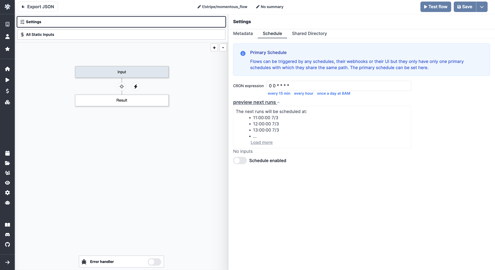

# Settings

The flow settings are divided into four tabs:

- [Metadata](#metadata)
- [Schedule](#schedule)
- [Shared Directory](#shared-directory)

## Metadata

The metadata tab allows you to configure the flow name, summary, and description.
Permissions can be configured in two ways:

- by User: select a user
- by Folder: select a folder

## Schedule

Flows can be triggered by any schedules, their webhooks or their UI but they only have only one primary schedules with which they share the same path. The primary schedule can be set here.

A CRON expression is used to define the schedule. Schedules can also be disabled.

## Shared Directory

Steps will share a folder at `./shared` in which they can store heavier data and pass them to the next step.

Beware that the `./shared` folder is not preserved across suspends and sleeps.

